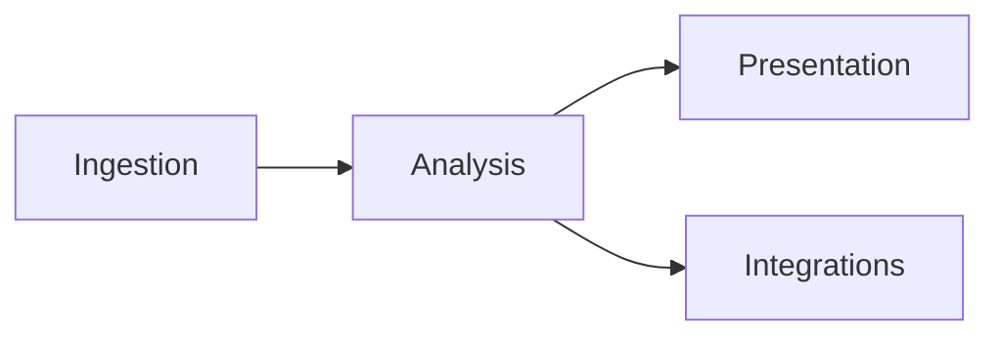

# Competitive inspiration — open-source + commercial transcript tools vs TranscriptX (2026-07-22)

> **Living research note:** conclusions, learnings, and “do / don’t” rows are **ongoing and changeable**. Revisit when products ship, when [docs/ROADMAP.md](../docs/ROADMAP.md) themes move, or when the analysis backlog is re-ranked. The title date is the first snapshot, not a freeze.  
> **Public comparison (user-facing):** [`docs/comparison.md`](../docs/comparison.md) — prefer that page for README / website / USER_INDEX links.  
> This file remains **maintainer research** (deeper OSS profiles, backlog-linked learnings). Keep private under `.local/` unless intentionally promoted.  
> Evidence-based comparison of six public GitHub projects **and** six commercial / non-open-source conversation-intelligence products against TranscriptX’s analysis product.  
> Companion to [`analysis_module_backlog_2026-07-17.md`](../docs/dev/analysis_module_backlog_2026-07-17.md) (living) and [`stocktake_2026-07-17.md`](../docs/dev/stocktake_2026-07-17.md).  
> **Method (OSS):** README + selective source review (no installs/runs). Marketing claims discounted unless backed by code.  
> **Method (commercial):** Public product docs, pricing pages, and third-party comparison writeups as of **2026-07** (Scriberr addendum **2026-08-07**). No paid trials / demos. Treat feature lists as **vendor-claimed** unless noted; depth and reliability are harder to verify than OSS.  
> **Addendum (2026-08-07):** Added **Scriberr** ([repo](https://github.com/rishikanthc/Scriberr), [site](https://scriberr.app/)); public summary in `docs/comparison.md`. **Addendum (2026-08-07 b):** Aligned with ROADMAP 1.x themes **D / G / H / I** — optional local in-app STT, karaoke playback, directory watcher, PWA are **product bets**, not permanent non-goals. This note may recommend adopting patterns without re-ranking the analysis-module backlog by itself.  
> **Still out of scope for this note alone:** implementing features; becoming a SaaS meeting bot; making RAG chat the primary product; silent cloud STT/LLM defaults.

---

## 1. Executive framing

**TranscriptX wins on:** modular conversational analytics depth (~45 registered modules), deterministic + LLM hybrid summaries, structured `llm_action_items` with grounding/dedupe, emotion/voice/interaction stacks, group multi-session analytics, contracts/provenance culture, local Ollama-only LLMs, reproducible artifacts + Python API.

**Open-source projects win on (narrow wedges):**

| Wedge | Strongest example |
|-------|-------------------|
| Self-hosted local STT + polished transcript workspace | Scriberr |
| Chat / RAG over uploaded content | Retrievia-AI (Scriberr also: chat-with-audio) |
| Protocol → calendar handoff | Meeting-Analysis-Service |
| Domain outcome score (NPS) + role-split tools | Digital-Assistant-for-Call-Centers |
| Rubric-scored evaluation + automation-bias UX | trinethra-feedback-analyzer |
| Multi-lens contested Q&A presentation | perspective-studio |

**Commercial products win on (productized wedges OSS rarely reaches):**

| Wedge | Strongest example(s) |
|-------|----------------------|
| Deal / revenue intelligence tied to CRM outcomes | Gong, Chorus by ZoomInfo |
| Scorecard / methodology coaching at team scale | Gong, Avoma, CallMiner |
| Auto-join capture + same-day team rollout | Fireflies, Otter |
| Live / in-call assist (answer cards, coaching) | Avoma, Observe.ai / CallMiner |
| Omnichannel contact-center 100% coverage analytics | CallMiner (also Observe.ai) |
| Searchable org meeting library + Ask-AI over history | Otter, Fireflies, Gong |

**North-star reminder (living):** TranscriptX stays **analysis-first** and **local-first**. Chat-over-transcript as the *primary* product, remote SaaS LLMs as silent defaults, hosted multi-user, realtime meeting bots, and CRM/revenue platforms remain non-goals / deferred. **1.0** keeps BYO transcription + command generation. **1.x** may optionally add local STT / capture / playback / installable-shell capabilities (ROADMAP themes **D / G / H / I**) without diluting the module DAG — design before build; invest/narrow/defer forks live on the roadmap. Learnings below inspire **analysis depth, taxonomy, presentation, and (where ROADMAP allows) capture UX** — not a mandate to copy SaaS CRM.



Most OSS demos and commercial CI products optimize **ingest + present + integrate** (bots, CRM, coaching UX). TranscriptX optimizes **analyze** (module DAG, contracts, groups). **Scriberr** is the clearest OSS peer on the **ingest + present** wedge (local STT, diarization, playback/notes/chat) and today a natural **upstream** of TX’s BYO-transcript stance. Under ROADMAP theme **H**, TX may later offer optional local STT of its own — Scriberr remains a quality bar and competitor on that wedge, not an analysis-depth peer. Commercial tools set the **quality bar users already see** for talk ratios, trackers, scorecards, and longitudinal deal/agent views.

---

## 2. TranscriptX baseline (matrix column)

**Snapshot** from package **0.6.4** registry + backlog §4 (2026-07-17/22), with **2026-08** product-direction notes. Baseline cells describe *today*; ROADMAP themes describe *possible 1.x*. Re-check module counts and surfaces when refreshing this note.

| Area | What exists today | 1.x direction (ROADMAP) |
|------|-------------------|-------------------------|
| Ingestion | BYO transcript import (transcription external); managed library | Theme **H** optional local STT; **G2** directory watcher; **K** richer command gen |
| Summaries | `highlights`→`summary`, `narrative_summary`, `llm_summary`, `llm_speaker_summary`, group LLM synthesis | Theme **A** Insights quality |
| Structured extract | `llm_action_items` (+ meeting extracts / grounding) | Backlog **B10** deepen; L1 taxonomy |
| Affect / interaction / voice | Emotion family, interactions (+ equity), voice stacks | Continue deepen-in-place |
| Groups | pool/compare/refit + charts + optional synthesis | Theme **J** SQLite analytics aids |
| LLM | Ollama only; skip-when-disabled | Keep local-first; no silent cloud default |
| Chat / RAG | **Absent as primary product** | Remains non-primary (W1) |
| Playback / shell | Streamlit playback; no PWA | Themes **D** karaoke · **C** Components v2 · **I** PWA |
| Auth / multi-user / calendar / CRM | **Absent** | Stay deferred |

Open analysis anchors: **B10**, **P2**, **B18**, **P1**. Capture/STT/playback are **not** analysis-module ranks — see ROADMAP.

---

## 3. Per-project profiles (open source)

### 3.1 Retrievia-AI

- **Repo:** [King-MCML06/Retrievia-AI](https://github.com/King-MCML06/Retrievia-AI)  
- **Job:** Privacy-leaning document/audio workspace: upload → embed → chat/summarize.  
- **Maturity:** Small (~3 commits); README richer than code age; committed `chroma_db/` artifacts suggest migration residue (README now documents pgvector).

**Features (observed)**

- PDF / DOCX / TXT ingestion; audio via **Groq Whisper** (`whisper-large-v3`) in `document_loader.py`
- Structured **Minutes of Meeting** JSON via Groq `llama-3.1-8b-instant` + `response_format: json_object`:

```json
{
  "overview": "...",
  "discussion_points": ["..."],
  "decisions": ["..."],
  "action_items": [{"task": "...", "owner": "...", "deadline": "..."}],
  "insights": ["..."],
  "summary": "..."
}
```

- RAG: chunk (500 words / 50 overlap) → **Nomic Atlas** cloud embeddings → PostgreSQL **pgvector**
- LangGraph ReAct agent (`agent.py`): `document_search`, `topic_summarizer`, `full_document_summary`, DuckDuckGo `web_search`; one-tool-then-answer constraint; SSE chat streaming
- JWT auth, per-user conversations, React split-pane + WaveSurfer audio UI

**Architecture**

```
Upload → extract/transcribe → chunk → Nomic embed → pgvector
                                              ↓
                                    Ollama ReAct agent ↔ SSE chat UI
```

**Strengths**

- Coherent assistant UX (upload progress SSE, streaming chat, audio-specific quick actions)
- MoM schema cleanly separates overview / decisions / action items / insights
- Explicit web-search labeling (`🌍 **Web Search Result:**`) reduces source confusion

**Weaknesses**

- “Privacy-first” marketing vs **cloud** Groq STT/LLM + Nomic embeddings (Ollama only for chat)
- Audio MoM embeds MoM JSON text into vectors — not a durable typed analysis artifact like TX modules
- No discourse/emotion/voice analytics; no groups; no grounding/dedupe contracts for action items
- Early-stage; auth/CORS permissive (`allow_origins=["*"]`)

---

### 3.2 Meeting-Analysis-Service

- **Repo:** [khammari-manel/Meeting-Analysis-Service](https://github.com/khammari-manel/Meeting-Analysis-Service)  
- **Job:** Meeting **protocol documents** → structured tasks → Google Calendar invitations.  
- **Maturity:** Student/demo microservices (Flask + React + RabbitMQ); pytest present; README claims “100% task extraction accuracy” — **not evidenced** in reviewed code.

**Features (observed)**

- PDF / DOCX / TXT protocol parsing (`documents/handlers.py`)
- OpenRouter cloud LLM (`mistralai/mistral-7b-instruct`) with large bilingual (EN/DE) extraction prompt (`ai/parser.py`)
- Rich extract schema beyond tasks: participants, action_items (assignee + email + deadline + priority), decisions, risks, questions, agreements, delays, milestones, reminders, compliance
- Google OAuth + Calendar: tasks with deadlines become all-day events; smart attendee logic (skip self-invite) in `integrations/google_calendar.py`
- Multi-user isolation via Google identity; RabbitMQ path for async messaging

**Architecture**

```
Protocol upload → OpenRouter JSON extract → Task CRUD
                              ↓
                    Google Calendar events + invitations
```

**Strengths**

- End-to-end **operational handoff** (extract → calendar) — strongest integration story among the non-STT OSS demos
- Extraction taxonomy is broader than TX `llm_action_items` alone (risks, milestones, compliance)
- Explicit participant→email mapping before assignment (good for invite correctness)
- German + English protocol patterns in prompt

**Weaknesses**

- Cloud-only LLM; not local-first
- Operates on **written protocols**, not spoken transcripts / diarization / ASR quality
- Truncates input (`text[:4500]` in prompt) — long meetings lose coverage
- No confidence/provenance; accuracy claim unsupported
- Microservices overhead disproportionate to analysis depth

---

### 3.3 Digital-Assistant-for-Call-Centers

- **Repo:** [busrabektas/Digital-Assistant-for-Call-Centers](https://github.com/busrabektas/Digital-Assistant-for-Call-Centers)  
- **Job:** Supervisor chat over stored call transcripts: NPS, sentiment, summarization.  
- **Maturity:** ~18 commits; Streamlit + LangGraph demo; hardcoded OpenAI key placeholder in `agent.py`.

**Features (observed)**

- Preprocess: WhisperX diarization → JSON turns (external to chat loop)
- MySQL conversation store; Streamlit chat UI
- LangGraph tool-calling agent (GPT-4o) over three HF tools:
  - **NPS:** `joeddav/xlm-roberta-large-xnli` zero-shot → promoter/passive/detractor; score = %promoter − %detractor; customer turns only (`SPEAKER_01`)
  - **Sentiment:** Turkish BERT `savasy/bert-base-turkish-sentiment-cased` per turn
  - **Summary:** Turkish mT5 `ozcangundes/mt5-small-turkish-summarization`
- “All conversations” mode to find lowest-NPS call

**Architecture**

```
Audio → WhisperX → MySQL turns → Streamlit chat
                         ↓
              LangGraph + GPT-4o tool router
                         ↓
         HF NPS / sentiment / summarization pipelines
```

**Strengths**

- Clear **role-split** analytics (customer-only NPS)
- Outcome-oriented score (NPS) that supervisors can act on
- Specialty language models (Turkish) — relevant for P1 multilingual thinking
- Tool-node graph separates orchestration (LLM) from measurement (HF)

**Weaknesses**

- Hardcoded API key pattern; cloud GPT-4o required for routing even when tools are local HF
- Loads HF pipelines **inside** tool calls (cold-start / cost)
- Narrow feature surface vs TX emotion/interaction/voice depth
- No structured contracts, provenance, or group equity analytics
- Domain-locked (call center) — not a general transcript toolkit

---

### 3.4 trinethra-feedback-analyzer

- **Repo:** [Poornima2006-Lakshmi/trinethra-feedback-analyzer](https://github.com/Poornima2006-Lakshmi/trinethra-feedback-analyzer)  
- **Job:** Paste supervisor transcript → local Ollama (`gemma:2b`) → rubric score + evidence + KPI gaps + follow-ups.  
- **Maturity:** Internship MVP (~1 commit); strong product thinking relative to size; no DB.

**Features (observed)**

- Domain files: `rubric.json` (1–10 bands, critical 6↔7 boundary), `context.md` rules
- Prompt builder injects rubric + truncated context + transcript (`buildPrompt.js`)
- Ollama `format: "json"` with repair retry; normalize to stable API shape (`parseAnalysisJson.js`)
- Output contract: `score` (value/label/band/justification/**confidence**), `evidence[]` (quote/signal/dimension), `kpiMapping[]`, `gaps[]`, `followUpQuestions[]`
- Persistent UI banner: **“AI-generated draft. Human review required.”**; shows parse warnings

**Architecture**

```
Transcript paste → Express → Ollama gemma:2b JSON → normalize → React review UI
```

**Strengths**

- Best **automation-bias / human-review** posture among the OSS set
- Confidence + gaps + follow-up questions when evidence is thin
- Rubric-as-data (JSON) separates domain rules from model code
- Fully local (Ollama); no cloud LLM
- Parse resilience (fences, truncation, repair) mirrors TX structured-extract concerns

**Weaknesses**

- Single-purpose (Fellow/supervisor rubric); not general meeting analytics
- Tiny model (`gemma:2b`) — quality ceiling; no grounding against span indexes
- No multi-session/groups; no audio/voice
- One-shot MVP; limited tests

---

### 3.5 perspective-studio

- **Repo:** [Wajiha20/perspective-studio](https://github.com/Wajiha20/perspective-studio)  
- **Job:** Ask a question about a transcript; get Optimist / Pessimist / Moderator answers.  
- **Maturity:** Small Next.js app (~5 commits); local Ollama `llama3.2:3b`; debate history in `localStorage`.

**Features (observed)**

- Paste transcript + question → `POST /api/analyze`
- Parallel Optimist + Pessimist prompts (evidence-only, ~80–120 words); Moderator synthesizes disagreement / agreement / missing evidence / takeaway (`app/api/analyze/route.ts`)
- Transcript compacted to **2500 chars** before inference
- UI: horizontal result tabs, suggested questions, Markdown export of debate
- Fully local; no auth/DB

**Architecture**

```
Transcript + question → Next.js route → 2× Ollama (parallel) → Moderator Ollama → tabs UI
```

**Strengths**

- Elegant **multi-lens presentation** for contested interpretations
- Explicit “missing evidence” section in moderator output
- Low ops cost; privacy-clean (local Ollama only)
- Exportable debate artifact

**Weaknesses**

- Truncation loses long-meeting context (vs TX chunking / module DAG)
- Free-form paragraphs — no schemas, confidence, or quote grounding
- Not batch/group analysis; not structured extract
- Small model; no streaming; no tests observed

### 3.6 Scriberr

- **Repo:** [rishikanthc/Scriberr](https://github.com/rishikanthc/Scriberr) · **Site:** [scriberr.app](https://scriberr.app/)  
- **Job:** Self-hosted, offline-first **audio/video transcription workspace** — local STT + diarization + transcript reader + optional LLM chat/summaries for privacy-conscious self-hosters (Plaud/cloud-STT subscription alternative).  
- **Maturity:** Comparatively strong OSS footprint (~2.9k★, MIT, Go server + managed Python STT env, Docker CPU/CUDA/Blackwell, Homebrew, public API docs). Active development **paused** as of maintainer note (layoff / job search; project “not abandoned”). README + selective public docs only (no install/run for this addendum).

**Features (claimed / README-backed)**

- Local transcription with **NVIDIA Parakeet / Canary** or **Whisper**-class models; **word-level timing**
- **Speaker diarization** (smart speaker detection / labeling)
- Transcript UI: playback follow-along, seek-from-text, highlights/notes while listening, built-in recorder, dark mode, **PWA** mobile/desktop
- **Chat with your audio** via **Ollama** or OpenAI-compatible providers; generate summaries / Q&A inside the app
- Automation: **folder watcher**, REST API surface (n8n-friendly), JWT auth
- Ops: SQLite app data + separate WhisperX/model env volumes; secure-cookies production defaults

**Architecture (as positioned)**

```
Audio/video upload or folder watch → local STT (+ diarization) → SQLite library
                                              ↓
                         Transcript reader / notes ←→ optional Ollama or OpenAI chat
```

**Strengths**

- Best OSS match for TX’s **privacy / local-first** story on the **capture→transcript** half of the pipeline
- Polished **present** wedge TX often under-emphasizes: fluid reader, notes, PWA, self-host install path
- Explicit **automation/API** story (folder watch + HTTP) useful as a BYO-transcript feeder into TX
- Optional OpenAI is opt-in; Ollama path keeps a full-local mode

**Weaknesses / TX non-fit (today)**

- Optimizes **ingest + light assist**, not modular conversational analytics (no emotion/interaction/voice science stack, no group multi-session contracts)
- Chat/summary is assistant UX (overlaps Retrievia / commercial Ask-AI) — **watch** under TX’s no-primary-RAG stance
- Optional cloud OpenAI softens “completely offline” marketing when configured
- Maintainer pause → treat roadmap claims cautiously; do not depend on Scriberr as a shipped TX dependency
- **Today:** complementary upstream for BYO transcripts. **1.x:** also a **quality bar / competitor** if TX invests in theme **H** (local Parakeet/Canary/Whisper, CUDA/CPU, folder watch, reader polish) — do not copy chat-as-product; do borrow STT/ops/UX patterns via ROADMAP forks

---

## 4. Per-product profiles (commercial / non-open-source)

> Evidence bar is lower than §3: no source. Prefer **capability themes** over feature-checklist parity claims. Pricing is third-party / vendor-published and drifts quickly.

### 4.1 Gong

- **Site:** [gong.io](https://www.gong.io/)  
- **Job:** Enterprise **Revenue AI / conversation intelligence** for sales orgs — capture virtual meetings, analyze talk patterns, surface deal risk, coach reps, feed CRM/forecast workflows.  
- **Maturity:** Category benchmark; custom/enterprise pricing (commonly cited ~\$100–150/seat/mo + seat minimums + platform fee; onboarding often multi-week).

**Claimed / commonly reported capabilities**

- Virtual meeting capture (Zoom, Teams, etc.); deep Salesforce / HubSpot sync
- Talk-pattern analytics: talk-to-listen ratio, question cadence, filler words, discovery depth
- Smart trackers / alerts: objections, competitors, pricing language, theme mentions with timelines
- Deal boards with risk signals; pipeline / forecast products adjacent to call analysis
- Coaching scorecards; rep vs rep benchmarking; win/loss pattern libraries
- Ask / search over org call corpus (meeting library intelligence)

**Strengths (for TX inspiration)**

- Sets the **commercial quality bar** for longitudinal + comparative conversation analytics
- Strong **tracker taxonomy** (theme → evidence span → alert) — closest commercial analogue to TX moments / topic-shift / keyword stacks
- Scorecards as first-class coaching artifacts (aligns with Trinethra rubric idea at scale)
- Ties analysis to **outcomes** (won/lost deals) — stronger than OSS demos

**Weaknesses / TX non-fit**

- SaaS, cloud-only, sales-domain lock; not local-first or research/general transcript
- Capture limited to supported virtual channels (phone / in-person gaps widely noted)
- Heavy CRM/RevOps surface — orthogonal to TX analysis-first product
- Opaque models / no exportable analysis contracts like TX schema versions

---

### 4.2 Chorus by ZoomInfo

- **Site:** [chorus.ai](https://www.chorus.ai/) / ZoomInfo GTM stack  
- **Job:** Sales conversation intelligence + coaching, increasingly bundled into ZoomInfo’s go-to-market data platform.  
- **Maturity:** Long-standing CI vendor; enterprise quote / bundle pricing.

**Claimed / commonly reported capabilities**

- Call recording + AI summaries; conversation-to-outcome mapping (language patterns ↔ won deals)
- Competitor mention categorization; rep benchmarking dashboards
- Topic / moment tagging for manager review and enablement
- CRM and ZoomInfo data-layer integration

**Strengths**

- Same commercial CI pattern as Gong: trackers, coaching, outcome correlation
- Useful reminder that **GTM data context** (firmographics, contacts) amplifies transcript analytics — TX deliberately stays transcript-grounded

**Weaknesses / TX non-fit**

- Same SaaS + sales + virtual-meeting limits as Gong
- Differentiation vs Gong is largely packaging / ZoomInfo ecosystem, not a distinct analysis science TX should chase

---

### 4.3 Avoma

- **Site:** [avoma.com](https://www.avoma.com/)  
- **Job:** Mid-market all-in-one meeting lifecycle: AI notes + conversation intelligence + optional coaching / revenue modules.  
- **Maturity:** Strong mid-market presence; modular pricing (base meeting assistant from ~\$19–29/seat/mo annual; coaching / CI add-ons extra).

**Claimed / commonly reported capabilities**

- Auto recording / notes; CRM push
- **Live answer cards** during calls (real-time objection / FAQ assist)
- AI call scoring against methodologies (MEDDIC, SPICED, custom scorecards)
- Talk-pattern + topic intelligence; smart trackers / Slack-email alerts
- Broader than pure sales (CS / product / cross-functional positioning)

**Strengths**

- **Methodology-as-config** scorecards (commercial twin of Trinethra `rubric.json` + Gong scorecards)
- Live assist is a productized “presentation during conversation” pattern (TX non-goal for realtime, but useful for thinking about insight urgency)
- Modular packaging shows CI features can be **optional packs** — matches TX deepen-in-place / domain-pack thinking

**Weaknesses / TX non-fit**

- Still cloud SaaS + bot capture; headline price often excludes full CI stack
- Realtime coaching conflicts with TX deferred realtime / local stance

---

### 4.4 Fireflies.ai

- **Site:** [fireflies.ai](https://fireflies.ai/)  
- **Job:** Budget / mid-market AI meeting assistant — auto-join, transcribe (100+ languages claimed), summarize, CRM autofill, AskFred search.  
- **Maturity:** High adoption for fast rollout; Pro ~\$10/seat/mo annual, Business ~\$19/seat/mo annual (published tiers drift).

**Claimed / commonly reported capabilities**

- Calendar bot joins Zoom / Meet / Teams; same-day team setup
- Structured summaries + action items; keyword / topic trackers
- Salesforce / HubSpot population; soundbites / clips
- Org search / Ask AI over meeting history
- Broad horizontal use (sales + non-sales)

**Strengths**

- Best commercial example of **documentation + light trackers** without full Gong analytics
- Multilingual transcription claim relevant to **P1** awareness (TX routes analysis; STT remains external)
- Soundbites / clip UX is a polished evidence-presentation pattern

**Weaknesses / TX non-fit**

- Reviewers consistently call analytics “adequate but shallow” vs Gong (talk-time / topics / keywords ceiling)
- Cloud bot + multi-user SaaS; chat-over-meetings overlaps W1 deferrals
- Not a substitute for discourse / emotion / voice science

---

### 4.5 Otter.ai

- **Site:** [otter.ai](https://otter.ai/)  
- **Job:** Live collaborative transcription and AI meeting notes for individuals / small teams; Enterprise adds CRM mapping and light coaching.  
- **Maturity:** Widely known consumer→team product; free tier + Pro/Business (~\$8–30/seat/mo range); Enterprise quote.

**Claimed / commonly reported capabilities**

- Real-time transcript teammates can follow / comment
- Automated summaries and action items; searchable meeting history
- AI chat over past meetings; CRM field mapping on higher tiers
- Live coaching / buying-signal extract claims on Enterprise (BANT/MEDDIC-style)

**Strengths**

- Strongest commercial **live collaborative transcript** UX — presentation, not deep analytics
- Action-item + summary expectations users bring to any transcript product (parity pressure on TX extract quality)

**Weaknesses / TX non-fit**

- Analytics/coaching depth limited vs dedicated CI; few transcription languages vs Fireflies claims
- Live collaboration + hosted multi-user are stocktake non-goals
- Easy to confuse with “conversation intelligence” marketing while remaining mostly a notes product

---

### 4.6 CallMiner (contact-center enterprise; Observe.ai adjacent)

- **Sites:** [callminer.com](https://www.callminer.com/), [observe.ai](https://www.observe.ai/)  
- **Job:** Enterprise **contact-center** conversation analytics — analyze (often) 100% of omnichannel interactions for QA scoring, compliance, sentiment/emotion, agent coaching, and real-time guidance.  
- **Maturity:** Long-standing enterprise CX analytics category; quote-based; heavy compliance / recorder integrations.

**Claimed / commonly reported capabilities**

- Omnichannel capture (voice, chat, email, etc.) at scale — not just Zoom bots
- Automated weighted scorecards; phrase / sequence / proximity logic for behaviors (e.g. empathy **after** dissatisfaction)
- Sentiment + emotion scoring; topic discovery; trend dashboards
- Real-time agent alerts / guidance; supervisor QA automation
- Compliance verification and 100%-coverage monitoring vs sample-based QA

**Strengths**

- Closest commercial peer to TX’s **affect + interaction + scoring** ambitions (Call-Centers OSS is a toy version of this category)
- Sequence/proximity behavioral rules are a serious pattern for **interaction science** (beyond bag-of-keywords trackers)
- Rubric / scorecard automation at true enterprise volume — validates Trinethra + Gong scorecard themes outside sales

**Weaknesses / TX non-fit**

- Domain-locked to contact centers; realtime agent assist is out of TX scope
- Opaque proprietary analytics; not local-first; not a general research toolkit
- Observe.ai vs CallMiner is a vendor shootout TX need not pick — use as **category inspiration** only

---

## 5. Cross-project feature matrix

### 5.1 Open-source matrix

Legend: **Y** = present / first-class · **P** = partial / adjacent · **—** = absent · **N** = not offered *today* (may change under ROADMAP). “TX 1.x intent” is directional, not a commitment.

| Capability | Retrievia | Meeting-Analysis | Call-Centers | Trinethra | Perspective | Scriberr | TranscriptX (today) | TX 1.x intent |
|------------|-----------|------------------|--------------|-----------|-------------|----------|---------------------|---------------|
| PDF/DOCX ingest | Y | Y | — | — | — | — | — (transcript import) | — |
| Audio ingest | Y (Groq) | — | Y (WhisperX prep) | — | — | Y (local Parakeet/Canary/Whisper) | N (external STT) | Theme **H** optional local |
| Diarization / speaker labels | — | — | P | — | — | Y | P (Speaker ID / BYO labels) | **H** + B19 |
| Transcript-only analysis | P | P (as text) | Y | Y | Y | P (reader + LLM assist) | Y | Y (keep) |
| Local LLM (Ollama) | Y (chat) | — | P (commented) | Y | Y | Y (chat/summary) | Y | Y |
| Cloud LLM | Y (Groq MoM) | Y (OpenRouter) | Y (GPT-4o) | — | — | P (optional OpenAI-compatible) | N | Opt-in only if ever |
| Abstractive summary | Y | — | Y | — | — | Y | Y | Theme **A** |
| MoM / multi-field minutes | Y | Y (broader) | — | — | — | P (summaries / chat) | P (`llm_action_items` + summaries) | **B10** |
| Action items + owner/deadline | Y | Y (+ email/priority) | — | — | — | — | Y (+ quote/confidence/ground) | deepen |
| Rubric / scored evaluation | — | — | P (NPS) | Y | — | — | — | pack candidate |
| Sentiment / emotion depth | — | — | Y (narrow) | — | — | — | Y (family) | keep |
| Chat / RAG Q&A | Y | — | Y (tool chat) | — | P (Q&A lenses) | Y (chat-with-audio) | N (primary) | stay non-primary |
| Folder watch / automation API | — | — | — | — | — | Y | P (batch/CLI / folder import) | Theme **G2** |
| Polished transcript reader + notes | P (WaveSurfer) | — | — | — | — | Y | P (playback / Speaker ID) | Themes **D** / **C** |
| PWA / installable shell | — | — | — | — | — | Y | — | Theme **I** |
| Groups / longitudinal | — | — | P (all-IDs NPS) | — | — | — | Y | Theme **J** |
| Interaction / voice science | — | — | — | — | — | — | Y | keep |
| Contracts / schema versions | — | — | — | P (normalize) | — | — | Y | keep |

### 5.2 Commercial matrix (vendor-claimed)

Legend: **Y** / **P** / **—** / **N** as above. Cells reflect public positioning, not audited depth.

| Capability | Gong | Chorus | Avoma | Fireflies | Otter | CallMiner† | TranscriptX |
|------------|------|--------|-------|-----------|-------|-----------|-------------|
| Auto meeting-bot capture | Y | Y | Y | Y | Y | P (recorders / CCaaS) | N |
| Live transcript / collab | P | P | P | P | Y | P (realtime agent) | — |
| Abstractive summary | Y | Y | Y | Y | Y | Y | Y |
| Action items | Y | Y | Y | Y | Y | P (QA / next steps) | Y (+ ground/dedupe) |
| Talk ratio / talk patterns | Y | Y | Y | P | P | Y | P (interaction/voice) |
| Theme / keyword trackers | Y | Y | Y | Y | P | Y | P (moments / keywords / topic_shift) |
| Rubric / call scorecards | Y | Y | Y | — | P (Ent) | Y | — (domain pack candidate) |
| Deal / pipeline intelligence | Y | Y | P | — | — | — | N |
| CRM sync (SFDC/HubSpot) | Y | Y | Y | Y | P | P | N |
| Org Ask-AI / search library | Y | P | P | Y | Y | P | N |
| Sentiment / emotion | P | P | P | P | P | Y | Y (family) |
| Sequence/behavior rules | P | P | P | — | — | Y | P (acts/interactions) |
| Omnichannel (phone/chat/email) | — | — | — | — | — | Y | N (BYO transcript) |
| Local / air-gapped LLM | — | — | — | — | — | — | Y |
| Groups / multi-session science | P (deal/team) | P | P | P | P | Y (agent/team) | Y (explicit) |
| Open contracts / Python API | — | — | — | — | — | — | Y |

† Observe.ai occupies a similar contact-center CI niche; use CallMiner as the category stand-in.

---

## 6. Strengths & weaknesses synthesis

### Theme clusters

| Theme | Who is strong | TX implication (living) |
|-------|---------------|-------------------------|
| Local STT + self-host workspace | Scriberr | **Today:** complement / BYO upstream. **1.x:** ROADMAP theme **H** product decision (invest/narrow/defer) — Scriberr is quality bar |
| Assistant / chat UX | Retrievia, Scriberr, Call-Centers; Otter/Fireflies Ask-AI | **Watch** — keep chat non-primary |
| Operational handoff | Meeting-Analysis (Calendar); Fireflies/Gong CRM; Scriberr folder-watch/API | **Adapt** export/import automation; folder watch → theme **G2** |
| Domain specialty packs | Call-Centers (NPS), Trinethra (rubric); Gong/Avoma/CallMiner scorecards | **Adapt** as optional domain packs / deepen-in-place |
| Structured extract taxonomy | Meeting-Analysis, Retrievia MoM; commercial MoM/action defaults | **Adopt** for **B10** field design |
| Uncertainty / human review | Trinethra | **Adopt** for **P2 / B18** UX + confidence |
| Contested interpretation UI | Perspective | **Adapt** as presentation pattern for insights |
| Tracker / moment taxonomies | Gong, Chorus, Avoma, Fireflies, CallMiner | **Adopt patterns** for moments / topic_shift / keyword UX — not their SaaS capture |
| Outcome-linked analytics | Gong/Chorus (won-lost); CallMiner (CSAT/QA) | **Watch** — keep transcript-grounded |
| Live / realtime assist | Avoma, CallMiner/Observe, Otter | **Defer** — realtime still deferred |
| Privacy purity | Trinethra, Perspective, Scriberr (local mode), TX | Reinforce local stance; optional OpenAI only with labelling |
| Polished transcript reader / notes / PWA | Scriberr | **Adapt** via themes **D** / **C** / **I** |
| Analysis depth (discourse/emotion/voice) | TX alone among OSS; CallMiner closest commercial peer on affect/QA | Do not dilute analysis for chat/CRM parity; STT is additive optional path |

### Shared weaknesses — OSS six

- Most are thin maturity (few commits; limited tests; demo credentials patterns) — **exception: Scriberr** (larger star/install surface) but maintainer development is currently paused
- Little/no provenance spanning transcript offsets (Scriberr has word timing for playback, not TX-style analysis contracts)
- Weak or no multi-session group analytics
- Either cloud-coupled privacy story, STT-first product, or very narrow local MVP — none match TX’s analysis DAG depth

### Shared weaknesses — commercial six

- Closed models; no reproducible local pipelines or schema-versioned artifacts
- Capture/CRM gravity pulls product away from general conversational science
- Marketing conflates notes, CI, and revenue platforms
- Hard for TX to verify claim depth without paid pilots
- Almost no air-gap / local-LLM story

---

## 7. What TranscriptX can learn

Priority = product fit under local-first + analysis-first + deepen-in-place. Each item ends with a next step. **This section is living** — may propose backlog/ROADMAP updates; does not auto-re-rank modules. Analysis capacity rule remains in the backlog until revised there.

### Adopt / adapt (fits stance)

| # | Learning | Source | Link | Suggested next step |
|---|----------|--------|------|---------------------|
| L1 | **MoM / extract taxonomy:** separate `overview`, `discussion_points`, `decisions`, `action_items`, `insights` (and Meeting-Analysis extras: risks, milestones, open questions) | Retrievia; Meeting-Analysis; commercial MoM defaults | **B10** | Doc-only: draft B10 record-type examples; prefer deepen extraction family |
| L2 | **Confidence + gaps + human-review banner** on inferred LLM surfaces | Trinethra | **P2**, **B18** | Spike confidence + “draft / human review” copy on insights / action-item review |
| L3 | **Evidence-only + abstain when silent** prompt rules; repair/normalize JSON | Trinethra | **P2**, `llm_action_items` | Compare parse/ground diagnostics; surface parse warnings in GUI |
| L4 | **Role-conditioned metrics** (e.g. customer-only NPS) | Call-Centers; CallMiner | Domain pack | Document role-filter pattern; no NPS core module without genre gate |
| L5 | **Multi-lens presentation** for contested claims | Perspective | **B18** / theme **A** | Optional “alternate readings” panel — no RAG store |
| L6 | **Calendar/export handoff** for action items with deadlines | Meeting-Analysis; commercial norms | Export/integrations | iCal/CSV of `llm_action_items` candidate |
| L7 | **Configurable scorecards / methodology rubrics** as data | Gong, Avoma, CallMiner; Trinethra | Domain pack | Spec-only until genre fixtures exist |
| L8 | **Smart trackers:** theme/phrase → timeline → alertable moment | Gong, Chorus, Avoma, Fireflies | Moments / topic_shift | Prefer presentation + config over new detector modules |
| L9 | **Sequence / proximity behavior rules** | CallMiner; Gong | Interaction deepen | Research acts/interactions “A before/after B” packs |
| L10 | **Transcript reader polish:** follow-along, seek-from-text, notes, karaoke word highlight | Scriberr | ROADMAP **D** / **C** | UX inventory → Components v2 playback; needs word timings |
| L11 | **PWA / installable shell** | Scriberr | ROADMAP **I** | Design spike vs Streamlit hosting constraints |
| L12 | **Local STT stack:** Parakeet/Canary + Whisper, CUDA/CPU, diarization, job UX | Scriberr | ROADMAP **H** | Architecture fork (in-process vs host service vs external-only); keep BYO import |
| L13 | **Directory / folder watcher** for new recordings | Scriberr | ROADMAP **G2** | Extend transcript folder-import honesty toward audio→STT when **H** exists |
| L14 | **YouTube (or URL) → local STT** | Scriberr-class workflows / commercial capture | ROADMAP **H** | Legal/ToS + yt-dlp ops + size limits in design spike |

### Watch / defer (interesting; still constrained)

| # | Learning | Source | Why constrained | Suggested next step |
|---|----------|--------|-----------------|---------------------|
| W1 | Full RAG chat as primary product | Retrievia; Scriberr chat; Otter/Fireflies/Gong Ask | Non-primary by product stance | Awareness only; optional assist ≠ primary UX |
| W2 | Cloud STT/embed (Groq/Nomic) as default | Retrievia | Breaks air-gap / local-first | Prefer local STT (**H**) or BYO; cloud only with explicit opt-in |
| W3 | Google OAuth multi-user + Calendar invites; CRM sync | Meeting-Analysis; Gong/Fireflies/Otter | Hosted multi-user no-go | Export-only path (L6) |
| W4 | GPT-4o tool router over HF tools | Call-Centers | Cloud orchestrator | Prefer direct modules |
| W5 | Truncate-transcript Q&A as primary UX | Perspective | Loses long-form fidelity | Optional lens UI (L5) only |
| W6 | Auto-join meeting bots + live collab notes | Fireflies, Otter, Gong, Avoma | Capture bots still deferred | Stay off meeting-bot path |
| W7 | Deal boards / forecast / revenue intelligence | Gong, Chorus, Avoma | Sales CRM platform | Ignore for core |
| W8 | Realtime in-call answer cards / agent whisper | Avoma, CallMiner/Observe | Realtime deferred | Awareness only |

### Explicit non-transfers (current; revisable)

- Do **not** add DuckDuckGo web search into analysis answers (Retrievia) — pollutes transcript-grounded claims.
- Do **not** treat “100% extraction accuracy” marketing as a quality bar.
- Do **not** create a new **analysis** module ID for “NPS” or “rubric scorer” without overlap assessment + genre fixtures.
- Do **not** chase Gong/Chorus deal intelligence or Fireflies/Otter **meeting bots** for parity.
- Do **not** assume commercial emotion/sentiment depth exceeds TX’s emotion family without side-by-side eval.
- Do **not** let optional STT (**H**) replace analysis-first positioning or drop BYO import.
- Do **not** ship silent cloud STT/LLM defaults.

---

## 8. Decision summary

| If the question is… | Answer (living) |
|---------------------|-----------------|
| Should TX become a RAG meeting chat app? | **No** as primary (W1) |
| Should TX become a Gong-like revenue CI SaaS? | **No** (W6–W7) |
| Should TX offer optional local STT like Scriberr? | **1.x product decision** — ROADMAP theme **H** (invest/narrow/defer); not a 1.0 gate |
| Should karaoke playback / PWA / folder watch inform TX? | **Yes as ROADMAP themes D / I / G2** (L10–L13) |
| Should B10 look at MoM/protocol schemas? | **Yes** (L1) |
| Should P2/B18 borrow Trinethra’s review/confidence UX? | **Yes** (L2–L3) |
| Should Perspective’s multi-lens become a core module? | **No** — optional presentation (L5) |
| Should Calendar/CRM sync be near-term analysis work? | **No** — optional export later (L6) |
| Should scorecards / smart trackers inform TX? | **Yes as packs/UX** (L7–L8) |
| Should CallMiner-style sequence rules inform interaction deepen? | **Yes, research** (L9) |
| Does TX beat the six OSS projects on conversational analytics depth? | **Yes** (today) |
| Does TX beat commercial CI on local contracts + discourse/emotion/voice? | **Likely yes on science/contracts**; **no** on capture, CRM, coaching scale, polished tracker UX |
| Does Scriberr beat TX on local STT + workspace polish *today*? | **Yes**; TX may close that gap on **H/D/I** without becoming STT-only |
| Are this note and the analysis backlog frozen? | **No** — both are ongoing / changeable |

---

## 9. Source index

| Project / product | Key evidence paths |
|-------------------|-------------------|
| Retrievia-AI | `document_loader.py` (MoM), `agent.py`, `vector_store.py`, `server.py`, README |
| Meeting-Analysis-Service | `backend-meeting-analysis/ai/parser.py`, `integrations/google_calendar.py`, `database/models.py`, README |
| Digital-Assistant-for-Call-Centers | `agent.py`, `graph.py`, `nodes/*`, `whisperx/main.py`, README |
| trinethra-feedback-analyzer | `rubric.json`, `backend/src/services/buildPrompt.js`, `utils/parseAnalysisJson.js`, `frontend/src/App.jsx`, README |
| perspective-studio | `app/api/analyze/route.ts`, `app/page.tsx`, README |
| Scriberr | README (features, install, LLM disclosure, maintainer pause); [scriberr.app](https://scriberr.app/); [github.com/rishikanthc/Scriberr](https://github.com/rishikanthc/Scriberr) |
| Gong | Product site + third-party 2026 CI comparisons (pricing/features vendor-claimed) |
| Chorus by ZoomInfo | Product site + Gong/Chorus comparison writeups |
| Avoma | Product blog / pricing pages (scorecards, live answer cards, modular CI) |
| Fireflies.ai | Product site + mid-market CI reviews (CRM, languages, analytics ceiling) |
| Otter.ai | Product site + meeting-assistant comparisons (live notes, Ask AI) |
| CallMiner / Observe.ai | Product comparison pages (omnichannel, scorecards, sequencing, realtime) |
| TranscriptX | `module_specs/__init__.py`; [`analysis_module_backlog_2026-07-17.md`](../docs/dev/analysis_module_backlog_2026-07-17.md); [`ROADMAP.md`](../docs/ROADMAP.md) themes A–M; [`comparison.md`](../docs/comparison.md); stocktake |
