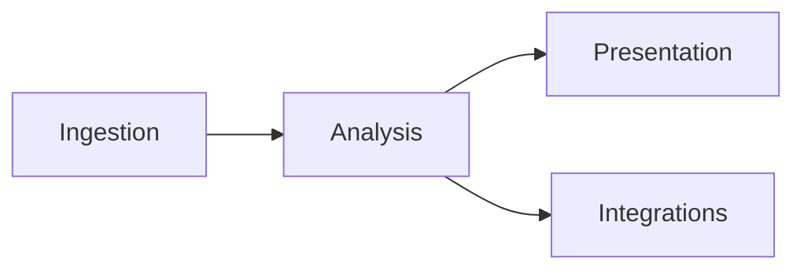

Type: RESEARCH
Authority: self

# Competitive inspiration — open-source + commercial transcript tools vs TranscriptX (2026-07-22)

> Evidence-based comparison of five public GitHub projects **and** six commercial / non-open-source conversation-intelligence products against TranscriptX’s analysis product.  
> Companion to [`analysis_module_backlog_2026-07-17.md`](analysis_module_backlog_2026-07-17.md) and [`stocktake_2026-07-17.md`](stocktake_2026-07-17.md).  
> **Method (OSS):** README + selective source review (no installs/runs). Marketing claims discounted unless backed by code.  
> **Method (commercial):** Public product docs, pricing pages, and third-party comparison writeups as of **2026-07**. No paid trials / demos. Treat feature lists as **vendor-claimed** unless noted; depth and reliability are harder to verify than OSS.  
> **Non-goals of this note:** implementing learnings; re-ranking the analysis backlog; proposing a RAG chat product; becoming a SaaS meeting bot.

---

## 1. Executive framing

**TranscriptX wins on:** modular conversational analytics depth (~45 registered modules), deterministic + LLM hybrid summaries, structured `llm_action_items` with grounding/dedupe, emotion/voice/interaction stacks, group multi-session analytics, contracts/provenance culture, local Ollama-only LLMs, reproducible artifacts + Python API.

**Open-source projects win on (narrow wedges):**

| Wedge | Strongest example |
|-------|-------------------|
| Chat / RAG over uploaded content | Retrievia-AI |
| Protocol → calendar handoff | Meeting-Analysis-Service |
| Domain outcome score (NPS) + role-split tools | Digital-Assistant-for-Call-Centers |
| Rubric-scored evaluation + automation-bias UX | trinethra-feedback-analyzer |
| Multi-lens contested Q&A presentation | perspective-studio |

**Commercial products win on (productized wedges OSS rarely reaches):**

| Wedge | Strongest example(s) |
|-------|----------------------|
| Deal / revenue intelligence tied to CRM outcomes | Gong, Chorus by ZoomInfo |
| Scorecard / methodology coaching at team scale | Gong, Avoma, CallMiner |
| Auto-join capture + same-day team rollout | Fireflies, Otter |
| Live / in-call assist (answer cards, coaching) | Avoma, Observe.ai / CallMiner |
| Omnichannel contact-center 100% coverage analytics | CallMiner (also Observe.ai) |
| Searchable org meeting library + Ask-AI over history | Otter, Fireflies, Gong |

**North-star reminder (from stocktake / backlog):** TranscriptX is analysis-first and local-first. Chat-over-transcript, remote SaaS LLMs as product surface, hosted multi-user, realtime bots, and CRM/revenue platforms are explicit non-goals / deferred. Learnings below are filtered through that stance — commercial products are inspiration for **analysis depth, taxonomy, and presentation**, not a mandate to copy SaaS capture/CRM.



Most OSS demos and commercial CI products optimize **ingest + present + integrate** (bots, CRM, coaching UX). TranscriptX optimizes **analyze** (module DAG, contracts, groups). Commercial tools set the **quality bar users already see** for talk ratios, trackers, scorecards, and longitudinal deal/agent views.

---

## 2. TranscriptX baseline (matrix column)

Locked from package **0.6.4** module registry + backlog §4 (2026-07-17/22):

| Area | What exists |
|------|-------------|
| Ingestion | BYO transcript import (transcription external); managed library |
| Summaries | `highlights`→`summary`, `narrative_summary`, `llm_summary`, `llm_speaker_summary`, group LLM synthesis |
| Structured extract | `llm_action_items` (`transcriptx.llm_action_items.v1`: text/owner/deadline/status/quote/confidence + ground/dedupe) |
| Affect | `sentiment`, emotion family (`emotion`, `contextual_emotion`, `fine_grained_emotion`), contagion, affect tension |
| Interaction | acts, interactions (+ equity pack), loops, `qa_analysis` (discourse Q&A, not RAG), echoes |
| Voice | features, mismatch, tension, fingerprint, prosody/charts |
| Groups | pool/compare/refit + charts + optional synthesis |
| LLM | Ollama only; skip-when-disabled |
| Chat / RAG | **Absent by design** |
| Auth / multi-user / calendar / CRM | **Absent** (hosted multi-user is stocktake no-go) |

Open backlog anchors used below: **B10** decisions/commitments taxonomy; **P2** evidence/provenance; **B18** grounded insight narratives; **P1** multilingual routing; non-goal: RAG chat product.

---

## 3. Per-project profiles (open source)

### 3.1 Retrievia-AI

- **Repo:** [King-MCML06/Retrievia-AI](https://github.com/King-MCML06/Retrievia-AI)  
- **Job:** Privacy-leaning document/audio workspace: upload → embed → chat/summarize.  
- **Maturity:** Small (~3 commits); README richer than code age; committed `chroma_db/` artifacts suggest migration residue (README now documents pgvector).

**Features (observed)**

- PDF / DOCX / TXT ingestion; audio via **Groq Whisper** (`whisper-large-v3`) in `document_loader.py`
- Structured **Minutes of Meeting** JSON via Groq `llama-3.1-8b-instant` + `response_format: json_object`:

```json
{
  "overview": "...",
  "discussion_points": ["..."],
  "decisions": ["..."],
  "action_items": [{"task": "...", "owner": "...", "deadline": "..."}],
  "insights": ["..."],
  "summary": "..."
}
```

- RAG: chunk (500 words / 50 overlap) → **Nomic Atlas** cloud embeddings → PostgreSQL **pgvector**
- LangGraph ReAct agent (`agent.py`): `document_search`, `topic_summarizer`, `full_document_summary`, DuckDuckGo `web_search`; one-tool-then-answer constraint; SSE chat streaming
- JWT auth, per-user conversations, React split-pane + WaveSurfer audio UI

**Architecture**

```
Upload → extract/transcribe → chunk → Nomic embed → pgvector
                                              ↓
                                    Ollama ReAct agent ↔ SSE chat UI
```

**Strengths**

- Coherent assistant UX (upload progress SSE, streaming chat, audio-specific quick actions)
- MoM schema cleanly separates overview / decisions / action items / insights
- Explicit web-search labeling (`🌍 **Web Search Result:**`) reduces source confusion

**Weaknesses**

- “Privacy-first” marketing vs **cloud** Groq STT/LLM + Nomic embeddings (Ollama only for chat)
- Audio MoM embeds MoM JSON text into vectors — not a durable typed analysis artifact like TX modules
- No discourse/emotion/voice analytics; no groups; no grounding/dedupe contracts for action items
- Early-stage; auth/CORS permissive (`allow_origins=["*"]`)

---

### 3.2 Meeting-Analysis-Service

- **Repo:** [khammari-manel/Meeting-Analysis-Service](https://github.com/khammari-manel/Meeting-Analysis-Service)  
- **Job:** Meeting **protocol documents** → structured tasks → Google Calendar invitations.  
- **Maturity:** Student/demo microservices (Flask + React + RabbitMQ); pytest present; README claims “100% task extraction accuracy” — **not evidenced** in reviewed code.

**Features (observed)**

- PDF / DOCX / TXT protocol parsing (`documents/handlers.py`)
- OpenRouter cloud LLM (`mistralai/mistral-7b-instruct`) with large bilingual (EN/DE) extraction prompt (`ai/parser.py`)
- Rich extract schema beyond tasks: participants, action_items (assignee + email + deadline + priority), decisions, risks, questions, agreements, delays, milestones, reminders, compliance
- Google OAuth + Calendar: tasks with deadlines become all-day events; smart attendee logic (skip self-invite) in `integrations/google_calendar.py`
- Multi-user isolation via Google identity; RabbitMQ path for async messaging

**Architecture**

```
Protocol upload → OpenRouter JSON extract → Task CRUD
                              ↓
                    Google Calendar events + invitations
```

**Strengths**

- End-to-end **operational handoff** (extract → calendar) — strongest integration story of the five
- Extraction taxonomy is broader than TX `llm_action_items` alone (risks, milestones, compliance)
- Explicit participant→email mapping before assignment (good for invite correctness)
- German + English protocol patterns in prompt

**Weaknesses**

- Cloud-only LLM; not local-first
- Operates on **written protocols**, not spoken transcripts / diarization / ASR quality
- Truncates input (`text[:4500]` in prompt) — long meetings lose coverage
- No confidence/provenance; accuracy claim unsupported
- Microservices overhead disproportionate to analysis depth

---

### 3.3 Digital-Assistant-for-Call-Centers

- **Repo:** [busrabektas/Digital-Assistant-for-Call-Centers](https://github.com/busrabektas/Digital-Assistant-for-Call-Centers)  
- **Job:** Supervisor chat over stored call transcripts: NPS, sentiment, summarization.  
- **Maturity:** ~18 commits; Streamlit + LangGraph demo; hardcoded OpenAI key placeholder in `agent.py`.

**Features (observed)**

- Preprocess: WhisperX diarization → JSON turns (external to chat loop)
- MySQL conversation store; Streamlit chat UI
- LangGraph tool-calling agent (GPT-4o) over three HF tools:
  - **NPS:** `joeddav/xlm-roberta-large-xnli` zero-shot → promoter/passive/detractor; score = %promoter − %detractor; customer turns only (`SPEAKER_01`)
  - **Sentiment:** Turkish BERT `savasy/bert-base-turkish-sentiment-cased` per turn
  - **Summary:** Turkish mT5 `ozcangundes/mt5-small-turkish-summarization`
- “All conversations” mode to find lowest-NPS call

**Architecture**

```
Audio → WhisperX → MySQL turns → Streamlit chat
                         ↓
              LangGraph + GPT-4o tool router
                         ↓
         HF NPS / sentiment / summarization pipelines
```

**Strengths**

- Clear **role-split** analytics (customer-only NPS)
- Outcome-oriented score (NPS) that supervisors can act on
- Specialty language models (Turkish) — relevant for P1 multilingual thinking
- Tool-node graph separates orchestration (LLM) from measurement (HF)

**Weaknesses**

- Hardcoded API key pattern; cloud GPT-4o required for routing even when tools are local HF
- Loads HF pipelines **inside** tool calls (cold-start / cost)
- Narrow feature surface vs TX emotion/interaction/voice depth
- No structured contracts, provenance, or group equity analytics
- Domain-locked (call center) — not a general transcript toolkit

---

### 3.4 trinethra-feedback-analyzer

- **Repo:** [Poornima2006-Lakshmi/trinethra-feedback-analyzer](https://github.com/Poornima2006-Lakshmi/trinethra-feedback-analyzer)  
- **Job:** Paste supervisor transcript → local Ollama (`gemma:2b`) → rubric score + evidence + KPI gaps + follow-ups.  
- **Maturity:** Internship MVP (~1 commit); strong product thinking relative to size; no DB.

**Features (observed)**

- Domain files: `rubric.json` (1–10 bands, critical 6↔7 boundary), `context.md` rules
- Prompt builder injects rubric + truncated context + transcript (`buildPrompt.js`)
- Ollama `format: "json"` with repair retry; normalize to stable API shape (`parseAnalysisJson.js`)
- Output contract: `score` (value/label/band/justification/**confidence**), `evidence[]` (quote/signal/dimension), `kpiMapping[]`, `gaps[]`, `followUpQuestions[]`
- Persistent UI banner: **“AI-generated draft. Human review required.”**; shows parse warnings

**Architecture**

```
Transcript paste → Express → Ollama gemma:2b JSON → normalize → React review UI
```

**Strengths**

- Best **automation-bias / human-review** posture of the five
- Confidence + gaps + follow-up questions when evidence is thin
- Rubric-as-data (JSON) separates domain rules from model code
- Fully local (Ollama); no cloud LLM
- Parse resilience (fences, truncation, repair) mirrors TX structured-extract concerns

**Weaknesses**

- Single-purpose (Fellow/supervisor rubric); not general meeting analytics
- Tiny model (`gemma:2b`) — quality ceiling; no grounding against span indexes
- No multi-session/groups; no audio/voice
- One-shot MVP; limited tests

---

### 3.5 perspective-studio

- **Repo:** [Wajiha20/perspective-studio](https://github.com/Wajiha20/perspective-studio)  
- **Job:** Ask a question about a transcript; get Optimist / Pessimist / Moderator answers.  
- **Maturity:** Small Next.js app (~5 commits); local Ollama `llama3.2:3b`; debate history in `localStorage`.

**Features (observed)**

- Paste transcript + question → `POST /api/analyze`
- Parallel Optimist + Pessimist prompts (evidence-only, ~80–120 words); Moderator synthesizes disagreement / agreement / missing evidence / takeaway (`app/api/analyze/route.ts`)
- Transcript compacted to **2500 chars** before inference
- UI: horizontal result tabs, suggested questions, Markdown export of debate
- Fully local; no auth/DB

**Architecture**

```
Transcript + question → Next.js route → 2× Ollama (parallel) → Moderator Ollama → tabs UI
```

**Strengths**

- Elegant **multi-lens presentation** for contested interpretations
- Explicit “missing evidence” section in moderator output
- Low ops cost; privacy-clean (local Ollama only)
- Exportable debate artifact

**Weaknesses**

- Truncation loses long-meeting context (vs TX chunking / module DAG)
- Free-form paragraphs — no schemas, confidence, or quote grounding
- Not batch/group analysis; not structured extract
- Small model; no streaming; no tests observed

---

## 4. Per-product profiles (commercial / non-open-source)

> Evidence bar is lower than §3: no source. Prefer **capability themes** over feature-checklist parity claims. Pricing is third-party / vendor-published and drifts quickly.

### 4.1 Gong

- **Site:** [gong.io](https://www.gong.io/)  
- **Job:** Enterprise **Revenue AI / conversation intelligence** for sales orgs — capture virtual meetings, analyze talk patterns, surface deal risk, coach reps, feed CRM/forecast workflows.  
- **Maturity:** Category benchmark; custom/enterprise pricing (commonly cited ~\$100–150/seat/mo + seat minimums + platform fee; onboarding often multi-week).

**Claimed / commonly reported capabilities**

- Virtual meeting capture (Zoom, Teams, etc.); deep Salesforce / HubSpot sync
- Talk-pattern analytics: talk-to-listen ratio, question cadence, filler words, discovery depth
- Smart trackers / alerts: objections, competitors, pricing language, theme mentions with timelines
- Deal boards with risk signals; pipeline / forecast products adjacent to call analysis
- Coaching scorecards; rep vs rep benchmarking; win/loss pattern libraries
- Ask / search over org call corpus (meeting library intelligence)

**Strengths (for TX inspiration)**

- Sets the **commercial quality bar** for longitudinal + comparative conversation analytics
- Strong **tracker taxonomy** (theme → evidence span → alert) — closest commercial analogue to TX moments / topic-shift / keyword stacks
- Scorecards as first-class coaching artifacts (aligns with Trinethra rubric idea at scale)
- Ties analysis to **outcomes** (won/lost deals) — stronger than OSS demos

**Weaknesses / TX non-fit**

- SaaS, cloud-only, sales-domain lock; not local-first or research/general transcript
- Capture limited to supported virtual channels (phone / in-person gaps widely noted)
- Heavy CRM/RevOps surface — orthogonal to TX analysis-first product
- Opaque models / no exportable analysis contracts like TX schema versions

---

### 4.2 Chorus by ZoomInfo

- **Site:** [chorus.ai](https://www.chorus.ai/) / ZoomInfo GTM stack  
- **Job:** Sales conversation intelligence + coaching, increasingly bundled into ZoomInfo’s go-to-market data platform.  
- **Maturity:** Long-standing CI vendor; enterprise quote / bundle pricing.

**Claimed / commonly reported capabilities**

- Call recording + AI summaries; conversation-to-outcome mapping (language patterns ↔ won deals)
- Competitor mention categorization; rep benchmarking dashboards
- Topic / moment tagging for manager review and enablement
- CRM and ZoomInfo data-layer integration

**Strengths**

- Same commercial CI pattern as Gong: trackers, coaching, outcome correlation
- Useful reminder that **GTM data context** (firmographics, contacts) amplifies transcript analytics — TX deliberately stays transcript-grounded

**Weaknesses / TX non-fit**

- Same SaaS + sales + virtual-meeting limits as Gong
- Differentiation vs Gong is largely packaging / ZoomInfo ecosystem, not a distinct analysis science TX should chase

---

### 4.3 Avoma

- **Site:** [avoma.com](https://www.avoma.com/)  
- **Job:** Mid-market all-in-one meeting lifecycle: AI notes + conversation intelligence + optional coaching / revenue modules.  
- **Maturity:** Strong mid-market presence; modular pricing (base meeting assistant from ~\$19–29/seat/mo annual; coaching / CI add-ons extra).

**Claimed / commonly reported capabilities**

- Auto recording / notes; CRM push
- **Live answer cards** during calls (real-time objection / FAQ assist)
- AI call scoring against methodologies (MEDDIC, SPICED, custom scorecards)
- Talk-pattern + topic intelligence; smart trackers / Slack-email alerts
- Broader than pure sales (CS / product / cross-functional positioning)

**Strengths**

- **Methodology-as-config** scorecards (commercial twin of Trinethra `rubric.json` + Gong scorecards)
- Live assist is a productized “presentation during conversation” pattern (TX non-goal for realtime, but useful for thinking about insight urgency)
- Modular packaging shows CI features can be **optional packs** — matches TX deepen-in-place / domain-pack thinking

**Weaknesses / TX non-fit**

- Still cloud SaaS + bot capture; headline price often excludes full CI stack
- Realtime coaching conflicts with TX deferred realtime / local stance

---

### 4.4 Fireflies.ai

- **Site:** [fireflies.ai](https://fireflies.ai/)  
- **Job:** Budget / mid-market AI meeting assistant — auto-join, transcribe (100+ languages claimed), summarize, CRM autofill, AskFred search.  
- **Maturity:** High adoption for fast rollout; Pro ~\$10/seat/mo annual, Business ~\$19/seat/mo annual (published tiers drift).

**Claimed / commonly reported capabilities**

- Calendar bot joins Zoom / Meet / Teams; same-day team setup
- Structured summaries + action items; keyword / topic trackers
- Salesforce / HubSpot population; soundbites / clips
- Org search / Ask AI over meeting history
- Broad horizontal use (sales + non-sales)

**Strengths**

- Best commercial example of **documentation + light trackers** without full Gong analytics
- Multilingual transcription claim relevant to **P1** awareness (TX routes analysis; STT remains external)
- Soundbites / clip UX is a polished evidence-presentation pattern

**Weaknesses / TX non-fit**

- Reviewers consistently call analytics “adequate but shallow” vs Gong (talk-time / topics / keywords ceiling)
- Cloud bot + multi-user SaaS; chat-over-meetings overlaps W1 deferrals
- Not a substitute for discourse / emotion / voice science

---

### 4.5 Otter.ai

- **Site:** [otter.ai](https://otter.ai/)  
- **Job:** Live collaborative transcription and AI meeting notes for individuals / small teams; Enterprise adds CRM mapping and light coaching.  
- **Maturity:** Widely known consumer→team product; free tier + Pro/Business (~\$8–30/seat/mo range); Enterprise quote.

**Claimed / commonly reported capabilities**

- Real-time transcript teammates can follow / comment
- Automated summaries and action items; searchable meeting history
- AI chat over past meetings; CRM field mapping on higher tiers
- Live coaching / buying-signal extract claims on Enterprise (BANT/MEDDIC-style)

**Strengths**

- Strongest commercial **live collaborative transcript** UX — presentation, not deep analytics
- Action-item + summary expectations users bring to any transcript product (parity pressure on TX extract quality)

**Weaknesses / TX non-fit**

- Analytics/coaching depth limited vs dedicated CI; few transcription languages vs Fireflies claims
- Live collaboration + hosted multi-user are stocktake non-goals
- Easy to confuse with “conversation intelligence” marketing while remaining mostly a notes product

---

### 4.6 CallMiner (contact-center enterprise; Observe.ai adjacent)

- **Sites:** [callminer.com](https://www.callminer.com/), [observe.ai](https://www.observe.ai/)  
- **Job:** Enterprise **contact-center** conversation analytics — analyze (often) 100% of omnichannel interactions for QA scoring, compliance, sentiment/emotion, agent coaching, and real-time guidance.  
- **Maturity:** Long-standing enterprise CX analytics category; quote-based; heavy compliance / recorder integrations.

**Claimed / commonly reported capabilities**

- Omnichannel capture (voice, chat, email, etc.) at scale — not just Zoom bots
- Automated weighted scorecards; phrase / sequence / proximity logic for behaviors (e.g. empathy **after** dissatisfaction)
- Sentiment + emotion scoring; topic discovery; trend dashboards
- Real-time agent alerts / guidance; supervisor QA automation
- Compliance verification and 100%-coverage monitoring vs sample-based QA

**Strengths**

- Closest commercial peer to TX’s **affect + interaction + scoring** ambitions (Call-Centers OSS is a toy version of this category)
- Sequence/proximity behavioral rules are a serious pattern for **interaction science** (beyond bag-of-keywords trackers)
- Rubric / scorecard automation at true enterprise volume — validates Trinethra + Gong scorecard themes outside sales

**Weaknesses / TX non-fit**

- Domain-locked to contact centers; realtime agent assist is out of TX scope
- Opaque proprietary analytics; not local-first; not a general research toolkit
- Observe.ai vs CallMiner is a vendor shootout TX need not pick — use as **category inspiration** only

---

## 5. Cross-project feature matrix

### 5.1 Open-source matrix

Legend: **Y** = present / first-class · **P** = partial / adjacent · **—** = absent · **N** = non-goal for TX

| Capability | Retrievia | Meeting-Analysis | Call-Centers | Trinethra | Perspective | TranscriptX |
|------------|-----------|------------------|--------------|-----------|-------------|-------------|
| PDF/DOCX ingest | Y | Y | — | — | — | — (transcript import) |
| Audio ingest | Y (Groq) | — | Y (WhisperX prep) | — | — | N (external STT) |
| Transcript-only analysis | P | P (as text) | Y | Y | Y | Y |
| Local LLM (Ollama) | Y (chat) | — | P (commented) | Y | Y | Y |
| Cloud LLM | Y (Groq MoM) | Y (OpenRouter) | Y (GPT-4o) | — | — | N |
| Cloud embeddings | Y (Nomic) | — | — | — | — | — (local HF/embeddings) |
| Abstractive summary | Y | — | Y | — | — | Y |
| MoM / multi-field minutes | Y | Y (broader) | — | — | — | P (`llm_action_items` + summaries) |
| Decisions as typed field | Y | Y | — | — | — | backlog **B10** |
| Action items + owner/deadline | Y | Y (+ email/priority) | — | — | — | Y (+ quote/confidence/ground) |
| Rubric / scored evaluation | — | — | P (NPS) | Y | — | — |
| Sentiment / emotion depth | — | — | Y (narrow) | — | — | Y (family) |
| NPS / outcome score | — | — | Y | P (KPI map) | — | — |
| Chat / RAG Q&A | Y | — | Y (tool chat) | — | P (Q&A lenses) | N |
| Multi-perspective answers | — | — | — | — | Y | — |
| Evidence quotes + confidence | — | — | P (scores) | Y | P (missing evidence) | P → **P2/B18** |
| Human-review banner | — | — | — | Y | — | P (skip/partial UX) |
| Auth / multi-user | Y | Y (Google) | — | — | — | N (hosted) |
| Calendar / invite export | — | Y | — | — | — | — |
| Groups / longitudinal | — | — | P (all-IDs NPS) | — | — | Y |
| Interaction / voice science | — | — | — | — | — | Y |
| Contracts / schema versions | — | — | — | P (normalize) | — | Y |

### 5.2 Commercial matrix (vendor-claimed)

Legend: **Y** / **P** / **—** / **N** as above. Cells reflect public positioning, not audited depth.

| Capability | Gong | Chorus | Avoma | Fireflies | Otter | CallMiner† | TranscriptX |
|------------|------|--------|-------|-----------|-------|-----------|-------------|
| Auto meeting-bot capture | Y | Y | Y | Y | Y | P (recorders / CCaaS) | N |
| Live transcript / collab | P | P | P | P | Y | P (realtime agent) | — |
| Abstractive summary | Y | Y | Y | Y | Y | Y | Y |
| Action items | Y | Y | Y | Y | Y | P (QA / next steps) | Y (+ ground/dedupe) |
| Talk ratio / talk patterns | Y | Y | Y | P | P | Y | P (interaction/voice) |
| Theme / keyword trackers | Y | Y | Y | Y | P | Y | P (moments / keywords / topic_shift) |
| Rubric / call scorecards | Y | Y | Y | — | P (Ent) | Y | — (domain pack candidate) |
| Deal / pipeline intelligence | Y | Y | P | — | — | — | N |
| CRM sync (SFDC/HubSpot) | Y | Y | Y | Y | P | P | N |
| Org Ask-AI / search library | Y | P | P | Y | Y | P | N |
| Sentiment / emotion | P | P | P | P | P | Y | Y (family) |
| Sequence/behavior rules | P | P | P | — | — | Y | P (acts/interactions) |
| Omnichannel (phone/chat/email) | — | — | — | — | — | Y | N (BYO transcript) |
| Local / air-gapped LLM | — | — | — | — | — | — | Y |
| Groups / multi-session science | P (deal/team) | P | P | P | P | Y (agent/team) | Y (explicit) |
| Open contracts / Python API | — | — | — | — | — | — | Y |

† Observe.ai occupies a similar contact-center CI niche; use CallMiner as the category stand-in.

---

## 6. Strengths & weaknesses synthesis

### Theme clusters

| Theme | Who is strong | TX implication |
|-------|---------------|----------------|
| Assistant / chat UX | Retrievia, Call-Centers; Otter/Fireflies Ask-AI | **Watch/defer** — conflicts with no RAG-chat product |
| Operational handoff | Meeting-Analysis (Calendar); Fireflies/Gong CRM | **Adapt** as optional export, not core analysis |
| Domain specialty packs | Call-Centers (NPS), Trinethra (rubric); Gong/Avoma/CallMiner scorecards | **Adapt** as optional domain packs / deepen-in-place |
| Structured extract taxonomy | Meeting-Analysis, Retrievia MoM; commercial MoM/action defaults | **Adopt** for **B10** field design |
| Uncertainty / human review | Trinethra | **Adopt** for **P2 / B18** UX + confidence |
| Contested interpretation UI | Perspective | **Adapt** as presentation pattern for insights |
| Tracker / moment taxonomies | Gong, Chorus, Avoma, Fireflies, CallMiner | **Adopt patterns** for moments / topic_shift / keyword UX — not their SaaS capture |
| Outcome-linked analytics | Gong/Chorus (won-lost); CallMiner (CSAT/QA) | **Watch** — TX has groups but not CRM outcome joins; keep transcript-grounded |
| Live / realtime assist | Avoma, CallMiner/Observe, Otter | **Defer** — realtime is stocktake deferred |
| Privacy purity | Trinethra, Perspective, TX | Commercial = cloud SaaS; reinforce TX local stance |
| Analysis depth (discourse/emotion/voice) | TX alone among OSS; CallMiner closest commercial peer on affect/QA | Do not dilute for chat/CRM parity; borrow scorecard + tracker UX ideas |

### Shared weaknesses — OSS five

- Thin maturity (few commits; limited tests; demo credentials patterns)
- Little/no provenance spanning transcript offsets
- Weak or no multi-session group analytics
- Either cloud-coupled privacy story or very narrow local MVP

### Shared weaknesses — commercial six

- Closed models; no reproducible local pipelines or schema-versioned artifacts
- Capture/CRM gravity pulls product away from general conversational science
- Marketing conflates notes, CI, and revenue platforms
- Hard for TX to verify claim depth without paid pilots
- Almost no air-gap / local-LLM story

---

## 7. What TranscriptX can learn

Priority = product fit under local-first + deepen-in-place + ≤2 new module IDs/wave. Each item ends with a next step. **No backlog re-rank in this note.**

### Adopt / adapt (fits stance)

| # | Learning | Source | Backlog link | Suggested next step |
|---|----------|--------|--------------|---------------------|
| L1 | **MoM / extract taxonomy:** separate `overview`, `discussion_points`, `decisions`, `action_items`, `insights` (and Meeting-Analysis extras: risks, milestones, open questions) | Retrievia `document_loader.py`; Meeting-Analysis `ai/parser.py`; commercial summary defaults (Fireflies/Otter/Gong) | **B10** | Doc-only: draft B10 record-type examples against Retrievia MoM + MAS schema + commercial minutes fields; prefer deepen extraction family over new module ID |
| L2 | **Confidence + gaps + human-review banner** on inferred LLM surfaces | Trinethra UI + `score.confidence` + `gaps` | **P2**, **B18** | Spike: reuse confidence enum + persistent “draft / human review” copy on `narrative_summary` / `insights` / action-item review |
| L3 | **Evidence-only + abstain when silent** prompt rules; repair/normalize JSON | Trinethra `buildPrompt.js`, `parseAnalysisJson.js` | **P2**, existing `llm_action_items` parse path | Compare TX action-item parse/ground diagnostics to Trinethra normalize; adopt parseWarning surfacing in GUI if missing |
| L4 | **Role-conditioned metrics** (e.g. customer-only NPS) | Call-Centers `nps_analysis_tool.py`; CallMiner agent/customer channel splits | Optional domain pack (not core); equity already speaker-aware | Candidate: document “role filter” pattern for group charts / sentiment rollups; do **not** add NPS as core module without genre gate |
| L5 | **Multi-lens presentation** for contested claims (Optimist/Pessimist/Moderator tabs; “missing evidence”) | Perspective `route.ts` + UI tabs | **B18** presentation; not a new analysis module | UX spike on Insights: optional “alternate readings” panel fed by existing modules + one LLM synthesis — no RAG store |
| L6 | **Calendar/export handoff** for action items with deadlines | Meeting-Analysis Calendar; commercial CRM/export norms | Outside analysis backlog (export/integrations) | Candidate follow-up: iCal/CSV export of `llm_action_items` (no Google OAuth / CRM required for v1) |
| L7 | **Configurable scorecards / methodology rubrics** as data (MEDDIC/SPICED/custom bands + evidence) | Gong, Avoma, CallMiner; Trinethra `rubric.json` | Domain pack / deepen-in-place; overlaps L2 | Spec-only: optional rubric pack that scores existing module outputs + quotes — **no** new default module ID until genre fixtures exist |
| L8 | **Smart trackers:** theme/phrase → timeline → alertable moment** with competitive/objection/pricing examples | Gong, Chorus, Avoma, Fireflies | Moments / keywords / topic_shift presentation | Map commercial tracker UX to TX moments + topic_shift charts; prefer presentation + config over new detector modules |
| L9 | **Sequence / proximity behavior rules** (empathy after complaint; discovery before pitch) | CallMiner (claimed sequencing/proximity); Gong discovery depth | Interaction family deepen | Research note: can existing acts/interactions express “A before/after B” rules for genre packs? |

### Watch / defer (interesting, conflicts with non-goals)

| # | Learning | Source | Why defer | Suggested next step |
|---|----------|--------|-----------|---------------------|
| W1 | Full RAG chat workspace + streaming ReAct / Ask-AI over meetings | Retrievia; Otter/Fireflies/Gong Ask | Explicit non-goal: chat-over-transcript product | Keep as competitive awareness only |
| W2 | Cloud STT/embed (Groq/Nomic) for “zero GPU” | Retrievia | Breaks air-gap / local-first story | Prefer external BYO transcript + local Ollama |
| W3 | Google OAuth multi-user + Calendar invites; CRM sync | Meeting-Analysis; Gong/Fireflies/Otter CRM | Hosted multi-user is stocktake no-go | Export-only path (L6) if anything |
| W4 | GPT-4o tool router over HF tools | Call-Centers | Cloud orchestrator; TX already runs HF modules in-DAG without chat router | Prefer direct modules over agent wrappers |
| W5 | Truncate-transcript Q&A as primary UX | Perspective | Loses long-form fidelity TX already solves with modules | Only as optional lens UI (L5), not primary analysis |
| W6 | Auto-join meeting bots + live collaborative notes | Fireflies, Otter, Gong, Avoma | Capture/realtime/hosted — deferred / non-goals | Stay BYO-transcript; do not build bots |
| W7 | Deal boards / forecast / revenue intelligence | Gong, Chorus, Avoma RI modules | Sales CRM outcome platform, not analysis toolkit | Ignore for core; optional research genre pack later |
| W8 | Realtime in-call answer cards / agent whisper | Avoma, CallMiner/Observe | Realtime deferred; breaks local batch model | Awareness only |

### Explicit non-transfers

- Do **not** add DuckDuckGo web search into analysis answers (Retrievia) — pollutes transcript-grounded claims.
- Do **not** treat “100% extraction accuracy” marketing as a quality bar.
- Do **not** create a new module ID for “NPS” or “rubric scorer” without overlap assessment + genre fixtures (backlog capacity rule).
- Do **not** chase Gong/Chorus deal intelligence or Fireflies/Otter bot capture for parity.
- Do **not** assume commercial emotion/sentiment depth exceeds TX’s emotion family without side-by-side eval on shared fixtures.

---

## 8. Decision summary

| If the question is… | Answer |
|---------------------|--------|
| Should TX become a RAG meeting chat app? | **No** (W1) |
| Should TX become a Gong-like revenue CI SaaS? | **No** (W6–W7) |
| Should B10 look at MoM/protocol schemas? | **Yes** (L1) |
| Should P2/B18 borrow Trinethra’s review/confidence UX? | **Yes** (L2–L3) |
| Should Perspective’s multi-lens become a core module? | **No** — optional presentation (L5) |
| Should Calendar/CRM sync be Wave 1 analysis work? | **No** — optional export later (L6) |
| Should scorecards / smart trackers inform TX? | **Yes as packs/UX** (L7–L8), not as SaaS capture |
| Should CallMiner-style sequence rules inform interaction deepen? | **Yes, research** (L9) |
| Does TX already beat the five OSS projects on conversational analytics depth? | **Yes** |
| Does TX already beat commercial CI on local contracts + discourse/emotion/voice science? | **Likely yes on science/contracts**; **no** on capture, CRM, coaching scale, and polished tracker UX |

---

## 9. Source index

| Project / product | Key evidence paths |
|-------------------|-------------------|
| Retrievia-AI | `document_loader.py` (MoM), `agent.py`, `vector_store.py`, `server.py`, README |
| Meeting-Analysis-Service | `backend-meeting-analysis/ai/parser.py`, `integrations/google_calendar.py`, `database/models.py`, README |
| Digital-Assistant-for-Call-Centers | `agent.py`, `graph.py`, `nodes/*`, `whisperx/main.py`, README |
| trinethra-feedback-analyzer | `rubric.json`, `backend/src/services/buildPrompt.js`, `utils/parseAnalysisJson.js`, `frontend/src/App.jsx`, README |
| perspective-studio | `app/api/analyze/route.ts`, `app/page.tsx`, README |
| Gong | Product site + third-party 2026 CI comparisons (pricing/features vendor-claimed) |
| Chorus by ZoomInfo | Product site + Gong/Chorus comparison writeups |
| Avoma | Product blog / pricing pages (scorecards, live answer cards, modular CI) |
| Fireflies.ai | Product site + mid-market CI reviews (CRM, languages, analytics ceiling) |
| Otter.ai | Product site + meeting-assistant comparisons (live notes, Ask AI) |
| CallMiner / Observe.ai | Product comparison pages (omnichannel, scorecards, sequencing, realtime) |
| TranscriptX | `module_specs/__init__.py`, `llm_action_items.py`, `docs/dev/analysis_module_backlog_2026-07-17.md`, `docs/dev/stocktake_2026-07-17.md` |
