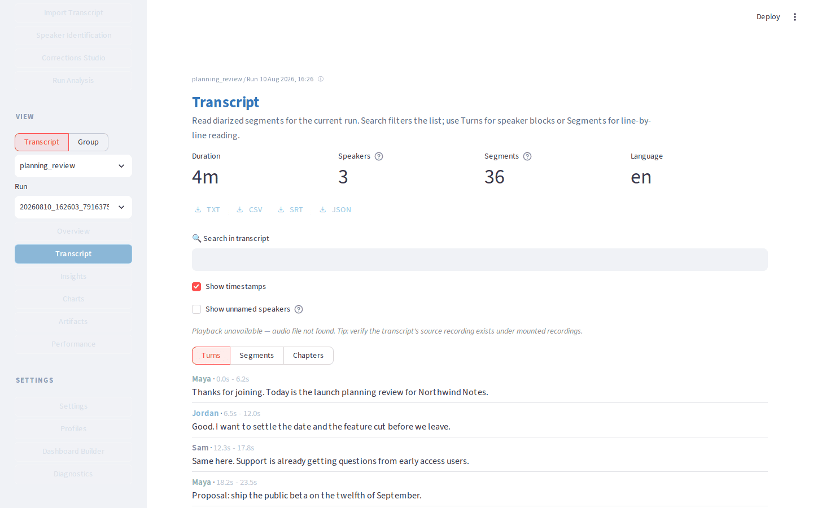
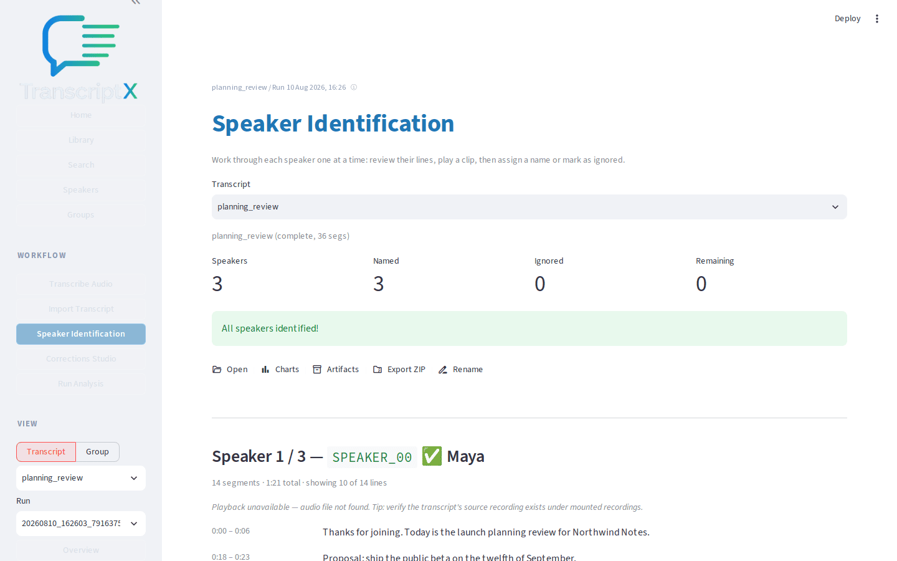
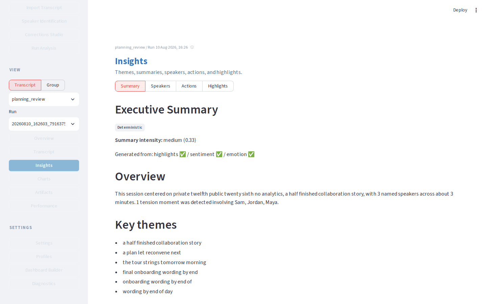

# TranscriptX

TranscriptX is a local-first workbench for people who want to think with transcripts.

Import conversations you already have. See themes, speakers, and evidence.
Optional local AI stays on your computer. TranscriptX does **not** transcribe
audio — bring files from WhisperX, [Scriberr](https://scriberr.app/),
[noScribe](https://noscribe.de/en/), Otter, or a similar tool.

Not sure if this is the right tool? [How TranscriptX compares](docs/comparison.md).

## The application








Open **Charts** from the same View menu for visual module outputs.

## What can I do with it?

- Understand themes across a conversation
- Compare speakers — who said what, and how they interact
- Investigate a question and jump back to the original lines
- Analyse several conversations together over time
- Correct the transcript while you read
- Export findings as HTML or a ZIP you keep

Walkthroughs: [Using TranscriptX](docs/workflows/index.md). Product definition: [docs/PRODUCT.md](docs/PRODUCT.md).

## On your machine

Source files and analysis results stay on your computer. Optional AI uses
[Ollama](docs/runtime/llm.md) locally and stays off until you turn it on.

Limits: [known limitations](docs/known_limitations.md). Third-party models: [NOTICE](NOTICE).

## From a file to a useful Overview

Use the sample [planning_review.json](docs/workflows/fixtures/planning_review.json) if you do not have a transcript yet.

1. Open **Import Transcript**, upload the JSON, and confirm.
2. Open **Run Analysis**, keep **Balanced**, and run it.
3. Open **Overview** and note a couple of useful outputs.
4. If speakers still look like `SPEAKER_00`, name them next.

Full walkthrough: [First analysis](docs/workflows/first-analysis.md).

Five everyday jobs: [first analysis](docs/workflows/first-analysis.md), [name speakers](docs/workflows/speaker-identification.md), [investigate evidence](docs/workflows/investigate-evidence.md), [local AI](docs/workflows/local-ai-synthesis.md) (optional), [export](docs/workflows/export-results.md). More: [all workflows](docs/workflows/index.md).

## Installation

**Docker (recommended).** Copy `.env.example` to `.env` and set **`HOST_RECORDINGS_DIR`** to an absolute path **outside this repository**.

```bash
git clone https://github.com/glen-w/TranscriptX.git
cd TranscriptX
cp .env.example .env   # set HOST_RECORDINGS_DIR
docker compose up transcriptx-web
```

Open http://localhost:8501. The first run builds the image.

**Native (from git — not PyPI).** Python 3.10–3.12. From the repo: `./transcriptx.sh` creates a `.transcriptx` virtualenv and starts the web UI. Details: [installation](docs/runtime/installation.md). Docker notes: [docker](docs/runtime/docker.md). How to turn audio into a file: [transcription](docs/runtime/transcription.md).

## Advanced and developer docs

- [User docs sitemap](docs/USER_INDEX.md) · [Website](website/index.html)
- [Developer docs](docs/DEV_INDEX.md) · [Roadmap](docs/ROADMAP.md)
- [Python API / web launcher](docs/generated/cli.md)
