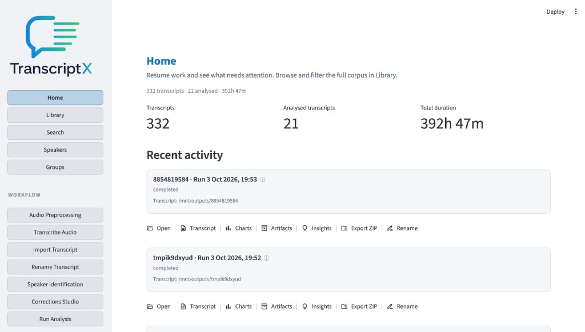
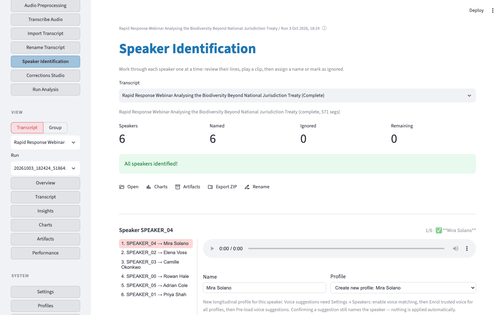
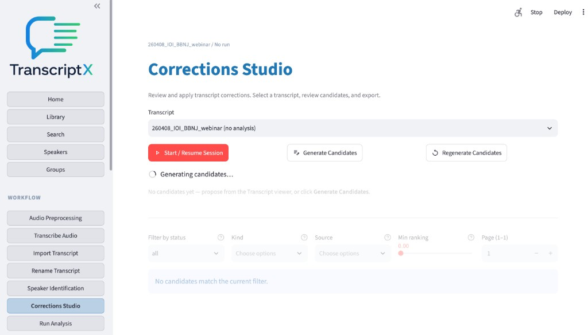
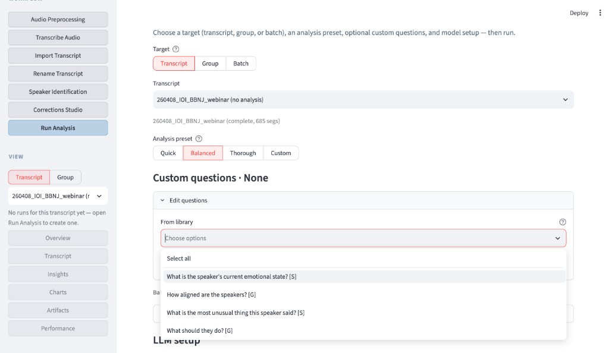
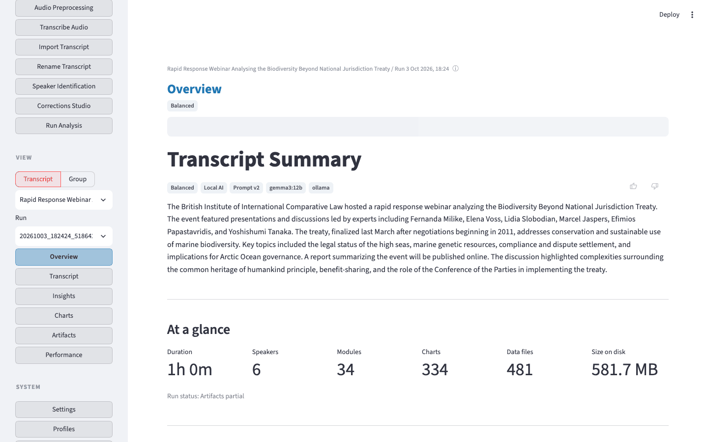
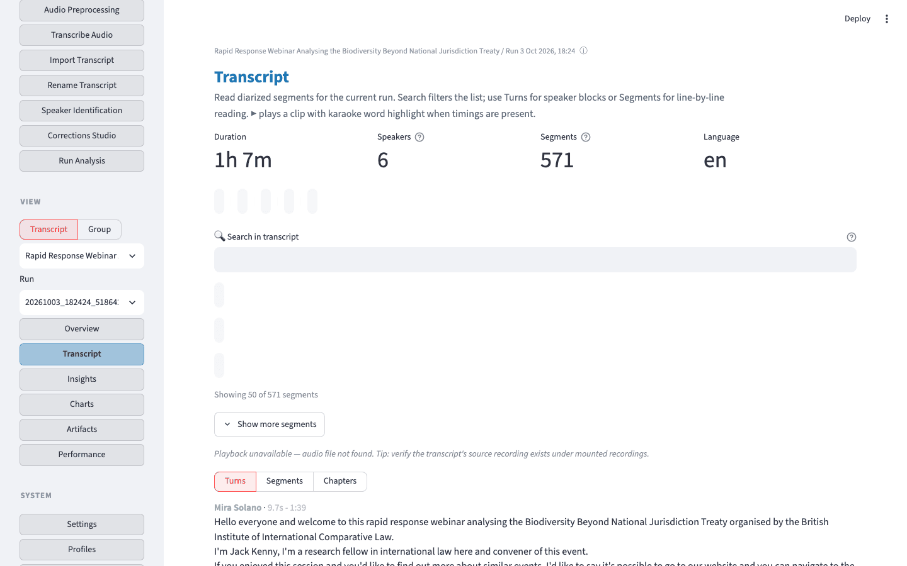
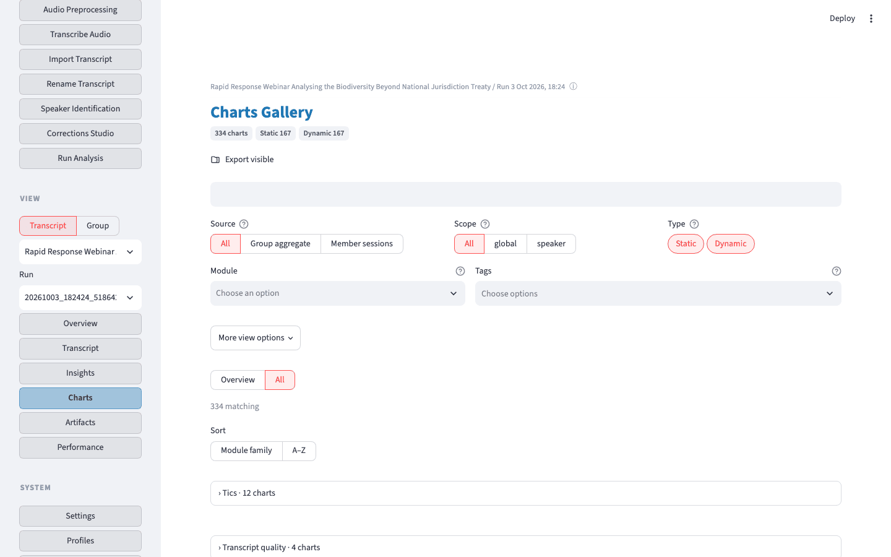

<p align="center">
  <picture>
    <source media="(prefers-color-scheme: dark)" srcset="assets/transcriptx_logo_dark.png">
    <source media="(prefers-color-scheme: light)" srcset="assets/transcriptx_logo.png">
    
  </picture>
</p>

TranscriptX is a local-first workbench for people who want to think with transcripts.

Import conversations you already have. See themes, speakers, and evidence.
Optional local AI stays on your computer.

Not sure if this is the right tool? [How TranscriptX compares](docs/comparison.md).

## Screenshots
















## What can I do with it?

- Understand themes across a conversation
- Compare speakers — who said what, and how they interact
- Investigate a question and jump back to the original lines
- Analyse several conversations together over time
- Correct the transcript while you read
- Export findings as HTML or a ZIP you keep

You can also browse **Charts**, save custom questions, and turn on optional [local AI](docs/runtime/llm.md) for summaries and extracts. [Analysis modules](docs/generated/modules.md) · [Workflows](docs/workflows/index.md) · [Settings](docs/runtime/settings.md).

## On your machine

Source files and analysis results stay on your computer. Optional AI uses
[Ollama](docs/runtime/llm.md) locally and stays off until you turn it on.

Limits: [known limitations](docs/known_limitations.md). Third-party models: [NOTICE](NOTICE).

## From a file to a useful Overview

Use the sample [planning_review.json](docs/workflows/fixtures/planning_review.json) if you do not have a transcript yet.

1. Open **Import Transcript**, upload the JSON, and confirm.
2. Open **Speaker Identification** and give each diarized label a display name (the sample uses labels such as `SPEAKER_00` until you rename them). Most **Balanced** modules skip until speakers are named.
3. Open **Run Analysis**, keep **Balanced**, and run it.
4. Open **Overview** and read the summary and the at-a-glance metrics.

Full walkthrough: [First analysis](docs/workflows/first-analysis.md).

Everyday jobs, in order: [first analysis](docs/workflows/first-analysis.md), [name speakers](docs/workflows/speaker-identification.md), [investigate evidence](docs/workflows/investigate-evidence.md), [local AI](docs/workflows/local-ai-synthesis.md) (optional), [export](docs/workflows/export-results.md). More: [all workflows](docs/workflows/index.md).

## Installation

**Docker (recommended).** Copy `.env.example` to `.env` and set **`HOST_RECORDINGS_DIR`** to an absolute path **outside this repository**.

```bash
git clone https://github.com/glen-w/TranscriptX.git
cd TranscriptX
cp .env.example .env   # set HOST_RECORDINGS_DIR
docker compose up transcriptx-web
```

Open http://localhost:8501. The first run builds the image.

**Native (from git — not PyPI).** Python 3.10–3.12. From the repo: `./transcriptx.sh` creates a `.transcriptx` virtualenv and starts the web UI. Use that launcher, or `pip install -e ".[full,web]"`, so chart modules can finish a **Balanced** run. Details: [installation](docs/runtime/installation.md). Docker notes: [docker](docs/runtime/docker.md). How to turn audio into a file: [transcription](docs/runtime/transcription.md).

## Advanced and developer docs

- [User docs sitemap](docs/USER_INDEX.md) · [Website](website/index.html)
- [Developer docs](docs/DEV_INDEX.md) · [Roadmap](docs/ROADMAP.md)
- [Python API / web launcher](docs/generated/cli.md) · [Product definition](docs/PRODUCT.md)
