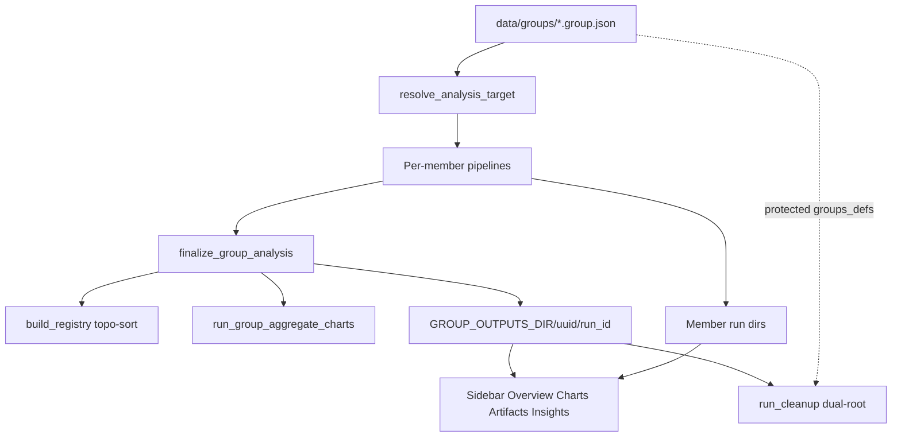

Type: PRODUCT
Authority: self

> **Archived / superseded.** Historical context only. Current authority: [group_analysis_module_outputs.md](../../groups/group_analysis_module_outputs.md). Do not treat as live roadmap or support policy.

# Group functionality audit — 2026-07-17

> Evidence-based audit of **analysis groups** (file-backed multi-transcript analysis).  
> Companion to [`stocktake_2026-07-17.md`](stocktake_2026-07-17.md).  
> **Non-goals:** serial audio groups, `module_ui_groups` / block taxonomy, `export/grouping.py` speaker segments.

**Verdict:** Core pipeline (identity → finalize → aggregation → charts) is **mature and well-tested**. Release-hygiene items G1/G2/G3/F3 closed 2026-07-17 (README file-backed; manifests documented in STORAGE; `data/groups` untracked). Soft-failure / doc-drift gaps (R1–R2, D1, A3–A4) remain. **2026-07-19:** Insights/Overview group UX gap closed — blocks are dual-aware (group rollup + per-session member browse); `ArtifactContentLoader` honors member `storage_root`. **2026-07-24 refresh:** chart registry includes `topic_shift`, `epistemic_markers`, `politeness`, **`keyphrases`** (B16); `llm_custom_qa` aggregates without a group chart (v2 group loader pending). No blocker that prevents local beta use of groups.

---

## 1. Executive summary

| Dimension | Verdict | Confidence |
|-----------|---------|------------|
| Identity / manifests | Mature (file-first) | High |
| Finalize + aggregation | Mature; soft-fail semantics | High |
| Group charts / contracts | Mature; minor phase-4 doc drift | High |
| Web subject surfaces | Mature at service layer; Insights dual-aware (2026-07-19) | High |
| Run cleanup dual-root | Mature; defs protected | High |
| Public labeling | File-backed (G1–G3 closed) | High |

**Test gates run 2026-07-17 (all green):**
- Contract/outcome: 23 passed (`test_group_module_support_contract`, wiring, outcome truth, member runs, chart_outcome)
- Finalize/smoke (with `-m ""`): 15 passed
- Charts: 64 passed (1 deselected)
- Web group services: 19 passed

**Follow-up gates 2026-07-19:**
- Web blocks (incl. group-aware Insights): 52 passed (`tests/web/blocks/`)

**Inventory refresh 2026-07-24 (post-B16):** live `build_registry()` = **46** agg ids; `GROUP_CHART_REGISTRY` = **34** chart generators (see §3).

---

## 2. Architecture (as audited)

**Primary code:**
- Domain/store: `core/domain/group.py`, `core/store/group_manifest_store.py`, `core/services/group_service.py`
- Finalize: `core/pipeline/group_analysis_runner.py`
- Aggregation: `core/analysis/aggregation/registry.py`
- Charts: `core/analysis/group_charts/registry.py`, `runner.py`
- Insights/Overview dual load: `web/blocks/group_content.py`, `web/blocks/loader.py` (`storage_root`)
- Docs taxonomy: `docs/groups/group_analysis_module_outputs.md` (authoritative four classes)

---

## 3. Aggregation inventory (`agg_id` matrix)

Source: `build_registry()` + `GROUP_CHART_REGISTRY` + four-class doc (refreshed **2026-07-24**).

| Class | agg_ids |
|-------|---------|
| **Registry-backed charts** | acts, affect_tension, bertopic, contagion, conversation_loops, echoes, emotion, entity_sentiment, epistemic_markers, highlights, insights, interactions, **keyphrases**, lexical_diversity, llm_action_items, moments, momentum, ner, pauses, politeness, prosody, qa_analysis, semantic_similarity, sentiment, simplified_transcript, stats, tics, topic_modeling, topic_shift, transcript_quality, understandability, voice_fingerprint, voice_mismatch, voice_tension |
| **Special-path visuals** | wordclouds (`run_group_wordclouds`; not in chart registry) |
| **Data-only (no chart)** | temporal_dynamics, insight_eligibility, voice_contours, llm_speaker_summary, contextual_emotion, fine_grained_emotion, llm_custom_qa |
| **Blob-only** | transcript_output, summary, llm_summary, narrative_summary |

**Deps (non-empty):** entity_sentiment→ner; insight_eligibility→tics; pauses→acts; momentum→pauses; affect_tension→emotion+sentiment; contagion→emotion; qa_analysis→acts; moments→pauses+echoes+momentum+qa_analysis; summary→highlights.

**Aliases (one agg, multiple modules):** voice_features / voice_charts_core / prosody_dashboard → `prosody`; semantic_similarity_advanced / semantic_similarity_v2 → `semantic_similarity` (B14: composite charts + `motif_rows` / `semantic_similarity_pooled`; TF-IDF incomparable).

**Notes (post-audit ships):** `transcript_quality` pools only within matching ASR provenance cohorts; emotion-family classifier aggs (`contextual_emotion`, `fine_grained_emotion`) are independent of lexical `emotion` and currently data-only at group chart layer; group LLM synthesis is a finalize-path composite (see [`group_llm_synthesis_contract.md`](../groups/group_llm_synthesis_contract.md)), not a chart registry entry; `llm_custom_qa` group chart deferred pending v2 group loader; Wave 2 lexicons + `topic_shift` have dedicated pooled/temporal chart contracts; **B16** `keyphrases` pools noun_chunks by `canonical_key` (YAKE/KeyBERT deferred; per-speaker group rows deferred) — see [`group_charts_keyphrases_pooled_contract.md`](../groups/group_charts_keyphrases_pooled_contract.md).

**Allowlists (live):**
- `DEFAULT_GROUP_OVERVIEW_VIZ_IDS` — 7 viz ids (acts pie, sentiment/stats session, 4 temporal overlays)
- `POOLED_GROUP_OVERVIEW_ALLOWLIST` — `{group.acts.global_acts_pie.global}`
- `CROSS_SESSION_SPEAKER_OVERVIEW_ALLOWLIST` — empty (gallery-only)
- `GROUP_CHART_OUTCOME_OPTIONAL_KEYS` — 16 pooled keys (incl. `keyphrases_pooled`)

**Four-class doc ↔ registry:** no class assignment drift.  
**Phase-4 table ↔ registry:** incomplete rows for `highlights`, `moments`, `simplified_transcript` (see G-D1).

---

## 4. Findings matrix

Severity: **Blocker / High / Medium / Low / By-design**.

### 4.1 Product labeling and storage docs

| ID | Finding | Severity | Evidence |
|----|---------|----------|----------|
| **G1** | README claimed Groups “(DB-backed, experimental)” | **Closed** | Now “file-backed” (`README.md`) |
| **G2** | README self-contradiction with file-first callout | **Closed** | Resolved with G1 |
| **G3** | `STORAGE.md` omitted `data_dir/groups/*.group.json` manifests | **Closed** | Tree documents manifests + run outputs |
| **G4** | ROADMAP “DB-backed analytics” is Phase-3 speaker tracking, not group identity | By-design | `docs/ROADMAP.md` ~154 |
| **F3** | 11 `data/groups/*.group.json` git-tracked despite `.gitignore` | **Closed** | `git rm --cached`; files remain local-only |

### 4.2 Identity, readiness, feature flags

| ID | Finding | Severity | Evidence |
|----|---------|----------|----------|
| **A1** | File-backed create/dedup/resolve by exact normalized member list | By-design | `GroupService` + `GroupManifestStore` |
| **A3** | `group_type` accepted but unused; `list_groups(group_type=…)` never filters | **Medium** | `group_service.py` `list_groups` both branches return all |
| **A4** | Groups page CRUD **not** gated by `group_analysis.enabled` | **Medium** | `page_modules/groups.py` |
| **A5** | Run Analysis “Group” target **is** gated | By-design | `run_analysis.py` |
| **A6** | Sidebar can select Group subject when analysis disabled | Low / By-design | `sidebar.py` |
| **A7** | Readiness requires ≥1 existing member path; other missing paths not reported as errors | Low | `validate_group_analysis_readiness` |
| **A8** | All registered modules `supports_group=True` | By-design | support contract test |

### 4.3 Finalize / outcomes

| ID | Finding | Severity | Evidence |
|----|---------|----------|----------|
| **B1** | Disabled path: scaffold/metadata only, no registry loop | By-design | finalize + disabled scaffold integration |
| **B2** | `MISSING_DEP` warn + skip | By-design | deps integration test |
| **R1** | `GROUP_FINALIZATION_FAILED` handled in `project_group_outcomes` but **never emitted** by finalize (`group_phase_terminal_failure` always `False`) | **Medium** | `group_analysis_runner.py` return metadata; only injected in outcome unit tests |
| **R2** | Aggregate `outcome is None` → silent continue (no warning) | **Medium** | `group_analysis_runner.py` ~340 |
| **R3** | Charts best-effort; chart failure → `GROUP_CHART_FAILED` → outcome `partial`, agg still completed | Low / By-design | runner + outcome truth |
| **R4** | Outer finalize chart `except` logs only (dead today; runner swallows) | Low | finalize |

### 4.4 Charts / docs drift

| ID | Finding | Severity | Evidence |
|----|---------|----------|----------|
| **D1** | Phase-4 outcome table missing rows for `highlights`, `moments`, `simplified_transcript` (present in registry + families) | **Medium** | `group_charts_phase4_outcome_table.md` vs `GROUP_CHART_REGISTRY` |
| **D2** | Phase-4 incomplete listing of by-design non-chart aggs (covered by four-class doc) | Low | same |
| **D3** | `DEFAULT_GROUP_OVERVIEW_VIZ_IDS` matches default-overview doc | OK | `chart_registry.py` + `group_charts_default_overview.md` |
| **D4** | Temporal / cross-session / pooled fail-closed via context guards | By-design | `context_guards.py` + tests |

### 4.5 Web UX

| ID | Finding | Severity | Evidence |
|----|---------|----------|----------|
| **E1** | Subject lifecycle: Groups CRUD → sidebar → Overview/Charts/Artifacts with aggregate/member filters | By-design | page modules + `ArtifactService._merge_group_member_artifacts` |
| **E2** | Search has **no** group scope | By-design (product gap) | `search.py` radios transcript-only |
| **E3** | Group subject on Transcript page → member browser only | By-design | `_render_group_browser` |
| **E4** | Service-layer tests strong; page-level Groups CRUD / Run Analysis gate / search-under-group | **Closed 2026-07-18** | `test_groups_page.py`, `test_run_analysis_page.py` group gate, `test_search_page.py` group-subject contract |
| **E5** | `web/` omitted from coverage measurement | Medium | stocktake §7.2 |
| **E6** | Insights/Overview blocks expected single-transcript stems (`_insights.json`, etc.) under group root → empty tabs despite successful member runs | **Closed 2026-07-19** | Dual rollup + session picker; `group_content.py`; loader `storage_root`; `test_group_aware_insights.py`, `test_group_content.py`, `test_loader.py` |
| **E7** | `ArtifactContentLoader` ignored member `storage_root` (Artifacts page worked; Insights did not) | **Closed 2026-07-19** | `loader.py` → `resolve_artifact_source_path`; data preview same |
| **E8** | Overview compact blocks spawned session pickers; availability said “Run the modules” when only group aggregates existed; dual `is_group_run` defs | **Closed 2026-07-19 (review)** | Compact = rollup-or-quiet; widened patterns + group availability copy; unified `is_group_run` via synthesis resolve; view-raw scoped to `storage_root` |

**Clarification (E6 root cause):** Group pipeline **already** runs selected modules on each member (`pipeline.py` member loop). Empty Insights was a **surfacing** bug, not a missing member execution path.

### 4.6 Cleanup

| ID | Finding | Severity | Evidence |
|----|---------|----------|----------|
| **F1** | `groups_defs` = `data/groups` protected; cleanup deletes runs only | By-design | `default_protected_paths` |
| **F2** | Dual-root discovery + nested group skip under transcript outputs | By-design | `classifier.py` |
| **F4** | Bulk/delete-old independence + checksum leave defs intact — tested | OK | cleanup bulk/acceptance suites |

---

## 5. Test coverage map (representative)

| Area | Tests (representative) | Gate 2026-07-17 |
|------|------------------------|-----------------|
| Support / wiring | `test_group_module_support_contract.py`, `test_group_module_for_group_wiring.py` | 7 passed |
| Outcome / member runs | `test_group_outcome_truth.py`, `test_write_group_member_runs.py`, `test_chart_outcome.py` | 16 passed |
| Finalize | `test_group_finalize_*_integration.py`, `test_group_analysis_smoke.py` | 15 passed (`-m ""`) |
| Charts | `test_group_charts.py`, allowlists, `group_charts/*` | 64 passed |
| Web services | `test_group_service.py`, member charts, subject, run_index, artifact edges, group browser | 19 passed |
| Insights dual UX | `test_group_aware_insights.py`, `test_group_content.py`, `test_loader.py` (storage_root) | 9 passed (2026-07-19; part of 52 `tests/web/blocks/`) |
| Cleanup × groups | discovery, bulk depth, characterisation goldens `"kind": "group"` | not re-run this pass (mature Phase B) |

**Gaps:** live emission of `GROUP_FINALIZATION_FAILED`. Page-level Groups / Run Analysis gate / search-under-group closed 2026-07-18. Insights empty-on-group closed 2026-07-19.

---

## 6. By-design omissions (confirm, do not “fix”)

- `temporal_dynamics`, `insight_eligibility`, `voice_contours`, `llm_speaker_summary` — aggregated, no chart registry entry
- Blob summaries / `transcript_output` — no charts
- Wordclouds — special visual path, not `GROUP_CHART_REGISTRY`
- Cross-session speaker charts — gallery-only (empty overview allowlist)
- Most pooled charts — gallery-only except acts pie on overview strip
- Stats pooled speaker **shares** — deferred (phase-4 note)
- `voice_tension` temporal overlay — deferred
- Bertopic — not a registered pipeline module
- Search / group-native transcript view — intentionally absent

---

## 7. Recommended follow-up backlog

Ordered for risk vs effort. None of these are required to keep shipping local beta group runs.

### Release hygiene

1. ~~**Fix README Groups line**~~ **Done** — file-backed (G1–G2 / stocktake B5).
2. ~~**Untrack `data/groups/*.group.json`**~~ **Done** — local user data only (F3 / stocktake H6).
3. ~~**Document manifests in STORAGE**~~ **Done** (G3).

### Correctness / contracts (next eng slice)

4. **Decide `GROUP_FINALIZATION_FAILED` policy** — either emit it from finalize on hard group-phase failure, or remove/demote the projection path and update outcome tests (R1).
5. **Warn on `outcome is None`** — emit `aggregation_warnings` entry instead of silent skip (R2).
6. **Complete phase-4 table** — add rows for highlights / moments / simplified_transcript (D1).
7. **Either implement or remove `group_type` filtering** (A3).

### Product / UX (beta polish, not blockers)

8. Reconcile feature-flag story: document that CRUD/sidebar work when aggregation disabled, or gate consistently (A4–A6).
9. ~~Optional: page-level tests for Groups CRUD + Run Analysis Group gate (E4).~~ **Done 2026-07-18.**
10. Optional: group-scoped search — product decision (E2).
11. ~~Insights/Overview empty on group subjects (E6/E7).~~ **Done 2026-07-19** — dual rollup + per-session; loader `storage_root`; see [`web_blocks.md`](web_blocks.md).

### Explicit non-goals (do not start from this audit)

- Aggregation algorithm rewrites / mega-generator collapse
- DB-backed group analytics (Phase 3 speaker tracking)
- Compare page / longitudinal product
- Cleanup schema/policy changes

---

## 8. How to use this document

| Question | Where |
|----------|-------|
| Is groups “done”? | §1 — mature pipeline; labeling/hygiene closed |
| What was wrong for OSS trust? | G1, G2, F3 (closed 2026-07-17) |
| What is by-design? | §6 + By-design rows in §4 |
| What tests pin contracts? | §5 |
| What to fix next? | §7 |

**Refresh policy:** Re-run the four pytest gates in §1 when changing aggregation registry, chart registry, finalize, or group cleanup roots. When changing Insights/Overview group loading, also run `pytest tests/web/blocks/`. Update the inventory table when adding `agg_id`s.
