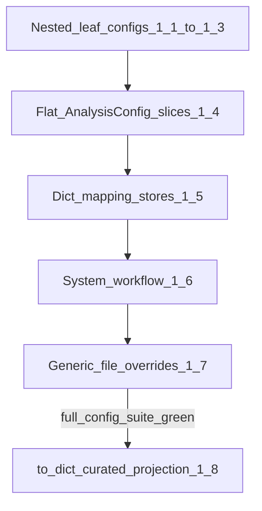

> **Archived / superseded.** Historical context only. Current authority: [developer_quickstart.md](../../developer_quickstart.md). Do not treat as live roadmap or support policy.

<!-- Planning doc: authoritative for Candidate 1 ownership collapse. -->
<!-- Behavior-preserving ownership migration only. Validation consolidation and resolver redesign are separate tracks. -->

# Config ownership collapse (locked scope)

**Authority:** This document is authoritative for Candidate 1 **delegation**, **file-override**, and **`to_dict()` sequencing**. Companion docs ([`pydantic_migration.md`](pydantic_migration.md), [`config_knobs_refactor_plan.md`](config_knobs_refactor_plan.md)) defer to it for those steps. Validation consolidation and resolver redesign remain separate tracks.

**Status: Candidate 1 Done through 1.8** (Wave 0 Track B). Optional **1.9** structural split of `analysis.py` remains out of done criteria.

Post-landing registry ownership invariant (enforced by `tests/core/config/test_registry_ownership.py`): **51 pilots / 705 Pydantic-owned flattened registry leaves / 16 permanent legacy** (**721** total; includes `keyphrases` pilot). Historical planning text below may still mention earlier **50 / 690 / 16** (706), **50 / 682 / 16** (698), **46 / 642 / 16** (658), **44 / 614 / 16** (630), or **41 / 598 / 10** (608) targets; treat the test invariant as authoritative. Inventory key counts are **flattened registry-leaf counts**, not direct dataclass field counts (e.g. `MomentumConfig` has fewer direct fields than **11** leaves because nested `weights` flattens).

## Locked scope

**In scope:** behavior-preserving ownership migration — delete duplicated dataclass default literals; hydrate runtime dataclasses from existing Pydantic pilots; keep `TranscriptXConfig` attribute facade and existing override order (`defaults < file < profiles < env`).

**Approved API narrowing (only exception to “no runtime API changes”):** when a field becomes delegated (`field(init=False)`), constructor kwargs for that field cease to be accepted and raise `TypeError`. This is explicit, reviewed, and gated by a pre-PR call-site audit.

**Out of scope:** other runtime API changes, validation changes, key renames, new knobs, resolver redesign (temp-file), Settings UI generation, intentional registry count changes, structural `analysis.py` split (1.9 follow-up). Validation consolidation and resolver redesign remain separate tracks in companion docs.

## Definition: “delegated”

A config is **delegated** when:

1. Every registered field default originates **only** in its Pydantic model (`Field(default=…)` / `default_factory`).
2. The runtime dataclass has **no literal defaults** for those registered fields.
3. Hydration goes through the shared helper appropriate to the shape (dataclass hydrate, flat-slice hydrate, or mapping-store hydrate).
4. The dataclass retains the existing attribute facade (`get_config().analysis.<…>`).

## Constructor / `init=False` contract

**Proven contract (nested + system/workflow delegated configs):** all owned fields use `field(init=False, repr=True)`; hydrate from `Model()` in `__post_init__` (or a called hydration method). Constructor kwargs for those fields are **not** supported (`TypeError`). Call sites must use `Cls()` then mutate attributes if needed.

**Same rejection contract for 1.6 system/workflow dataclasses** (`LLMConfig`, `LoggingConfig`, `AudioPreprocessingConfig`, `WorkflowConfig` / `SpeakerGateConfig`, `InputConfig`, `OutputConfig`, `GroupAnalysisConfig`, `MetadataConfig`, `DashboardConfig`): when a field is delegated, kwargs for it raise `TypeError`. Document and audit the same way as analysis nests.

**Flat `AnalysisConfig` during 1.4:** only the active pilot slice’s fields become `init=False` + hydrated; remaining flat fields keep normal init until their slice PR. Never hydrate the whole `AnalysisConfig` from one mega-model.

### Call-site audit (required before every 1.1–1.6 PR)

Before removing literals / switching to `init=False`:

1. AST and/or ripgrep for constructions that pass owned field names as kwargs (`PausesConfig(…)`, `AnalysisConfig(sentiment_window_size=…)`, `LLMConfig(enabled=…)`, etc.).
2. Fix or rewrite any hits to construct-then-setattr (or rely on defaults).
3. Record “no remaining owned-kwarg call sites” in the PR description.
4. Fail the PR if audits were skipped.

### Flat-slice constructor rejection tests (every 1.4 PR)

1. Newly delegated field kwargs raise `TypeError`.
2. Not-yet-delegated field kwargs still work.
3. Previously delegated slice fields remain hydrated and untouched.

### Mutation / validation clarification

**Direct programmatic `setattr` on leaves does not revalidate** (intentional legacy). **Existing profile application** via [`apply_profile_to_config()`](src/transcriptx/core/utils/config/profile_loading.py) **may call the target’s `validate()` after applying fields**; preserve that behaviour. Do not conflate the two paths.

## Function-local model imports (cycle avoidance)

[`pydantic_bridge.py`](src/transcriptx/core/config/pydantic_bridge.py) imports runtime dataclasses at **module import time**. Therefore:

- In [`analysis.py`](src/transcriptx/core/utils/config/analysis.py), [`system.py`](src/transcriptx/core/utils/config/system.py), and [`workflow.py`](src/transcriptx/core/utils/config/workflow.py), Pydantic **model** imports must remain **local** to `__post_init__` or a called hydration method — **never module-level**.
- The flat field-to-pilot ownership map is **test-only** or derived from bridge/model metadata in tests — **not** imported by `AnalysisConfig` at runtime.

## Authoritative inventory (flattened registry-leaf counts)

All “Keys” columns are **flattened registry-leaf counts** from the ownership snapshot / pilots. Nested submodels (e.g. `MomentumConfig.weights`) increase leaf count above direct dataclass field count. Do not “correct” these numbers against `len(fields(Cls))`.

### Already delegated (8 nested analysis subtrees)

| Runtime | Pilot | Registry leaves |
|---------|-------|-----------------|
| `PausesConfig` | `pauses` | 3 |
| `VoiceConfig` | `voice` | 18 |
| `CorrectionsConfig` (+ `CorrectionsLlmConfig`) | `corrections` | 23 |
| `SummaryConfig` (+ nested) | `summary` | 13 |
| `HighlightsConfig` (+ nested) | `highlights` | 30 |
| `LLMSummaryConfig` | `llm_summary_settings` | 1 |
| `LLMSpeakerSummaryConfig` | `llm_speaker_summary_settings` | 1 |
| `LLMActionItemsConfig` | `llm_action_items_settings` | 1 |

### Nested analysis dataclasses — delegated in 1.1–1.3 (historical PR column)

| Runtime | Pilot | Registry leaves | PR |
|---------|-------|-----------------|-----|
| `EchoesConfig` | `echoes` | 12 | 1.1 |
| `MomentumConfig` | `momentum` | 11 | 1.1 |
| `MomentsConfig` | `moments` | 15 | 1.1 |
| `AffectTensionConfig` | `affect_tension` | 9 | 1.2 |
| `ActsConfig` | `acts` | 21 | 1.2 |
| `TopicModelingConfig` | `topic_modeling` | 12 | 1.2 |
| `SpeakerExemplarsConfig` | `speaker_exemplars` | 26 | 1.3a |
| `BERTopicConfig` | `bertopic` | 6 | 1.3a |
| `SemanticSimilarityV2Config` | `semantic_similarity_v2` | 17 | 1.3b |
| `VectorizationConfig` | `vectorization` | 6 | 1.3b |
| `TagExtractionConfig` | `tag_extraction` | 3 | 1.3c |
| `QAAnalysisConfig` | `qa_analysis` | 11 | 1.3c |
| `TemporalDynamicsConfig` | `temporal_dynamics` | 13 | 1.3c |

### Flat `AnalysisConfig` pilot slices (exact owned fields — whole-model hydrate prohibited)

| Pilot | Fields (exact) | Registry leaves | PR |
|-------|----------------|-----------------|-----|
| `analysis_sentiment` | `sentiment_window_size`, `sentiment_min_confidence`, `emotion_min_confidence`, `emotion_model_name`, `emotion_output_mode`, `emotion_score_threshold`, `sentiment_backend`, `sentiment_model_name` | 8 | 1.4a |
| `analysis_ner` | `ner_labels`, `ner_min_confidence`, `ner_include_geocoding`, `ner_use_light_model`, `ner_max_segments`, `ner_batch_size` | 6 | 1.4b |
| `analysis_wordcloud` | `wordcloud_max_words`, `wordcloud_min_font_size`, `wordcloud_stopwords`, `exclude_unidentified_from_speaker_charts`, `readability_metrics` | 5 | 1.4c |
| `analysis_interaction` | `interaction_overlap_threshold`, `interaction_min_gap`, `interaction_min_segment_length`, `interaction_response_threshold`, `interaction_include_responses`, `interaction_include_overlaps`, `interaction_min_interactions`, `interaction_time_window`, `loop_max_intermediate_turns`, `loop_exclude_monologues`, `loop_min_gap`, `loop_max_gap` | 12 | 1.4d |
| `analysis_entity` | `entity_min_mentions`, `entity_types`, `entity_sentiment_threshold` | 3 | 1.4e |
| `analysis_legacy_semantic` | `semantic_similarity_threshold`, `cross_speaker_similarity_threshold`, `repetition_time_window`, `cross_speaker_time_window`, `semantic_model_name`, `clustering_eps`, `clustering_min_samples`, `max_segments_for_semantic`, `max_segments_per_speaker`, `max_segments_for_cross_speaker`, `use_quality_filtering`, `min_segment_quality_score`, `quality_filtering_profile`, `semantic_similarity_method`, `quality_weights_override`, `quality_thresholds_override`, `quality_indicators_override`, `max_semantic_comparisons`, `semantic_timeout_seconds`, `semantic_batch_size`, `semantic_progress_log_interval_seconds`, `module_progress_log_interval_seconds`, `output_formats`, `analysis_mode`, `include_legacy_modules` | 25 | 1.4f |

**Not in any pilot:** `use_dag_pipeline` (runtime-only; absent from registry/`to_dict()`). Leave literal.

### Dict / profile stores (mapping attributes — separate hydrate recipe)

| Attr on `AnalysisConfig` | Pilot | Registry leaves | PR |
|--------------------------|-------|-----------------|-----|
| `quality_filtering_profiles` | `quality_filtering_profiles` | 162 | 1.5a |
| `semantic_similarity_v2_profiles` | `semantic_similarity_v2_profiles` | 22 | 1.5b |
| `quick_analysis_settings` | `quick_analysis_settings` | 10 | 1.5c |
| `full_analysis_settings` | `full_analysis_settings` | 12 | 1.5c |

### System / workflow (undelegated; separate PRs; same kwargs rejection)

| Runtime | File | Pilot(s) | Registry leaves | PR |
|---------|------|----------|-----------------|-----|
| `LLMConfig` | `system.py` | `llm` | 10 | 1.6a |
| `LoggingConfig` | `system.py` | `logging` | 6 | 1.6b |
| `AudioPreprocessingConfig` | `system.py` | `audio_preprocessing` | 18 | 1.6c |
| `WorkflowConfig` (+ `SpeakerGateConfig`) | `workflow.py` | `workflow` | 13 | 1.6d |
| `InputConfig` | `workflow.py` | `input` | 6 | 1.6e |
| `OutputConfig` | `workflow.py` | `output` | 9 | 1.6f |
| `GroupAnalysisConfig` | `workflow.py` | `group_analysis` | 9 | 1.6g |
| `MetadataConfig` | `workflow.py` | `metadata` | 4 | 1.6h |
| `DashboardConfig` | `workflow.py` | `dashboard_display` (2) + `dashboard_overview` (4) | 6 | 1.6i |

### Permanent legacy keys (10 — do not pilot)

`active_workflow_profile`, `analysis.active_acts_profile`, `analysis.active_qa_analysis_profile`, `analysis.active_semantic_similarity_v2_profile`, `analysis.active_tag_extraction_profile`, `analysis.active_temporal_dynamics_profile`, `analysis.active_topic_modeling_profile`, `analysis.active_vectorization_profile`, `use_emojis`, `core_mode`.

## Dashboard collision handling (PR 1.6i)

**Field sets (must stay disjoint — gate with a test):**

- `dashboard_display`: `duration_hours_threshold_seconds`, `duration_summary_style`
- `dashboard_overview`: `schema_version`, `overview_charts`, `overview_missing_behavior`, `overview_max_items`

Hydrate in fixed order: **display then overview**. Test both pilots. If overlap is ever introduced, reject in CI unless explicit precedence is documented and tested.

## Dependency order



1. Nested leaf configs (1.1–1.3)
2. Flat `AnalysisConfig` slices (1.4)
3. Mapping stores (1.5) — after flat slices; fixed hydrate order below
4. System/workflow (1.6)
5. Generic file overrides (1.7) — **Done** (atomic deep-candidate apply)
6. Curated `to_dict()` (1.8) — **Done** in code

**1.9** structural split is a separately tracked follow-up; not part of Candidate 1 done criteria.

## Partial hydration helpers

### Flat slices — `_hydrate_analysis_slice`

Iterates **only** `model.model_fields` keys; sets those attributes; leaves others untouched. Invoke from `AnalysisConfig.__post_init__` in order: sentiment → ner → wordcloud → interaction → entity → legacy_semantic. Disjoint field sets enforced by ownership-map test.

### Mapping stores — `_hydrate_mapping_store` (required; do not use slice helper)

The four store models describe the **contents of one `AnalysisConfig` attribute**. Using `_hydrate_analysis_slice` would incorrectly try to set profile/setting **names** as attributes.

Require a helper of the form:

```python
_hydrate_mapping_store(
    self,
    "quality_filtering_profiles",
    QualityFilteringProfilesSettingsModel(),
)
```

Behaviour: `setattr(instance, attr_name, model.model_dump())` with a **fresh** dump (mutable independence). Model import stays function-local.

**Fixed order in `AnalysisConfig.__post_init__`:** run all completed flat-slice hydrates first, then mapping stores in this order:

1. `quality_filtering_profiles`
2. `semantic_similarity_v2_profiles`
3. `quick_analysis_settings`
4. `full_analysis_settings`

## Field-to-pilot ownership map (gate before 1.4)

Committed map + test **before** any 1.4 PR. Test-only / bridge-derived — not imported by runtime `AnalysisConfig`. Fails on omit, overlap, or out-of-pilot hydrate.

## Expected ownership counts after each PR

Historical planning targets during 1.1–1.8 used **41 / 598 / 10** (608), then post-1.8 **44 / 614 / 16** (630). Live invariant after `transcript_quality` pilot (authoritative; enforced by `tests/core/config/test_registry_ownership.py`):

| After PR | Pilots | Pydantic leaves | Legacy | Total |
|----------|--------|-----------------|--------|-------|
| Candidate 1 complete (through 1.8) | **44** | **614** | **16** | **630** |
| + `transcript_quality` pilot (0.6.3+) | **45** | **619** | **16** | **635** |

Runtime delegated nested subtree count: start **8**; after 1.1 → **11**; 1.2 → **14**; 1.3a → **16**; 1.3b → **18**; 1.3c → **21**. Flat slices 0→6; mapping stores 0→4; system/workflow dataclasses 0→9.

## Step 1.5 — mapping-store merge semantics + store-specific consumers

### File-load merge (preserve)

| Concern | Contract |
|---------|----------|
| Top-level `quality_filtering_profiles` | **Replacement** of the whole dict |
| Threshold lists of length 2 | Coerced to `tuple` before apply |
| Unknown profile names in replacement | Accepted (no schema strip) |
| Deletion via omission | Only for full-dict replacement |
| File replacements | **Must not** pass through Pydantic `model_validate` / construct if that would reject, strip, coerce, or fill differently than today’s path |

### Store-specific selectors and consumers (not a generic four-stage profile E2E)

Do **not** force all four stores through “default → file → selected profile → env.” They are different shapes. Require **store-specific consumer tests**:

#### `quality_filtering_profiles`

- **Selector:** `analysis.quality_filtering_profile` (scalar; under `analysis_legacy_semantic`).
- **Final consumer:** [`TranscriptXConfig.get_quality_filtering_config()`](src/transcriptx/core/utils/config/main.py) — lazily looks up the named entry in `quality_filtering_profiles`, falls back to `"balanced"`, then applies `quality_*_override` dicts.
- **Test:** default store → file replacement of profiles dict → change selector / overrides → assert `get_quality_filtering_config()` output; plus env override of a leaf or selector if registered. Not module `profile_loading`.

#### `quick_analysis_settings` / `full_analysis_settings`

- **Role:** mode **presets**, not module profiles from `profile_loading`.
- **Selector/consumer:** [`core/analysis/selection.py`](src/transcriptx/core/analysis/selection.py) (`apply_analysis_mode` / `filter_modules_by_mode`) reads the dict and writes scalar analysis fields (`semantic_similarity_method`, segment caps, NER flags, `quality_filtering_profile`, etc.).
- **Test:** default presets → file override of preset keys → invoke mode apply → assert resulting analysis scalars; env leaf override after file if applicable. Do not treat as adapter-backed saved profiles.

#### `semantic_similarity_v2_profiles`

- **Built-in presets:** inline dict on `AnalysisConfig`; selected by legacy `active_semantic_similarity_v2_profile`.
- **Runtime merge consumer:** [`resolve_semantic_similarity_v2_runtime()`](src/transcriptx/core/analysis/semantic_similarity_v2/config_resolve.py) — defaults → active preset from `semantic_similarity_v2_profiles` → per-field overrides from `analysis.semantic_similarity_v2` that differ from defaults.
- **Distinct from adapter-backed saved profiles:** module adapters + `load_module_profiles` / `apply_profile_to_config` target `analysis.semantic_similarity_v2` (the dataclass), not this presets dict. Tests must cover both paths separately and must not conflate them.
- **Test:** preset dict default/file → active name → resolve runtime config; separately, adapter/file target payload applied via `apply_profile_to_config` (which may call `validate()` when present).

## Step 1.7 — generic nested overrides + atomic apply

**Status: Done (2026-07-20).** Expand nested apply **without** semantic change (precedence, unknown keys ignored, list→tuple coercion, partial nested updates, list replace, dict shallow merge). Apply goes to a deep independent candidate; validate complete candidate (object + registry/Pydantic leaves); commit onto the live config only on success. **Acceptance:** config regression suite + `tests/core/config/test_file_overrides_atomicity.py`. Behaviour matrix: `docs/dev/file_override_behaviour_matrix.md`.

## Step 1.8 — curated `to_dict()` (no raw `asdict(self.analysis)`)

**Status: Done in code** (curated projection in `main.py`; kept after 1.7).
### Prohibitions and projection rules

**Prohibit** `asdict(self.analysis)` / dumping the whole analysis object. That would expose runtime-only fields deliberately absent today.

**Curated projection / exclusion must preserve:**

| Item | Rule |
|------|------|
| `AnalysisConfig.use_dag_pipeline` | Remain **absent** from `to_dict()` |
| `TranscriptXConfig.mode` | Remain **absent** from `to_dict()` (runtime UI mode) |
| Adapter-written `active_*` profile keys | Continue to be emitted via adapter `write_activation_value` into the curated maps (same as today) |
| Existing key order | Preserve where consumers rely on it (golden asserts order) |

Nested subtrees may still use `_config_to_dict` / `asdict` **per subtree** as today; the analysis **shell** stays an explicit curated key list (or equivalent exclusion-aware builder), not a wholesale dump.

### Copy / aliasing characterization (before changing 1.8)

Current `to_dict()` returns some list/dict objects **by reference** (e.g. flat analysis lists/dicts assigned directly) while nested dataclasses go through `asdict` (deep copy). **Before** simplifying:

1. Characterize which keys alias live config vs deep-copied snapshots.
2. Freeze that behaviour in tests.
3. Any change to copy semantics is a behaviour change and is out of scope unless explicitly approved with updated tests.

### Snapshot type parity

- Require **exact pre-change Python value and type parity** for the snapshot (including **tuples** remaining tuples).
- Separately assert `json.dumps(config.to_dict())` succeeds.
- Comparison normalization used in **tests** (for enum/model dump parity) must **not** drive production snapshot conversion that turns tuples into lists.

## Characterization fixtures and normalized parity (defaults only)

1. Generate `delegation_shape_<id>_pre.json` from the **pre-change branch**; immutable baseline — do not auto-update after implementation.
2. **Normalized parity helper** (dataclass vs model defaults): compares normalized JSON-safe values because `asdict` and `model_dump` may differ in enum/nested representation.
3. **Separate assertions** for runtime dataclass types and tuple types on the facade and on `to_dict()` where applicable.
4. Every subtree/slice/store PR: env, file, construction, mutation/`setattr`, `to_dict()`, `get_config()` three-path; plus call-site audit evidence; plus mutable independence (no shared list/dict/set/nested-dataclass identity across instances).
5. Ownership invariant **41 / 598 / 10** (608 total).

## Required smoke / regression commands (exact)

### Per ownership PR (1.1–1.6) and Doc/Gates PRs

```bash
pytest tests/core/config/ \
  tests/core/utils/config/test_env_key_registry.py \
  tests/core/utils/test_config_loading_contracts.py \
  tests/core/utils/test_config_validation.py \
  tests/integration/extended/test_config_cli_web.py \
  -q
```

Plus the PR’s new/updated delegation or characterization module. If a subtree already has a focused integration file (e.g. `test_acts_config_integration.py`, `test_semantic_v2_config_integration.py`), include it on that PR.

### After 1.7 (must be green before starting 1.8) and after 1.8

Same command.

### Config-package coverage companion

```bash
make test-config-coverage
# equivalent:
pytest tests/core/config/ tests/core/utils/config/ \
  tests/core/utils/test_config_loading_contracts.py \
  --cov=transcriptx.core.config --cov=transcriptx.core.utils.config \
  --cov-report=term-missing --cov-fail-under=85
```

Floor is **85%** on `transcriptx.core.config` and `transcriptx.core.utils.config` combined (measured ~96% after WP0–WP5; keep the gate at 85 unless intentionally raising). Raise `--cov-fail-under` if measured coverage is higher and should not regress.

## Cross-cutting gates

### Import-ban scope (exact)

**Allowed:** `src/transcriptx/core/utils/config/`, `src/transcriptx/core/config/`.

**Prohibited:** `src/transcriptx/core/analysis/`, `pipeline/`, `app/`, `web/`, `services/`, `io/`, `core/data_extraction/`, `core/viz/`, `core/store/`, `core/output/`, `core/llm/`.

**Frozen allowlist:** `LLMSummaryEffort` import in `src/transcriptx/core/analysis/llm_support/runtime.py` only; must not grow without review.

### Duplicate-default gate — three cases

| Case | Requirement |
|------|-------------|
| **Root delegated dataclass** | Direct owned fields are `field(init=False)`; root `__post_init__` (or called hydrate) required |
| **Nested child dataclass** (e.g. `HighlightsCounts`) | Fields are `init=False`; **no** own `__post_init__` required; coverage is **transitive** via parent `model_dump` + `_dataclass_from_nested_dump` |
| **Mapping store** | The single `AnalysisConfig` attribute is `init=False`; `_hydrate_mapping_store` covers all model leaves under that attribute |

Do not claim repo-wide detection of every duplicated constant outside these dataclasses.

## Documentation alignment

Companion docs ([`pydantic_migration.md`](pydantic_migration.md), [`config_knobs_refactor_plan.md`](config_knobs_refactor_plan.md)) must stay aligned with this plan:

1. Pydantic-owned key count **598**; total registry keys **608** (`598 + 10` legacy).
2. Normalized parity language for dataclass vs model defaults.
3. This plan is authoritative for delegation, file-override, and `to_dict()` sequencing.
4. Validation consolidation and resolver redesign remain separate tracks.

## PR sequence (summary)

| PR | Work |
|----|------|
| **Doc** | Expanded documentation PR above |
| **Gates** | Import ban; three-case duplicate-default gate; field-to-pilot map (test-only) |
| 1.1–1.3c | Nested delegation + call-site audits + local model imports |
| 1.4-pre / 1.4a–f | Map + flat slices + constructor rejection trio |
| 1.5-pre / 1.5a–c | Mapping-store helper + store-specific consumer tests |
| 1.6a–i | System/workflow same rejection contract; Dashboard last |
| 1.7 | Generic nested file overrides + deep-candidate atomic apply — **Done** (2026-07-20) |
| 1.8 | Curated `to_dict` projection — **Done** in code (landed ahead of formal 1.7; kept) |
| Follow-up | 1.9 structural split — outside done criteria |

## Done criteria (Candidate 1)

**Status: Done (through 1.8; Wave 0 Track B closed 2026-07-22).** Do not reopen mid-flight language in stocktake / Top-3 index.

- Three-case duplicate-default gate green for all delegated roots/children/stores.
- Every flat pilot field mapped exactly once.
- Every delegated config covered by expanded parity + store-specific consumers where applicable.
- Constructor narrowing only as approved; call-site audits done for 1.1–1.6.
- File profile/store replacements not revalidated through Pydantic.
- Ownership invariant **51 / 705 / 16** (721 total) — see `test_ownership_invariant_counts`.
- Full config regression suite green after 1.6, 1.7, and 1.8.
- Import ban green (frozen allowlist).
- `to_dict()` curated projection preserves exclusions, key order, Python types (incl. tuples), and characterized aliasing.
- Structural `analysis.py` split **not** required.

## Follow-up (outside Candidate 1 done criteria)

**1.9 Structural split** of `analysis.py` into `analysis_*.py` modules is tracked separately. Ownership collapse is complete regardless of whether that split lands.

## Risk & rollback

High blast radius. One subtree/slice/store per PR; revert single PR. Immutable pre-shape fixtures + ownership + `init=False`/hydrate gates detect drift. Do not batch all of 1.4. Do not run 1.7 and 1.8 in parallel.

