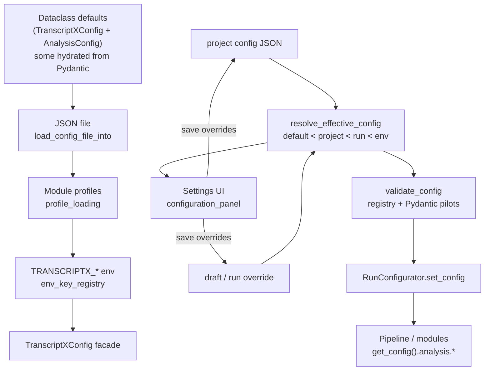

<!-- Planning doc: review only. No implementation committed with this file. -->

# TranscriptX config knobs — stepwise refactor plan

**Last reviewed:** 2026-07-14 (post 0.3.5 / 0.3.6). No runtime-delegation or load-path PRs landed since this plan was written.

## Status vs plan (changelog)

| Check | Current | Plan impact |
|---|---|---|
| Ownership snapshot | **41 / 598 / 10** (608 total registry keys) | Metrics match fixture |
| Runtime delegation | Partial — follow [`config_ownership_collapse_plan.md`](config_ownership_collapse_plan.md) | Authoritative for Candidate 1 sequencing |
| `docs/config/pydantic_migration.md` | Aligned to **41 / 598 / 10** + freeze policy | Step 0 done |
| Unused deps | Removed from `pyproject.toml` / requirements | Step 7 done |
| Deprecated `system.TranscriptXConfig` | Removed | Step 2 done |
| Product releases 0.3.5–0.3.6 | Export / Overview / Artifacts — not config knobs | No reordering of this plan |

---

## Current state (important)

Registry ownership is **already complete**. Do not restart a “migrate all knobs to Pydantic” program.

| Metric | Value (from `tests/core/config/fixtures/registry_ownership_snapshot.json`) |
|--------|-----------------------------------------------------------------------------|
| Registry leaf keys (total) | **608** |
| Pydantic-owned | **598** (41 pilots; flattened registry-leaf counts) |
| Permanent legacy | **10** (`active_*_profile` ×7, `active_workflow_profile`, `use_emojis`, `core_mode`) |
| Runtime delegation | **Partial** — `pauses`, `voice`, `corrections`, `summary`, `highlights`, `llm_*`; see ownership collapse plan |

Canonical freeze checklist: [`docs/config/pydantic_migration.md`](pydantic_migration.md) (**41 / 598 / 10**).  
**Authoritative for delegation, file-override, and `to_dict()` sequencing:** [`config_ownership_collapse_plan.md`](config_ownership_collapse_plan.md).  
Validation consolidation and resolver redesign stay separate from ownership-collapse PRs.

---

## 1. How config loads, overrides, validates, and is consumed



### Load order (runtime facade)

`TranscriptXConfig.__init__` in [`src/transcriptx/core/utils/config/main.py`](src/transcriptx/core/utils/config/main.py):

1. Construct section objects (`AnalysisConfig`, `LLMConfig`, …)
2. Optional file → [`file_overrides.load_config_file_into`](src/transcriptx/core/utils/config/file_overrides.py)
3. Module profiles → [`profile_loading`](src/transcriptx/core/utils/config/profile_loading.py)
4. Env last (wins) → [`env_overrides` → `env_key_registry`](src/transcriptx/core/utils/config/env_key_registry.py)
5. LLM post-check → [`config_raw_validation.validate_applied_llm_config`](src/transcriptx/core/utils/config/config_raw_validation.py)

**Priority:** defaults < file < profiles < env.

### Effective config (UI + runs)

[`resolver.resolve_effective_config`](src/transcriptx/core/config/resolver.py):

- Flatten defaults → merge project → merge draft/run override → overlay env
- Rebuild via **temp JSON + `_load_from_file`** (known debt; docs say keep until most subtrees are delegated)

### Validation layers (today)

| Layer | Path | Role |
|-------|------|------|
| Raw file contract | `config_raw_validation.py` | Allowed top-level keys, reject legacy shapes |
| Registry + pilots | `core/config/validation.py` | Type/bounds/choices; Pydantic subtree validate |
| Applied LLM/audio | `config_raw_validation` + model helpers | Shared with `validate_config` |
| Legacy object validator | `core/utils/config_validator.py` | Separate `ValidationResult` path — **parallel**, not unified |

### Consumers

| Surface | Entry | Reads |
|---------|-------|-------|
| Pipeline run | [`run_configurator.RunConfigurator`](src/transcriptx/core/pipeline/run_configurator.py) | `resolve` → `validate` → `set_config` |
| Modules / DAG | `get_config()` / `config_provider` | Attribute access on facade (`cfg.analysis.voice`, …) |
| Web Settings | [`configuration_panel.py`](src/transcriptx/web/ui/settings/configuration_panel.py) | `build_registry()`, `COMMON_SETTINGS_SCHEMA`, `validate_config`, save project/draft/run |
| Snapshots | `to_dict()` in `main.py` | Hand-maintained nested dict (churn hotspot) |

---

## 2. Dual-stack / bridge mechanics — what lives where

### Stack A — runtime facade (legacy bag)

`src/transcriptx/core/utils/config/`

| File | Role |
|------|------|
| `main.py` (~514 LOC) | `TranscriptXConfig`, `to_dict()`, global getters |
| `analysis.py` (~1233 LOC) | Mega analysis bag + nested dataclasses |
| `system.py` (~431 LOC) | `LLMConfig`, audio/logging **and deprecated duplicate `TranscriptXConfig`** (inverted load order) |
| `workflow.py` | Input/output/workflow/dashboard/metadata |
| `file_overrides.py` | Section-by-section setattr + nested apply + profile adapters |
| `env_key_registry.py` | Declarative `TRANSCRIPTX_*` → target path |
| `config_raw_validation.py` | Pre-apply JSON contract |

### Stack B — Pydantic SoT (definitions / registry / validate)

`src/transcriptx/core/config/`

| File | Role |
|------|------|
| `models/*.py` | Field defaults, types, bounds, UI metadata |
| `pydantic_bridge.py` | `PYDANTIC_REGISTRY_PILOTS` (41 specs) — **hand-maintained** |
| `pydantic_bridge_helpers.py` | Dotpath routing / override extract |
| `pydantic_registry.py` | Model → `FieldMetadata` |
| `registry.py` | `build_registry()` = flatten defaults + pilot overrides |
| `validation.py` | UI/run validation fan-out |
| `gui_support.py` | Curated common settings + profile contracts |
| `persistence.py` / `resolver.py` | Project/draft/run files + effective merge |

### Bridge rules

- **Registry leaf ownership:** Pydantic pilots own ~all editable keys; baseline 10 stay legacy forever.
- **Runtime:** Modules still see dataclasses. Delegated ones use `_hydrate_dataclass_from_pydantic` in `__post_init__` (defaults from model; setattr does **not** revalidate).
- **Not yet delegated:** Most nested configs still duplicate default literals in `analysis.py` / `system.py` / `workflow.py` while Pydantic also defines them → drift risk until delegated.

### Where knobs live (by phase)

| Category | Definition SoT | Runtime shape | Notes |
|----------|----------------|---------------|-------|
| 41 pilot subtrees | `models/*` | Dataclass (3 hydrated) | Continue delegation |
| `active_*_profile`, `use_emojis`, `core_mode` | Legacy only | Facade attrs | Do not pilot |
| Infra env (`TRANSCRIPTX_DATA_DIR`, …) | `INFRA_ENV_ALLOWLIST` | Not config bag | Keep separate |
| Profile JSON on disk | Profile adapters | Applied via `profile_loading` | Orthogonal to pilots |

---

## 3. Target end-state

**Single source of truth for field definitions:** Pydantic models under `core/config/models/`.

**Single runtime facade (keep):** `TranscriptXConfig` — thin containers hydrated from models; attribute API stable for pipeline/modules.

**Single validation path for knobs:** `validate_config` + pilot `model_validate` (+ thin raw-file allowlist). Delete/merge `config_validator.py` eventually.

**UI + pipeline read the same way:**

1. UI: `build_registry()` + `resolve_effective_config` + save override JSON  
2. Run: same resolve → `set_config(effective_config)`  
3. Modules: `get_config().analysis.<subtree>.<field>` only — never import models for runtime defaults

**Optional later (not required for unification):** replace resolver temp-file roundtrip with “build facade from nested dict via pilot validate + setattr”; only after most subtrees are delegated.

**Explicit non-goals:** Hydra / OmegaConf / Dynaconf; greenfield `BaseSettings` rewrite; collapsing UI to auto-generate every leaf.

---

## 4. Freeze policy (enforce now)

1. **No new literal defaults** in `utils/config/analysis.py` / `system.py` / `workflow.py` / `main.py` unless the knob is one of the permanent 10 legacy keys.
2. **New product knobs:** add/extend Pydantic model → register/update pilot in `pydantic_bridge.py` (hand review) → regenerate goldens → update `to_dict()` / `file_overrides` visibility if new subtree → env key only if needed in `env_key_registry.py`.
3. **No new registry pilots** for vanity; only when product adds keys (per migration doc). Prefer extending an existing model.
4. **No new validators** (Cerberus/Marshmallow/jsonschema/ad-hoc). Validation goes through Pydantic pilots + existing `validate_config`.
5. **Do not grow** `system.py`’s deprecated `TranscriptXConfig` — schedule deletion.
6. PR checklist: ownership snapshot invariant `41/598/10` (608 total; or update fixture intentionally) + `tests/core/config/` gate.

---

## 5. Ordered incremental steps (shippable)

### Step 0 — Align docs + freeze enforcement (0.5–1 d) — **done**

| | |
|--|--|
| **Goal** | Make docs match tree (41/598/10, 608 total); publish freeze policy |
| **Files** | `docs/config/pydantic_migration.md` (replace 38/585 language throughout Phase 2 / Batch 5 tables); optional PR template / AGENTS note |
| **Risk** | Low |
| **Tests** | `test_registry_ownership.py`, `test_ownership_snapshot_matches_committed_fixture` |
| **Example** | Document that `llm_summary_settings` etc. already count toward 41; keep “do not add vanity pilots” |

### Step 1 — Continue runtime delegation (Batch 5+) (multi-PR)

**Authoritative sequencing:** [`config_ownership_collapse_plan.md`](config_ownership_collapse_plan.md) (Candidate 1 Steps 1.1–1.6). Do not invent a parallel order here.

| | |
|--|--|
| **Goal** | Remove duplicate default literals; hydrate from Pydantic |
| **Files** | `utils/config/analysis.py` (or `system.py`/`workflow.py`); tests under `tests/core/config/test_*_config_delegation.py`; shape fixtures |
| **Risk** | Medium — nested dataclasses need recursive hydrate |
| **Tests** | Per ownership-collapse plan: pre-shape → normalized parity → three-path → ownership → file/env → full config suite |

### Step 2 — Delete deprecated duplicate facade (1–2 d) — **done**

| | |
|--|--|
| **Goal** | Remove inverted-order `TranscriptXConfig` in `system.py` |
| **Files** | `utils/config/system.py`; any remaining imports; tests |
| **Risk** | Medium if anything still constructs it |
| **Tests** | Grep + import tests; config load order contracts |
| **Example** | Ensure only `main.TranscriptXConfig` is constructible |

### Step 3 — Thin `file_overrides` (2–3 d)

**Authoritative sequencing:** ownership-collapse Step **1.7** (only after 1.1–1.6 parity green; acceptance gate before 1.8).

| | |
|--|--|
| **Goal** | Replace per-section branches with generic “section root → nested apply” + keep special cases (quality profiles tuples, workflow `speaker_gate`, adapters) |
| **Files** | `file_overrides.py`; `config_raw_validation.py` (allowlist stays); tests `test_nested_file_overrides_probe.py`, `test_settings_file_load_pilots.py` |
| **Risk** | Medium-high — merge semantics for dict profiles / adapters |
| **Tests** | Nested probe + full config regression suite (must be green before Step 5 / 1.8) |
| **Example** | Route `analysis.summary` only through `_apply_nested_dict_config` (already in `_NESTED_ANALYSIS_SUBTREES`) |

### Step 4 — Unify validation entrypoints (1–2 d)

**Separate from ownership collapse.** Do not mix into Candidate 1 PRs.

| | |
|--|--|
| **Goal** | One public validate API; deprecate `utils/config_validator.py` |
| **Files** | `core/config/validation.py`; callers of `config_validator`; possibly wrap for CLI |
| **Risk** | Low-medium |
| **Tests** | `test_validation_consolidation.py`, `test_validation_fanout.py`, `test_config_validation.py` |
| **Example** | Speaker-gate % cap and audio modes only via shared path |

### Step 5 — Shrink `to_dict()` (2–3 d, after many delegations)

**Authoritative sequencing:** ownership-collapse Step **1.8** (only after 1.7 acceptance). **Prohibit** raw `asdict(self.analysis)` — curated projection must keep `use_dag_pipeline` / `mode` absent and preserve Python types (incl. tuples).

| | |
|--|--|
| **Goal** | Generate analysis subtree from curated projection / per-subtree dumps instead of 100+ hand-listed keys in `main.py` |
| **Files** | `main.py`; visibility tests `test_analysis_config_visibility.py` |
| **Risk** | Medium — key order / missing keys / aliasing vs deep-copy |
| **Tests** | Exact Python-type parity + `json.dumps(to_dict())` + ownership suite |

### Step 6 — Resolver without temp file (optional, 2–4 d)

**Separate from ownership collapse / deferred.** Not part of Candidate 1 done criteria.

| | |
|--|--|
| **Goal** | Build `TranscriptXConfig` from nested dict without disk |
| **Files** | `resolver.py`; shared apply helper with `file_overrides` |
| **Risk** | High if done early — **defer** |
| **Tests** | `resolve_effective_config` parity vs current; run configurator; UI save/load |

### Step 7 — Dependency cleanup (0.5 d) — **done**

| | |
|--|--|
| **Goal** | Drop unused validators from `pyproject.toml` / requirements |
| **Files** | `pyproject.toml`, lockfiles, `archive/scripts/validate_dependencies.py` |
| **Risk** | Low (confirmed: **no** `import cerberus|marshmallow|jsonschema` in `src/`; **no** `BaseSettings` / `pydantic_settings` usage) |
| **Tests** | Import smoke / CI install |
| **Keep** | `pydantic` (required). Decide separately whether to keep `pydantic-settings` for future env binding or remove now |

### Step 8 — Optional env unification (later)

Wire selected `TRANSCRIPTX_*` keys from model metadata instead of hand-maintaining `env_key_registry.py` — only after delegation + Step 3. Keep infra allowlist separate forever.

---

## 6. Migration pattern — example knob `analysis.summary.enabled`

Mirror completed work in `corrections` / `voice` / `pauses`:

1. **Capture** pre-shape: extend `test_delegation_shape_snapshots.py` + `delegation_shape_summary_pre.json`.
2. **Confirm** SoT already in [`models/summary.py`](src/transcriptx/core/config/models/summary.py) (`SummarySettingsModel.enabled`).
3. **Rewrite** `SummaryConfig` / nested `SummaryCounts` / … in `analysis.py` to `field(init=False)` + `__post_init__` hydrate from `SummarySettingsModel()` (nested: dump and hydrate children, or hydrate leaf-by-leaf from nested model dump).
4. **Do not** change `pydantic_bridge` registration (`summary` pilot already exists).
5. **Add** `test_summary_config_delegation.py` using `delegation_test_utils`: ownership invariant, shape match, three-path access for `enabled`, file override `{"analysis":{"summary":{"enabled":false}}}` via `load_config_file_into`, optional `validate_config` invalid bound if any.
6. **Run** docs regression gate (`tests/core/config/` + env registry + config CLI/web).

Same pattern for a **new** knob (freeze-compliant):

1. Add field on existing model (e.g. `LLMActionItemsSettingsModel`) with `Field(default=..., json_schema_extra=…)` for UI metadata.
2. Regenerate goldens via `scripts/generate_pydantic_pilots.py` (does **not** rewrite bridge).
3. If runtime dataclass is delegated, hydrate picks it up; if not, add dataclass field **and** model field in same PR (temporary dual literal — prefer delegate in same PR).
4. Update env registry only if CLI/Docker must override it.
5. Update ownership snapshot if key count changes.

---

## 7. Cerberus / Marshmallow / jsonschema / pydantic-settings

| Library | In tree usage | Strategy |
|---------|---------------|----------|
| **Cerberus** | Unused | **Remove** in Step 7 |
| **Marshmallow** | Unused (pin only) | **Remove** in Step 7 |
| **jsonschema** | Comments only | **Remove** in Step 7 |
| **pydantic-settings** | Unused (`BaseSettings` nowhere) | **Remove now** or hold one release if you plan env→model binding; do **not** introduce a second env stack beside `env_key_registry` |
| **Pydantic v2 models** | Active SoT | **Keep / grow** |
| **Hand validators** | `config_raw_validation`, `config_validator` | Consolidate into `core/config/validation.py`; keep raw allowlist for migration-directional errors |

**Keep-for-now (short term):** dual validation until Step 4; raw allowlist forever for unsupported keys.

---

## 8. What NOT to do

- Do **not** introduce Hydra / OmegaConf / Dynaconf / confz.
- Do **not** re-migrate registry ownership or add empty-prefix pilots for `use_emojis` / `core_mode`.
- Do **not** auto-edit `pydantic_bridge.py` via generators (hand-review only; `--write-bridge` is paste scaffold).
- Do **not** make modules import Pydantic models for runtime config.
- Do **not** rewrite Settings UI as full schema auto-form for all 598 keys (`COMMON_SETTINGS_SCHEMA` stays curated).
- Do **not** change resolve precedence (default < project < run < env).
- Do **not** “fix” `file_overrides` and resolver temp-file in the same PR.
- Do **not** grow the deprecated `system.TranscriptXConfig`.

---

## 9. PR sequence and rough effort

| PR | Scope | Effort | Status (2026-07-14) |
|----|--------|--------|---------------------|
| **A** | Docs + freeze policy; ownership numbers | 0.5 d | **Done** |
| **B1…Bn** | Delegation PRs: `summary`, `highlights`, `llm_*`, then remaining nested, then top-level | 1–2 d each; ~8–15 PRs total | **Partial** (`summary` / `highlights` / `llm_*` done; more remain) |
| **C** | Delete `system.TranscriptXConfig` duplicate | 1 d | **Done** |
| **D** | Genericize `file_overrides` | 2–3 d | Not started |
| **E** | Collapse `config_validator` into `core/config/validation` | 1–2 d | Not started |
| **F** | Generate `to_dict()` analysis section | 2–3 d | Not started (after more delegations) |
| **G** | Drop unused deps | 0.5 d | **Done** |
| **H** (optional) | Resolver in-memory apply | 2–4 d | Deferred |

**Total to “unified definitions + thin facade + clean load/validate”:** ~4–8 engineer-weeks of incremental PRs.  
**Registry unification:** already done — do not budget for it.

**Regression gate (every PR):**

```bash
pytest tests/core/config/ \
  tests/core/utils/config/test_env_key_registry.py \
  tests/core/utils/test_config_loading_contracts.py \
  tests/core/utils/test_config_validation.py \
  tests/integration/extended/test_config_cli_web.py \
  -q
```

---

## Key file map for the parent brief

| Concern | Paths |
|---------|-------|
| Facade | `src/transcriptx/core/utils/config/main.py`, `analysis.py`, `system.py`, `workflow.py` |
| Load/override | `file_overrides.py`, `env_key_registry.py`, `profile_loading.py`, `config_raw_validation.py` |
| Pydantic SoT | `src/transcriptx/core/config/models/*`, `pydantic_bridge.py`, `pydantic_registry.py` |
| Resolve/validate/UI | `resolver.py`, `validation.py`, `registry.py`, `gui_support.py`, `web/ui/settings/configuration_panel.py` |
| Run apply | `pipeline/run_configurator.py` |
| Docs / fixtures | `docs/config/pydantic_migration.md`, `tests/core/config/fixtures/registry_ownership_snapshot.json` |
