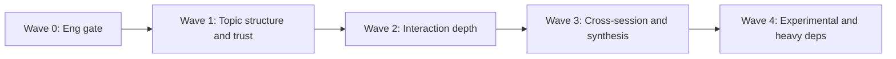

Type: PRODUCT
Authority: self

# Analysis module backlog (ranked) — 2026-07-17

> Ranked product backlog for **new or deepened** analysis modules, libraries, and approaches.  
> Companion to [`stocktake_2026-07-17.md`](stocktake_2026-07-17.md) and the prior coverage discussion.  
> Organized against web UI groups in `src/transcriptx/web/module_ui_groups.py`.

**Non-goals:** release hygiene, Top-3 eng refactors, transcription engine integration, plugin marketplace, realtime analysis.

**Default stance:** Prefer deepen-in-place over new module IDs when overlap is high. Prefer local-first libs and Ollama-structured extract over remote SaaS APIs.

**Capacity rule:** No more than **two new module IDs per delivery wave**. All other work must deepen, revive, or replace existing modules unless a written overlap assessment demonstrates a distinct user-facing object.

---

## 1. How to read this

| Field | Meaning |
|-------|---------|
| **Rank** | Global priority within the **analysis backlog** (1 = do first when product capacity opens). Platform workstreams are tracked separately (§2). |
| **Mode** | `new` = new module id; `deepen` = extend existing; `revive` = re-wire archived/optional path |
| **UI group** | Target `MODULE_UI_GROUPS` bucket (or new bucket if noted) |
| **Effort** | S / M / L (rough; contracts + tests assumed) |
| **Depends** | Eng or product prerequisites |

**Gate before any item:** Phase 1 hygiene + Top-3 config ownership progress remain ahead of greenfield analysis features (stocktake §9–§10). Items marked **Revive** may still land earlier if they are mostly rewire + deps, not new algorithms.

**Do not treat platform work as a single “shipped analysis.”** Multilingual routing (P1) and shared evidence/provenance (P2) are infrastructure with downstream adoption milestones; “done” must name which consumers adopted them.

---

## 2. Platform workstreams (not ranked as analysis modules)

These are shared capabilities. Track adoption per consumer; avoid presenting them as one shippable analysis feature.

| ID | Workstream | Affects | Intent | Adoption milestones (examples) |
|----|------------|---------|--------|--------------------------------|
| **P1** | **Multilingual model routing** (spaCy / embeddings / emotion / NER / understandability / keyphrases; potentially sentiment) from `language` metadata | Language & Meaning (+ Foundations) | Shared model-resolution; download / air-gap policy in `docs/runtime/models.md` | Per-consumer: supported-language declaration, unsupported-language behaviour, offline discovery |
| **P2** | **Evidence / provenance infrastructure** for inferred results | Summary & Synthesis consumers | One shared contract for spans, source module refs, confidence, abstention | Required before/alongside B10, B11, B18 — not reinvented three times |

P1 may start in Wave 1 as infrastructure while individual language switches land later. Avoid ranking “multilingual routing” next to BERTopic or hedging as if they were the same kind of deliverable.

---

## 3. Ranked backlog (global) — first product-capacity window

Order after the engineering gate. B2 (old ID for multilingual routing) is **P1** above, not a ranked analysis item.

| Rank | ID | Item | Mode | UI group | Effort | Depends |
|------|----|------|------|----------|--------|---------|
| 1 | B1 | **BERTopic rewire** as optional topic path | revive | Language & Meaning | M | optional `bertopic` extra; registry + agg + charts |
| 2 | B3 | **ASR / transcript quality** diagnostics (confidence spans, filler density, likely-error clusters) — limited to available evidence | new | Foundations | M | import adapters expose scores when present |
| 3 | B9 | **Agenda / topic-shift segmentation** (embedding change-points) | new | Dynamics & Flow or Language & Meaning | M | reuse semantic embeddings |
| 4 | B12 | **Turn-taking equity pack** (floor entropy, interruption asymmetry, response latency fairness) | deepen | Speakers & Interaction | S–M | mostly from `interactions` + `stats` |
| 5 | B6 | **Hedging / certainty / epistemic markers** | new | Language & Meaning | S–M | lexicon + optional classifier; group charts |
| 6 | — | *(P1 routing infrastructure continues; not a ranked module)* | platform | — | M | see §2 |
| 7 | B10 | **Structured decisions / commitments** — prefer extraction-family deepening over a wholly new module ID | deepen (prefer) / new only with overlap write-up | Summary & Synthesis | M | Ollama; taxonomy vs `llm_action_items` (see §3.1); P2 provenance |
| 8 | B7 | **Politeness / formality / power** (lexicon-first) | new | Speakers & Interaction | M | lexicon path first; ConvoKit optional later |
| 9 | B14 | **Cross-session concept drift / recurring motifs** | deepen | Language & Meaning (+ Groups) | M | `semantic_similarity_v2` + group finalize |
| 10 | B13 | **Speaker interaction graphs** (NetworkX artifacts + gallery) | deepen | Speakers & Interaction / Visualisations | M | Phase 3 network mention; B12 primitives help |

### Later / lower in the same global list

| Rank | ID | Item | Mode | UI group | Effort | Depends |
|------|----|------|------|----------|--------|---------|
| 11 | B5 | **Longitudinal speaker tracking v1** + Speakers UI charts | deepen / new surfaces | Speakers & Interaction (+ Groups) | L | Phase 3; group cross-session allowlists |
| 12 | B18 | **Insight narratives grounded in module evidence** | deepen | Summary & Synthesis | M | `insights` + LLM; **P2** provenance contracts |
| — | — | **Group LLM synthesis** (cross-session rollup of member `llm_summary` / `llm_speaker_summary`) | deepen (finalize; no new module ID) | Summary & Synthesis (+ Groups) | M | Shipped contract: [`group_llm_synthesis_contract.md`](../groups/group_llm_synthesis_contract.md) |
| 13 | B4 | **ConvoKit accommodation / coordination** — implementation option, not product objective | revive (optional) | Speakers & Interaction | L | define desired outputs first; resolve numpy/spaCy/thinc only if still needed |
| 14 | B8 | **Dialogue-act model upgrade** (re-enable transformer `acts` path) | deepen | Speakers & Interaction | M | model size / core-mode story; keep rules fallback; may move earlier if genuinely small rewire |
| 15 | B11 | **Claim–evidence / argument mining** (exploratory) | new | Summary & Synthesis or Language & Meaning | L | genres + schema + eval fixtures + UI + abstention before delivery (see §3.2); P2 |
| 16 | B15 | **Emotion × prosody fusion** (“said vs sounded”) | deepen | Voice & Audio (+ Dynamics) | M | `emotion` + `voice_*` join keys |
| 17 | B16 | **Keyphrase ranking** (KeyBERT / YAKE / noun-chunks) | new or deepen wordclouds | Visualisations / Language & Meaning | S | optional dep; group pooled phrases; P1 for language |
| 18 | B17 | **Toxicity / hostility** (optional, labeled) | new | Language & Meaning | S–M | Detoxify or similar; clear ethics/docs |
| 19 | B19 | **Diarization / speaker-map consistency diagnostics** (per run + group) | new | Foundations / Speakers | M | voice fingerprint + speaker-map sidecars |
| 20 | B20 | **Pooled wordcloud deferred variant matrix** | deepen | Visualisations | S | eng backlog already listed in ROADMAP |

### 3.1 B10 — decisions vs action items (required taxonomy)

B10 is worthwhile only with a strict semantic boundary. Prefer deepening the existing structured extraction pipeline with multiple record types rather than a separate module ID unless overlap assessment says otherwise.

| Type | Meaning |
|------|---------|
| **Decision** | A conclusion or selected course of action |
| **Commitment** | A speaker or group undertaking |
| **Action item** | An executable task, optionally with owner and deadline |
| **Proposal** | Considered but not accepted |
| **Open question** | Unresolved matter |

Without this taxonomy, B10 mostly duplicates `llm_action_items`, summaries, and highlights.

### 3.2 B4 — ConvoKit as option, not objective

B4 ranks low relative to dependency surface (NumPy/spaCy/thinc), overlap with B7/B12, optional packaging burden, and uncertain end-user value until outputs are specified.

1. Define desired **accommodation** and **coordination** outputs.  
2. Implement them directly **or** revive only the necessary ConvoKit components.  
3. Do not treat “ConvoKit re-enabled” as the product goal.

### 3.3 B11 — argument mining stays exploratory

Most research-heavy, least contractually obvious. “Claim”, “evidence”, and “argument” vary across meetings, interviews, debates, and informal talk.

Keep below decision tracking and evidence-grounded insights until there are: target transcript genres; stable output schema; evaluation fixtures; clear UI; confidence and abstention behaviour. Do **not** anchor Wave 3 delivery on B11.

### 3.4 B9 and B12 — why promoted

**B9 (topic-shift segmentation):** Improves navigation, summaries, moments, chapter-like exports, topic modelling, action-item/decision context, and group comparisons; highly visible; reuses embeddings.

**B12 (interaction equity):** Strong low-cost deepen-in-place; first release from existing turn/interaction outputs; establishes reusable interaction primitives and charts ahead of heavier social-linguistic work (B4, B7).

---

## 4. By UI group (add vs deepen)

### Summary & Synthesis
*Existing:* `llm_summary`, `narrative_summary`, `llm_speaker_summary`, `llm_action_items`, `summary`, `highlights`, `insights`

| Prefer | Items |
|--------|-------|
| **Deepen** | B18 evidence-grounded insight narratives; B10 structured decisions/commitments as extraction-family types; richer action-item ↔ moment linkage |
| **Add** | B11 claim–evidence only after §3.3 gates (exploratory) |

Avoid: another free-form summarizer that overlaps `llm_summary` / `narrative_summary`.

### Foundations
*Existing:* `stats`, `transcript_output`, `simplified_transcript`, `tics`, `pauses`, `temporal_dynamics`, `insight_eligibility`

| Prefer | Items |
|--------|-------|
| **Deepen** | `tics` ← filler/disfluency metrics if B3 stays thin |
| **Add** | B3 ASR/transcript quality (evidence-limited); B19 speaker-map consistency |

### Language & Meaning
*Existing:* `sentiment`, `emotion`, `ner`, `entity_sentiment`, `topic_modeling`, semantic similarity family, `understandability`, `lexical_diversity`

| Prefer | Items |
|--------|-------|
| **Deepen** | B1 BERTopic; B14 concept drift; P1 multilingual routing adoption; model upgrades per `docs/runtime/models.md` |
| **Add** | B6 hedging/certainty; B16 keyphrases; B17 toxicity (optional) |

Avoid: third sentiment backend as a product feature (keep as config only).

### Speakers & Interaction
*Existing:* `acts`, `interactions`, `conversation_loops`, `qa_analysis`, `echoes`, `contagion`

| Prefer | Items |
|--------|-------|
| **Deepen** | B12 equity metrics on interaction outputs; B8 acts ML path; B5 longitudinal speakers; B13 graphs |
| **Add** | B7 politeness/formality (lexicon-first) |
| **Optional revive** | B4 ConvoKit only after desired outputs are specified (§3.2) |

### Dynamics & Flow
*Existing:* `momentum`, `moments`, `affect_tension`

| Prefer | Items |
|--------|-------|
| **Deepen** | `moments` / `affect_tension` consumers of B15 fusion scores |
| **Add** | B9 agenda / topic-shift segmentation |

### Voice & Audio
*Existing:* `voice_features`, `voice_mismatch`, `voice_tension`, `voice_fingerprint`, charts/contours/prosody

| Prefer | Items |
|--------|-------|
| **Deepen** | B15 emotion×prosody fusion; fingerprint → B5 / B19 |
| **Add** | none required near-term |

### Visualisations
*Existing:* `wordclouds`

| Prefer | Items |
|--------|-------|
| **Deepen** | B20 pooled variant matrix; optional B16 keyphrase charts |
| **Add** | graph viz for B13 (or nest under Speakers gallery) |

---

## 5. Suggested delivery waves

| Wave | When | Items | Intent |
|------|------|-------|--------|
| **0** | Now | Top-3 config; release hygiene | Capacity, not features |
| **1** | Post-gate | B1, B3, B9; **initial P1** routing infrastructure | Topic structure and trust; visible navigation/quality |
| **2** | After Wave 1 | B12, B6, B7 (lexicon-first), B13 | Interaction depth from existing data + light linguistics |
| **3** | Phase 3 product | B5, B10 (extraction deepen), B14, B18 (+ **P2** provenance) | Cross-session and structured synthesis — **not** B11 |
| **4** | Opportunistic / experimental | B4, B8, B11, B15, B16, B17, B19, B20 | Dependency-heavy and research paths |

**Wave constraints:** ≤2 new module IDs per wave (capacity rule). B8 may move earlier if the transformer path is a small rewire, but it should not outrank user-visible improvements (B9, B12, B3).

P1 may begin in Wave 1 as infrastructure; do not call “multilingual routing” shipped until named consumers adopt it.

---

## 6. Explicit non-adds (near-term)

| Temptation | Why skip |
|------------|----------|
| Another *sentiment* module / third valence backend as a product feature | Keep as config/backends on `sentiment` only |
| ~~Another sentiment/emotion module~~ | **Product override (2026-07-18):** `contextual_emotion` and `fine_grained_emotion` are intentional new module IDs alongside lexical `emotion`. See [`emotion_family_contracts_2026-07-18.md`](emotion_family_contracts_2026-07-18.md). Do not reintroduce “converge emotion via config only.” |
| Chat-over-transcript product | Analysis-first north star; not beta scope |
| Remote OpenAI-backed modules | Deferred post-beta (Ollama only) |
| Plugin marketplace | 6-month out of scope |
| Realtime / streaming analysis | Out of scope |
| Heavy model training in-tree | Out of scope |
| “ConvoKit enabled” as the goal | Outputs first; library is optional (§3.2) |
| Argument mining as Wave 3 anchor | Exploratory until genres/schema/eval/UI/abstention exist (§3.3) |

---

## 7. Acceptance criteria (per new / revive / deepen ship)

Minimum bar before claiming “shipped.” Registration alone is not enough.

### Contract and behaviour
1. Explicit **output schema** and **schema-version / no-version** decision documented  
2. **Evidence / provenance** requirements for every inferred result (prefer shared **P2** where applicable)  
3. **Confidence, abstention, and partial-failure** semantics  
4. **Deterministic fallback** or explicit **optional-only** behaviour  
5. **Aggregation semantics:** pool, compare, recompute, or unsupported — documented in `docs/groups/group_analysis_module_outputs.md`  
6. **Deletion or deprecation** decision for any output made redundant  

### Engineering and packaging
7. `AnalysisModule` + registry entry + UI group placement (where a module exists)  
8. Aggregation entry and chart class decision (when group-relevant)  
9. Config knobs under owned subtree (no new ownership sprawl)  
10. Core-mode / optional-extra story clear (`TRANSCRIPTX_CORE`, extras)  
11. **Packaging tests** for every optional extra on supported Python versions  
12. **Performance budgets** for transcript and group execution  
13. **Offline / air-gapped** behaviour: model discovery, downloads, failure modes  

### Language, privacy, UI, evaluation
14. **Supported-language declaration** and unsupported-language behaviour (esp. P1 consumers)  
15. **Privacy statement** where audio embeddings, speaker identity, or sensitive labels are involved  
16. Docs: runtime note + model/license if HF/spaCy/third-party  
17. **UI empty / error / partial states**, not only analysis empty paths  
18. **Representative evaluation fixtures**, not merely happy-path goldens  

---

## 8. Source index

| Topic | Path |
|-------|------|
| Current module order | `src/transcriptx/core/pipeline/module_specs/__init__.py` |
| UI groups | `src/transcriptx/web/module_ui_groups.py` |
| ConvoKit / BERTopic deferrals | `docs/ROADMAP.md` |
| Model upgrade matrix | `docs/runtime/models.md` |
| Group output classes | `docs/groups/group_analysis_module_outputs.md` |
| Stocktake sequencing | `docs/dev/stocktake_2026-07-17.md` |
