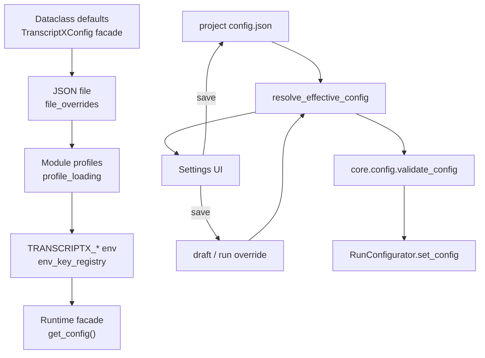

Type: ARCHITECTURE
Authority: docs/ARCHITECTURE.md + docs/runtime/STORAGE.md

# Config / settings architecture

Live map of how TranscriptX resolves, validates, and exposes knobs. Historical migration plans live under `docs/archive/plans/` (`config_knobs_refactor_plan.md`, `config_ownership_collapse_plan.md`, `pydantic_migration.md`) — **do not treat archived metrics as current**.

## Ownership snapshot (authoritative)

Enforced by `tests/core/config/test_registry_ownership.py` against
`tests/core/config/fixtures/registry_ownership_snapshot.json`:

| Metric | Live value |
|--------|------------|
| Pydantic pilots | **53** |
| Pydantic-owned flattened registry leaves | **720** |
| Permanent non-Pydantic baseline leaves | **16** |
| Total registry leaves | **736** |

Baseline leaves include profile activation selectors (`active_*_profile`), `core_mode`, `use_emojis`, and intentional `analysis.chart_descriptions.*` keys.

## Dual stack

| Stack | Location | Role |
|-------|----------|------|
| **A — runtime facade** | `src/transcriptx/core/utils/config/` | Attribute API modules read (`get_config().analysis.*`) |
| **B — registry / pilots** | `src/transcriptx/core/config/` | Pydantic models, `build_registry()`, UI metadata, leaf validation, persistence |

Bridge: `core/config/pydantic_bridge.py` (`PYDANTIC_REGISTRY_PILOTS`).

### Facade load order

`TranscriptXConfig.__init__` (`utils/config/main.py`):

**defaults &lt; optional JSON file &lt; active module/workflow profiles &lt; env** (env wins).

### Effective config (Settings + runs)

`resolve_effective_config` (`core/config/resolver.py`):

**default &lt; project &lt; draft/run override &lt; env**, then validate. Rebuild still uses a temp JSON + `_load_from_file` roundtrip (known debt).

## Surfaces

| Surface | Entry |
|---------|-------|
| Settings hub | `web/page_modules/settings.py` + `web/ui/settings/*` |
| Profiles page | `web/page_modules/profiles.py` + `app/controllers/profile_controller.py` |
| Pipeline | `pipeline/run_configurator.py` |
| Env | `utils/config/env_key_registry.py` — `ENV_KEY_REGISTRY` vs `INFRA_ENV_ALLOWLIST` |
| Profile targets | `core/config/gui_support.py` (`PROFILE_TARGET_*`, `COMMON_SETTINGS_SCHEMA`) |
| Profile CRUD | `utils/profile_manager.py` under `PROFILES_DIR` |

User-facing guide: [settings.md](../runtime/settings.md).

## Validation (two paths today)

| Path | Module | Used by |
|------|--------|---------|
| Canonical leaf / pilot | `core/config/validation.py` | Settings UI, run configurator |
| Object-level legacy | `utils/config_validator.py` | Still called from `file_overrides._validate_candidate` **in addition to** leaf validation |

Unifying these is a hardening follow-up — see [settings_knobs_assessment.md](settings_knobs_assessment.md).

## Profile targets

Supported ProfileManager targets: `workflow`, `topic_modeling`, `semantic_similarity`, `acts`, `tag_extraction`, `qa_analysis`, `temporal_dynamics`, `vectorization`, `llm_models`.

Note: `analysis.semantic_similarity_profiles` (in-config `fast`/`balanced`/`deep`) is a **separate** mapping store that shares activation-key vocabulary with the disk ProfileManager target — do not merge casually.

## Extension checklist

1. Add/change a knob in the owning Pydantic model under `core/config/models/`.
2. Keep runtime facade attributes compatible (delegation hydrate if the subtree is delegated).
3. Update ownership snapshot / goldens when registry leaf counts change.
4. Add env mapping only via `ENV_KEY_REGISTRY` (or infra allowlist if not a bag key); update `.env.example`.
5. Curate into `COMMON_SETTINGS_SCHEMA` only when the knob belongs in guided Settings UX.
6. Document user-visible behaviour in [settings.md](../runtime/settings.md) / module runtime notes — not in archived plans.
