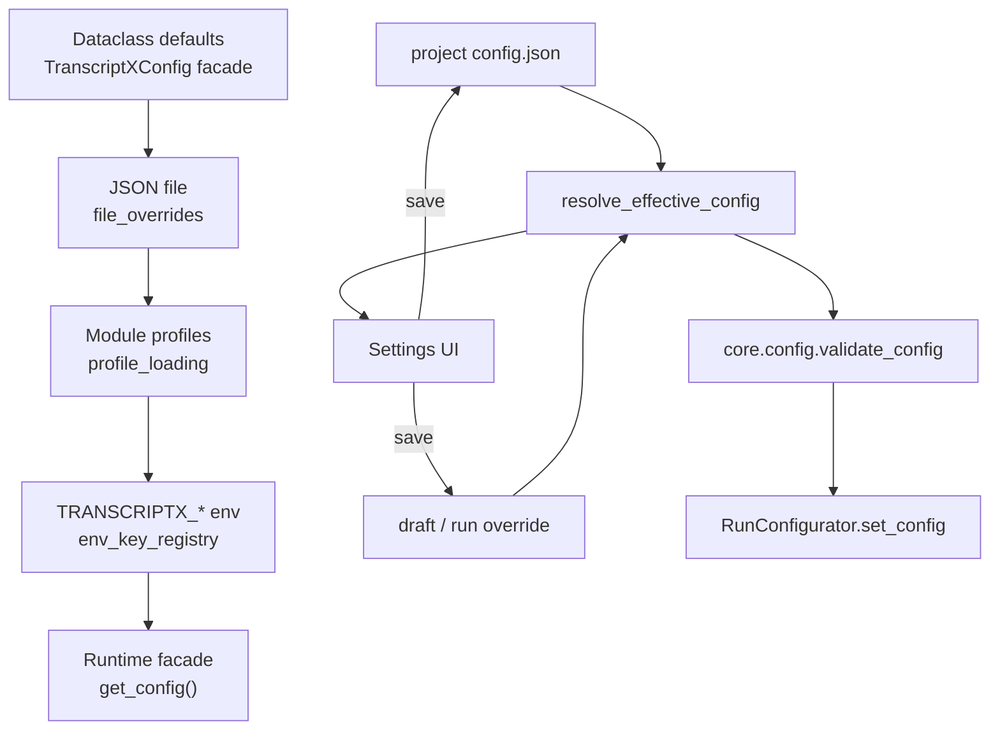

# Config / settings architecture

Live map of how TranscriptX resolves, validates, and exposes knobs. Historical migration plans live under `docs/archive/plans/` (`config_knobs_refactor_plan.md`, `config_ownership_collapse_plan.md`, `pydantic_migration.md`) — **do not treat archived metrics as current**.

## Ownership snapshot (authoritative)

Enforced by `tests/core/config/test_registry_ownership.py` against
`tests/core/config/fixtures/registry_ownership_snapshot.json`:

| Metric | Live value |
|--------|------------|
| Pydantic pilots | **55** |
| Pydantic-owned flattened registry leaves | **731** |
| Permanent non-Pydantic baseline leaves | **16** |
| Total registry leaves | **747** |

Baseline leaves include profile activation selectors (`active_*_profile`), `core_mode`, `use_emojis`, and intentional `analysis.chart_descriptions.*` keys.

When these numbers change, update **all** of the following in the same PR (CI `make test-fast` will fail if any are left behind):

- `tests/core/config/fixtures/registry_ownership_snapshot.json` (regenerate from `_build_ownership_snapshot()` in `test_registry_ownership.py`)
- Hard-coded totals in `tests/core/config/test_registry_ownership.py::test_ownership_invariant_counts`
- `tests/core/config/delegation_test_utils.py::assert_ownership_invariant_unchanged`
- Per-pilot JSON under `tests/core/config/fixtures/*_{registry,defaults}_golden.json` when fields or metadata change

### Config golden fixtures (CI pitfalls)

Drift guards live under `tests/core/config/` (`test_pydantic_bridge_drift.py`, delegation `test_*_delegation.py`, `test_registry_ownership.py`). They compare live registry defaults and metadata to committed JSON in `tests/core/config/fixtures/`.

**Path-shaped defaults** (`input.recordings_folders`, `output.base_output_dir`, `group_analysis.output_dir`, and similar) must be **portable**, not host-specific:

- Prefer literal placeholders such as `<REPO>/data/recordings` and `<REPO>/.test_outputs` in goldens when the value is derived from `TRANSCRIPTX_DATA_DIR` / `TRANSCRIPTX_OUTPUT_DIR`.
- Alternatively use a repo-shaped absolute path that normalizes the same way as CI (see `_normalize_pathish` in `test_pydantic_bridge_drift.py` — it collapses `.../data/...` and `.../.test_outputs/...` to `<REPO>/...`).
- Do **not** commit goldens with personal paths (`/Users/you/...`, external output dirs) unless they normalize identically on the GitHub runner.

**Local `.env` vs CI:** `core/utils/paths.py` loads `.env` at import time and freezes `PATHS` before tests run. Many config tests call `without_transcriptx_env()` (clears `TRANSCRIPTX_*` for the assertion) but **do not** rebuild `PATHS`. A developer machine with a customized `.env` can therefore see `test_pydantic_bridge_drift` failures on the `output` / `input` pilots while CI is green. For parity with CI before pushing, run config drift tests in a clean environment (no repo `.env`, or temporarily unset path overrides) or compare against the normalized golden shapes above.

**New Pydantic fields:** adding a `Field` on a pilot model increases `pydantic_owned_keys` and usually requires updating that pilot’s `*_registry_golden.json` and `*_defaults_golden.json`, not only the ownership snapshot.

## Dual stack

```mermaid
flowchart TD
  defaults["Dataclass defaults\nTranscriptXConfig facade"]
  file["JSON file\nfile_overrides"]
  profiles["Module profiles\nprofile_loading"]
  env["TRANSCRIPTX_* env\nenv_key_registry"]
  facade["Runtime facade\nget_config()"]

  defaults --> file --> profiles --> env --> facade

  project["project config.json"]
  draft["draft / run override"]
  resolve["resolve_effective_config"]
  validate["core.config.validate_config"]
  run["RunConfigurator.set_config"]
  ui["Settings UI"]

  project --> resolve
  draft --> resolve
  resolve --> validate --> run
  resolve --> ui
  ui -->|save| project
  ui -->|save| draft
```

| Stack | Location | Role |
|-------|----------|------|
| **A — runtime facade** | `src/transcriptx/core/utils/config/` | Attribute API modules read (`get_config().analysis.*`) |
| **B — registry / pilots** | `src/transcriptx/core/config/` | Pydantic models, `build_registry()`, UI metadata, leaf validation, persistence |

Bridge: `core/config/pydantic_bridge.py` (`PYDANTIC_REGISTRY_PILOTS`).

### Facade load order

`TranscriptXConfig.__init__` (`utils/config/main.py`):

**defaults &lt; optional JSON file &lt; active module/workflow profiles &lt; env** (env wins).

### Effective config (Settings + runs)

`resolve_effective_config` (`core/config/resolver.py`):

**default &lt; project &lt; draft/run override &lt; env**, then validate. Rebuild still uses a temp JSON + `_load_from_file` roundtrip (known debt).

## Surfaces

| Surface | Entry |
|---------|-------|
| Settings hub | `web/page_modules/settings.py` + `web/ui/settings/*` |
| Profiles page | `web/page_modules/profiles.py` + `app/controllers/profile_controller.py` |
| Pipeline | `pipeline/run_configurator.py` |
| Env | `utils/config/env_key_registry.py` — `ENV_KEY_REGISTRY` vs `INFRA_ENV_ALLOWLIST` |
| Profile targets | `core/config/gui_support.py` (`PROFILE_TARGET_*`, `COMMON_SETTINGS_SCHEMA`) |
| Profile CRUD | `utils/profile_manager.py` under `PROFILES_DIR` |

User-facing guide: [settings.md](../runtime/settings.md).

## Validation (two paths today)

| Path | Module | Used by |
|------|--------|---------|
| Canonical leaf / pilot | `core/config/validation.py` | Settings UI, run configurator |
| Object-level legacy | `utils/config_validator.py` | Still called from `file_overrides._validate_candidate` **in addition to** leaf validation |

Unifying these is a hardening follow-up — see [settings_knobs_assessment.md](settings_knobs_assessment.md).

## Profile targets

Supported ProfileManager targets: `workflow`, `topic_modeling`, `semantic_similarity`, `acts`, `tag_extraction`, `qa_analysis`, `temporal_dynamics`, `vectorization`, `llm_models`.

Note: `analysis.semantic_similarity_profiles` (in-config `fast`/`balanced`/`deep`) is a **separate** mapping store that shares activation-key vocabulary with the disk ProfileManager target — do not merge casually.

## Extension checklist

1. Add/change a knob in the owning Pydantic model under `core/config/models/`.
2. Keep runtime facade attributes compatible (delegation hydrate if the subtree is delegated).
3. Update ownership snapshot, invariant counts, and pilot goldens when registry leaf counts or defaults change (see **Config golden fixtures** above).
4. Add env mapping only via `ENV_KEY_REGISTRY` (or infra allowlist if not a bag key); update `.env.example`.
5. Curate into `COMMON_SETTINGS_SCHEMA` only when the knob belongs in guided Settings UX.
6. Document user-visible behaviour in [settings.md](../runtime/settings.md) / module runtime notes — not in archived plans.
