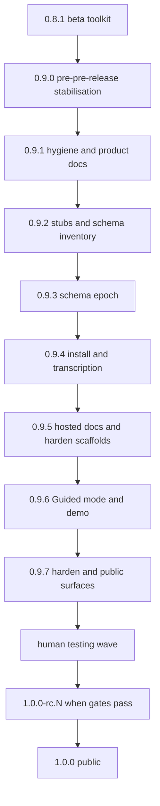
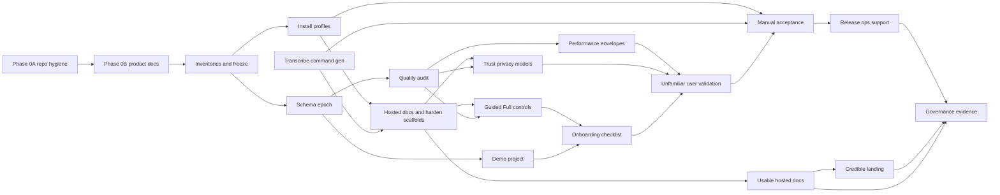

Type: PRODUCT
Authority: self

# TranscriptX pre-release roadmap (0.9.x → 1.0)

**Scope:** short-term only — current work through public **1.0**. When 1.0 ships, retire or archive this file; do not grow it into a permanent product roadmap.

**Long-term home:** [docs/ROADMAP.md](docs/ROADMAP.md) owns 1.x themes, 2.0 vision, deferred platform tracks, and everything after the 1.0 gate.

Documentation-first alignment of TranscriptX as a local-first personal transcript analysis workbench, then a stabilisation-focused 0.9.x programme that lands a clean public schema epoch, install profiles, quality audits, Transcribe Audio command generation, hosted docs, and a static website — culminating in a credible 1.0 governed by **release evidence and explicit severity rules**, not feature count or fixed patch assignments.

Before rewriting live product docs, an early **repository hygiene and knowledge-consolidation** workstream classifies documentation and scripts so the public project is coherent: intentional navigation, preserved historical detail, clear script support status, and no abandoned utilities mistaken for product capabilities.

**Version numbers in this roadmap are flexible.** Prefer thematic **0.9.x** workstreams over fixed patch assignments. Cut releases around coherent, tested increments — hygiene/docs **`0.9.1`**, planning stubs + schema inventory sign-off **`0.9.2`**, schema epoch **`0.9.3`**, install + transcription **`0.9.4`**, hosted docs + harden scaffolds **`0.9.5`**, Guided/Full + demo project **`0.9.6`**, automatable harden + public surfaces **`0.9.7`**, hygiene + honesty + human-pass prep **`0.9.8`**, then **maintainer acceptance** → **`0.9.9` Overview/results presentation polish** → unfamiliar-user → RC → public **1.0**. Do not combine unrelated risky changes merely because a draft once shared a patch label.

## Programme checklist

- [x] **Phase 0A docs inventory** — Classify all tracked documentation; consolidate current authority; archive valuable historical material; remove incorporated scratch notes; create user/dev/archive indexes
- [x] **Phase 0A script inventory** — Classify all scripts and helpers as supported, maintainer, internal, archived or disposable; clean machine-specific assumptions; define local ignored scratch location
- [x] **Phase 0A hygiene controls** — Add deliberate `.gitignore` patterns and lightweight checks preventing new ad-hoc root docs/scripts
- [x] **Phase 0B product docs** — PRODUCT, README, ROADMAP and related alignment after the repository information architecture is agreed (**shipped as 0.9.1**)
- [x] **Phase 0B stubs** — Add planning stubs including schema_epoch_inventory, install_profiles_matrix, manual_acceptance_1_0, analysis_quality_audit, docs_architecture_1_0, ui_presentation_modes, demo_project, performance_envelopes_1_0, trust_privacy_model_governance_1_0, release_ops_support_1_0, unfamiliar_user_validation_1_0 (+ release_severity_triage_1_0)
- [x] **Schema inventory** — Classified schema/version inventory + transition UX in [schema_epoch_inventory.md](schema_epoch_inventory.md); **human-approved 2026-07-24** (integer public schemas → `1` only)
- [x] **0.9.x — schema epoch** — Epoch-1 reset + compatibility removal; GUI/typed-workflow preflight and fresh-data-dir UX; default preserve compatible transcripts; no automatic deletion; no new public analysis CLI (**cut as 0.9.3**)
- [x] **0.9.x — install + transcription** — Install-profile audit; Transcribe command gen; whispermlx-missing and corpus docs (**cut as 0.9.4**)
- [x] **0.9.x — hosted docs + harden scaffolds** — Sphinx revive + CI docs build; hygiene strict subset; quality-audit registry scaffold; draft model-licence matrix (**cut as 0.9.5**)
- [x] **0.9.x — modes + demo (trial)** — Guided/Full controls v1 + demo project + onboarding checklist (**cut as 0.9.6**; **later removed** — prefer docs + clear GUI; see §16)
- [x] **0.9.x — harden + public surfaces (automatable)** — audit judgements draft; perf recipe; trust drafts + AI labelling + NOTICE; website + Pages; release-ops draft; Data/Explorer redirects removed (**cut as 0.9.7**). Owner sign-off, RTD slug, and measured Large-library soak may remain soft-cut residuals.
- [x] **0.9.x — hygiene + honesty + human-pass prep** — epoch/deps cleanup; BERTopic-out-of-base; Balanced experimental-emotion honesty; known-limitations page; maintainer + unfamiliar-user kits (**cut as 0.9.8**). Templates ≠ measured ≠ signed-off for owner-gated residuals.
- [ ] **Maintainer acceptance pass** — executable kit in [manual_acceptance_1_0.md](manual_acceptance_1_0.md); severity-justified fixes after
- [ ] **0.9.9 — Overview / results presentation polish** — organisation & presentation of Overview Actions/Highlights/Analysis (and related); list in [overview_presentation_0_9_9.md](overview_presentation_0_9_9.md); **after** maintainer findings, **before** unfamiliar-user round
- [ ] **Unfamiliar-user validation** — Clean-room round (2–5 people, ≥1 non-technical); kit in [unfamiliar_user_validation_1_0.md](unfamiliar_user_validation_1_0.md); mandatory before 1.0
- [ ] **RC → 1.0** — Severity triage clear; gates pass; release ops/support policy published; governance evidence on exact commit

---

## 1. Product definition (locked)

**One sentence:** TranscriptX is a local-first personal transcript analysis workbench for people who want to think with transcripts.

**Product promise:** Import and organise transcripts; explore language, themes, speakers, interactions, emotion, voice and conversational dynamics; use structured analyses and local AI to find useful patterns; compare over time; inspect and export machine-readable results — while retaining local control of source material and outputs.

**Audience:** Approachable to any thoughtful user with transcripts; researchers and analysts are an important emerging audience (contracts, provenance, reproducibility) without positioning 1.0 solely as specialist research software.

**Primary surface:** Streamlit GUI. **Secondary:** typed Python API. **Transcription:** external to the analysis runtime, with a strong in-app command-generation handoff.

**AI position:** First-class, optional (Ollama today). Deterministic/statistical, model-based, and LLM interpretation are complementary; label them honestly; do not keep weak deterministic fallbacks merely to claim non-AI coverage.

**1.0 success:** An unfamiliar user can install, build/import a useful corpus, run appropriate analysis, understand results, recover from failures, and export artifacts without undocumented developer knowledge — **validated by a clean-room unfamiliar-user round**, not only maintainer testing. Not required: every backlog feature, PyPI, hosted SaaS, built-in transcription, or a highly polished website.

---

## 2. Locked decisions (this iteration)

| Topic | Decision |
|-------|----------|
| Public schema epoch | **Option A (disciplined):** public persisted `schema_version` → integer **`1` only** (never dotted `"1.0"` / `"2.0"`); public string IDs → `transcriptx.<domain>.v1`; refuse/isolate pre-epoch stores; data-root epoch marker; **no cosmetic resets** of policy/prompt/cache identity strings |
| Versioned analysis module ids | **No `_vN` in public module ids for 1.0.** Inventory offender was `semantic_similarity_v2`. **Done in 0.9.3:** retire legacy `semantic_similarity` + `semantic_similarity_advanced`, rename `semantic_similarity_v2` → `semantic_similarity` (package/config/artifacts/presets/docs). Do **not** keep a parallel legacy module unless a written exception says otherwise. Internal file names like `llm_custom_qa/analyze_v2.py` are not public module ids; dual live writers collapsed as part of epoch. |
| Product website | **Option A:** `website/` plain HTML/CSS (+ minimal JS), GitHub Pages; separate from hosted user docs. **Not a hard 1.0 blocker** if product gates pass — require a *credible* public landing; first version may be modest |
| Hosted docs | **Revive Sphinx + Read the Docs.** Sphinx tree revived in **0.9.5** (`docs/conf.py`, `make docs`, CI docs job, `.readthedocs.yml` scaffold). `stale_refs.sh` still forbids `readthedocs.io` until an intentional RTD project URL exists. **Usable hosted documentation is required**; polished breadth is not a hard blocker if task docs complete supported workflows |
| Mode system / onboarding / demo | **Trialled in 0.9.6; decided against.** Prefer excellent task docs and a clear, always-complete GUI over Guided/Full presentation modes, in-app Getting started checklist, and bundled demo-project load/remove. Do not reintroduce before 1.0. |
| Module freeze | No new analysis modules in 0.9.x unless required to complete/repair the 1.0 journey. **Allowed under freeze:** retire/rename versioned or legacy module ids (e.g. semantic similarity cleanup above). |
| Documentation preservation | Expansive: entry surfaces stay concise; detailed design history, rationale, migration notes, investigation results and operational knowledge are retained when useful for maintenance, debugging, future features or contracts. Do **not** solve clutter by indiscriminately deleting detailed material. |
| Patch versioning | Prefer thematic **0.9.x** workstreams over fixed patch numbers. Cut releases around coherent, tested increments; never ship unrelated high-risk changes together merely to match a draft patch label |
| Script archive vs ignore | Tracked obsolete material is archived explicitly (`archive/scripts/` or `docs/archive/`). `.gitignore` is only for future local/generated scratch — not an archive mechanism. |
| Hardening triage | Issues classified as release blocker / must fix / known limitation / post-1.0 — without this, hardening expands indefinitely |

### Mandatory vs desirable vs deferrable

**Mandatory for 1.0**
- Documentation inventory and authority consolidation; script/tooling inventory; removal of machine-specific or misleading supported scripts; archive policy; deliberate ignored location for future local scratch; removal or archival of obsolete pre-public compatibility and migration helpers after the schema reset.
- Product/roadmap/docs alignment; schema epoch reset + compatibility cleanup with **supported data-epoch transition UX**; installation/profile audit; end-to-end manual tests including **accessibility and supported-browser checks**; task-oriented documentation; Transcribe Audio command generation + corpus guidance; sustained real-use hardening; **unfamiliar-user clean-room validation**; **performance/resource envelopes** as documented expectations; **trust / privacy / model-governance gate**; **release severity triage**; **release operations and support policy**; release-governance evidence on exact clean commit.
- Usable hosted documentation and a credible public landing surface (may be modest).

A perfect historical archive taxonomy is **not** required for 1.0. A simple, documented archive structure is acceptable initially, provided current and historical material are clearly distinguished.

**Strongly desirable for 1.0**
- Excellent task-oriented documentation and a clear, complete GUI (presentation modes / demo / in-app checklist **trialled in 0.9.6 and removed**); polished Read the Docs navigation and screenshots (Sphinx scaffold **0.9.5**; RTD go-live owner-gated); polished static `website/` + GitHub Pages (**landed 0.9.7** — modest; further polish optional).

**Not hard blockers if product gates pass**
- Elaborate website effects; exhaustive RTD autodoc; a highly polished first public site — provided usable docs and a credible landing exist.

**Safe to defer to 1.1+**
- Elaborate coach-mark tours or reintroduction of Guided/Full / demo-project / Getting started checklist UX; sophisticated interactive website effects; large bundled completed analysis runs; any mode system that duplicates page logic; multilingual routing beyond a small reliable subset; B4 ConvoKit-family methods; built-in/orchestrated transcription engine; elaborate archive taxonomy refinements beyond a clear current-vs-historical split; aesthetic refactors; experimental analyses; specialist convenience and non-supported configurations; **transcript tagging** for library visibility/kind labels (meeting, voice note, lone speaker, …) — design must clarify interaction with Groups (tags ≠ analysis cohorts); tracked in [docs/ROADMAP.md](docs/ROADMAP.md) §1.1. **SQLite / DB-backed speaker analytics** — tracked in [docs/ROADMAP.md](docs/ROADMAP.md) §1.5 (not a 1.0 gate).

---

## 3. Phase 0A — Repository knowledge and tooling hygiene

Place this **before** the main product-documentation rewrite. Live docs and navigation should be designed only after current material has been classified.

**Aim:** turn the repository from an active development workspace into a coherent public project in which:

- live documentation is intentional and navigable;
- historical detail remains available where it may matter later;
- temporary planning material is no longer mixed with authoritative docs;
- scripts exposed to users or maintainers have a clear supported status;
- abandoned development utilities do not look like public product capabilities.

The output should be a clear **repository information architecture**, not merely a smaller file count.

### Phase 0A sequence

- [x] Inventory Markdown, reStructuredText and other documentation-like files across the repository (**0.9.1**)
- [x] Inventory scripts, shell helpers, one-off migration tools, debug utilities and local developer automation (**0.9.1**)
- [x] Classify every item (**0.9.1**)
- [x] Consolidate relevant content into the correct live, reference, developer or archived location (**0.9.1**)
- [x] Remove or quarantine obsolete material (**0.9.1**)
- [x] Add repository checks that prevent ad-hoc files from accumulating again (**0.9.1**; warn mode)

### Documentation classification

#### 1. Public entry-level documentation

Examples: `README.md`; `docs/PRODUCT.md`; installation quick starts; first-analysis guide; website copy; hosted documentation landing pages.

Requirements: concise; task-oriented; current; low in internal implementation detail; links onward rather than duplicating deeper material.

#### 2. User reference documentation

Examples: complete installation profiles; configuration reference; transcription workflows; analysis capability explanations; troubleshooting; output and export guides; supported Python workflow reference.

Requirements: detailed enough for real use; surfaced through the hosted documentation navigation; written for users rather than repository historians.

#### 3. Authoritative contracts and policies

Examples: storage; run outcomes; output layouts; public surfaces; speaker profiles; schema epoch policy; release governance.

Requirements: preserve authority and stable locations where possible; do **not** archive merely because a contract is detailed; eliminate competing summaries that restate rules inaccurately; non-authoritative docs should link to these rather than copying them.

#### 4. Active developer documentation

Examples: architecture; contributor quick start; current release plans; testing architecture; module-development guidance; active refactor or migration plans that still govern unfinished work.

Requirements: clearly marked as active; linked from a curated developer index; contain ownership/status/last-reviewed metadata where useful; avoid date-stamped filenames for evergreen documents unless the date is integral to their purpose.

#### 5. Historical design and implementation records

Examples: completed wave plans; stocktakes superseded by newer decisions; old release plans; investigation reports; dependency-conflict analyses; implementation retrospectives; migration plans whose work is complete but whose rationale may remain valuable.

**Default action: archive, do not delete.**

Create a structured archive derived from the inventory, for example:

- `docs/archive/releases/`
- `docs/archive/plans/`
- `docs/archive/assessments/`
- `docs/archive/investigations/`
- `docs/archive/migrations/`

Exact hierarchy should be derived from the inventory rather than imposed mechanically.

Archived files should:

- carry a visible archived/superseded banner;
- state whether they are historical context only;
- link to the current authority where one exists;
- remain searchable;
- not appear in the primary user documentation navigation;
- be excluded from stale-current-version assertions where appropriate without being excluded from all link validation.

#### 6. Disposable working notes

Examples: temporary brainstorming; partial prompts; duplicate scratch stocktakes; abandoned checklists with no enduring rationale; generated planning fragments already incorporated elsewhere.

Delete only after confirming that useful content has been incorporated into a live document or archive.

Do not retain every development conversation merely because it exists. Preserve information with plausible future engineering, operational or product value.

### Documentation inventory deliverable

Planning document: [docs/dev/documentation_inventory_1_0.md](docs/dev/documentation_inventory_1_0.md)

One row per candidate file or coherent file family:

| Column | Content |
|--------|---------|
| path | File or family path |
| current purpose | What it is for today |
| current authority/status | Live / competing / stale / unknown |
| intended audience | Entry / user / contract / developer / historical / disposable |
| freshness | Current / dated / superseded |
| overlap or contradictions | Notes |
| action | retain / merge / rewrite / move / archive / delete |
| destination | Target path if moving/archiving |
| links that must be updated | Inbound/outbound |
| owner or governing document | Authority |
| hosted docs navigation | Yes / no / archive-only |

Include root-level and unexpectedly located `.md` files, not only files already under `docs/`.

Search for documentation embedded in:

- scripts;
- examples;
- configuration comments;
- archived Cursor or agent-plan material if tracked;
- root-level notes;
- package directories;
- test fixtures;
- release evidence folders.

Do **not** move authoritative contract files merely to achieve a cosmetically tidy directory tree unless all references and authority rules are safely updated.

- [x] Create `docs/dev/documentation_inventory_1_0.md` with full classification rows (**shipped 0.9.1**)
- [x] Classify all tracked documentation-like files (**shipped 0.9.1**)
- [x] Execute retain / merge / rewrite / move / archive / delete decisions (**shipped 0.9.1**)
- [x] Create or update curated navigation: user docs index; developer docs index; contract index; archive index (**shipped 0.9.1**)

### Documentation consolidation rules

- One current authority per subject.
- Concise public summaries may link to detailed references.
- Detailed documentation is **not** clutter merely because it is long.
- Historical reasoning should be archived when it may explain current design.
- Completed implementation plans should not remain presented as active roadmaps.
- Date-stamped stocktakes should either be refreshed as living documents or archived and replaced by a current index.
- Avoid copying the same installation or product claims across README, website, roadmap and hosted docs; link to a canonical source instead.
- Preserve Git history, but do not rely on Git history as the only home for operationally important knowledge.
- Archived documents should remain readable without pretending to be current.

The archive index should make retained history discoverable without placing it in the main user journey.

### Script and tooling inventory

Planning document: [docs/dev/script_inventory_1_0.md](docs/dev/script_inventory_1_0.md)

Inventory at minimum:

- `scripts/`;
- root-level shell scripts;
- Python utilities outside the supported package API;
- Docker helper scripts;
- release scripts;
- migration and schema utilities;
- transcription helpers;
- demo-generation scripts;
- documentation-build scripts;
- developer setup scripts;
- debugging/profiling helpers;
- one-off cleanup or repair tools.

For each script record:

| Column | Content |
|--------|---------|
| path | Script path |
| purpose | What it does |
| intended user | End user / maintainer / developer / historical |
| current callers | Docs, CI, Makefile, other scripts |
| documented or undisclosed | Status |
| tested or untested | Status |
| destructive or read-only | Risk class |
| platform assumptions | OS / Docker / GPU |
| dependency assumptions | Declared extras / undeclared |
| current validity | Valid / stale / unknown |
| public/support status | Supported / maintainer / internal / archived / disposable |
| action | retain supported / retain internal / rewrite / move / archive / delete |

- [x] Create `docs/dev/script_inventory_1_0.md` with full classification rows (**shipped 0.9.1**)
- [x] Classify every tracked script/helper (**shipped 0.9.1**)
- [x] Execute retain / rewrite / move / archive / delete decisions (**shipped 0.9.1**)

### Script classification and destinations

#### Supported user-facing scripts

Part of the 1.0 product or documented workflow.

Requirements: stable command/help output; safe argument parsing; shell/path quoting; documented prerequisites; actionable errors; dry-run where appropriate; tests; supported-platform declaration; referenced from current documentation.

Examples may include transcription corpus helpers, demo generation or install verification, subject to audit.

#### Maintainer and release tooling

Examples: release checks; fixture regeneration; schema inventory checks; documentation build/link checks; licence inventory; demo artifact regeneration.

Requirements: remain tracked; live in a clearly named location; have a short README or `--help`; not be presented as public product commands; be exercised by CI where practical.

#### Developer convenience tools

Examples: profiling; local inspection; debugging; repository audits; specialised data repair.

Requirements: clearly marked unsupported/internal; tracked only if generally reusable; avoid assumptions tied to the owner’s filesystem; document destructive behaviour.

#### Historical or potentially reusable scripts

Do **not** simply place tracked obsolete scripts in `.gitignore`. Gitignore applies to untracked local files; it is not an archive mechanism for already tracked repository history.

For scripts with potential future value but no current supported role, prefer one of:

- move to `scripts/archive/` with an archived banner and no live references;
- move to `docs/archive/` as a code listing or design record if the implementation itself need not remain executable;
- retain in Git history only after documenting what replaced it, if it has no plausible operational value.

Archived executable scripts must not be on normal PATHs, packaging manifests, Docker images, release bundles or user-facing docs.

#### Disposable and machine-local scripts

Remove genuinely one-off scripts once their useful logic or knowledge has been incorporated.

Expand `.gitignore` for recurring local scratch patterns, for example:

- temporary audit outputs;
- local release evidence not intended for commits;
- generated screenshots before curation;
- private corpus helpers;
- machine-specific Compose overrides;
- local benchmark output;
- developer scratch scripts in an explicitly named ignored directory.

Prefer a dedicated ignored location such as `.local/`, `.scratch/`, `tmp/`, or `scripts/local/`. **Choose one convention and document it.**

Do not broadly ignore `*.md`, `scripts/*.py` or similarly valuable classes of files.

Add placeholder files or documentation where needed so contributors know where local-only tools belong.

### Script cleanup priorities (early checks)

- [x] Stale `scripts/build_docs.sh` (**archived 0.9.1** → `archive/scripts/build_docs.sh`)
- [x] Stale or misleading environment setup helpers (**removed 0.9.1**)
- [x] Scripts that imply PyPI installation when releases use Git/Docker (**0.9.4** — hints + stale_refs guard)
- [x] Scripts containing owner-specific absolute paths (**0.9.1** supported tooling; live docs cleaned + hygiene gate **0.9.5**; archive historical hits expected)
- [x] Scripts relying on undeclared environment variables (**0.9.7** — deferred as known limitation / maintainer docs; no new user-facing undeclared env in supported scripts this cut)
- [x] Duplicate install or Docker launch helpers (**removed 0.9.1**)
- [x] Transcription helpers with weak quoting, error reporting or resume behaviour (**0.9.4** — `whispermlx-missing` already had dry-run/resume/`shlex.join`; Transcribe command generator quotes paths)
- [x] Schema or fixture regeneration scripts that will become invalid after the epoch reset (**addressed with 0.9.3** fixture/golden regen + epoch refuse paths)
- [x] Scripts that directly mutate managed storage without going through supported services (**0.9.7** — deferred post-1.0 unless severity demands; supported paths use services)
- [x] Release scripts that duplicate or conflict with release governance (**0.9.7** — ops policy aligns with release_governance; residual consolidation post-1.0)
- [x] Scripts included in Docker build context or package data accidentally (`.dockerignore` excludes `scripts/` / `docs/` / `tests/` — verified **0.9.7**)

### Phase 0A acceptance criteria

Phase 0A is complete only when:

- [x] Every tracked documentation file has a classified purpose or an explicit action (**0.9.1**)
- [x] Every tracked script/helper has a classified support status (**0.9.1**)
- [x] Current documentation has one authority per subject (**0.9.1**)
- [x] Historical material has been archived with clear banners and replacement links (**0.9.1**)
- [x] Disposable notes have been incorporated or removed (**0.9.1**)
- [x] No known owner-machine paths or private corpus assumptions remain in supported tooling (**0.9.1**)
- [x] Public scripts have help, validation and documentation (**0.9.1**)
- [x] Archived scripts cannot be mistaken for supported product paths (**0.9.1**)
- [x] Hosted-doc navigation excludes internal planning noise (**0.9.1**; Sphinx `exclude_patterns` for archive/planning in **0.9.5**; RTD go-live still owner-gated)
- [x] Archive and developer indexes make retained detail discoverable (**0.9.1**)
- [x] Stale-reference and link checks understand the archive policy (**0.9.1**)
- [x] `.gitignore` has a deliberate home for future local scratch material (**0.9.1**)
- [x] CI or repository checks flag new ad-hoc root Markdown files and unclassified scripts where practical (**0.9.1** warn mode; **0.9.5** strict subset for root allowlist + archive banners)

### Preventative repository checks

Plan lightweight checks rather than a complex documentation CMS. Start in reporting/audit mode; promote only stable checks to blocking status. Implemented in [scripts/release/repo_hygiene_audit.py](../../scripts/release/repo_hygiene_audit.py).

- [x] Allowlist expected root-level documentation files (**0.9.1**; **CI strict in 0.9.5**)
- [x] Fail or warn when new root `.md` files appear without classification (**0.9.1**; **CI strict in 0.9.5**)
- [x] Validate archived banners (**0.9.1**; **CI strict in 0.9.5**)
- [x] Ensure archived plans do not claim to be current (beyond banner presence) (**0.9.7** — deferred warn-mode; banners already CI-strict; deeper “current” claims = known limitation until dedicated check is green)
- [x] Check that active dated plans appear in the developer index (**0.9.1**; warn mode)
- [x] Identify unreferenced live docs (**0.9.7** — deferred warn-mode / post-1.0; not promoted to strict)
- [x] Detect absolute paths such as `/Users/...` (**0.9.1**; warn mode — archive hits expected; live hits must stay clean)
- [x] Detect scripts without shebang/help or classification metadata where relevant (**0.9.7** — deferred warn-mode / post-1.0)
- [x] Confirm public scripts are mentioned in documentation (**0.9.1**; warn mode)
- [x] Exclude intentionally archived references from current-version wording checks while retaining ordinary link validation (**0.9.1** stale_refs / archive policy)

---

## 4. Phase 0B — Product documentation alignment

Safe documentation-only product alignment **after** Phase 0A information architecture is agreed (no schema/code resets yet).

The schema inventory may begin in parallel with Phase 0B, but **no public schema reset** should occur until documentation and script locations that reference old versions are known.

### Phase 0B file actions

- [x] [docs/PRODUCT.md](../PRODUCT.md) — authoritative short product doc (**0.9.1**)
- [x] [README.md](../../README.md) — product-first opening; stale claims fixed (**0.9.1**)
- [x] [docs/ROADMAP.md](../ROADMAP.md) — long-term roadmap + 0.9 themes; 1.0 north star (**0.9.1**)
- [x] [docs/ARCHITECTURE.md](../ARCHITECTURE.md) — aligned with PRODUCT.md (**0.9.1**)
- [x] [docs/CONTRACT_INDEX.md](../CONTRACT_INDEX.md) — PRODUCT / surfaces / epoch / severity pointers
- [x] [docs/public_surfaces.md](../public_surfaces.md) — Guided/Full notes (**0.9.1**); Transcribe command-gen marked shipped (**0.9.4**)
- [x] [docs/dev/stocktake_2026-07-17.md](stocktake_2026-07-17.md) — retargeted to 0.9→1.0; Wave 3 demoted
- [x] [docs/dev/analysis_module_backlog_2026-07-17.md](analysis_module_backlog_2026-07-17.md) — 0.9.x freeze header
- [x] Install / Docker / transcription / release-governance — version / profile / handoff alignment (**0.9.1**)

### Phase 0B planning stubs

- [x] `docs/dev/schema_epoch_inventory.md` (rows drafted; human sign-off before wipe)
- [x] `docs/dev/install_profiles_matrix.md`
- [x] `docs/dev/manual_acceptance_1_0.md`
- [x] `docs/dev/analysis_quality_audit.md`
- [x] `docs/dev/docs_architecture_1_0.md`
- [x] `docs/dev/ui_presentation_modes.md` (later **removed** after trial — §16)
- [x] `docs/dev/demo_project.md` (later **removed** after trial — §16)
- [x] `docs/dev/performance_envelopes_1_0.md`
- [x] `docs/dev/trust_privacy_model_governance_1_0.md`
- [x] `docs/dev/release_ops_support_1_0.md`
- [x] `docs/dev/unfamiliar_user_validation_1_0.md`
- [x] `docs/dev/release_severity_triage_1_0.md`

(Phase 0A stubs `documentation_inventory_1_0.md` and `script_inventory_1_0.md` are created earlier.)

### Contradictions / stale claims to remove

- [x] README/ROADMAP “credible **beta** toolkit” north star and “Next: richer analysis modules / Ollama integration” (Ollama already shipped)
- [x] Version bands stuck on 0.6.x/0.7.x “near-term” while package advanced
- [x] Competing install claims: `.[full]` vs Docker `requirements.txt` vs `./transcriptx.sh` presented as equivalent (**honesty deepened 0.9.4** — `[web]` ownership + capability matrix)
- [x] README claim that `scripts/docker-smoke-test.sh` writes an inline transcript (it does not)
- [x] Aspirational `basic`/`full`/`llm` profile names presented as if implemented (runtime marker is `core`|`full` only)
- [x] Stocktake “Wave 3 remainder (B5 DB / B18)” as default next capacity during a stabilisation freeze
- [ ] `stale_refs` “dead ReadTheDocs” once RTD is intentionally revived
- [x] Sphinx builder assuming missing `docs/conf.py` (archived 0.9.1; **revived 0.9.5**)

---

## 5. Version arc

**Flexible 0.9.x themes.** The exact number of 0.9.x releases is unimportant. Cut releases around coherent, tested increments. Avoid creating pressure to combine unrelated changes merely because a draft once assigned them to the same patch.

Shipped / likely sequence (themes, not fixed patch IDs):

After **1.0**, planning continues in [docs/ROADMAP.md](docs/ROADMAP.md) (1.x themes → 2.0 vision → deferred tracks).

### 0.9.x — Product and release baseline (hygiene + docs + inventories; feature freeze)

**Cut as `0.9.1` (2026-07-24).** Phase 0A hygiene + Phase 0B product-doc alignment.

**Cut as `0.9.2` (2026-07-24).** Phase 0B planning stubs + schema-epoch inventory human-approved (integer `1`).

**Cut as `0.9.3` (2026-07-24).** Schema epoch implementation: integer-1 public stamps, data-root marker + GUI/typed remediation, compatibility removal, `semantic_similarity` module-id cleanup.

**Cut as `0.9.4` / tag `v0.9.4` (2026-07-24).** Install-profile honesty + Transcribe Audio command generator + whispermlx-missing/corpus docs.

**Cut as `0.9.5` (2026-07-24).** Hosted docs revive (Sphinx) + CI docs build; hygiene strict subset; analysis-quality audit registry scaffold; draft model-licence matrix; light release tests.

**Cut as `0.9.6` (2026-07-24).** Guided/Full controls presentation mode; demo project pack + transactional load/remove; lightweight onboarding checklist. **Later removed** (prefer docs + clear GUI; see §16).

**Cut as `0.9.7` (2026-07-24).** Automatable harden + public surfaces: audit judgements overlay; perf envelope recipe; trust drafts + Local AI labelling + voice privacy notice v2 + NOTICE; website + Pages; release-ops draft + issue templates; Data/Explorer redirect removal; RTD go-live prep (slug still owner-gated).

**Cut as `0.9.8` (2026-07-24).** Hygiene + honesty + human-pass prep: epoch/deps cleanup; BERTopic-out-of-base; Balanced experimental-emotion honesty; known-limitations page; maintainer + unfamiliar-user kits. Owner-gated residuals (RTD slug, Hub/NOTICE sign-off, BMC URL, Large-library soak, cohort execution) remain outside the cut.

**Phase 0A — Repository hygiene and information architecture**

- [x] Documentation inventory
- [x] Script inventory
- [x] Authority and audience classification
- [x] Archive structure
- [x] Consolidation / move / delete decisions
- [x] `.gitignore` and local scratch convention
- [x] Initial repository hygiene checks

**Phase 0B — Product documentation alignment**

- [x] PRODUCT.md + README/ROADMAP/ARCHITECTURE/surfaces/stocktake alignment
- [x] Public surface notes (Guided/Full; command-gen; operational surfaces) — further compatibility inventory may deepen later
- [x] Documentation architecture stub ([docs_architecture_1_0.md](docs_architecture_1_0.md))
- [x] Guided/Full controls **design** (trial docs; later removed — §16)
- [x] Demo-project **design** (trial docs; later removed — §16)
- [x] Manual acceptance-test specification ([manual_acceptance_1_0.md](manual_acceptance_1_0.md))
- [x] Analysis-quality audit template ([analysis_quality_audit.md](analysis_quality_audit.md))
- [x] Release severity triage rules published ([release_severity_triage_1_0.md](release_severity_triage_1_0.md))
- [x] Performance-envelope and trust/governance planning stubs
- [x] Freeze on non-release-critical module additions
- [x] Known-limitations draft + model/dependency matrix skeleton (subsection in [trust_privacy_model_governance_1_0.md](trust_privacy_model_governance_1_0.md))

**Parallel / gated**

- [x] **Schema reset inventory + convention + epoch transition UX design** — [schema_epoch_inventory.md](schema_epoch_inventory.md) human-approved 2026-07-24 (integer `1` only; no dotted `.x`)
- [x] Supported installation-profile inventory + capability matrix ([install_profiles_matrix.md](install_profiles_matrix.md); **audited 0.9.4**). Fresh clean-env soak remains an **RC** gate.

### 0.9.x — Schema epoch and compatibility removal

Focus: one coherent risk surface — public schema epoch (+ related public module-id hygiene).

- [x] Execute public schema epoch reset + data-root epoch marker (integer `1` only; no dotted `.x` stamps)
- [x] Remove unnecessary pre-public compatibility adapters
- [x] Archive or remove obsolete pre-public compatibility and migration helpers (mandatory hygiene after reset)
- [x] Supported GUI preflight (+ typed Python workflow / internal maintainer utility if needed — **not** a new public analysis CLI); optional inventory/export before reset; explicit fresh data directory path; no automatic deletion; default preserve compatible transcripts/recordings
- [x] Regenerate fixtures/goldens; refuse pre-epoch stores with remediation UX (see §8)
- [x] Prove 0.9 epoch-1 store opens unchanged in later 0.9.x / 1.0 candidates (epoch-1 marker + exact schema stamps; forward-compat by construction)
- [x] **Versioned module-id cleanup:** retire legacy `semantic_similarity` + `semantic_similarity_advanced`; rename `semantic_similarity_v2` → `semantic_similarity` (package, registry, config keys, UI presets/profiles, artifacts, group-agg preference, docs/tests). No long-lived dual module. (**done in 0.9.3**)
- [x] Collapse `llm_custom_qa` dual V1/V2 writer/marker symbols to a single epoch-1 constant (no `_V2` in names)

### 0.9.x — Installation and transcription onboarding

Focus: getting users onto a working analysis environment and building corpora.

- [x] Installation clean-environment fixes (`requirements.txt` ↔ extras ↔ Streamlit `[web]` ownership; `setup_env.sh` already removed; editable/non-PyPI install hints; CUDA via `TRANSCRIPTX_FORCE_CPU=1` opt-in) (**0.9.4**)
- [x] Capability matrix per supported profile; verification matrix cells (**0.9.4**). **Clean-env soak** (fresh Docker + native proof on release hardware) remains an RC gate, not a 0.9.4 code deliverable.
- [x] Transcribe Audio parameterised **command generator** (no Streamlit shell execution) (**0.9.4**)
- [x] Harden `whispermlx-missing` + transcription docs (spaces, dry-run, resume, OS/Docker boundaries, import next step) (**0.9.4**)

### 0.9.x — Hosted docs + hardening scaffolds (**0.9.5**)

Focus: mechanical foundations for usable hosted docs and later human hardening — **before** Guided/demo datasets.

- [x] Sphinx revive + `make docs` + CI docs build (user-task first; excludes internal planning noise) (**0.9.5**)
- [x] Hygiene strict subset in CI (root MD allowlist + archive banners) (**0.9.5**)
- [x] Analysis-quality audit **registry scaffold** + regenerated module catalog (**0.9.5**)
- [x] Draft model/dataset licence matrix from existing model metadata (**0.9.5**)
- [x] Light release tests for hygiene subset, catalog/scaffold drift, Sphinx scaffold wiring (**0.9.5**)
- [ ] RTD project go-live (owner slug / domain — §20); flip `stale_refs` denylist when URL is intentional — [rtd_go_live_checklist.md](rtd_go_live_checklist.md)
- [x] Provisional audit recommendations / severity tags (**0.9.7** judgements overlay; owner sign-off open)
- [x] Trust gate evidence drafts (privacy wording, telemetry statement, NOTICE, AI labelling — **0.9.7**; owner Hub-card sign-off open)

### 0.9.x — Guided mode and demo project (**0.9.6**; later removed)

Focus: first-run product experience (presentation + examples).

- [x] Initial Guided/Full controls (presentation/defaults only) (**0.9.6**)
- [x] Demo project launcher + one-click removal (**0.9.6**)
- [x] Lightweight onboarding checklist (not elaborate tour) (**0.9.6**)
- [x] **Removed after trial** — prefer excellent docs + clear complete GUI (§16)

### 0.9.x — Quality hardening, hosted docs, public presentation

Focus: operational tolerance, trust, docs surfaces — split across further 0.9.x cuts if needed. Sphinx scaffold + audit rows + licence draft landed in **0.9.5**; automatable harden + public landing in **0.9.7**; hygiene + honesty + human-pass kits in **0.9.8**; human testing remains after the tag.

- [ ] Sustained personal/corpus testing; bug fixes; GUI friction removal
- [x] Deterministic vs AI quality audit judgements (provisional overlay **0.9.7**; owner sign-off open)
- [ ] Prompt/model-output tuning; failure-state improvements (only severity-justified leftovers)
- [x] Performance and resource envelope **recipe** + corpus sizes documented (**0.9.7**; fill measured rows on release hardware / soft-cut gaps tagged)
- [x] Trust / privacy / model-governance gate **drafts** (**0.9.7**; owner Hub-card sign-off open)
- [ ] First screenshot-based user guides
- [ ] RTD navigation polish (usable docs required; polish not a hard blocker) — go-live owner-gated
- [x] Initial `website/` + GitHub Pages — credible landing (**0.9.7**; modest)
- [x] User-facing known-limitations page + maintainer/unfamiliar-user kits (**0.9.8**; measured evidence still open)
- [ ] Accessibility and supported-browser acceptance checks (kit prepared; execution after 0.9.8)
- [ ] Unfamiliar-user clean-room validation round (kit prepared **0.9.8**; execution after maintainer pass)

### RC preparation → 1.0

RC **only when gates pass** — not when a patch number is exhausted.

- [ ] Full clean-install matrix evidence
- [ ] AppTest + manual journey passes (incl. a11y / browser)
- [ ] Unfamiliar-user validation evidence reviewed; blockers triaged
- [ ] Regenerated version-matched demo data
- [x] Docs Sphinx build in CI (**0.9.5**); website polish + final screenshots as capacity allows
- [ ] Schema/compatibility freeze; published known limitations under severity rules ([known_limitations.md](../known_limitations.md) drafted **0.9.8**; publish/sign-off still RC)
- [ ] Performance envelopes and trust gate signed off
- [ ] Release-ops / support policy published
- [ ] Release-governance **rehearsal** (not yet the final tag)
- [ ] No unresolved **release blockers** or open **must-fix** items
- [ ] Public contracts + epoch frozen; usable hosted docs + credible landing live
- [ ] Exact release commit passes [docs/dev/release_governance.md](docs/dev/release_governance.md) + CI

### After 1.0 (not owned here)

1.x themes, 2.0 vision, and deferred platform tracks live in [docs/ROADMAP.md](docs/ROADMAP.md). This file stops at the public **1.0** gate.

---

## 6. Sequenced programme and dependencies

Critical path: **repository inventory and classification → product/docs alignment → schema inventory/reset → install/transcription → hosted-docs + harden scaffolds (**0.9.5**) → modes/demo (**0.9.6**) → automatable harden + public surfaces (**0.9.7**) → human-testing wave → RC evidence.**

Cut intermediate tags around coherent tested increments; do not force install+schema+modes into one patch.

---

## 7. Release severity and triage rules

Without explicit severity, hardening expands indefinitely because every imperfection looks equally important. Publish these rules in [docs/dev/release_severity_triage_1_0.md](docs/dev/release_severity_triage_1_0.md) (or fold into release governance) and apply them during **0.9.x hardening / RC** triage.

| Severity | Definition | 1.0 action |
|----------|------------|------------|
| **Release blocker** | Data loss; unsafe deletion; corrupt outputs; broken supported install; incorrect run truth; security/privacy failure | Must fix before RC/1.0; no known-limitation escape |
| **Must fix** | Principal journey broken; misleading prominent analysis; unusable error state; documentation cannot complete a supported workflow | Must fix before 1.0 |
| **May ship as known limitation** | Optional module failure; unsupported language/model/platform combination; specialist UI friction; non-critical performance problem | Document honestly; do not block 1.0 |
| **Post-1.0** | Aesthetic refactors; experimental analyses; specialist convenience; non-supported configurations | Explicitly out of scope for the release gate |

- [x] Severity rules written and linked from ROADMAP / release governance
- [x] Hardening backlog tagged with severity before RC (provisional — [analysis_quality_audit_judgements.md](analysis_quality_audit_judgements.md) **0.9.7**; owner confirm)
- [ ] RC entry requires zero open release blockers and zero open must-fix items

---

## 8. Schema reset inventory and recommendation

### Convention (locked)

1. Classify every version-like value before changing it.
2. Public persisted numeric `schema_version` → integer **`1` only** (never dotted `"1.0"` / `"2.0"`).
3. Public persisted string schema IDs → **`transcriptx.<domain>.v1`** (rename `transcriptx.emotion_result.v1`, live `llm_custom_qa.v2`, action-items `.v2` envelopes, etc.).
4. Refuse or isolate pre-epoch artifacts; **no long-lived compatibility adapters** for wiped pre-public data.
5. Write **`schema_epoch` / public-schema epoch marker** at managed data-root; detect early; explain clearly in GUI and supported remediation surfaces (see transition UX below — not a new public analysis CLI).
6. **Never** renumber, reuse, or reset public schema IDs after 1.0.
7. **Public analysis module ids** must not embed `_vN` / version suffixes for 1.0 (see locked decision *Versioned analysis module ids*). Method/algorithm fingerprints may still live in separate semantics constants — prefer names that do not imply a parallel “legacy module” is still the product default.

### Classification buckets

| Class | Reset? | Examples |
|-------|--------|----------|
| Public persisted artifact schema | **Yes → epoch 1** | `RUN_RESULTS_SCHEMA_VERSION` (2→1), cleanup **result** schema (2→1), layout (2→1), config schema, speaker/voice store versions, pooled integer schemas, public string IDs; dotted stamps like `"2.0"` → `1` |
| Input/canonical transcript schema | **Yes → integer `1`** | `CANONICAL_SCHEMA_VERSION`, `io/transcript_schema.SCHEMA_VERSION` (today `"1.0"`) |
| Contract version / schema id strings | Rename to `transcriptx.*.v1` when they identify **persisted public** artifacts | `LLM_ACTION_ITEMS_SCHEMA_ID`, custom QA pack ids |
| Journal / recovery format | **→ integer `1`** for public journal envelopes | cleanup `JOURNAL_SCHEMA_VERSION` (3→1), rename journal stays 1 |
| Policy / behaviour generation | **Do not reset** for cosmetics | cleanup **policy 7**, voice threshold/preprocess policies, admission policy, speaker eligibility policy |
| Cache identity | **Do not reset** unless invalidating caches deliberately as part of wipe | emotion_family inference/aggregation cache v3, clip cache, voice excerpt cache |
| Algorithm / analytical semantics | **Do not reset** when version describes method, not envelope — but **do** drop `_vN` from **public module ids** (separate row) | Keep method fingerprints (e.g. interactions/emotion semantics); rename module id `semantic_similarity` → `semantic_similarity` after retiring legacy siblings; then retarget method string away from implying a second product module |
| Public analysis module id | **Unversioned for 1.0** | Only current offender: `semantic_similarity` (+ legacy `semantic_similarity`, `semantic_similarity_advanced`) |
| Prompt IDs / prompt policy versions | **Do not reset** | LLM prompt version constants |
| Package / API version | Bump via normal release process (`0.9.x` → `1.0.0`) | `pyproject` / `__version__` |

### Wipe / refusal boundary

**Separate canonical source data from incompatible derived state.** Do **not** presume managed transcripts must be wiped.

Because the canonical transcript schema becomes integer **`1`** with the epoch, the inventory still decides whether managed transcript **files** are retained vs reimported; schema stamp migration is separate from file deletion.

**Default:** preserve **compatible** managed transcripts and **source recordings**; remove or refuse **incompatible** derived state — run outputs, caches, indexes, speaker profiles/voice data, groups, corrections, cleanup journals, run manifests/results, sidecars, and local config overrides as needed. Regenerate fixtures/goldens/tests/docs where they encode pre-epoch assumptions.

Never make deletion broader merely for epoch neatness. Owner-intended broader wipes remain allowed when explicitly chosen; they are not the default epoch policy.

On encounter of a pre-epoch or otherwise incompatible data-root: **fail closed with remediation** — not silent best-effort adapters. The first public impression must not be a cryptic incompatible-store failure.

### Data-epoch transition UX (mandatory)

Do not let “refuse pre-epoch store” become only an exception message. Keep preflight within **existing public surfaces** — do **not** create a new public analysis CLI solely for the reset.

- [x] **GUI preflight** that detects incompatible roots before work begins (**0.9.3**)
- [x] Plus a **typed Python workflow** and/or clearly **internal maintainer utility** if automation is needed — not a new user-facing analysis CLI (**0.9.3**)
- [x] Optional **inventory/export** before any reset path the product offers (**0.9.3**)
- [x] Explicit **“create fresh 1.0 data directory”** path (**0.9.3**; copy says epoch-1)
- [x] **No automatic deletion** of user data (**0.9.3**)
- [x] Precise identification of **which root** is incompatible (**0.9.3**)
- [x] **Backup guidance** in GUI/docs (**0.9.3**)
- [x] A **reset report** when a supported reset path is used (scoped to incompatible derived state by default; never broaden deletion for neatness) (**0.9.3**)
- [x] Tests proving **unrelated source recordings are never touched** (**0.9.3**)
- [x] Inventory decision recorded for **whether compatible managed transcripts are retained** (retain / reimport; **0.9.2** inventory)
- [x] Validation that a **0.9 epoch-1 store opens unchanged in 1.0** (epoch-1 marker + exact stamps frozen in **0.9.3**; confirm on 1.0 candidate soak)

- [x] Deliverable: [docs/dev/schema_epoch_inventory.md](schema_epoch_inventory.md) with classified rows + retain/wipe + UX design — human-approved 2026-07-24; implementation cut as **0.9.3**
- [x] Inventory + transition-UX sign-off before epoch implementation (**0.9.2**)
- [x] After reset: archive or remove obsolete pre-public compatibility/migration helpers per Phase 0A script policy (**0.9.3**)

---

## 9. Installation-profile matrix (derived)

Do **not** invent `basic`/`llm` marketing names until the graph matches. Proposed **user-facing profiles** mapped to real install paths (authoritative living sheet: [install_profiles_matrix.md](install_profiles_matrix.md); verification cells: [install_verification_matrix.md](../runtime/install_verification_matrix.md)):

| Profile | Install path | Capabilities | 1.0 status |
|---------|--------------|--------------|------------|
| **Docker full analysis** (recommended) | Compose + image from `requirements.txt` | GUI + full analysis stack; spaCy baked; YAKE/KeyBERT; CPU on Mac override | **Supported** — clean-env soak at RC |
| **Docker + local AI** | Above + host Ollama via `host.docker.internal` | LLM modules / Corrections discovery | **Supported** |
| **Native full** | `./transcriptx.sh` / `requirements.txt`, or `pip install -e ".[full,web]"` | GUI + near-Docker deps; CUDA available unless `TRANSCRIPTX_FORCE_CPU=1` | **Candidate** — confirm via RC clean-env matrix |
| **Native + local AI** | Native full + Ollama | Same + LLM | **Candidate** — follows native-full |
| **Voice / speaker match** | `[voice]` / `[speaker_match]` or Docker subset | Prosody + local ECAPA match | **Optional supported** |
| **Core analysis API** | `pip install -e .` | Library/API without Streamlit | **Developer/secondary** — must not claim “full app” |
| **GUI only** | `pip install -e ".[web]"` | Streamlit without analysis extras | **Secondary** — pair with Docker or `.[full,web]` for real use |
| **Developer / test** | `.[dev]` (+ `nlp`) | CI lanes | **Contributor** |
| **Air-gap** | Any + `TRANSCRIPTX_DISABLE_DOWNLOADS=1` + prebaked caches | Offline inference | **Documented profile** |

**Ownership (0.9.4):** Streamlit = `[web]` / Docker / `requirements.txt` / launcher — **not** in `[full]`. Playwright = `[maps]` (optional NER map PNG), not Streamlit GUI.

### 1.0 install programme must fix

- [x] Streamlit ownership (`[web]`; not in `[full]`) (**0.9.4**)
- [x] Clarify `.[full]` ≠ Docker (**0.9.4**)
- [x] Missing `keyphrases` in Docker (**0.9.4** — yake/keybert in `requirements.txt`)
- [x] `speaker_match` matrix cell (**0.9.4**)
- [x] Stale `setup_env.sh` (**removed 0.9.1**; checklist closed 0.9.4)
- [x] Auto-install hints using PyPI name (**0.9.4** — editable git checkout wording)
- [x] `transcriptx.sh` forcing `CUDA_VISIBLE_DEVICES=""` (**0.9.4** — opt-in `TRANSCRIPTX_FORCE_CPU=1`)
- [x] Playwright: clarify whether dependencies are required only for website/docs checks; remove them from product installation profiles unless a supported runtime feature needs them (**0.9.4** — `[maps]` / Docker PNG only; not Streamlit)
- [x] Capability matrix per profile (**0.9.4**)

---

## 10. Transcribe Audio and corpus onboarding

**Shipped in 0.9.4** (`v0.9.4`): [src/transcriptx/web/page_modules/transcribe_audio.py](src/transcriptx/web/page_modules/transcribe_audio.py) is a **parameterised command generator** (copyable only; **never executes** from Streamlit). Builder: [src/transcriptx/services/transcription/command_gen.py](src/transcriptx/services/transcription/command_gen.py).

Parameters covered: input file/folder, output folder, tool (whispermlx / whispermlx-missing / WhisperX Docker), model, language, diarisation, device/compute, audio glob, overwrite/resume (`--force`), dry-run, fuzzy JSON match, WhisperX batch size + optional min/max speakers, expected output format = WhisperX/whispermlx JSON.

Must-cover checklist for the cut: shell quoting/spaces; macOS vs Linux vs Docker/host boundaries; dependency/model checks (documented + dry-run flags on scripts); resumability/duplicates; partial failures; dry-run/preview; logs/progress (host terminal); output compatible with managed import; clear next step → Import Transcript.

- [x] Parameterised Transcribe Audio command generator (copyable only) (**0.9.4**)
- [x] Harden [scripts/whispermlx-missing.py](scripts/whispermlx-missing.py) (docs + generator flags; script already had dry-run/resume/`shlex.join`) (**0.9.4**)
- [x] Update [docs/runtime/transcription.md](docs/runtime/transcription.md) + WhisperX recipe docs for non-technical corpus building (**0.9.4**)
- [ ] Manual acceptance journey for Transcribe command gen (see §15 — RC / acceptance suite)

---

## 11. Analysis-quality audit structure

New living sheet: [docs/dev/analysis_quality_audit.md](docs/dev/analysis_quality_audit.md) — one row per user-visible analysis:

intended question; output type; algorithm/model; meaningfulness on real transcripts; languages; min data; confidence/abstention; failure modes; overlap; GUI presentation; group semantics; test quality; performance; **recommendation:** retain / improve / relabel / document as experimental / deprecate / remove.

Prioritise Insights, default presets, summary surfaces, exports. **Mandatory scrutiny:** deterministic highlights, summaries, action-item extraction vs LLM equivalents — improve, restrict claims, reduce prominence, or remove misleading fallbacks. Use real corpora, not only fixtures.

No new modules during 0.9.x unless audit proves a release-critical repair. Map audit findings into release severity triage (§7).

- [x] Create analysis-quality audit template (**0.9.2** stub — [analysis_quality_audit.md](analysis_quality_audit.md))
- [x] Scaffold audit rows from `MODULE_REGISTRY_ORDER` (**0.9.5** — [analysis_quality_audit_scaffold.md](analysis_quality_audit_scaffold.md))
- [x] Complete provisional audit columns (meaningfulness deferred; recommendation, severity) for user-visible analyses (**0.9.7** — [analysis_quality_audit_judgements.md](analysis_quality_audit_judgements.md); owner sign-off open)
- [x] Mandatory scrutiny: deterministic highlights / summaries / action-items vs LLM equivalents (**0.9.7** provisional + Local AI / Deterministic labelling)
- [ ] Apply retain / improve / relabel / hide / deprecate / remove recommendations (labelling applied **0.9.7**; experimental emotion off Balanced defaults **0.9.8**; further code only if severity demands; owner sign-off open)
- [x] Tag each finding as release blocker / must fix / known limitation / post-1.0 (**0.9.7** provisional backlog in judgements doc)

---

## 12. Performance and resource envelopes

Correctness and installation alone are not enough — the product must be **operationally tolerable**. Deliverable: [docs/dev/performance_envelopes_1_0.md](docs/dev/performance_envelopes_1_0.md).

Define representative corpus sizes (small / medium / large-for-1.0) and record expectations (not necessarily strict universal guarantees) for:

- [x] Startup time (recipe + expectation; measure on release hardware)
- [x] Import time (recipe + expectation)
- [x] Time to first useful result (recipe + expectation)
- [x] Default-preset runtime (recipe; use run_performance.json)
- [x] Memory and disk use (recipe)
- [x] Model download sizes (documented via runtime/models.md)
- [x] Docker image size (baseline doc + recipe)
- [x] Group-analysis scaling (recipe)
- [x] UI responsiveness with a large library (**known limitation** soft-cut — soak on human-testing hardware)
- [x] Behaviour when disk, RAM or model capacity is insufficient (documented expectation: fail closed)

These become **documented expectations and regression indicators**. Non-critical misses may ship as known limitations; capacity failures that corrupt data or hang without recovery are release blockers / must-fix per §7.

---

## 13. Trust, privacy and model-governance gate

Dedicated gate (stocktake already flags the missing aggregated third-party model/licence notice as a release gap). Deliverable: [docs/dev/trust_privacy_model_governance_1_0.md](docs/dev/trust_privacy_model_governance_1_0.md).

- [x] Third-party model and dataset **licence inventory** (draft matrix in trust stub — **0.9.5**; Hub-card confirmations still open)
- [x] Model download origins and **gated-model** requirements (**0.9.7** rows; residual `owner-verify`)
- [x] Voice embedding and speaker-identity **privacy wording** (**0.9.7** notice v2)
- [x] Confirmation that **no telemetry or remote processing** occurs unless explicitly configured (**0.9.7**)
- [x] Secrets and **absolute-path** audit (secrets_check + hygiene owner-path scan; live paths cleaned **0.9.5**; archive historical hits expected)
- [x] Dependency **vulnerability** checks (`pip-audit` / clean-env / image pip-check in release CI — ongoing); dependency **licence** NOTICE draft (**0.9.7**)
- [x] **AI output labelling** (**0.9.7** Local AI badges)
- [x] Model, prompt and analytical-semantics identity in artifacts where needed (provenance badges)
- [x] Explicit definition of what **“reproducible”** means for stochastic LLM output (**0.9.7**)

Gate is mandatory before 1.0. Incomplete polish of notices may be known limitation only where legal/privacy risk is absent; missing licence/privacy truth for shipped models is a release blocker.

---

## 14. Unfamiliar-user validation

The 1.0 success criterion centres on an unfamiliar user; personal testing will find analytical and workflow problems, but unfamiliar users expose assumptions the maintainer no longer notices.

Deliverable: [docs/dev/unfamiliar_user_validation_1_0.md](docs/dev/unfamiliar_user_validation_1_0.md). Run during late **0.9.x hardening or pre-RC** once install and principal journeys are stable enough to evaluate.

**Mandatory before 1.0:**

- [ ] Two to five people who have **not** developed TranscriptX
- [ ] At least one relatively **non-technical** user
- [ ] **Fresh machine** or fresh environment
- [ ] **No live coaching** unless they become completely blocked
- [ ] Record: installation time; time to first useful result; blockers; misunderstood terminology; abandoned journeys

Triage findings with §7 severity rules. Blockers and must-fix items from this round gate RC.

---

## 15. Manual acceptance-test structure

Authoritative suite: [docs/dev/manual_acceptance_1_0.md](docs/dev/manual_acceptance_1_0.md).

Journeys (each with prerequisites, test data, steps, expected UI, expected files, failure criteria, evidence):

- [ ] Clean Docker
- [ ] Clean native where supported
- [ ] First launch
- [ ] Transcribe command gen (**implementation shipped 0.9.4**; journey evidence still required)
- [ ] Single + folder import
- [x] Duplicate/malformed — folder-import path rejects (empty/relative/missing/file-not-dir); clear errors; no admit (2026-07-27; [manual_acceptance_1_0.md](manual_acceptance_1_0.md) §3.4)
- [x] Default preset — experimental `contextual_emotion` / `fine_grained_emotion` off Balanced defaults (verified 2026-07-27; see [manual_acceptance_1_0.md](manual_acceptance_1_0.md) §3.3)
- [ ] Optional AI
- [ ] Missing Ollama
- [x] Partial module failure — Thorough `llm_action_items` + `llm_custom_qa` 600s timeout → FAIL; pipeline continued; `final_status=partial` (2026-07-26; [manual_acceptance_1_0.md](manual_acceptance_1_0.md) §3.4)
- [ ] Insights source nav
- [ ] Charts/artifacts
- [ ] Speakers/profiles
- [ ] Voice where supported
- [ ] Groups
- [ ] Export
- [ ] Cleanup/reset
- [ ] Data-epoch GUI preflight / fresh data directory / refuse-with-remediation (no new public analysis CLI)
- [ ] Compatible managed transcripts retained when inventory allows; source recordings untouched
- [ ] Reopen data dir
- [ ] Upgrade from final 0.9 epoch-1 store unchanged
- [ ] Offline/downloads disabled
- [ ] Spaces/non-ASCII paths
- [ ] Empty/short/long/multilingual

### Accessibility and browser checks (GUI primary surface)

`web/` is the primary interface; the stocktake notes `web/` is excluded from measured coverage, so focused acceptance testing is especially important.

- [ ] Keyboard navigation of principal journeys
- [ ] Focus visibility
- [ ] Contrast of primary text/controls
- [ ] Narrow / small screens usable for principal journeys
- [ ] Readable charts
- [ ] Downloadable alternatives for visual outputs where practical
- [ ] At least the browsers **Streamlit officially supports** at release time

Automation split: keep expanding `make test-gui-acceptance` / AppTest for structural journeys; residual AppTest-blind items stay in [docs/dev/gui_acceptance_residual_checklist.md](docs/dev/gui_acceptance_residual_checklist.md); **no Playwright for Streamlit before 1.0** (existing policy). Browser checks for the **app** are manual/acceptance against Streamlit’s supported browsers; separate browser checks apply to **website** and **RTD**.

---

## 16. Product-experience features (0.9.x)

### Guided / Full, demo project, Getting started — **trialled and decided against**

Shipped in **0.9.6** (Guided/Full controls presentation mode, bundled demo project load/remove, lightweight Getting started checklist). After trial use, **removed before 1.0** in favour of **really good documentation** and a **clear, always-complete GUI** (no reduced “Guided” surface, no in-app tour/checklist, no bundled demo pack).

Do **not** treat reintroduction as a 1.0 residual. Historical design notes from the trial are obsolete; prefer [USER_INDEX.md](../USER_INDEX.md), [PRODUCT.md](../PRODUCT.md), and hosted/task docs.

### Hosted docs — Sphinx + RTD (usable required; polish desirable)

- [x] Stand up missing Sphinx project (`docs/conf.py`, toctrees, MyST, Furo from `[docs]` extra) (**0.9.5**)
- [x] Curated **user** navigation (tasks first, reference second) (**0.9.5** — `docs/index.md`)
- [x] Contracts/dev material reachable but not undifferentiated top-level (**0.9.5** secondary toctrees)
- [x] Archive index discoverable but excluded from primary user journey (**0.9.5** Sphinx `exclude_patterns`; ARCHIVE_INDEX remains in-repo)
- [ ] Versioned docs for 1.0+; search; screenshots; install-profile pages as capacity allows
- [ ] Autodoc **only** for supported Python surfaces (`app.workflows`, managed import)
- [x] CI Sphinx HTML build (**0.9.5**); linkcheck + RTD preview builds still open until project go-live
- [ ] Remove/update `readthedocs.io` denylist when live
- [x] Single source of truth for docs IA — README/Sphinx summarise and link, do not fork content (**0.9.5** scaffold; `website/` landed **0.9.7**)
- [x] Stale-reference checks understand archive policy (exclude archived from current-version assertions; keep ordinary link validation) (**0.9.1**)

**Gate:** documentation can complete supported workflows. Do **not** block 1.0 solely for incomplete polish if usable hosted docs exist.

### Website (credible landing required; first version may be modest)

[website/](website/): headline, product explanation, screenshots, workflows, local-first + AI, example outputs, install CTA, GitHub, docs link, platforms, release status, Buy Me a Coffee **config placeholder** (do not invent URL). GitHub Pages workflow. Plain HTML/CSS; minimal JS only for clear value (e.g. mobile nav).

- [x] Initial `website/` content (credible public landing) (**0.9.7**)
- [x] GitHub Pages workflow (**0.9.7**)
- [ ] Screenshots / example outputs as capacity allows
- [x] Buy Me a Coffee placeholder (URL when supplied) (**0.9.7**)

**Gate:** credible public landing exists. Do **not** make website polish or elaborate RTD a hard blocker if the product itself is ready.

Doc relationship:

- `website/` — marketing/presentation
- README — concise repo landing + quick start
- RTD — complete user guides / concepts / troubleshooting / supported reference
- contracts — authoritative behaviour
- `docs/dev/` — internal architecture and contribution
- `docs/archive/` — historical design/implementation records (discoverable via archive index)

---

## 17. Release operations and support policy

Define the mechanics around the tag so the maintenance promise matches the strength of existing contracts and release governance. Deliverable: [docs/dev/release_ops_support_1_0.md](docs/dev/release_ops_support_1_0.md) (extend [docs/dev/release_governance.md](docs/dev/release_governance.md) where appropriate).

- [x] CHANGELOG structure and migration notes (**0.9.7** — Keep a Changelog + ops policy)
- [x] RC naming and duration (**0.9.7** draft default ≥7 days)
- [x] Branch/tag convention (**0.9.7**)
- [x] Release artifacts and checksums (**0.9.7** draft)
- [x] GitHub issue templates (**0.9.7**)
- [x] Supported Python/platform matrix (link install profiles — **0.9.7**)
- [x] Security-reporting link (SECURITY.md — **0.9.7** ops policy)
- [x] Support expectations for 1.0.x (**0.9.7**)
- [x] Patch-release policy (**0.9.7**)
- [x] Deprecation period for public Python and schema surfaces (**0.9.7**)
- [x] Rollback procedure if 1.0 has a serious fault (**0.9.7**)

Mandatory before the public 1.0 tag. RC may start once product gates pass even if some ops docs are still being finalised, but the public tag requires the policy published.

---

## 18. Pre-1.0 vs post-1.0 refactor recommendations

**Before 1.0 (only if release risk / severity demands):**

- [x] Install/config duplication (`setup_env.sh` removed; extras vs requirements documented; auto-install hints fixed) (**0.9.4**)
- [x] Remove obsolete pre-public schema adapters after wipe (**0.9.3**)
- [x] Legacy Data/Explorer redirects (removed **0.9.7**)
- [ ] Error-prone install profile markers (docs honesty **0.9.4**; runtime `install_profile` / marker simplification still open if severity demands)
- [x] Epoch refusal tests / remediation paths (**0.9.3**). Fresh clean-env soak = **RC** gate (not a 0.9.4 code deliverable)
- [x] Machine-specific or misleading scripts identified in Phase 0A (**0.9.1** inventory; live absolute-path clean reinforced **0.9.5**)
- [x] Epoch transition UX gaps (GUI preflight, typed/internal helper only, fresh dir, no auto-delete, preserve compatible transcripts) (**0.9.3**)

**After 1.0** refactors and backlog items are tracked in [docs/ROADMAP.md](docs/ROADMAP.md) and the analysis-module backlog — not expanded in this short-term file.

For each pre-1.0 refactor PR: state risk addressed, behavioural invariants, characterisation tests, change surface, and severity classification.

---

## 19. Risk register (high)

| Risk | Mitigation |
|------|------------|
| Schema rename churn breaks goldens/CI | Inventory-first; single epoch PR; regenerate fixtures; refuse pre-epoch |
| Mode system forks execution | Presentation-only; equivalence tests; defer if duplication appears |
| Demo size / licence | Transcripts + generate script; document provenance; optional voice |
| Sphinx revive larger than expected | Curated toctree first; defer full autodoc breadth; usable docs gate not polish gate |
| Install matrix never green on all hosts | Explicit supported vs best-effort cells; no false “full” claims |
| Quality audit removes popular but weak modules mid-freeze | Relabel / document as experimental or known limitation before hard delete when uncertain; severity triage |
| Docs drift across README/website/RTD | Single source + link summaries; CI linkcheck |
| Useful engineering rationale lost during cleanup | Archive by default when future maintenance value is plausible; require destination/replacement before deletion |
| Archive becomes a second cluttered live-doc tree | Structured archive categories, archived banners, current-authority links, excluded from primary navigation |
| Old scripts remain executable-looking and are mistaken for supported tools | Move out of live script paths, add banners, remove packaging/docs references |
| `.gitignore` is misused as an archive mechanism | Archive tracked material explicitly; use ignore rules only for future local/generated files |
| Documentation cleanup creates mass broken links | Inventory inbound links first; perform moves in coherent batches; run link and stale-reference checks |
| Root-level scratch files reappear after 1.0 | Define ignored local workspace and add lightweight repository audits |
| Unrelated risky changes bundled in one patch | Flexible 0.9.x themes; cut releases around coherent tested increments |
| Hardening never ends | Severity triage; known-limitation escape for non-must-fix |
| Cryptic epoch refusal alienates first public users | GUI preflight + typed/internal remediation; fresh-dir path; backup guidance; no auto-delete; preserve compatible transcripts by default; tests |
| Epoch wipe deletes salvageable source data | Inventory separates canonical transcripts/recordings from incompatible derived state; never broaden deletion for neatness |
| Maintainer-only testing misses UX assumptions | Mandatory unfamiliar-user clean-room round |
| Operational surprise (RAM/disk/image size) | Documented performance envelopes and capacity-failure behaviour |
| Licence/privacy/model gaps at public release | Dedicated trust/privacy/model-governance gate |
| 1.0 ships without a maintenance promise | Release-ops/support policy including rollback and deprecation |

---

## 20. Unresolved owner judgements (non-blocking defaults set)

- [ ] **Buy Me a Coffee URL** — placeholder until supplied
- [x] **Demo pack / Guided UI for 0.9.6** — trialled in **0.9.6**; **removed** (prefer docs + clear GUI; see §16)
- [ ] **Native Mac MPS:** documented supported-with-caveats for 1.0, not a hard GPU gate (default)
- [x] **Whether cleanup result schema 2→1** proceeds in same PR as public epoch (done in **0.9.3**; journal → 1 / policy 7 kept)
- [x] **Final UI copy:** Guided/Full / demo / Getting started **removed** after trial; single complete GUI + docs
- [ ] **RTD project slug / custom domain** — create when docs build is green (**Sphinx CI green in 0.9.5**; slug/domain still owner judgement)
- [x] **Local scratch directory convention** — `.local/` documented in Phase 0A (`docs/dev/local_scratch.md`)
- [x] **Exact archive subcategory names** — `docs/archive/{assessments,plans,investigations,migrations}/` from inventory
- [ ] **Unfamiliar-user cohort** — who / when / consent and recording method
- [ ] **Representative corpus sizes** for performance envelopes
- [ ] **RC duration** default (e.g. minimum soak window) if not already in release governance
- [ ] **Security-reporting contact** channel for 1.0

---

## 21. Immediate next execution steps

1. [x] Start **Phase 0A**: create `docs/dev/documentation_inventory_1_0.md` and `docs/dev/script_inventory_1_0.md`; inventory and classify before rewriting product docs
2. [x] Complete Phase 0A acceptance criteria (authority consolidation, archive banners, script support status, `.gitignore` scratch home, hygiene checks in audit mode)
3. [x] Apply **Phase 0B** documentation edits (PRODUCT.md, README, ROADMAP restructure, alignment passes) — **cut as 0.9.1**; planning stubs completed in **0.9.2**
4. [x] Freeze analysis-module additions in backlog/stocktake language
5. [x] Publish release severity triage rules early so later hardening has a decision system
6. [x] Schema inventory **and epoch transition UX design** approved in [schema_epoch_inventory.md](schema_epoch_inventory.md) (integer public schemas → `1`; owner clean-slate backup of maps/profiles 2026-07-24)
7. [x] Execute **0.9.x schema epoch** implementation (**0.9.3** / `v0.9.3`)
8. [x] Execute **0.9.x install + transcription** theme (**0.9.4** / `v0.9.4`)
9. [x] Execute **0.9.x hosted docs + harden scaffolds** theme (**0.9.5**)
10. [x] Execute **0.9.x Guided mode + demo** theme (**0.9.6**) ← **landed**; later **removed** (docs + clear GUI preferred; §16)
11. [x] Execute **0.9.x harden + public surfaces (automatable)** theme (**0.9.7**) ← **landed** (owner Hub-card / RTD slug / Large-library soak may soft-cut)
12. [x] Execute **0.9.x hygiene + honesty + human-pass prep** theme (**0.9.8**) ← **landed** (owner Hub/RTD/BMC/Large-library/cohort remain soft residuals)
13. [ ] **Maintainer acceptance pass** — [manual_acceptance_1_0.md](manual_acceptance_1_0.md); then severity-justified fixes
14. [ ] **0.9.9 Overview / results presentation polish** — [overview_presentation_0_9_9.md](overview_presentation_0_9_9.md) (after maintainer findings; before unfamiliar-user)
15. [ ] **Unfamiliar-user round** — [unfamiliar_user_validation_1_0.md](unfamiliar_user_validation_1_0.md); blockers/must-fix prevent RC
16. [ ] **Final gate review** → RC rehearsal → RC → public **1.0**