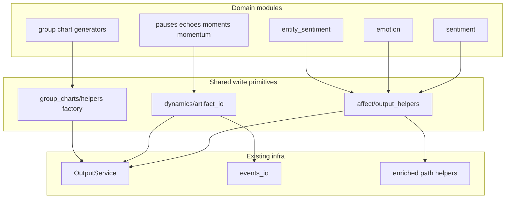

<!-- Planning + implementation guide for Candidate 2 shared analysis I/O. -->

# Shared analysis I/O extraction (refined)

**Status:** **Done** (2026-07-17) — affect / dynamics / group-chart families landed; A3 `save_rows_csv_json` for entity_sentiment; characterization goldens wired. Emotion NRC JSON/CSV pairs remain module-local (different payloads). Keep this document as the locked contract history.

**Source:** 2026-07-16 refactor assessment (Top 3), refined. Behavior-preserving incremental extraction.

Index: [`docs/dev/refactor_top3_index_2026-07-16.md`](refactor_top3_index_2026-07-16.md)

## Extraction rule

Share **artifact mechanics only**: directory prep, path construction for shared filenames, delegated writes through existing APIs, and group-chart service construction.

Keep inside each module: payload construction, domain branching, chart spec generation, summary content/args, and optional extras (contextual emotion exports, echo network CSV, moments markdown, etc.).

**Approved helper infrastructure only** (helpers call these; no parallel write layer):

- [`OutputService`](src/transcriptx/core/output/output_service.py) — `save_data`, `save_chart`, `save_summary`
- [`get_enriched_transcript_path`](src/transcriptx/core/utils/_path_core.py) + [`save_transcript`](src/transcriptx/io/file_io.py)
- [`save_events_json`](src/transcriptx/core/io/events_io.py) + `save_json` / `save_csv` as modules already use them
- [`build_group_virtual_transcript_path`](src/transcriptx/core/analysis/group_charts/virtual_path.py) + [`GroupChartOutputService`](src/transcriptx/core/analysis/group_charts/output_service.py)

**Not on the helper call surface:** `create_summary_json`. It remains an implementation detail inside `OutputService.save_summary`; dynamics/affect helpers must not import or call it. Modules keep calling `output_service.save_summary(...)` themselves (no shared `finish_with_summary`).

## Committed locations (no `core/analysis/io/`)

| Family | Module | Role |
|--------|--------|------|
| Affect | [`src/transcriptx/core/analysis/affect/output_helpers.py`](src/transcriptx/core/analysis/affect/output_helpers.py) (new package) | Enriched transcript + row JSON/CSV via `OutputService` |
| Dynamics | [`src/transcriptx/core/analysis/dynamics/artifact_io.py`](src/transcriptx/core/analysis/dynamics/artifact_io.py) | Dirs, events, stats, speaker stats |
| Group charts | [`src/transcriptx/core/analysis/group_charts/helpers.py`](src/transcriptx/core/analysis/group_charts/helpers.py) | Add `make_group_output_service` |

### Affect package vs registry discovery

Registry is an explicit map in [`module_registry_specs.py`](src/transcriptx/core/pipeline/module_registry_specs.py) (`MODULE_CLASS_MAP`); there is no package walk that would auto-register `affect`. Still required before committing the location:

1. Confirm no dynamic discovery under `core.analysis` imports sibling packages by scanning `__path__`.
2. Export only helpers from `affect/` (no `AnalysisModule` subclass, no `module_name`).
3. Add a registry snapshot / negative test: `"affect"` is not a registered module id; creating the package does not change [`test_module_registry_specs_snapshot`](tests/core/pipeline/test_module_registry_specs_snapshot.py).
4. Prefer package name `affect` (helpers-only) and avoid colliding with registered `affect_tension`.

Domain modules may import helpers. Helpers must never import sentiment/emotion/entity_sentiment/dynamics analysis classes or group chart generators. Enforce with an import-boundary test (AST or importlinter-style check).



## Non-goals

- No payload-schema normalization / result-key changes
- No chart refactor / viz_id / title / filename cleanup
- No summary rewrite
- No public pipeline API expansion
- No `__init__.py` split (old Step 2.9) — separate follow-up
- No unrestricted callback / “extra writers” hooks
- No `finish_with_summary` that rebuilds summary envelopes in shared code

## Documented write order (verified)

### Affect JSON/CSV order

| Module | Global pair order | Notes |
|--------|-------------------|-------|
| sentiment | **JSON then CSV** (`sentiment`) | Per-speaker: JSON then CSV inside speaker loop; charts interleaved per speaker before multi-speaker chart; then `save_summary` |
| emotion | **JSON then CSV** (`nrc_emotion_scores`) | Then contextual JSON-only exports; per-speaker JSON then CSV; charts; `save_summary` |
| entity_sentiment | **CSV then JSON** (`entity_sentiment`) | Per-speaker also **CSV then JSON**; do **not** route through a JSON-first `save_rows_json_csv` helper. Either a CSV-first variant, separate single-format calls, or keep entity writes module-local |

### Dynamics events/stats

All four modules write **events then stats**, identical filename pattern `{module}.events.json` / `{module}.stats.json`:

- pauses, echoes, moments, momentum — verified consecutive `save_events_json` → `save_json(stats, …)`

Therefore a single `write_events_and_stats` that writes events then stats is safe. Extras/charts/summary stay module-orchestrated after that call (and after speaker-stats for pauses).

## Artifact inventory (golden baseline)

All paths relative to `{transcript_dir}/{module}/`. Summary id = `{base}_{module}_summary.json` via `save_summary`. Charts use `spec.name` under `charts/...`.

### Sentiment

| Artifact | Rel path | Format | viz_id / summary | Condition |
|----------|----------|--------|------------------|-----------|
| Enriched | `data/global/{base}_with_sentiment.json` | JSON | — | always |
| Global rows | `data/global/{base}_sentiment.json` then `.csv` | JSON+CSV | — | always |
| Per-speaker | `data/speakers/{base}_{speaker}_sentiment.json` then `.csv` | JSON+CSV | — | per speaker; `save_data` may skip via `_should_skip_speaker_artifact` |
| Rolling | `charts/speakers/{Safe}/static/rolling_sentiment.png` (+ optional html) | PNG/HTML | `sentiment.rolling_sentiment.speaker` | spec non-`None` |
| Multi-speaker | `charts/global/static/multi_speaker_sentiment.png` | PNG/HTML | `sentiment.multi_speaker_sentiment.global` | `len(named_speakers) > 1` |
| Summary | `data/global/{base}_sentiment_summary.json` | JSON | module=`sentiment` | always |

### Emotion

| Artifact | Rel path | Format | viz_id / summary | Condition |
|----------|----------|--------|------------------|-----------|
| Enriched | `data/global/{base}_with_emotion.json` | JSON | — | always |
| NRC | `data/global/{base}_nrc_emotion_scores.json` then `.csv` | JSON+CSV | — | always |
| Contextual labels/examples | `…_contextual_emotion_labels.json`, `…_contextual_emotion_examples.json` | JSON | — | always (module-owned) |
| Per-speaker NRC | `data/speakers/{base}_{speaker_safe}_nrc_emotion.json` then `.csv` | JSON+CSV | — | per `nrc_scores` |
| Radar / polar | under `charts/.../radar/` and `radar_polar/` | PNG/HTML | `emotion.radar.*`, `emotion.radar_polar.*` | conditional on scores / multi-speaker |
| Summary | `data/global/{base}_emotion_summary.json` | JSON | module=`emotion` | always |

### Contextual emotion / fine-grained emotion

| Artifact | Rel path | Format | viz_id / summary | Condition |
|----------|----------|--------|------------------|-----------|
| Label counts (global) | `charts/global/.../contextual_emotion_label_counts.*` | PNG/HTML | `contextual_emotion.label_counts.global` | non-empty `label_counts` |
| Label counts (speaker) | `charts/speakers/{Speaker}/.../contextual_emotion_label_counts.*` | PNG/HTML | `contextual_emotion.label_counts.speaker` | per named speaker with non-empty `label_counts` |
| Native prevalence (global) | `charts/global/.../fine_grained_native_label_prevalence.*` | PNG/HTML | `fine_grained_emotion.label_counts.global` | non-empty prevalence |
| Native prevalence (speaker) | `charts/speakers/{Speaker}/.../fine_grained_native_label_prevalence.*` | PNG/HTML | `fine_grained_emotion.label_counts.speaker` | per named speaker with non-empty `label_counts` (top 15) |

Gallery captions: [`chart_definitions.json`](../../src/transcriptx/core/utils/chart_definitions.json); contract summary: [`emotion_family_contracts_2026-07-18.md`](emotion_family_contracts_2026-07-18.md#charts-gallery).

### Entity sentiment

| Artifact | Rel path | Format | viz_id / summary | Condition |
|----------|----------|--------|------------------|-----------|
| Enriched | not written | — | — | never |
| Global | `…_entity_sentiment.csv` then `.json` | CSV+JSON | — | always |
| Per-speaker | same basename under `data/speakers/` (not speaker-prefixed) | CSV then JSON | — | per speaker; last-write-wins on flat filenames |
| Charts | heatmap / type bar / mentions | PNG/HTML | `entity_sentiment.sentiment_heatmap.global`, `.entity_type_analysis.global`, `.entity_mentions.speaker` | gated on stats |
| Extra summary | `{base}_summary.json` / `.txt` | JSON+TXT | — | always (module-owned) |
| Canonical summary | `{base}_entity_sentiment_summary.json` | JSON | module=`entity_sentiment` | always |

### Dynamics

Shared core (always, order events → stats): `{module}.events.json`, `{module}.stats.json`, then later `{base}_{module}_summary.json`.

| Module | Extras | Charts | Conditions |
|--------|--------|--------|------------|
| pauses | `pauses.per_segment.json`; `data/speakers/{safe}_pauses.stats.json` | hist + timeline | see inventory conditions |
| echoes | `echo_network.csv` | heatmap + timeline | network / speakers / kinds |
| moments | `moments.csv`, `moments.moments.json`, optional `moments.md` | timeline | moments / `write_markdown` |
| momentum | `momentum.timeseries.json` (always); `stall_zones.csv` | timeseries | zones / non-empty series |

## Characterization strategy

### Goldens (behaviour preservation)

Commit **pre-refactor golden expectations** under e.g. `tests/analysis/goldens/shared_io/` (ordered write logs + normalized JSON + parsed CSV rows + relative path sets + chart metadata).

- Two post-refactor runs may assert **determinism** against each other, but must not replace goldens as the preservation oracle.
- Each migration PR ends with a **before/after artifact inventory diff**: no added, removed, renamed, reordered, or conditionally changed writes vs that PR’s golden slice.

### Fixtures (branch coverage)

Do **not** rely only on one mini-transcript’s live analyze output for branches.

1. **Controlled `save_results` / `_save_results` payload fixtures** — populated and empty variants that force each conditional artifact on/off (empty events, empty speaker_stats, no gaps, no moments, `write_markdown` true/false, empty entity_stats, single vs multi named speakers, etc.).
2. **One end-to-end analyze→save test per module** on a fixed mini-transcript (smoke that analyze still produces a savable shape).

### Ordered writes + partial failure

Characterization records an **ordered write call log** (spy/wrap `save_data`, `save_transcript`, `save_events_json`, `save_json`, `save_csv`, `save_chart`, `save_summary`, `write_text` as applicable), not only final files.

Failure-injection tests (at least one affect module, one dynamics module, and group-chart factory/`save_chart` path): inject failure on the Nth write and assert:

- earlier artifacts remain
- later writes did not occur
- exception type/propagation unchanged (no new swallowing)

### Content comparison

**JSON:** deep-compare after normalizing **exact field paths only**. Documented allowlist for summaries:

- `output_structure.data_directory`
- `output_structure.charts_directory`
- `output_structure.global_data_directory`
- `output_structure.global_charts_directory`
- `output_structure.speaker_data_directory`
- `output_structure.speaker_charts_directory`

Replace those with stable placeholders. Do **not** strip arbitrary timestamps or all paths globally.

**CSV:** compare as **parsed ordered rows** (header + row tuples), not raw bytes, unless a specific file is proven byte-deterministic and marked contractual.

**Charts:** do not hash PNG/HTML. Protect viz_ids via spy on `save_chart` and/or artifact metadata (`viz_id`, module, scope, name, chart_type, tags). File existence alone is insufficient.

### Dashboard / manifest discovery (named tests)

Add explicit tests (extend or companion to existing group/manifest suites) that assert consumer-visible entries depending on:

- relative artifact paths
- `viz_id` in artifact meta
- `group_aggregate` tags / `agg_id` / `group_uuid` where applicable

Do not leave “unchanged discovery” as an informal done criterion.

### Group-chart characterization (PR G0, before G1)

For a representative generator (and at least one pooled + one specialised site), assert:

- virtual transcript path = `build_group_virtual_transcript_path(group_run_root, agg_id)` → `{group_run_root}/{agg_id}.group.virtual` (resolved)
- physical chart root under `{group_run_root}/{module_name}/charts/...`
- `viz_id`, `module_name`, `agg_id`, `run_id`, `group_uuid`
- artifact tags include `group_aggregate`

## Helper contracts

### Affect — `affect/output_helpers.py`

Sentiment-first; extend only when emotion/entity prove another shared operation.

Confirmed return types from implementations:

- `save_transcript(...) -> None`
- `OutputService.save_data(...) -> str` (path string; `""` when speaker artifact skipped)
- `OutputService.save_summary(...) -> Path`

**`write_enriched_transcript(output_service, segments, module_tag) -> str`**

- Computes path via `get_enriched_transcript_path(output_service.transcript_path, module_tag)` (returns `str`).
- `makedirs(dirname, exist_ok=True)` + `save_transcript(segments, path)`.
- Returns the path string written. Overwrites. Propagates exceptions. Empty segments still write.

**`save_rows_json_csv` (sentiment/emotion JSON-first only)**

- Signature must forward **all** `save_data` parameters used today: `data`, `filename`, `format_type`, `subdirectory`, `speaker`. Do not silently drop args; there is no separate encoding kwarg on `save_data` today — preserve overwrite/`mkdir` semantics by calling `save_data` unchanged.
- Order for this helper: **json then csv** (matches sentiment/emotion).
- Returns `tuple[str, str]` of the two `save_data` return values.
- Empty payloads: whatever `save_data` does; no special case.
- **entity_sentiment must not use this helper** while its order is CSV-then-JSON. Prefer module-local paired calls or a separately named CSV-first helper only if duplication remains after A3 planning.

No chart/summary/extra-writer parameters. Emotion contextual exports stay explicit module calls.

### Dynamics — `dynamics/artifact_io.py`

**Path ownership:** helpers derive filenames from `module_name`. Callers pass `module_name` + payloads, not precomputed event/stats paths.

- Events: `{global_data_dir}/{module_name}.events.json` via `save_events_json`
- Stats: `{global_data_dir}/{module_name}.stats.json` via `save_json`
- Speaker stats: `{speaker_data_dir}/{sanitize_filename(speaker)}_{module_name}.stats.json`

**Directory rule (mandatory precondition):** Callers **must** call `ensure_dynamics_dirs(...)` before any dynamics write helper. Write helpers **do not** create directories (matches current module orchestration where `makedirs` precedes writes). Tests:

1. After `ensure_dynamics_dirs`, writes succeed.
2. Without it, write fails with the same class of error as today’s missing-dir behaviour (document exact exception).

**`ensure_dynamics_dirs(output_structure, *, include_speaker_data: bool = False) -> None`**

- Always: `global_data_dir`, `global_charts_dir`.
- If `include_speaker_data`: also `speaker_data_dir` (pauses only).

**`write_events_and_stats(output_structure, module_name, events, stats) -> tuple[Path, Path]`**

- Writes events then stats; returns paths from `save_events_json` and the stats path.
- Empty events/stats still write. No try/except. Assumes dirs exist.

**`write_speaker_stats_files(output_structure, module_name, speaker_stats) -> list[Path]`**

Speaker handling (matches pauses today):

- Iterates **all** keys in `speaker_stats` — does **not** apply `OutputService._should_skip_speaker_artifact`.
- Authoritative sanitiser: [`transcriptx.core.utils.validation.sanitize_filename`](src/transcriptx/core/utils/validation.py) (pauses import). Empty/`None`-coerced empty → `"unnamed"`; empty-after-strip → `"unnamed"`.
- Filename: `{safe}_{module_name}.stats.json`.
- Collisions: two distinct speakers that sanitise to the same string overwrite the same path (preserve; document in golden/collision fixture).
- Empty `speaker_stats` → no files.

**No `finish_with_summary`.** Modules call `output_service.save_summary(stats, speaker_stats_or_{}, analysis_metadata={})` after extras/charts.

### Group charts — `make_group_output_service`

```python
def make_group_output_service(
    ctx: GroupChartContext,
    *,
    module_name: str,
    agg_id: str,
) -> GroupChartOutputService:
```

No `outcome` parameter.

**Exact constructor mapping** (from [`GroupChartOutputService.__init__`](src/transcriptx/core/analysis/group_charts/output_service.py) and current call sites):

```python
GroupChartOutputService(
    virtual_transcript_path=build_group_virtual_transcript_path(ctx.group_run_root, agg_id),
    module_name=module_name,
    output_dir=str(ctx.group_run_root.resolve()),
    run_id=ctx.group_run_id,
    agg_id=agg_id,
    group_uuid=ctx.group_uuid,
)
```

Ownership:

- Virtual path: factory via `build_group_virtual_transcript_path` + `agg_id`
- `output_dir`: caller’s `ctx.group_run_root.resolve()` string (not inferred elsewhere)
- Super `OutputService`: `(virtual_transcript_path, module_name, output_dir=..., run_id=...)`
- Metadata: instance stores `_agg_id`, `_group_uuid`; `_record_artifact_metadata` merges tags `["group_aggregate"]`, sets `agg_id`, optional `group_uuid`

Factory does not force `module_name == agg_id` (call sites pass equal strings today).

## GroupChartOutputService construction audit (repo-wide)

Search: `GroupChartOutputService(` — **15 call sites** in **14 files** (excluding the class definition and docs):

| File | Sites | Pattern notes |
|------|-------|---------------|
| [`generic_numeric.py`](src/transcriptx/core/analysis/group_charts/generic_numeric.py) | 1 | canonical scaffold |
| [`stats_charts.py`](src/transcriptx/core/analysis/group_charts/stats_charts.py) | 1 | same kwargs |
| [`sentiment_charts.py`](src/transcriptx/core/analysis/group_charts/sentiment_charts.py) | 1 | same |
| [`emotion_charts.py`](src/transcriptx/core/analysis/group_charts/emotion_charts.py) | 1 | same |
| [`prosody_charts.py`](src/transcriptx/core/analysis/group_charts/prosody_charts.py) | 1 | same |
| [`pauses_charts.py`](src/transcriptx/core/analysis/group_charts/pauses_charts.py) | 1 | same |
| [`highlights_moments.py`](src/transcriptx/core/analysis/group_charts/highlights_moments.py) | 2 | Highlights + Moments generators |
| [`ner_pooled_charts.py`](src/transcriptx/core/analysis/group_charts/ner_pooled_charts.py) | 1 | pooled |
| [`entity_sentiment_pooled_charts.py`](src/transcriptx/core/analysis/group_charts/entity_sentiment_pooled_charts.py) | 1 | pooled |
| [`topic_modeling_group_charts.py`](src/transcriptx/core/analysis/group_charts/topic_modeling_group_charts.py) | 1 | pooled |
| [`contagion_pooled_charts.py`](src/transcriptx/core/analysis/group_charts/contagion_pooled_charts.py) | 1 | pooled |
| [`acts.py`](src/transcriptx/core/analysis/group_charts/acts.py) | 1 | then `generate_acts_charts` |
| [`interactions_charts.py`](src/transcriptx/core/analysis/group_charts/interactions_charts.py) | 1 | **pooled phase only**; session charts via `GenericNumericGroupChartGenerator` |
| [`tics_group_charts.py`](src/transcriptx/core/analysis/group_charts/tics_group_charts.py) | 1 | **pooled phase only**; session via generic |

No other production construction sites found. Re-run this search before merging G3+ to catch drift.

**Justified non-factory domain exceptions** (construction still migrates; chart logic stays local): acts overlay/delegation; interactions/tics two-phase orchestration; temporal/cross-session loaders; prosody schema checks; content_rows aggregators; pooled `can_generate` keys.

Construction kwargs are identical across pooled and specialised sites; **still split PRs by adopter risk**, not by inventing construction differences.

## Migration order (PR-sized units)

Candidate 2 complete only after affect, dynamics, and group-chart families each land independently.

| PR | Scope |
|----|-------|
| **A0** | Affect + dynamics characterization: goldens, ordered writes, payload fixtures, one E2E each, failure-injection for ≥1 affect + ≥1 dynamics |
| **G0** | Group-chart construction/metadata/manifest characterization (no factory yet) |
| **A1** | `affect/output_helpers.py` (sentiment-minimal) + migrate sentiment + inventory diff |
| **A2** | Extend helpers only if required + migrate emotion + inventory diff |
| **A3** | Migrate entity_sentiment **without** JSON-first helper coercion + inventory diff |
| **D1** | `dynamics/artifact_io.py` + migrate pauses (dirs precondition, speaker stats) + inventory diff |
| **D2** | echoes + inventory diff |
| **D3** | moments + inventory diff |
| **D4** | momentum + inventory diff |
| **G1** | Add `make_group_output_service` + adopt **only** `generic_numeric` |
| **G2** | Adopt in pooled generators (ner, entity_sentiment, topic_modeling, contagion) |
| **G3** | Adopt in specialised single-svc generators (stats, sentiment, emotion, prosody, pauses, highlights_moments) |
| **G4** | Adopt at acts + interactions/tics pooled construction sites |

Each PR: helper change (if any) + one adopter slice + updated characterization/goldens + **before/after artifact inventory diff** in the PR description. No unrelated formatting or API cleanup. Include import-boundary check once helpers exist (A1 or shared test PR).

## Done criteria

- Identical artifact sets and **write order** vs committed goldens
- Stable JSON (exact-path normalization only) and CSV-as-parsed-rows
- Named dashboard/manifest tests green (paths, viz_ids, group tags)
- Failure-injection: unchanged exceptions and partial outputs
- No new filesystem writes
- Registry unaffected by `affect/` package
- Import-boundary: helpers never import domain modules/generators
- Existing module and group-chart tests green

## Rollback

1. Revert the **consumer migration PR** first.
2. Remove or simplify a shared helper only when it has **no remaining consumers**.
3. Do not revert an earlier helper PR while later modules still import it.

## Out of scope follow-up

File splitting of sentiment/emotion `__init__.py` (old Step 2.9) — structural cleanup only; track separately.
