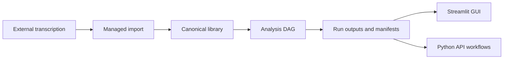

Type: PRODUCT
Authority: self

# TranscriptX Codebase Stocktake — 2026-07-17

> Living decision foundation for the **0.9.x → 1.0** stabilisation programme. Supersedes the historical assessment in [`docs/archive/assessments/assessment-2026-03-10.md`](../archive/assessments/assessment-2026-03-10.md).  
> Metrics refreshed **2026-07-24** against package **0.9.7**. Historical findings below that still say 0.4.4 / 0.6.x / 0.7.x / 0.8.x / 0.9.0–0.9.6 describe earlier snapshots; treat the header/snapshot tables as authoritative for current packaging.  
> **Product authority:** [PRODUCT.md](../PRODUCT.md) · **Roadmap:** [ROADMAP.md](../ROADMAP.md) · **Programme:** [pre_release_roadmap_1_0.md](pre_release_roadmap_1_0.md)

---

## 1. Executive verdict

| Dimension | Verdict | Confidence |
|-----------|---------|------------|
| **What it is** | Local-first personal transcript **analysis workbench** (Streamlit GUI + Python API + Docker). Transcription is intentionally external. | High |
| **Honest stage** | **0.9.x stabilisation toward 1.0** (`0.9.7`, classifier Beta). Strong contracts and test culture; not consumer polish; not multi-user. | High |
| **OSS local-first public 1.0** | **Conditional go** — automatable harden + public surfaces landed in **0.9.7**; public 1.0 still requires unfamiliar-user validation, owner trust/RTD sign-off, and [`release_governance.md`](release_governance.md) evidence. | High |
| **Hosted / multi-user product** | **No-go** until auth, tenancy, privacy, and durable concurrency are designed. | High |
| **Immediate process focus** | Human-testing wave (manual acceptance, unfamiliar users, clean-env soak) → RC — not Wave 3 module sprawl. | High |

**One-line:** Wave 0 eng gate is closed; Top-3 eng programs are Done; analysis waves through B16 shipped; programme through **0.9.7** (automatable harden + public surfaces) landed; **default next capacity is human testing → RC** (owner Hub-card / RTD slug / Large-library soak residuals) — **not** Wave 3 remainder (B5 DB / B18) as the default product track. Do not market as a hosted product.

---

## 2. Product snapshot

| Fact | Value / evidence |
|------|------------------|
| Version | `0.9.7` (`pyproject.toml`, `src/transcriptx/__init__.py`, CHANGELOG) |
| License | MIT |
| Scale | Large `src/transcriptx/` + extensive `tests/` (~4.5k test functions; see Makefile lanes) |
| Smoke gate | `make test-smoke` (CI matrix 3.10–3.12; Core+dev and NLP smoke lanes) |
| Coverage (checked-in `coverage.json`) | See latest coverage lane; **entire `web/` omitted** from `.coveragerc` fail_under (gap-finder only). GUI journey acceptance: `make test-gui-acceptance` |
| Git remote | `glen-w/TranscriptX` |
| Package URLs | `https://github.com/glen-w/TranscriptX` |
| CI workflows | `.github/workflows/ci.yml` (tests matrix + compose-config + release-checks); `.github/workflows/pages.yml` (website) |
| SECURITY.md / CoC | `SECURITY.md` present (private vuln reporting) |
| Distribution reality | Docker + git tags; **not on PyPI** — see install verification matrix |
| Wave 0 eng gate | Closed 2026-07-22 (hygiene A1–A10 + Config 1.7/1.8 + docs/inventory parity) |
| Recent product line (0.6.6→0.9.7) | `llm_custom_qa`, B10 meeting extracts, speaker profiles v1 + Phase 1.5/1.6 + avatars + voice R2 + locations pack, Wave 2 lexicons (B6/B7), B13 graphs, analysis presets, **B14** motifs/drift, **B16** keyphrases, LLM feedback v1; **0.9.x** schema epoch → install/transcribe → Sphinx scaffolds → Guided/demo → harden + public surfaces |

**Supported surfaces** ([`docs/public_surfaces.md`](../public_surfaces.md)): GUI, Python API (`app.workflows`, managed import), Docker Compose.  
**Explicitly unsupported:** analysis CLI subcommands, ad hoc unmanaged JSON, direct FS mutation of managed storage.

---

## 3. Status vs declared direction

### 3.1 What docs claim

- **North star** ([`docs/PRODUCT.md`](../PRODUCT.md); [`docs/ROADMAP.md`](../ROADMAP.md); programme [`pre_release_roadmap_1_0.md`](pre_release_roadmap_1_0.md)): ship a credible **1.0** workbench, then evolve toward a personal audio and transcript intelligence companion.
- **Phase 1 (0.6.x honesty):** install, core flows, docs, dep consistency, **in-repo CI** — feature delivery continues under beta; “no new features” language is retired.
- **Locked principles:** core-first correctness; contracts+tests before features; GUI primary; deferred platformisation.
- **Out of scope (6 months):** plugin marketplace, realtime transcription, cloud SaaS, heavy training, mobile.

### 3.2 Drift and contradictions (must reconcile)

| Issue | Detail |
|-------|--------|
| Historical Phase 1 vs shipping | Older ROADMAP/stocktake language said “no new features” while 0.3.x→0.7.x shipped continuously — **reconciled** in ROADMAP (language retired). |
| Historical version bands | Older docs said “v0.42 current” / stocktake once said **0.6.5** — **reconciled**; package is **0.9.7**. |
| Groups story | ~~README “DB-backed”~~ **Fixed** (file-backed). Storage contract is file-first; DB-backed **speaker** analytics views remain Phase 3 remainder. |
| Sprint archive | [`docs/archive/plans/sprint_archive.md`](../archive/plans/sprint_archive.md) is historical backlog only — not live. |
| Identity | ~~`pyproject` URLs ≠ remote~~ **Fixed** → `glen-w/TranscriptX`. |
| Install story | Documented: not on PyPI; Docker + git tags; see [`install_verification_matrix.md`](../runtime/install_verification_matrix.md). |
| Stale packaging | ~~`src/setup.py`~~ **Removed** (Wave 0 A6). |
| Tag naming | Prefer `v`-prefixed tags going forward; historical mix remains. |

**Recommendation:** Treat Phase 1 beta-ready machinery as **achieved**. Remaining public-tag work is governance evidence, not missing Wave 0 code.

---

## 4. Finished / unfinished matrix

| Domain | Status | Notes |
|--------|--------|-------|
| Analysis pipeline / DAG / run outcomes | **Mature** | Strong contracts (`run_outcome_contract`, output contract, pipeline contracts) |
| Managed import / storage / rename journals | **Mature** | Admission gate; file-first; durability-critical |
| Analysis modules (stats, NER, topics, voice, emotion family, ASR quality, lexicons, keyphrases, …) | **Mature** | **51** registered modules; some god-files (>1k LOC); 0.6–0.8 ships: equity, BERTopic, `transcript_quality`, `topic_shift`, emotion-family classifiers, B6/B7 lexicons, B10 extracts, `llm_custom_qa`, **B14** motifs, **B16** `keyphrases` |
| Streamlit GUI | **Mature (beta UX)** | Multipage toolkit; Run Analysis presets + Settings Models/Analysis; Speakers directory/detail; Charts Gallery restructure |
| Search | **Mature (simple)** | In-process file-backed index (`search_service.py`) |
| LLM (Ollama) | **Mature (local-only)** | Remote OpenAI deferred post-beta; Settings → Models presets |
| Corrections Studio / speaker studio | **Mature / active** | LLM corrections shipped; fragment work deferred |
| Speaker profiles (longitudinal) | **Mature (file-backed)** | v1 store + Phase 1.5/1.6 analytics + avatars + voice R2 + locations pack; remainder: DB views / group `profile_id` gallery |
| Groups analysis + charts | **Mature / experimental label** | File-backed; chart registry **34** aggs incl. `topic_shift`, `epistemic_markers`, `politeness`, **`keyphrases`**; product label inconsistent |
| Run cleanup | **Mature (Phase B complete)** | Phase A extract done; Phase B complete: policy **7**, result-schema **2**, journal schema **3** |
| Config ownership collapse (Top-3 #1) | **Done through 1.8** | Nested + flat + mapping + system/workflow + atomic file overrides (1.7) + curated `to_dict` (1.8). Inventory invariant: **51 / 705 / 16** (721 total; see `test_ownership_invariant_counts`; +`keyphrases` pilot). **1.9** structural split is optional follow-up. |
| Shared analysis I/O (Top-3 #2) | **Done** | Affect/dynamics/group-chart helpers landed; A3 entity_sentiment CSV-then-JSON; characterization hardened (2026-07-17). Emotion NRC pairs intentionally local. |
| Rename + corrections split (Top-3 #3) | **Done** | Structural extract landed (`rename/{transaction_phase,finalize_phase,reconcile,repair,post_commit}`; corrections `candidate_*` modules); `pipeline.py` / `candidate_service.py` are thin coordinators |
| Export system package refactor | **Complete (residual finish landed)** | Package under `transcriptx.export/`; shims retired; path dedupe; zip on `ExportService` |
| Wave 0 release hygiene (A1–A10) | **Done** | Compose loopback, SECURITY.md, install matrix, CI, denylist, audits, shim inventory, governance vs pre-release split |
| Transcription GUI orchestration | **Deferred** | Instruction hub + whispermlx provider; WhisperX Docker stub unregistered |
| Auth / multi-tenant | **N/A** | Cleanup “authorization” = confirm-phrase gate only |
| Empty `gui/` / `ui/` packages | **Stub** | Real UI under `web/` |

---

## 5. Architecture and risk hotspots

### 5.1 Package map (approximate)

| Package | Role | Maturity |
|---------|------|----------|
| `core/` (~94k LOC) | Pipeline, analysis, config, audio, LLM, rename | Mature; some oversized files |
| `web/` (~28k) | Streamlit app + services | Mature UI; cleanup Phase A extracted |
| `io/` (~8k) | Managed import / adapters | Mature |
| `app/` (~3.5k) | Typed workflows / controllers | Mature |
| `services/` | Transcription providers, studios | Mixed (transcription product-deferred) |
| `export/` | Export helpers | Mature; package refactor + residual finish complete |
| `gui/`, `ui/` | Empty shells | Stub |

### 5.2 Size / coupling hotspots

Largest risk files (illustrative): `qa_analysis/analysis.py`, `highlights/core.py`, topic modeling visualization, aggregation registry, `core/utils/config/analysis.py`, `run_cleanup/journal.py`, `run_cleanup/execution.py`.  
`run_cleanup/` package ~**6.5k LOC** / ~29 modules; façade `service.py` is a thin public API (no temporary private shims).

### 5.3 Incomplete markers in source

- **Zero** `TODO`/`FIXME` under `src/` (enforced by Wave 0 stale-ref / CI gate).
- Intentional stubs: WhisperX Docker provider; empty `gui/`/`ui/`; LLM null client pattern.
- Design `NotImplementedError` on some module `analyze()` paths that require `run_from_context()`.

---

## 6. Active engineering programs

Authoritative sequencing: [`refactor_top3_index_2026-07-16.md`](../archive/plans/refactor_top3_index_2026-07-16.md).

| Order | Program | Doc | Status (2026-07-24) |
|-------|---------|-----|---------------------|
| **Done** | Run cleanup Phase B hardening | [`run_cleanup_refactor_contracts.md`](../archive/plans/run_cleanup_refactor_contracts.md) | Policy 7; journal RMW; recovery matrix; Identity/Snapshot hot paths; LockAcquisitionOutcome; adversarial + idempotency suite. |
| **Done** | Config ownership collapse (Candidate 1) | [`config_ownership_collapse_plan.md`](../archive/plans/config_ownership_collapse_plan.md) | Through 1.8; atomic overrides + curated `to_dict`; inventory **51 / 705 / 16** (721). Optional follow-up: **1.9** structural split. |
| **Done** | Shared analysis I/O | [`shared_analysis_io_refactor_plan.md`](../archive/plans/shared_analysis_io_refactor_plan.md) | Affect + dynamics + group-chart families complete; A3 entity_sentiment + char closeout 2026-07-17 |
| **Done** | Rename + corrections split | [`rename_corrections_orchestrator_split_plan.md`](../archive/plans/rename_corrections_orchestrator_split_plan.md) | Steps 3.1–3.13 landed; compat table documents aliases; public import paths unchanged |
| **Done** | Export system refactor | [`export_system_refactor_plan.md`](../archive/plans/export_system_refactor_plan.md) | Steps 1–9 + residual finish; Jinja2 + Artifact Protocol remain optional backlog |

**Explicit non-goals** (from Top-3 index): no full config framework rewrite; no algorithm rewrites under I/O extract; no rename journal schema/policy changes in a “split” PR; no interleaved Candidate 1 + 3 mega-PRs.

---

## 7. Quality and release machinery

### 7.1 Strengths

- Large, well-marked suite (~4.5k collected test functions; historical “~6k” counts mixed markers/param) with Makefile lanes: smoke → contracts → fast → integration/heavy.
- Strong **contracts**, **config goldens**, **run-cleanup characterisation** (~25 goldens under `tests/web/services/run_cleanup_characterisation/`).
- In-repo CI: `.github/workflows/ci.yml` (Python 3.10–3.12 + compose-config + release-checks).
- Local confidence vs tag authority split: `# pre-release` vs [`release_governance.md`](release_governance.md).
- Honest beta labeling; MIT; Docker path documented; `SECURITY.md` present.
- Destructive cleanup design is defense-in-depth (preview → phrase confirm → handles → stage → fingerprint → verified delete → journal).

### 7.2 Remaining gaps (honest)

| Gap | Severity |
|-----|----------|
| Next public tag still needs governance evidence bundle + clean worktree + green CI on exact commit | High (process) |
| `web/` excluded from line-coverage gate | Medium | `.coveragerc` omit remains; **acceptance** via `make test-gui-acceptance` + [`gui_acceptance_residual_checklist.md`](gui_acceptance_residual_checklist.md) — measurement ≠ journey acceptance |
| mypy present but heavily softened (many error codes disabled) | Medium |
| Pre-commit config under `config/.pre-commit-config.yaml` only (not root) | Medium |
| No aggregated third-party model/license NOTICE | Medium |
| Tag naming inconsistency in history | Low–Medium |
| Ignored forbidden paths may exist locally (denylist soft-warn unless `TRANSCRIPTX_STRICT_IGNORED_FORBIDDEN=1`) | Low |

### 7.3 Live metrics vs March 2026 archive

| Metric | Archive 2026-03-10 | This stocktake (refreshed 2026-07-24) |
|--------|--------------------|----------------------------------------|
| Product stage | Early / CLI-era narrative | Beta **0.8.1**, GUI+API, no analysis CLI |
| Smoke | 10/10 (then) | Makefile `test-smoke` (CI matrix) |
| Coverage narrative | Mixed | Measured lane; web omitted |
| Ruff/mypy counts | 332 / 2111 (stale) | Not re-baselined as release gate; treat archive numbers as **historical only** |
| CI | Weak | **In-repo** `.github/workflows/ci.yml` |

Do **not** use [`docs/archive/assessments/assessment-2026-03-10.md`](../archive/assessments/assessment-2026-03-10.md) or [`docs/archive/assessments/TEST_SUITE_ASSESSMENT.md`](../archive/assessments/TEST_SUITE_ASSESSMENT.md) as current truth without refresh.

---

## 8. Public-release readiness

### 8.1 Dual-axis verdict

| Audience | Confidence | Why |
|----------|------------|-----|
| Private / trusted single-machine beta | High | Strong tests + Docker + Wave 0 hygiene landed |
| Public GitHub “clone & trust CI” | Medium–High | CI exists; tag still needs green CI on exact commit + evidence bundle |
| Public PyPI consumers | Low | Release model is not PyPI; install matrix documents this |
| Hosted multi-user product | None | No auth/tenancy/privacy ops |

### 8.2 OSS blockers (close or consciously accept)

| ID | Finding | Paths / notes |
|----|---------|---------------|
| **B1** | ~~Compose published on all interfaces by default~~ **Closed** | Host bind defaults to `127.0.0.1` via `TRANSCRIPTX_BIND_HOST`; in-container still `--host 0.0.0.0`. LAN opt-in documented. |
| **B2** | ~~Mid-flight run_cleanup extract~~ **Closed** | Phase A + B complete |
| **B3** | ~~No in-repo CI workflows~~ **Closed** | `.github/workflows/ci.yml` |
| **B4** | ~~Public URLs ≠ git remote~~ **Closed** | `glen-w/TranscriptX` |
| **B5** | ~~Groups README contradiction~~ **Closed** | README now “file-backed”; see [`group_functionality_audit_2026-07-17.md`](../archive/assessments/group_functionality_audit_2026-07-17.md) |
| **B6** | Public tag evidence incomplete until governance runbook executed on a clean commit | Process — see [`release_governance.md`](release_governance.md) |

### 8.3 High pitfalls (not always blockers)

| ID | Finding |
|----|---------|
| H1 | Optional-dep **auto-install** paths when not core mode; Docker `TRANSCRIPTX_CORE=0` |
| H2 | Downloads on by default (HF/spaCy); air-gap needs `TRANSCRIPTX_DISABLE_DOWNLOADS=1` |
| H3 | Gated HF / pyannote model ToS — no aggregated THIRD_PARTY notice |
| H4 | Cleanup handle store is **process-local in-memory** — multi-worker/multi-container desync risk |
| H5 | Secure cleanup needs dir_fd / O_NOFOLLOW; may refuse on some platforms (`PLATFORM_UNSUPPORTED`) |
| H6 | ~~Tracked `data/groups` / `data/perf`~~ **Closed** for Wave 0 intent (allowlist + untrack); local ignored paths may still soft-warn |
| H7 | ~~Tracked `docker-compose.override.yml`~~ **Closed** — example tracked; real override gitignored |
| H8 | ~~No SECURITY.md~~ **Closed**; secrets/denylist scripts in release path |

### 8.4 Strengths to preserve in messaging

- Public surfaces + storage contracts.
- Local-first, MIT, analysis-first transcription boundary.
- Cleanup confirm + staging + journals + characterisation suite.
- Honest beta labeling; Wave 0 hygiene + Config 1.7 atomic apply.

---

## 9. Decision framework (recommended defaults)

Use these as defaults unless you consciously override them:

1. **Release type (next 1–2 months):** OSS **local-first single-user beta** — not hosted product.
2. **run_cleanup:** Phase A + Phase B complete (policy 7 / schema 3 / result schema 2). Further behaviour changes need explicit schema/policy decisions; do not mix with Top-3 refactors.
3. **Eng priority:** Top-3 Candidates **#1 / #2 / #3 all Done**. Optional config **1.9** structural split and export Jinja2/Artifact Protocol are residual eng backlog, not Wave 0 blockers. **Default product capacity → human-testing wave → RC** (programme through **0.9.7** automatable harden + public surfaces landed; owner Hub-card / RTD slug / Large-library soak may soft-cut) — see [pre_release_roadmap_1_0.md](pre_release_roadmap_1_0.md). Analysis backlog Wave 3 remainder (B5 DB/group `profile_id`, B18/P2) is **post-1.0 / freeze-excepted repair only** ([`analysis_module_backlog_2026-07-17.md`](analysis_module_backlog_2026-07-17.md)).
4. **Phase 1 honesty:** ROADMAP reflects 0.7.x + real CI; “no new features” retired.
5. **Distribution:** Docker + git tags until PyPI decided; install matrix is authoritative.
6. **Network threat model:** Localhost by default; LAN opt-in via `TRANSCRIPTX_BIND_HOST=0.0.0.0` (unauthenticated).
7. **Do not start:** marketplace, realtime transcription, cloud SaaS, remote OpenAI, multi-tenant auth (until a product decision).

---

## 10. Recommended near-term backlog

### Release hygiene (before next public tag)

1. ~~Finish run_cleanup Phase A + Phase B~~ **Done** (policy 7 / schema 3 / result schema 2; façade shims removed).
2. ~~Fix README Groups line~~ **Done** — file-backed (not “DB-backed”).
3. ~~Align `pyproject` URLs with real GitHub remote~~ **Done** (`glen-w/TranscriptX`).
4. ~~Add `SECURITY.md`~~ **Done**.
5. ~~Decide Compose host bind default / document exposure~~ **Done** (`TRANSCRIPTX_BIND_HOST`, loopback default).
6. ~~Add minimal CI~~ **Done** (`.github/workflows/ci.yml`).
7. ~~Untrack non-fixture `data/groups` / `data/perf`; allowlist fixtures~~ **Done**.
8. ~~Remove stale `src/setup.py`~~ **Done**; prefer `v`-prefixed tags going forward.
9. ~~Reconcile README `pip install` claim with Docker+tag policy~~ **Done** (install matrix + caveats).
10. **Still open for tagging:** execute [`release_governance.md`](release_governance.md) evidence runbook on a **clean** commit with green CI on that SHA.
11. **Suite residual (non-Guided):** after Guided/demo deep-test, a small cluster of epoch-1 / LLM custom-QA + group aggregation + config-delegation snapshot tests may still fail under `make test-fast` — treat as contract-test drift to clear before RC, not as missing Guided/demo product work.

### Engineering (after Wave 0)

11. ~~Shared analysis I/O: A0/G0 characterization then A1+ slices.~~ **Done** (2026-07-17).
12. ~~Config ownership 1.1–1.8.~~ **Done** (2026-07-20+); optional **1.9** structural split tracked separately.
13. ~~Rename/corrections Candidate 3.~~ **Done** (structural extract + compat aliases).

### Product (Wave 3 open)

14. **Post-1.0 analysis capacity (not default 0.9.x track):** Wave 3 remainder — **B5 remainder** (DB analytics views / group gallery keyed by `profile_id`), **B18** / **P2** provenance. ~~B14~~ / ~~B16~~ shipped. See [`analysis_module_backlog_2026-07-17.md`](analysis_module_backlog_2026-07-17.md).
15. UX: Corrections Studio / Audio Prep fragment follow-ups (deferred).
16. ~~Remove legacy Data/Explorer redirect routes after “one more release”~~ **Done** (**0.9.7**).
17. User-facing docs thinner than contract corpus — optional researcher guide.

### Explicit deferrals

- WhisperX Docker GUI orchestration / host HTTP transcribe.
- Remote LLM providers.
- Speaker profiles **DB-backed** analytics views / group `profile_id` gallery (file-backed Speakers + voice + locations **shipped**).
- Export Jinja2 shells (step 10) / Artifact Protocol; plugin marketplace.
- **Post-1.0 only:** B4 optional citeable research methods (`fighting_words` first; sidecar isolation) — not 1.0 capacity, deps, or presets. See [`ROADMAP.md`](../ROADMAP.md) and [`analysis_module_backlog_2026-07-17.md`](analysis_module_backlog_2026-07-17.md) §3.2.

---

## 11. How to use this document

| Question | Where to look |
|----------|---------------|
| What is done vs not? | §4 matrix |
| What eng work is mid-flight? | §6 |
| Can we release publicly? | §1 + §8 + [`release_governance.md`](release_governance.md) |
| What blocks OSS vs product? | §8.2 vs §1 product no-go |
| What should we do next? | §9 defaults + §10 backlog |
| Is an old assessment current? | Prefer **this file**; archive is historical |

**Refresh policy:** Re-run smoke + update version/WIP rows when tagging a release or starting a major refactor program. Do not silently let this become another stale archive.

---

## 12. Source index (primary)

| Topic | Path |
|-------|------|
| Roadmap | `docs/ROADMAP.md` |
| Public surfaces | `docs/public_surfaces.md` |
| Storage | `docs/runtime/STORAGE.md` |
| Top-3 refactors | `docs/archive/plans/refactor_top3_index_2026-07-16.md` |
| Cleanup contracts / assessment | `docs/archive/plans/run_cleanup_refactor_contracts.md` / assessments |
| Config ownership | `docs/archive/plans/config_ownership_collapse_plan.md` |
| Release governance (tag gate) | `docs/dev/release_governance.md` |
| Pre-release checklist (local confidence) | `.cursor/commands/pre-release.md` |
| Analysis module backlog (ranked) | `docs/dev/analysis_module_backlog_2026-07-17.md` |
| Wave B16 keyphrases | `docs/dev/wave_b16_keyphrases_2026-07-24.md` |
| Keyphrases runtime | `docs/runtime/keyphrases.md` |
| Group functionality audit | `docs/archive/assessments/group_functionality_audit_2026-07-17.md` |
| Speaker profiles (longitudinal) | `docs/contracts/speaker_profiles_v1.md` |
| Speaker profiles voice | `docs/contracts/speaker_profiles_voice_v1.md` |
| Historical assessment (superseded) | `docs/archive/assessments/assessment-2026-03-10.md` |
