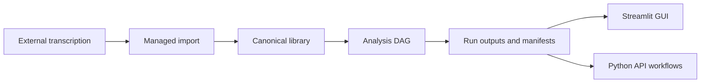

Type: PRODUCT
Authority: self

# TranscriptX Codebase Stocktake — 2026-07-17

> Living decision foundation for near-term work. Supersedes the historical assessment in [`docs/archive/assessment-2026-03-10.md`](../archive/assessment-2026-03-10.md).  
> Metrics refreshed 2026-07-17 against package **0.4.4** (beta).

---

## 1. Executive verdict

| Dimension | Verdict | Confidence |
|-----------|---------|------------|
| **What it is** | Local-first transcript **analysis** toolkit (Streamlit GUI + Python API + Docker). Transcription is intentionally external. | High |
| **Honest stage** | **Beta** (`0.4.4`, classifier `4 - Beta`). Strong contracts and test culture; not consumer polish; not multi-user. | High |
| **OSS local-first public release** | **Conditional go** after hygiene + security docs (cleanup Phase A extract complete). | High |
| **Hosted / multi-user product** | **No-go** until auth, tenancy, privacy, and durable concurrency are designed. | High |
| **Immediate process blocker** | Release hygiene (CI, SECURITY.md, identity/install claims) — not the cleanup extract. | High |

**One-line:** Ship as a single-user, local-first OSS beta after closing release hygiene; keep engineering sequenced (Top-3 refactors next); do not market as a hosted product.

---

## 2. Product snapshot

| Fact | Value / evidence |
|------|------------------|
| Version | `0.4.4` (`pyproject.toml`, `src/transcriptx/__init__.py`, CHANGELOG) |
| License | MIT |
| Scale | ~144k LOC under `src/transcriptx/`; ~722 `test_*.py` files; ~5910/6085 tests collected (default deselection) |
| Smoke gate (2026-07-17) | **37/37 passed** (`make test-smoke`, ~62s) |
| Coverage (checked-in `coverage.json`) | **~85.3%** of measured code; **entire `web/` omitted** (`.coveragerc`) |
| Git remote | `glen-w/TranscriptX` |
| Package URLs | Claim `github.com/transcriptx/transcriptx` + ReadTheDocs — **mismatch with remote** |
| CI workflows | **None** in-repo (no `.github/workflows`) |
| SECURITY.md / CoC | **Absent** |
| Distribution reality | Docker + git tags (pre-release command); README also claims `pip install transcriptx` |

**Supported surfaces** ([`docs/public_surfaces.md`](../public_surfaces.md)): GUI, Python API (`app.workflows`, managed import), Docker Compose.  
**Explicitly unsupported:** analysis CLI subcommands, ad hoc unmanaged JSON, direct FS mutation of managed storage.

---

## 3. Status vs declared direction

### 3.1 What docs claim

- **North star** ([`docs/ROADMAP.md`](../ROADMAP.md)): credible beta — stable contracts, strong UX, safe extensibility; evolve toward a personal audio analysis companion.
- **Phase 1 (now):** install, core flows, docs, dep consistency, CI — **“no new features.”**
- **Locked principles:** core-first correctness; contracts+tests before features; GUI primary; deferred platformisation.
- **Out of scope (6 months):** plugin marketplace, realtime transcription, cloud SaaS, heavy training, mobile.

### 3.2 Drift and contradictions (must reconcile)

| Issue | Detail |
|-------|--------|
| Phase 1 vs shipping | CHANGELOG 0.3.x→0.4.4 shows continuous feature delivery (cleanup, LLM corrections, groups charts, export UI) while Phase 1 still says “no new features.” |
| Version bands | ROADMAP still says near-term “v0.1–v0.41” and M3 “v0.42 — current”; package is **0.4.4**. |
| Groups story | ~~README “DB-backed”~~ **Fixed** (file-backed). Storage contract is file-first; DB-backed analytics remain Phase 3. |
| Transcription state label | ROADMAP “Current state (v0.1.x)” while package is 0.4.x — product stance (external) is correct; version label is stale. |
| Sprint archive | ROADMAP says archive “no longer in-tree”; [`docs/archive/sprint_archive.md`](../archive/sprint_archive.md) **exists**. |
| Identity | `pyproject` homepage/repo URLs ≠ actual `origin` remote. |
| Install story | README `pip install transcriptx` vs release playbook “Docker + tags, not PyPI/twine.” |
| Stale packaging | `src/setup.py` still hardcodes `version="0.42"`. |
| Tag naming | Mix of `v0.4.0`–`v0.4.2` and bare `0.4.3` / `0.4.4`. |

**Recommendation:** Treat Phase 1 as **mostly achieved on product flows** but **not closed** on CI/install-consistency claims. Either mark Phase 1 done and rewrite version bands, or stop calling “no new features” while shipping 0.4.x.

---

## 4. Finished / unfinished matrix

| Domain | Status | Notes |
|--------|--------|-------|
| Analysis pipeline / DAG / run outcomes | **Mature** | Strong contracts (`run_outcome_contract`, output contract, pipeline contracts) |
| Managed import / storage / rename journals | **Mature** | Admission gate; file-first; durability-critical |
| Analysis modules (stats, NER, topics, voice, …) | **Mature** | Large modules; some god-files (>1k LOC) |
| Streamlit GUI | **Mature (beta UX)** | Multipage toolkit; recent cleanup/UX fixes in 0.4.x |
| Search | **Mature (simple)** | In-process file-backed index (`search_service.py`) |
| LLM (Ollama) | **Mature (local-only)** | Remote OpenAI deferred post-beta |
| Corrections Studio / speaker studio | **Mature / active** | LLM corrections shipped; fragment work deferred |
| Groups analysis + charts | **Mature / experimental label** | File-backed; many group chart contracts; product label inconsistent |
| Run cleanup | **Mature (Phase B complete)** | Phase A extract done; Phase B complete: policy **7**, result-schema **2**, journal schema **3** (version-dispatched readers), journal RMW locks, plan-ID classifier binding, recovery matrix + adversarial FS suite |
| Config ownership collapse (Top-3 #1) | **WIP** | 8 nested subtrees delegated; 1.1–1.8+ still open |
| Shared analysis I/O (Top-3 #2) | **Done** | Affect/dynamics/group-chart helpers landed; A3 entity_sentiment CSV-then-JSON; characterization hardened (2026-07-17). Emotion NRC pairs intentionally local. |
| Rename + corrections split (Top-3 #3) | **Planned** | Needs characterization first |
| Export system package refactor | **Complete (residual finish landed)** | Package under `transcriptx.export/`; shims retired; path dedupe; zip on `ExportService` |
| Transcription GUI orchestration | **Deferred** | Instruction hub + whispermlx provider; WhisperX Docker stub unregistered |
| Auth / multi-tenant | **N/A** | Cleanup “authorization” = confirm-phrase gate only |
| Empty `gui/` / `ui/` packages | **Stub** | Real UI under `web/` |

---

## 5. Architecture and risk hotspots

### 5.1 Package map (approximate)

| Package | Role | Maturity |
|---------|------|----------|
| `core/` (~94k LOC) | Pipeline, analysis, config, audio, LLM, rename | Mature; some oversized files |
| `web/` (~28k) | Streamlit app + services | Mature UI; cleanup Phase A extracted |
| `io/` (~8k) | Managed import / adapters | Mature |
| `app/` (~3.5k) | Typed workflows / controllers | Mature |
| `services/` | Transcription providers, studios | Mixed (transcription product-deferred) |
| `export/` | Export helpers | Mature; package refactor + residual finish complete |
| `gui/`, `ui/` | Empty shells | Stub |

### 5.2 Size / coupling hotspots

Largest risk files (illustrative): `qa_analysis/analysis.py`, `highlights/core.py`, topic modeling visualization, aggregation registry, `core/utils/config/analysis.py`, `run_cleanup/journal.py`, `run_cleanup/execution.py`.  
`run_cleanup/` package ~**6.5k LOC** / ~29 modules; façade `service.py` is a thin public API (no temporary private shims).

### 5.3 Incomplete markers in source

- Almost **no** `TODO`/`FIXME` in `src/` (work tracked in docs/plans).
- Intentional stubs: WhisperX Docker provider; empty `gui/`/`ui/`; LLM null client pattern.
- Design `NotImplementedError` on some module `analyze()` paths that require `run_from_context()`.

---

## 6. Active engineering programs

Authoritative sequencing: [`docs/dev/refactor_top3_index_2026-07-16.md`](refactor_top3_index_2026-07-16.md).

| Order | Program | Doc | Status (2026-07-17) |
|-------|---------|-----|---------------------|
| **Done** | Run cleanup Phase B hardening | [`run_cleanup_refactor_contracts.md`](run_cleanup_refactor_contracts.md) | Policy 7; journal RMW; recovery matrix; Identity/Snapshot hot paths; LockAcquisitionOutcome; adversarial + idempotency suite. |
| **1st parallel** | Config ownership collapse | [`docs/config/config_ownership_collapse_plan.md`](../config/config_ownership_collapse_plan.md) | Registry pilots complete (41/598/10); **8 nested delegated**; batches 1.1–1.8+ open |
| **Done** | Shared analysis I/O | [`shared_analysis_io_refactor_plan.md`](shared_analysis_io_refactor_plan.md) | Affect + dynamics + group-chart families complete; A3 entity_sentiment + char closeout 2026-07-17 |
| **2nd** | Rename + corrections split | [`rename_corrections_orchestrator_split_plan.md`](rename_corrections_orchestrator_split_plan.md) | After characterization; do not interleave with config validation PRs |
| **Done** | Export system refactor | [`export_system_refactor_plan.md`](export_system_refactor_plan.md) | Steps 1–9 + residual finish (shims / path / zip ownership / resolve split); Jinja2 + Artifact Protocol remain optional backlog |

**Explicit non-goals** (from Top-3 index): no full config framework rewrite; no algorithm rewrites under I/O extract; no rename journal schema/policy changes in a “split” PR; no interleaved Candidate 1 + 3 mega-PRs.

---

## 7. Quality and release machinery

### 7.1 Strengths

- Large, well-marked suite (~6k tests) with Makefile lanes: smoke → contracts → fast → integration/heavy.
- Strong **contracts**, **config goldens**, **run-cleanup characterisation** (~25 goldens under `tests/web/services/run_cleanup_characterisation/`).
- Detailed `# pre-release` checklist (`.cursor/commands/pre-release.md`): tests, formatters, docker-smoke, secrets, pip-audit.
- Honest beta labeling; MIT; Docker path documented.
- Destructive cleanup design is defense-in-depth (preview → phrase confirm → handles → stage → fingerprint → verified delete → journal).

### 7.2 Gaps

| Gap | Severity |
|-----|----------|
| No GitHub Actions / in-repo CI workflows | High (ROADMAP Phase 1 claims CI) |
| `web/` excluded from coverage | Medium–High (primary UX unmeasured) |
| mypy present but heavily softened (many error codes disabled) | Medium |
| Pre-commit config under `config/.pre-commit-config.yaml` only (not root) | Medium |
| No SECURITY.md, CoC, model/license NOTICE | High for OSS trust |
| README install vs Docker+tag release model | High (user trust) |
| URL / org identity mismatch | High |
| ~50 tracked `data/**` paths; groups/perf remain tracked despite ignore intent | Medium |
| Tracked `docker-compose.override.yml` (LLM defaults, src bind-mount) | Medium |
| Tag naming inconsistency | Low–Medium |
| Stale `src/setup.py` version `0.42` | Medium |
| Historical assessments stale if misread as current | Medium |

### 7.3 Live metrics vs March 2026 archive

| Metric | Archive 2026-03-10 | This stocktake 2026-07-17 |
|--------|--------------------|---------------------------|
| Product stage | Early / CLI-era narrative | Beta 0.4.4, GUI+API, no analysis CLI |
| Smoke | 10/10 (then) | **37/37** |
| Coverage narrative | Mixed | ~85% measured; web omitted |
| Ruff/mypy counts | 332 / 2111 (stale) | Not re-baselined as release gate; treat archive numbers as **historical only** |
| CI | Weak | Still **no workflows** |

Do **not** use [`docs/archive/assessment-2026-03-10.md`](../archive/assessment-2026-03-10.md) or [`tests/TEST_SUITE_ASSESSMENT.md`](../../tests/TEST_SUITE_ASSESSMENT.md) as current truth without refresh.

---

## 8. Public-release readiness

### 8.1 Dual-axis verdict

| Audience | Confidence | Why |
|----------|------------|-----|
| Private / trusted single-machine beta | Medium–High | Strong tests + Docker if `# pre-release` run |
| Public GitHub “clone & trust CI” | Low–Medium | No Actions; gates are human/Makefile |
| Public PyPI consumers | Low | Release model is not PyPI; docs disagree |
| Hosted multi-user product | None | No auth/tenancy/privacy ops |

### 8.2 OSS blockers (close or consciously accept)

| ID | Finding | Paths / notes |
|----|---------|---------------|
| **B1** | Compose binds **`0.0.0.0`** with **no app auth** — LAN exposure = full data + destructive cleanup | `docker-compose.yml` `command: ["--host", "0.0.0.0"]`; native default `127.0.0.1` is safer |
| **B2** | ~~Mid-flight run_cleanup extract~~ **Closed** | Phase A complete; remaining OSS blockers are hygiene/docs/CI |
| **B3** | No in-repo CI workflows | ROADMAP Phase 1 incomplete on this claim |
| **B4** | Public URLs ≠ git remote | `pyproject.toml` vs `glen-w/TranscriptX` |
| **B5** | ~~Groups README contradiction~~ **Closed** | README now “file-backed”; see [`group_functionality_audit_2026-07-17.md`](group_functionality_audit_2026-07-17.md) |

### 8.3 High pitfalls (not always blockers)

| ID | Finding |
|----|---------|
| H1 | Optional-dep **auto-install** paths when not core mode; Docker `TRANSCRIPTX_CORE=0` |
| H2 | Downloads on by default (HF/spaCy); air-gap needs `TRANSCRIPTX_DISABLE_DOWNLOADS=1` |
| H3 | Gated HF / pyannote model ToS — no aggregated THIRD_PARTY notice |
| H4 | Cleanup handle store is **process-local in-memory** — multi-worker/multi-container desync risk |
| H5 | Secure cleanup needs dir_fd / O_NOFOLLOW; may refuse on some platforms (`PLATFORM_UNSUPPORTED`) |
| H6 | ~~Tracked `data/groups`~~ **Closed** (untracked); `data/perf` / other `data/` may still be tracked despite ignore intent |
| H7 | Tracked `docker-compose.override.yml` surprises clones |
| H8 | No SECURITY.md / narrow secrets script |

### 8.4 Strengths to preserve in messaging

- Public surfaces + storage contracts.
- Local-first, MIT, analysis-first transcription boundary.
- Cleanup confirm + staging + journals + characterisation suite.
- Honest beta labeling.

---

## 9. Decision framework (recommended defaults)

Use these as defaults unless you consciously override them:

1. **Release type (next 1–2 months):** OSS **local-first single-user beta** — not hosted product.
2. **run_cleanup:** Phase A + Phase B complete (policy 7 / schema 3 / result schema 2). Further behaviour changes need explicit schema/policy decisions; do not mix with Top-3 refactors.
3. **Eng priority:** Top-3 order — **shared analysis I/O Done**; config ownership continues; rename/corrections only after characterization. Export package refactor is done (Jinja2 / Artifact Protocol optional backlog).
4. **Phase 1 honesty:** Update ROADMAP — either close Phase 1 with truthful CI/docs status, or stop “no new features” language. Fix version bands (drop “v0.42 current”).
5. **Distribution:** Docker + git tags until PyPI/identity decided; align README install claims.
6. **Network threat model:** Document “localhost unless reverse proxy + auth”; prefer Compose bind `127.0.0.1:8501:8501` or an explicit `exposed` profile.
7. **Do not start:** marketplace, realtime transcription, cloud SaaS, remote OpenAI, multi-tenant auth (until a product decision).

---

## 10. Recommended near-term backlog

### Release hygiene (before next public tag)

1. ~~Finish run_cleanup Phase A + Phase B~~ **Done** (policy 7 / schema 3 / result schema 2; façade shims removed).
2. ~~Fix README Groups line~~ **Done** — file-backed (not “DB-backed”).
3. Align `pyproject` URLs with real GitHub remote (or move repo to claimed org).
4. Add `SECURITY.md` (+ brief threat model: local trust domain).
5. Decide Compose host bind default / document exposure.
6. Add minimal CI: smoke → contracts → fast (or document Makefile-only until then).
7. ~~Untrack non-fixture `data/groups`~~ **Done** (local-only); still: untrack `data/perf` if applicable; clarify fixtures vs user data.
8. Normalize tag naming; fix or remove stale `src/setup.py`.
9. Reconcile README `pip install` claim with Docker+tag policy.

### Engineering (after cleanup green)

10. ~~Shared analysis I/O: A0/G0 characterization then A1+ slices.~~ **Done** (2026-07-17).
11. Config ownership: one nested subtree per PR (1.1+).
12. Rename/corrections characterization only when ready for Candidate 3.

### Product polish (beta, not blockers)

13. UX: Corrections Studio / Audio Prep fragment follow-ups (deferred).
14. Remove legacy Data/Explorer redirect routes after “one more release” (public_surfaces).
15. User-facing docs thinner than contract corpus — optional researcher guide.

### Explicit deferrals

- WhisperX Docker GUI orchestration / host HTTP transcribe.
- Remote LLM providers.
- Longitudinal speaker tracking / Speakers UI / DB-backed analytics views.
- Export Jinja2 shells (step 10) / Artifact Protocol; ConvoKit re-enable; plugin marketplace.

---

## 11. How to use this document

| Question | Where to look |
|----------|---------------|
| What is done vs not? | §4 matrix |
| What eng work is mid-flight? | §6 |
| Can we release publicly? | §1 + §8 |
| What blocks OSS vs product? | §8.2 vs §1 product no-go |
| What should we do next? | §9 defaults + §10 backlog |
| Is an old assessment current? | Prefer **this file**; archive is historical |

**Refresh policy:** Re-run smoke + update version/WIP rows when tagging a release or starting a major refactor program. Do not silently let this become another stale archive.

---

## 12. Source index (primary)

| Topic | Path |
|-------|------|
| Roadmap | `docs/ROADMAP.md` |
| Public surfaces | `docs/public_surfaces.md` |
| Storage | `docs/runtime/STORAGE.md` |
| Top-3 refactors | `docs/dev/refactor_top3_index_2026-07-16.md` |
| Cleanup contracts / assessment | `docs/dev/run_cleanup_refactor_*.md` |
| Config ownership | `docs/config/config_ownership_collapse_plan.md` |
| Pre-release checklist | `.cursor/commands/pre-release.md` |
| Analysis module backlog (ranked) | `docs/dev/analysis_module_backlog_2026-07-17.md` |
| Group functionality audit | `docs/dev/group_functionality_audit_2026-07-17.md` |
| Historical assessment (superseded) | `docs/archive/assessment-2026-03-10.md` |
