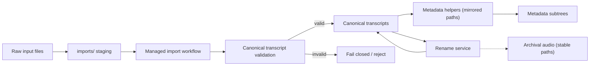

Type: CONTRACT
Authority: self

# TranscriptX Storage Policy

This document defines the storage contract for path roots and the serialization rule. It is the reference for the path/storage architecture.

## Serialization rule

**Internally**, filesystem paths are always represented as `Path` objects.

**At configuration, CLI, JSON, or API boundaries**, paths are serialized as strings.

Implications:

- Internal code uses `Path` everywhere.
- Config dataclasses keep `str`-typed fields for path values.
- JSON serialization uses `json.dump(..., default=str)` or equivalent.
- No `Path` objects should appear in serialized config files.

### Configuration layer precedence and provenance labels

- Effective configuration layer precedence is:
  - Environment
  - Run override (or Draft override when no run is selected)
  - Project config
  - Defaults
- Current resolver provenance labels intentionally report draft overrides under
  the run-layer source model (`source: run`) to preserve existing semantics.

---

## Storage roots

| Root | Meaning | Owner | Mountable | Safe to delete/rebuild | Authored by |
|------|---------|--------|-----------|------------------------|-------------|
| **recordings_dir** | User media library (source audio) | user | yes | no (never auto-clean) | user |
| **transcripts_dir** | User transcript library | user | yes | no (never auto-clean) | user |
| **data_dir** | App working state, outputs, cache | app | optional | partially reconstructable | app |
| **config_dir** | User/app configuration | user/app | optional | no (not safe to auto-delete) | user/app |
| **outputs_dir** | Analysis run outputs | app | optional | yes (re-run to rebuild) | app |
| **state_dir** | DB, processing state | app | under data_dir | partially reconstructable | app |
| **wav_backup_dir** | WAV archive / reproducibility | user/app | optional | no (unless explicit) | app |

### Details

- **recordings_dir**: User-owned, persistent, mountable, never auto-clean, user-authored content. **Do not commit audio into the repository.** With Docker Compose, set `HOST_RECORDINGS_DIR` to a host directory outside the clone; `data/recordings/` under the repo is gitignored for local/native defaults only.
- **transcripts_dir**: User-owned, persistent, mountable, never auto-clean, user-authored content.  
  - `readable/` is a derived child within this library (not a peer root).
  - `imports/` is ephemeral staging owned by the managed import workflow.
  - `originals/` stores archived source files for managed imports (never overwritten; disambiguated names). Audio paths under `originals/` (and any archival audio roots) are stable archival references and are intentionally decoupled from transcript filenames.
  - `metadata/` stores managed transcript sidecars under metadata-kind subtrees that mirror the transcript-relative path (for example, `transcripts/foo/bar.json` → `metadata/imports/foo/bar.import_meta.json`).
  - Language variants (e.g. `meeting_fr.json` beside `meeting.json`) are separate canonical transcripts with separate mirrored speaker-map sidecars. Import may copy the base speaker map into the variant sidecar; see `docs/runtime/transcription.md` (Multi-language variants).
  - A file at `transcripts_dir/*.json` alone is not library-valid; library admission requires a managed artifact set (canonical JSON + valid import sidecar, with archived original path linkage).
  - Naming leaves room for future subtypes (`diarised/`, `normalized/`, `export/`).
- **data_dir**: App-owned, persistent but partially reconstructable, not user-authored.
- **config_dir**: User/app config, persistent, not safe to auto-delete.  
  - `profiles/` lives under config_dir (user-editable config presets).
- **outputs_dir**: App-managed analysis outputs, reconstructable by re-running.
- **state_dir**: App state (DB, processing state), persistent, reconstructable in part. Lives under `data_dir/state/`.
- **wav_backup_dir**: Archive, persistent, not auto-clean unless explicit user action.

---

## Canonical transcript validation

TranscriptX treats canonical transcript JSON as a **typed, validated artifact**, not just \"any JSON file under transcripts_dir\".

- All library-valid transcripts must satisfy the canonical schema described in `docs/runtime/transcription.md` (schema_version/source/metadata/segments invariants).
- **Any API that accepts a \"transcript path\" must either:**
  - receive a pre-validated canonical transcript handle produced by the managed import workflow or a dedicated loader, **or**
  - perform canonical validation itself (for example via `validate_transcript_document`) and fail closed on invalid or ambiguous data.
- Callers and modules must not \"guess\" based on filenames or directory placement (for example, \"this looks like a transcript, let’s try to use it\"); loading arbitrary JSON from disk and treating it as canonical transcript data is a storage contract violation.

Where possible, public helpers should:

- Take strongly-typed/canonical transcript descriptors instead of raw `Path` objects, **or**
- Enforce canonical validation on entry before accessing transcript content.

Ad hoc file access logic that bypasses canonical validation is considered a bug and may be rejected in code review.

---

## Final intended directory model

```
recordings_dir/                 # user library (mountable)
transcripts_dir/                # user library (mountable)
  imports/                      # ephemeral staging
  originals/                    # archived source files
  metadata/                     # managed import sidecars
  readable/                     # derived transcripts

config_dir/                     # configuration
  profiles/                     # analysis presets

data_dir/                       # app-managed working state
  outputs/
    groups/
  preprocessing/
  cache/
    audio_playback/
    voice/
  state/                        # DB + processing state
    transcriptx.db
    processing_state.json
  backups/
    wav/
    processing_state/
```

This model separates:

- **User libraries**: recordings, transcripts (mountable, never auto-clean).
- **Configuration**: config_dir and profiles.
- **Application state and cache**: data_dir (outputs, preprocessing, cache, state).
- **Backups and reproducibility artefacts**: under data_dir/backups/.

---

## Renames

Managed transcript files participate in a broader contract that includes metadata sidecars, indices, and archival audio linkage. Moving them directly on disk can silently corrupt that contract.

- **Managed transcript renames must go through the storage rename service.**
- Direct filesystem renames of canonical transcripts (for example, calling `Path.rename()` on files under `transcripts_dir` or its metadata subtrees) are **not supported** and may leave metadata, indices, or cached state pointing at stale paths.
- The rename service is responsible for updating transcript locations, associated metadata sidecars, and any registered indices **without** renaming or relocating archival/original audio files.

Contributors should treat direct filesystem moves of canonical transcript or metadata files as bugs.

---

## Metadata mirroring invariant

Metadata sidecars must be discoverable and stable. To prevent layout drift, all transcript metadata locations obey a strict mirroring rule:

- **All transcript metadata paths must be derived via shared helper functions and must mirror the transcript-relative path under their metadata-kind subtree. Flat or ad hoc metadata paths are not permitted.**
- New code must obtain metadata paths only through central helpers (for example, helpers in `paths.py` or a dedicated metadata-paths module), never by manual string concatenation.
- Introducing flat files like `metadata/*.json` that do not mirror the transcript-relative path is explicitly disallowed and will be treated as a regression.

Example mapping:

- `transcripts/foo/bar.json` → `metadata/imports/foo/bar.import_meta.json` (import metadata sidecar)

This invariant allows future tooling to reliably locate and manage all metadata for a transcript without scanning arbitrary layouts.

---

## imports/ staging semantics

The `imports/` subtree exists purely as an internal staging area for the managed import workflow:

- **`imports/` is an internal staging area used by the managed import workflow and is not part of the canonical storage contract or discovery surface.**
- No production feature (discovery UI, search, indexing, or analysis) may depend on the long-term presence, exact layout, or filenames under `imports/`.
- Golden paths for discovery and analysis operate only on managed, library-valid transcripts under the canonical storage contract (canonical JSON + sidecars + archived original), not on raw files in `imports/`.

`imports/` may evolve or disappear without changing the canonical storage contract; treat it as an implementation detail of ingestion.

---

## Implementation pitfalls (Do/Don’t)

To keep the storage contract hardened, follow these guidelines:

- **Don’t** open arbitrary `.json` files under `transcripts_dir` (or any subdirectory) and assume they are valid transcripts.  
  **Do** use the managed import workflow or canonical loaders and/or call the canonical validator before use.

- **Don’t** write metadata files directly under `metadata/` with custom layouts or flat filenames.  
  **Do** use shared metadata path helpers that mirror the transcript-relative path under the appropriate metadata-kind subtree.

- **Don’t** call `Path.rename()` (or equivalent raw filesystem operations) on canonical transcript or metadata files.  
  **Do** use the storage rename service for any move/rename of canonical transcript artifacts.

- **Don’t** assume that renaming a transcript implies the associated audio file will also be renamed.  
  **Do** treat audio as separately archived, with associations maintained via metadata and indices rather than shared filenames.

- **Don’t** build discovery, indexing, or production features on top of `imports/` contents.  
  **Do** target only canonical managed storage for discovery and analysis.

These rules are intentionally strict; violating them risks subtle corruption of the storage model.

---

## End-to-end storage flow (overview)

The following diagram summarizes the intended flow from raw inputs to canonical storage, emphasizing validation, metadata mirroring, and rename behavior:



Canonical validation is mandatory between staging and canonical storage; metadata helpers maintain mirrored layouts; the rename service does not rename archival audio; and `imports/` is confined to staging and never used for discovery.

---

## Contract violations

This section describes **storage contract violations**, how they are detected, and the expected behavior.

- **Invalid states (examples)**:
  - Canonical transcript JSON under `transcripts_dir` without the required managed sidecars or archival/original linkage.
  - Metadata files under `metadata/` that do not mirror transcript-relative paths or are not derived via shared helpers.
  - Ad hoc flat metadata layouts (for example, `metadata/*.json` that are not part of a mirrored subtree).
  - Direct filesystem renames or moves of canonical transcripts or metadata that bypass the storage rename service.
  - Discovery or analysis codepaths that depend on `imports/` layout or treat `imports/` contents as canonical.
- **Detection**:
  - Library admission and validation helpers that enforce canonical schema and managed transcript requirements.
  - Central metadata path helpers that reject non-mirrored layouts or unexpected roots.
  - Storage-level diagnostics and tests that scan for invalid paths or layout drift.
- **Expected behavior**:
  - Violations are treated as **fail-fast** for production codepaths: reject invalid artifacts, log clear errors, and avoid silently accepting ambiguous layouts.
  - Tooling and maintenance scripts may offer **guided repair** (migration, cleanup) but must not silently reinterpret invalid layouts as valid storage.
