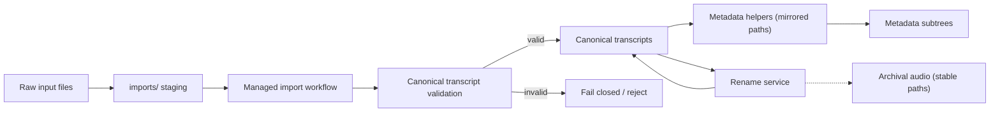

Type: CONTRACT
Authority: self

# TranscriptX Storage Policy

This document defines the storage contract for path roots and the serialization rule. It is the reference for the path/storage architecture.

## Serialization rule

**Internally**, filesystem paths are always represented as `Path` objects.

**At configuration, CLI, JSON, or API boundaries**, paths are serialized as strings.

Implications:

- Internal code uses `Path` everywhere.
- Config dataclasses keep `str`-typed fields for path values.
- JSON serialization uses `json.dump(..., default=str)` or equivalent.
- No `Path` objects should appear in serialized config files.

### Configuration layer precedence and provenance labels

- Effective configuration layer precedence is:
  - Environment
  - Run override (or Draft override when no run is selected)
  - Project config
  - Defaults
- Current resolver provenance labels intentionally report draft overrides under
  the run-layer source model (`source: run`) to preserve existing semantics.
- User-facing Settings scopes, Common vs Advanced knobs, and the overloaded
  “profile” taxonomy (install vs module/workflow vs analysis UI presets vs
  speaker profiles) are documented in [settings.md](settings.md).
- Runtime module/workflow profile JSON lives under `config_dir/profiles/`
  (override with `TRANSCRIPTX_PROFILES_DIR`). Tracked repo paths under
  `data/profiles/*/default.json` are allowlisted fixtures only — they are not
  auto-seeded into `PROFILES_DIR`, and ProfileManager treats disk name
  `default` as virtual (code defaults), not a loadable preset file.

---

## Storage roots

| Root | Meaning | Owner | Mountable | Safe to delete/rebuild | Authored by |
|------|---------|--------|-----------|------------------------|-------------|
| **recordings_dir** | User media library (source audio) | user | yes | no (never auto-clean) | user |
| **transcripts_dir** | User transcript library | user | yes | no (never auto-clean) | user |
| **data_dir** | App working state, outputs, cache | app | optional | partially reconstructable | app |
| **config_dir** | User/app configuration | user/app | optional | no (not safe to auto-delete) | user/app |
| **outputs_dir** | Analysis run outputs | app | optional | yes (re-run to rebuild) | app |
| **state_dir** | DB, processing state | app | under data_dir | partially reconstructable | app |
| **wav_backup_dir** | WAV archive / reproducibility | user/app | optional | no (unless explicit) | app |

### Details

- **recordings_dir**: User-owned, persistent, mountable, never auto-clean, user-authored content. **Do not commit audio into the repository.** With Docker Compose, set `HOST_RECORDINGS_DIR` to a host directory outside the clone; `data/recordings/` under the repo is gitignored for local/native defaults only. **Settings → Storage → Duplicate library files** may delete extra copies after an explicit preview and typed confirmation; it is never automatic.
- **transcripts_dir**: User-owned, persistent, mountable, never auto-clean, user-authored content. The same Settings tool may delete extra duplicate transcripts (and companions) after confirmation; admission, rename, and analysis-run cleanup still never auto-delete this tree.  
  - `readable/` is a derived child within this library (not a peer root).
  - `imports/` is ephemeral staging owned by the managed import workflow.
  - `originals/` stores archived source files for managed imports (never overwritten; disambiguated names). Audio paths under `originals/` (and any archival audio roots) are stable archival references and are intentionally decoupled from transcript filenames.
  - `metadata/` stores managed transcript sidecars under metadata-kind subtrees that mirror the transcript-relative path (for example, `transcripts/foo/bar.json` → `metadata/imports/foo/bar.import_meta.json`).
  - Language variants (e.g. `meeting_fr.json` beside `meeting.json`) are separate canonical transcripts with separate mirrored speaker-map sidecars. Import may copy the base speaker map into the variant sidecar; see `docs/runtime/transcription.md` (Multi-language variants).
  - A file at `transcripts_dir/*.json` alone is not library-valid; library admission requires a managed artifact set (canonical JSON + valid import sidecar, with archived original path linkage).
  - Host transcription helpers (`whispermlx-missing`, `inbox-watch`) must write raw engine output under `transcripts/originals/` only. They refuse the managed library root (the directory that already contains `metadata/` / `imports/`). They skip a stem when matching JSON already exists in `originals/` or in the library root; they still never write into the library root. Admit via Import Transcript or Settings → Watcher.
  - Naming leaves room for future subtypes (`diarised/`, `normalized/`, `export/`).
- **data_dir**: App-owned, persistent but partially reconstructable, not user-authored.  
  - `groups/` and `speaker_profiles/` are durable local project state (not safe to auto-delete). Speaker profile `.cache/` is disposable; profiles/links/events/operations **and** `profiles/assets/` (optional avatar WebP photos — face PII) are canonical (see `docs/contracts/speaker_profiles_v1.md`). Canonical voice evidence under `speaker_profiles/voice/` is biometric-derived local state (see `docs/contracts/speaker_profiles_voice_v1.md`); `.cache/voice/` is disposable. Ordinary exports must exclude `voice/` and `.cache/voice/`.
  - **Speaker profiles contain real display names (PII) and may contain avatar photos and voice embeddings.** Do not commit them. The in-repo default `data/speaker_profiles/` is gitignored. For real use, point `TRANSCRIPTX_SPEAKER_PROFILES_DIR` (or `TRANSCRIPTX_DATA_DIR`) at a directory **outside the git clone**, the same way `TRANSCRIPTX_TRANSCRIPTS_DIR` / `TRANSCRIPTX_OUTPUT_DIR` keep metadata and outputs mountable off the repo root.
  - Other subtrees (outputs, preprocessing, cache) remain reconstructable by re-running.
- **config_dir**: User/app config, persistent, not safe to auto-delete.  
  - `profiles/` lives under config_dir (user-editable config presets).
  - `config.json` holds project settings including the Custom Questions library (`analysis.llm_custom_qa.saved_questions`).
  - With Docker Compose, set `HOST_CONFIG_DIR` to a host directory **outside the git clone** (same pattern as `HOST_TRANSCRIPTS_DIR` / `HOST_OUTPUT_DIR`) so Settings survive wiping `./data`. Default remains `./data/.transcriptx`.
- **outputs_dir**: App-managed analysis outputs, reconstructable by re-running.
- **state_dir**: App state (DB, processing state), persistent, reconstructable in part. Lives under `data_dir/state/`.
- **wav_backup_dir**: Archive, persistent, not auto-clean unless explicit user action.

---

## Canonical transcript validation

TranscriptX treats canonical transcript JSON as a **typed, validated artifact**, not just \"any JSON file under transcripts_dir\".

- All library-valid transcripts must satisfy the canonical schema described in `docs/runtime/transcription.md` (schema_version/source/metadata/segments invariants).
- **Any API that accepts a \"transcript path\" must either:**
  - receive a pre-validated canonical transcript handle produced by the managed import workflow or a dedicated loader, **or**
  - perform canonical validation itself (for example via `validate_transcript_document`) and fail closed on invalid or ambiguous data.
- Callers and modules must not \"guess\" based on filenames or directory placement (for example, \"this looks like a transcript, let’s try to use it\"); loading arbitrary JSON from disk and treating it as canonical transcript data is a storage contract violation.

Where possible, public helpers should:

- Take strongly-typed/canonical transcript descriptors instead of raw `Path` objects, **or**
- Enforce canonical validation on entry before accessing transcript content.

Ad hoc file access logic that bypasses canonical validation is considered a bug and may be rejected in code review.

---

## Final intended directory model

```
recordings_dir/                 # user library (mountable)
transcripts_dir/                # user library (mountable)
  imports/                      # ephemeral staging
  originals/                    # archived source files
  metadata/                     # managed import sidecars
  readable/                     # derived transcripts

config_dir/                     # configuration
  profiles/                     # module/workflow/STT/UI-layout named presets (not speaker profiles)
  install_profile               # optional marker: core | full
  config.json                   # project settings bag

data_dir/                       # app-managed working state
  groups/                       # group definition manifests (*.group.json); local user data — not tracked
  speaker_profiles/             # longitudinal speaker profiles, links, events, ops (canonical PII); override with TRANSCRIPTX_SPEAKER_PROFILES_DIR; see docs/contracts/speaker_profiles_v1.md and speaker_profiles_voice_v1.md
    profiles/                   # *.speaker_profile.json
      assets/{profile_id}/      # optional avatar.webp (face PII; include in backups)
    links/                      # *.speaker_link.json
    events/                     # *.speaker_event.json (filename stem = event idempotency id)
    operations/                 # *.op.json + staging/backup while active
    voice/                      # enrolled trusted-voice evidence (biometric-derived; durable on ./data bind mount; ordinary export excludes this tree)
      samples/ embeddings/ vectors/
      privacy.voice_settings.json
      active_generation.json generations/
    .cache/                     # disposable listing/aggregate caches only (.cache/voice/ disposable)
  outputs/
    groups/                     # group analysis run outputs (per group uuid / run id)
  preprocessing/
  cache/
    audio_playback/
    voice/
  state/                        # DB + processing state
    transcriptx.db
    processing_state.json
    speaker_profiles.lock       # project operation lock for speaker profile mutations
  watcher/                      # directory watcher (G2) job records + activity; optional
    jobs/                       # *.json per watched-file job
    activity.jsonl              # append-only activity log
  backups/
    wav/
    processing_state/
```

This model separates:

- **User libraries**: recordings, transcripts (mountable, never auto-clean).
- **Configuration**: config_dir and profiles.
- **Application state and cache**: data_dir (outputs, preprocessing, cache, state).
- **Backups and reproducibility artefacts**: under data_dir/backups/.

### Full-workspace backup

Operators can pack and restore the authoritative workspace (transcripts, config, durable data) as a portable ZIP with role-root remapping. Normative rules: [contracts/workspace-backup.md](../contracts/workspace-backup.md). Operator guide: [backup_and_restore.md](../backup_and_restore.md). Default archives live under `data_dir/backups/workspace/`.

---

## Renames

Managed transcript files participate in a broader contract that includes metadata sidecars, indices, and archival audio linkage. Moving them directly on disk can silently corrupt that contract.

- **Managed transcript renames must go through the storage rename service** (`rename_managed_transcript` / web `RenameService`).
- Direct filesystem renames of canonical transcripts (for example, calling `Path.rename()` on files under `transcripts_dir` or its metadata subtrees) are **not supported** and may leave metadata, indices, or cached state pointing at stale paths.
- **Archival/original audio** under `transcripts/originals/` (and `wav_backup_dir`) is **never** renamed. Associations stay via metadata.
- **Recordings working copies** under `recordings_dir` **may** be renamed when the service classifies them as renameable and the target is free; a working-copy target collision **blocks** the entire rename.
- Import metadata sidecars use the mirrored layout (`metadata/imports/<rel>.import_meta.json`). Legacy flat `metadata/<stem>.import_meta.json` is migrated fail-closed during rename (never left as the authoritative location after success).
- A durable rename journal under `state_dir/rename_journal/` records the full
  transaction plan at `prepared`, then post-commit progress
  (`transaction_committed` → `finalized` → `reconciled` → `complete`).
  Incomplete ops are recoverable via `repair_managed_rename(operation_id)` /
  `discover_incomplete_renames()`. Prepared-phase recovery is limited to
  deterministic classification (all committed / none started / ambiguous);
  partial in-flight transaction states require manual inspection.
- Journal records include `schema_version`, planned slug mapping, and structured
  error history. Malformed journals are reported separately from incomplete ones.
- Global lock: `state_dir/managed_rename.lock` (held through plan, transaction, finalization, and journal updates).
- Dry-run may acquire the lock transiently but must make **no persistent domain-state changes**.

Contributors should treat direct filesystem moves of canonical transcript or metadata files as bugs.

---

## Metadata mirroring invariant

Metadata sidecars must be discoverable and stable. To prevent layout drift, all transcript metadata locations obey a strict mirroring rule:

- **All transcript metadata paths must be derived via shared helper functions and must mirror the transcript-relative path under their metadata-kind subtree. Flat or ad hoc metadata paths are not permitted.**
- New code must obtain metadata paths only through central helpers (for example, helpers in `paths.py` or a dedicated metadata-paths module), never by manual string concatenation.
- Introducing flat files like `metadata/*.json` that do not mirror the transcript-relative path is explicitly disallowed and will be treated as a regression.

Example mapping:

- `transcripts/foo/bar.json` → `metadata/imports/foo/bar.import_meta.json` (import metadata sidecar)

This invariant allows future tooling to reliably locate and manage all metadata for a transcript without scanning arbitrary layouts.

---

## imports/ staging semantics

The `imports/` subtree exists purely as an internal staging area for the managed import workflow:

- **`imports/` is an internal staging area used by the managed import workflow and is not part of the canonical storage contract or discovery surface.**
- No production feature (discovery UI, search, indexing, or analysis) may depend on the long-term presence, exact layout, or filenames under `imports/`.
- Golden paths for discovery and analysis operate only on managed, library-valid transcripts under the canonical storage contract (canonical JSON + sidecars + archived original), not on raw files in `imports/`.

`imports/` may evolve or disappear without changing the canonical storage contract; treat it as an implementation detail of ingestion.

---

## Implementation pitfalls (Do/Don’t)

To keep the storage contract hardened, follow these guidelines:

- **Don’t** open arbitrary `.json` files under `transcripts_dir` (or any subdirectory) and assume they are valid transcripts.  
  **Do** use the managed import workflow or canonical loaders and/or call the canonical validator before use.

- **Don’t** write metadata files directly under `metadata/` with custom layouts or flat filenames.  
  **Do** use shared metadata path helpers that mirror the transcript-relative path under the appropriate metadata-kind subtree.

- **Don’t** call `Path.rename()` (or equivalent raw filesystem operations) on canonical transcript or metadata files.  
  **Do** use the storage rename service for any move/rename of canonical transcript artifacts.

- **Don’t** assume that renaming a transcript always renames audio.  
  **Do** expect archival originals to stay put; only linked recordings working copies may rename when planned, and conflict blocks the whole rename.

- **Don’t** build discovery, indexing, or production features on top of `imports/` contents.  
  **Do** target only canonical managed storage for discovery and analysis.

These rules are intentionally strict; violating them risks subtle corruption of the storage model.

---

## End-to-end storage flow (overview)

The following diagram summarizes the intended flow from raw inputs to canonical storage, emphasizing validation, metadata mirroring, and rename behavior:



Canonical validation is mandatory between staging and canonical storage; metadata helpers maintain mirrored layouts; the rename service does not rename archival audio; and `imports/` is confined to staging and never used for discovery.

---

## Contract violations

This section describes **storage contract violations**, how they are detected, and the expected behavior.

- **Invalid states (examples)**:
  - Canonical transcript JSON under `transcripts_dir` without the required managed sidecars or archival/original linkage.
  - Metadata files under `metadata/` that do not mirror transcript-relative paths or are not derived via shared helpers.
  - Ad hoc flat metadata layouts (for example, `metadata/*.json` that are not part of a mirrored subtree).
  - Direct filesystem renames or moves of canonical transcripts or metadata that bypass the storage rename service.
  - Discovery or analysis codepaths that depend on `imports/` layout or treat `imports/` contents as canonical.
- **Detection**:
  - Library admission and validation helpers that enforce canonical schema and managed transcript requirements.
  - Central metadata path helpers that reject non-mirrored layouts or unexpected roots.
  - Storage-level diagnostics and tests that scan for invalid paths or layout drift.
- **Expected behavior**:
  - Violations are treated as **fail-fast** for production codepaths: reject invalid artifacts, log clear errors, and avoid silently accepting ambiguous layouts.
  - Tooling and maintenance scripts may offer **guided repair** (migration, cleanup) but must not silently reinterpret invalid layouts as valid storage.
