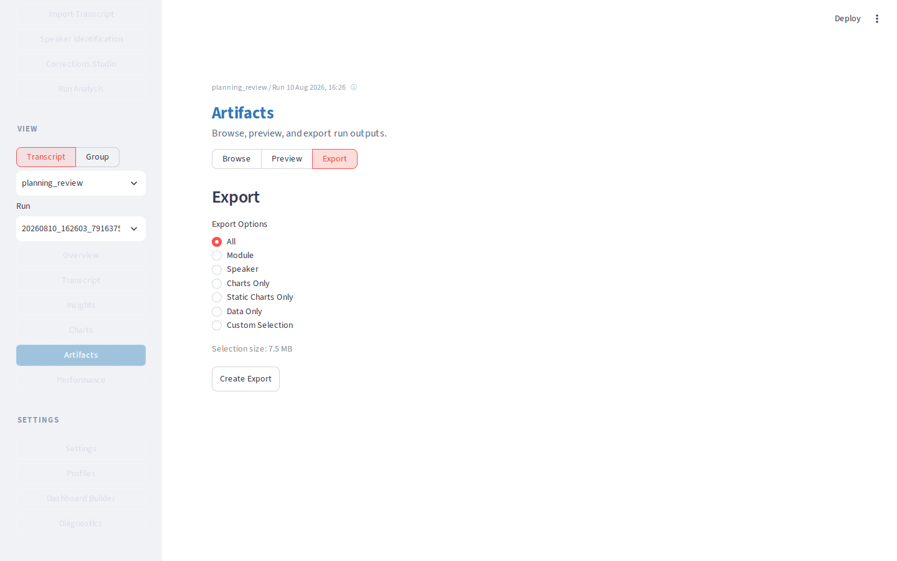
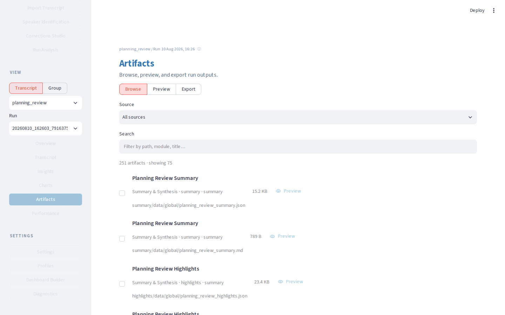
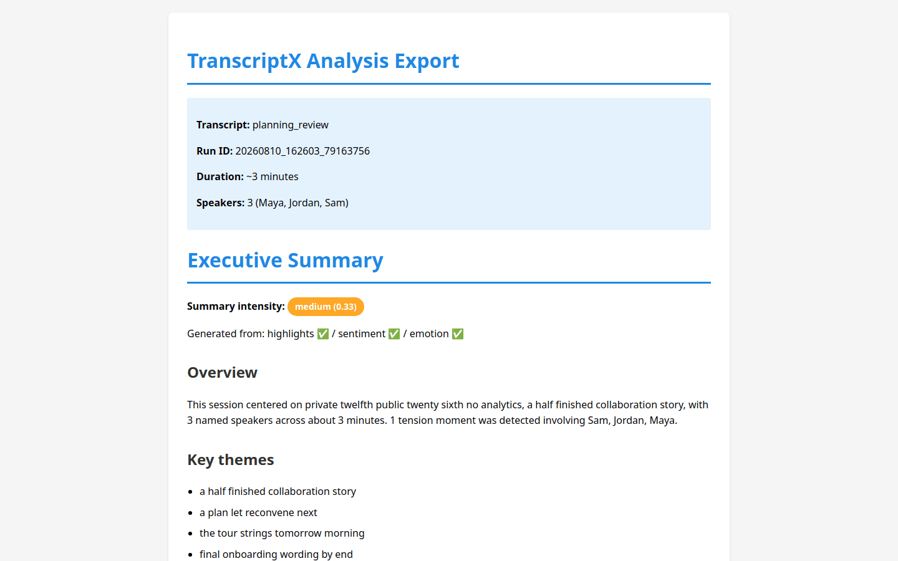

# Export a finished analysis

Take a completed run out of TranscriptX as a portable package.

## Outcome

You will have created an [export](../runtime/export.md) ZIP containing selected artifacts plus `index.html` (and `index.epub` when EPUB support is installed), and you will know what the package can and cannot do offline.

## Starting point

A completed analysis run is selected for the planning-review transcript (from [First analysis](first-analysis.md) or later workflows). Local AI is not required.

## What you’ll do

1. Confirm the transcript and run.
2. Open **Artifacts** and preview if useful.
3. Create the export package.
4. Download and open the HTML index.
5. Note EPUB and interactivity limits.

## Walkthrough

1. In the sidebar workspace pickers, confirm the planning-review transcript and the run you want to share.

2. Open **Artifacts**. Use **Browse** to see what the run produced, or **Preview** to skim a file without leaving the app.

3. Switch to **Export**. Keep a coherent selection (for example **All**, or the default selection that covers transcript, summaries, and charts you care about). Avoid turning this into a format-by-format catalogue — pick one sensible package.

4. Choose **Create Export**, then **Download Export** when the ZIP is ready.

5. Unpack the ZIP. Open `index.html` in a browser over `file://`. You should see a reading page built from the **same selection** you exported (transcript view, prose summaries when present, charts gallery notes or images).

6. Look for `index.epub` beside the HTML when `ebooklib` is available (visualization / full installs and Docker images usually include it). Missing EPUB does not invalidate the ZIP of raw files.

7. Remember the limits: interactive chart HTML is not fully runnable inside the static package; static chart images embed when present. Details and size caps are in [Exporting runs](../runtime/export.md).

## What to notice

- Export is selection-scoped: HTML/EPUB only include what you chose to copy into the ZIP.
- Artifacts **Preview** is for inspection; **Export** is for taking work elsewhere.
- [Overview](../public_surfaces.md) can also offer export entry points; **Artifacts → Export** is the durable end-of-workflow surface.
- Large selections warn or hard-cap; prefer a focused package for sharing.

## You should now have…

A downloaded ZIP for the sample run, with `index.html` opened locally and a clear sense of what remains interactive versus static.

## Next

- [Exporting runs (ZIP / HTML / EPUB)](../runtime/export.md)
- [Known limitations](../known_limitations.md) (EPUB / interactive charts)
- [Using TranscriptX](index.md) to pick another task
