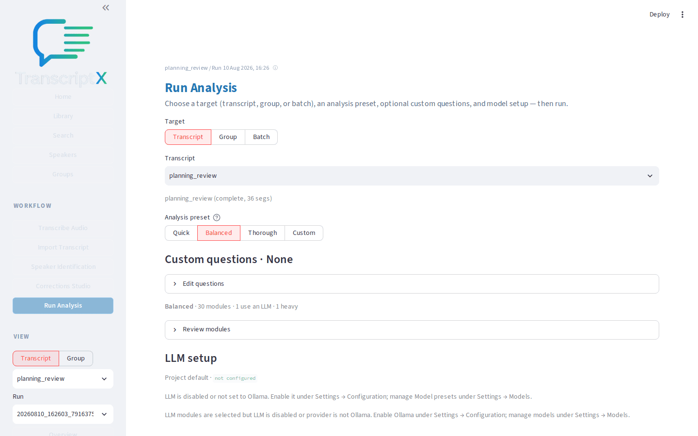
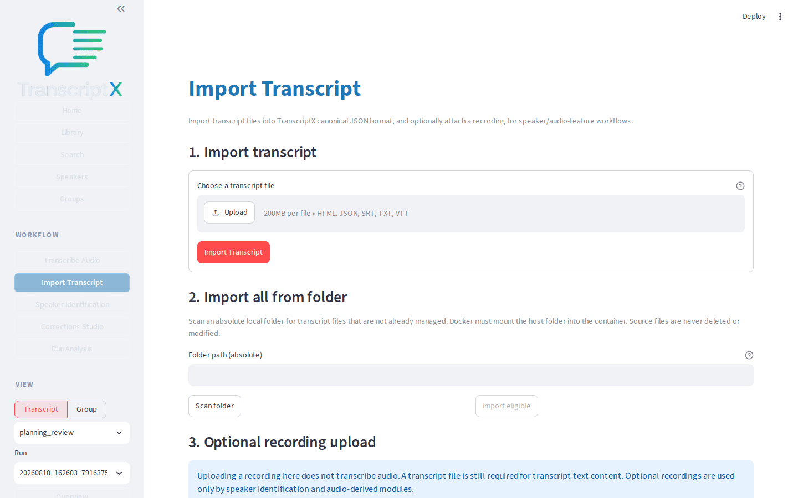
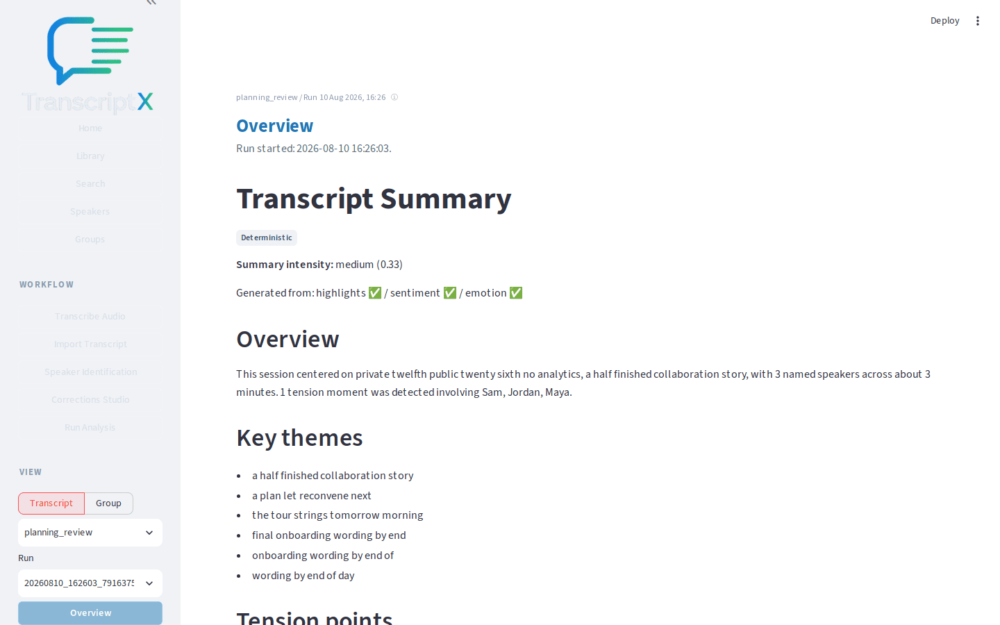

Type: GUIDE
Authority: docs/PRODUCT.md

# First analysis: from transcript to useful results

The shortest realistic path from importing a transcript to reading your first analysis results.

## Outcome

You will have [imported](../runtime/transcription.md) a transcript, completed a [**Balanced**](../runtime/installation.md#analysis-presets) analysis run, and identified several useful outputs on [**Overview**](../public_surfaces.md).

## Starting point

TranscriptX is running and you can open the sidebar. You do not need local AI for this workflow.

Download or copy the sample file [planning_review.json](fixtures/planning_review.json) so you can import it.

## What you’ll do

1. Import the sample transcript.
2. Glance at the transcript text.
3. Run analysis with the **Balanced** preset.
4. Open **Overview** and note the main results.
5. Decide where to go next.

## Walkthrough

1. Open **Import Transcript**. Upload `planning_review.json` and confirm the import. The library should list **Launch planning review (docs walkthrough)** (or the filename stem if the title is shown differently).

2. Open **Library**, select the new transcript in the table, then open **Transcript**. Skim a few turns so you know the cast uses diarized labels such as `SPEAKER_00`. Most speaker-aware modules need human-readable names; if Overview looks sparse after the first run, complete [Identify and name speakers](speaker-identification.md) and re-run.

3. Open **Run Analysis**. Keep the target as **Transcript** and the analysis preset as **Balanced** (the default). Balanced runs a practical core set without requiring local AI for the non-LLM modules.

4. Choose **Run analysis** and wait until the progress panel reports completion. A success message naming the output folder appears when the run finishes.

5. Open **Overview** for the selected transcript and run. Check **At a glance**, the speaker cards, and the compact highlights strip.

6. Pick two or three outputs that look useful for this meeting — for example a theme-related highlight, a speaker card, or run status. You do not need every panel yet.

7. From here, either improve speaker names ([**Speaker Identification**](speaker-identification.md)) or dig into a specific question ([**Insights**](investigate-evidence.md)). [Export](../runtime/export.md) can wait until you trust the results.

## What to notice

- **Balanced** is the recommended first preset: enough signal to explore, without Thorough’s full cost.
- Overview is a landing surface, not the whole analysis. Deeper detail lives under **Insights**, **Charts**, and **Transcript**.
- Diarized labels (`SPEAKER_00`, …) are placeholders until you name speakers; many modules skip until names exist.
- Run status on Overview tells you whether modules completed, skipped, or failed — useful before you trust a blank panel.

## You should now have…

An imported sample transcript, a completed Balanced run, and a mental map of Overview’s main blocks.

## Next

- [Identify and name speakers](speaker-identification.md)
- [Investigate a question and trace it back to evidence](investigate-evidence.md)
- [Installation](../runtime/installation.md) if you still need a durable install profile
