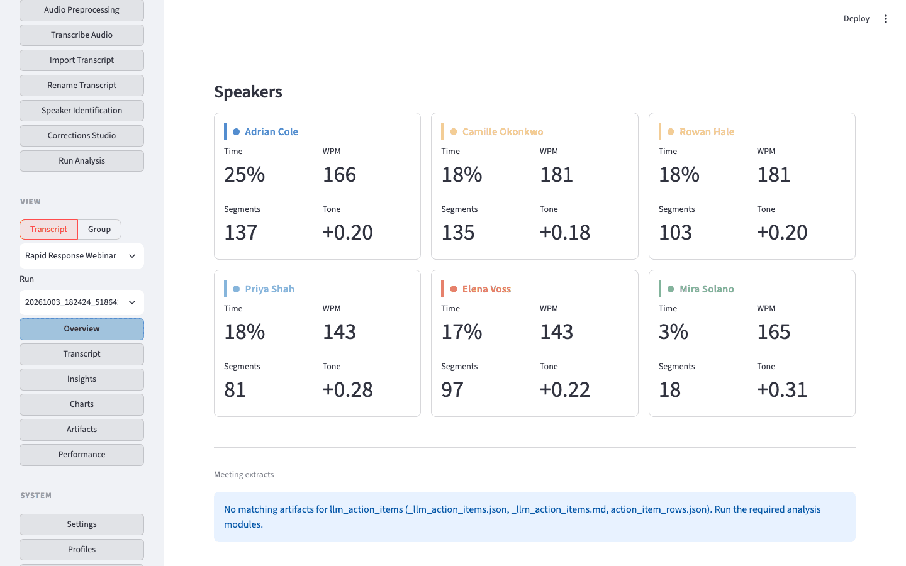
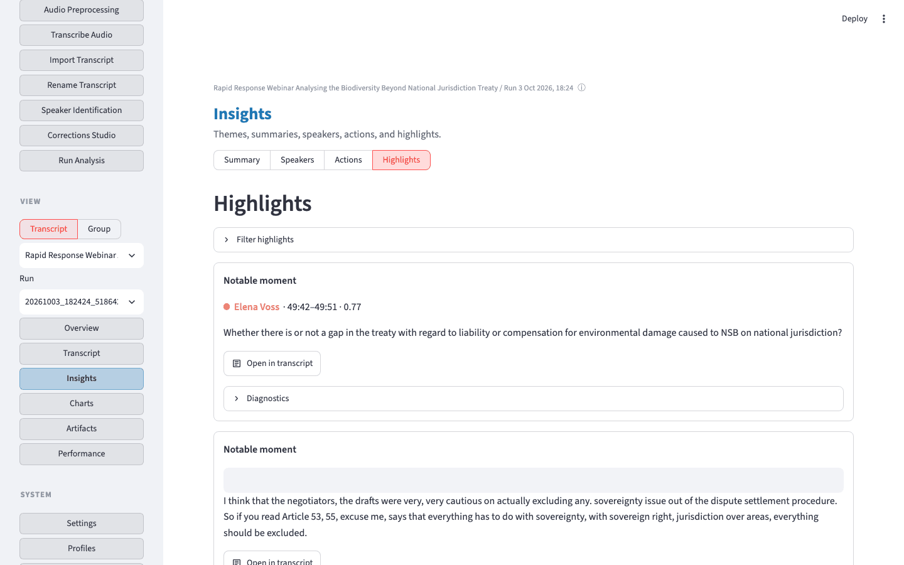
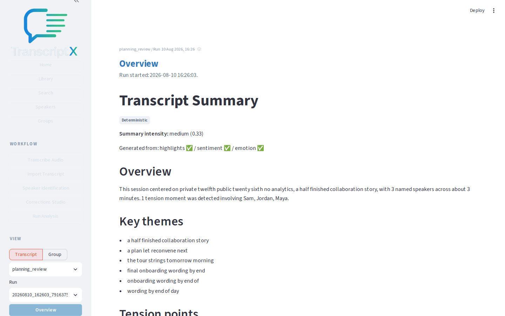

# Investigate a question and trace it back to evidence

Use TranscriptX as an analysis workbench: start from a question, follow results to supporting excerpts, then return to the transcript.

## Outcome

You will have answered one concrete question about the sample meeting by moving from **Overview** through **Insights** into transcript evidence.

## Starting point

The planning-review transcript is [imported](../runtime/transcription.md), speakers are named ([Identify and name speakers](speaker-identification.md)), and a [**Balanced**](../runtime/settings.md#analysis-presets) (or richer) run is selected on **Overview**.

The figures are the BBNJ rapid-response webinar run: speaker cards on Overview, then quoted moments on Insights → Highlights.

**Example question:** *Where did the speakers disagree most about the launch plan?*

## What you’ll do

1. Orient on **Overview**.
2. Open **Insights → Summary** for themes and tension points.
3. Optionally open **Insights → Highlights** for denser quotes.
4. Jump back to **Transcript** for full context.
5. Form your own interpretation.

## Walkthrough

1. Keep the example question in mind. Open **Overview** for the planning-review run and scan the compact highlights and speaker cards for signs of disagreement (timeline, scope, analytics).

2. Open **Insights** and stay on the **Summary** section first. Read the executive overview, key themes, and any tension points — in this sample you should see disagreement around timeline, collaboration scope, and analytics.

3. Follow one tension point or theme quote into fuller context. Prefer a cited speaker line (for example Sam on analytics versus shared folders) and open **Transcript** to read the surrounding turns. Use **Highlights** only if you want a denser quote/tension list.

4. On **Transcript**, read a few turns before and after the cited segment. In this sample, the sharpest disagreement is timeline-versus-scope (ship on the twelfth versus delaying for offline sync), with a later disagreement about analytics in beta.

5. Optionally open **Insights → Highlights** for additional quote cards, then return to Transcript when you need evidence rather than labels.

6. Stop after you can answer the question in your own words with at least one cited stretch of dialogue. You do not need to open every Insights section or the full **Charts** gallery for this investigation.

## What to notice

- Progressive investigation beats touring every module.
- Highlights and themes are aids to interpretation; they are not unquestionable conclusions.
- Segment jumps preserve provenance: always re-read surrounding turns.
- Partial or empty modules still leave the transcript as ground truth.

## You should now have…

A short, evidence-backed answer to the launch-disagreement question, with a path you can reuse on your own transcripts.

## Next

- [Use local AI for synthesis](local-ai-synthesis.md) when you want a generated summary of the same run
- [Export a finished analysis](export-results.md)
- [Module catalog](../generated/modules.md) for deeper reference on individual analyses
