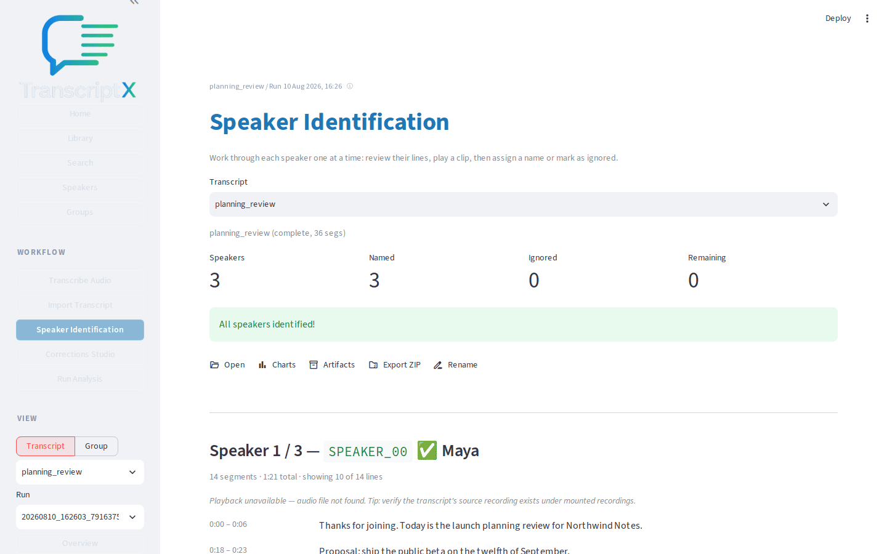

# Identify and name speakers

Replace diarized speaker IDs with readable names so the transcript and speaker-level results are legible and meaningful.

## Outcome

You will have named (or deliberately ignored) the diarized speakers on the sample transcript, switched between candidates while reviewing lines and clips, and confirmed the labels on **Transcript**.

## Starting point

The sample [planning_review.json](fixtures/planning_review.json) is [imported](../runtime/transcription.md) (see [First analysis](first-analysis.md)). Speakers still show as `SPEAKER_00`, `SPEAKER_01`, and `SPEAKER_02`.

Audio is optional for naming from text lines. If a matching recording is linked (same base name under recordings), you can load and play short clips while deciding who each diarized ID is.

## What you’ll do

1. Open **Speaker Identification** for the sample transcript.
2. Review sample lines for the active speaker (and play a clip when audio is linked).
3. Assign a clear display name with the save (✓) control, or ignore (⊘) a junk label.
4. Switch speakers with the previous/next arrows or by clicking another speaker in the list, then continue naming.
5. Confirm the names on **Transcript**.
6. Understand why naming matters for later speaker results.

On a managed library transcript you can also use **Apply auto-identify** (voice match plus names in the dialogue). For USB ingest, `inbox-watch --auto-name` does the same after admit — [auto-identify.md](../runtime/auto-identify.md).

## Walkthrough

1. From **Library** or the post-import actions, open **Speaker Identification**. Select the planning-review transcript if it is not already selected.

2. Read the sample lines for the first speaker. Decide who that person is from the dialogue (in this fixture: facilitator / product, engineering, and support roles).

3. If audio is linked, use the play controls beside a sample line to load that clip. Clips help when two speakers sound similar or when a short turn is ambiguous from text alone. Without audio, continue from the printed lines — naming still works.

4. Enter a display name in the **Name** field. Under **Link to speaker profile**, choose who this diarized ID should attach to: an existing person (name, alias, or voice match), **Create new profile**, or **Name only — this transcript**. Then choose the save (✓) control. The workspace advances to the next unnamed speaker when one remains.

A unique name match preselects the existing person. If several profiles share the name, nothing is auto-picked — choose deliberately so you do not create a second Maya.

5. Use the previous/next arrow controls, or click another speaker in the left-hand list, to move between diarized IDs without saving. Sample lines and clip targets follow the active speaker so you can compare voices before committing a name. Keyboard shortcuts (workspace focused): `j`/`k` next/prev, `Enter` save, `i` ignore, Space play/pause.

6. Repeat naming for the remaining speakers. Suggested names for this fixture: **Maya** (`SPEAKER_00`), **Jordan** (`SPEAKER_01`), **Sam** (`SPEAKER_02`). Use any stable names you prefer; consistency matters more than the exact strings.

7. If a diarized ID is clearly noise (rare in this short fixture), choose ignore (⊘) so it does not pollute speaker summaries. Open that speaker again and choose ignore a second time to clear the ignore flag.

8. Open **Transcript** and confirm turns now show your chosen names instead of `SPEAKER_00`-style IDs.

9. Re-run or refresh analysis views that depend on named speakers when you care about per-speaker summaries. A prior run may still reflect old labels until modules that key on speaker identity are run again.

> **Note:** Speaker Identification mounts the Components v2 (CCv2) workspace by
> default when `transcriptx-workspaces` is installed. Roll back to the classic
> UI with `TX_SPEAKER_ID_WORKSPACE_COMPONENT=0`. The classic path uses
> **Assign name** / **Save name** / **Jump to speaker** / **Unignore** labels;
> CCv2 uses **Name**, icon actions (save / ignore / prev / next), and the speaker list.
> See [known limitations](../known_limitations.md).

## What to notice

- Naming speakers makes the transcript readable and unlocks speaker-level modules; it is not a cosmetic rename.
- Switching speakers refreshes sample lines (and clip targets when audio is present) so you can compare before saving.
- Ignore is for unusable diarization IDs; prefer naming real participants. On CCv2, choose ignore again to restore a previously ignored ID.
- Longitudinal profile linking is optional; naming alone is enough for single-transcript work. When you do link, the control shows **which person** you are attaching to (or that you are creating a new profile).
- Voice suggestions appear in that same list when you have enrolled a reference corpus and pre-loaded queries — see [Assist naming with voice](speaker-voice-matching.md). Confirming still saves the name; nothing is applied automatically.
- Optional **Apply auto-identify** (managed library) runs local voice match plus names found in the dialogue and can write names and profile links when confident. Review badges show auto-named / auto-linked. It is probabilistic — not identity verification. Host ingest: `inbox-watch --auto-name`. Operator reference: [Auto-identify speakers](../runtime/auto-identify.md). Settings → Speakers stores ingest defaults (`auto_name` / `auto_link`).
- Downstream speaker cards, per-speaker LLM summaries, and interaction-style views depend on these labels being meaningful.

## You should now have…

A multi-speaker transcript with stable human-readable names confirmed in the transcript viewer, after practicing switch / rename / ignore (and clip playback when audio is available).

## Next

- [Assist naming with voice](speaker-voice-matching.md)
- [Investigate a question and trace it back to evidence](investigate-evidence.md)
- [First analysis](first-analysis.md) if you still need a [Balanced](../runtime/settings.md#analysis-presets) run after renaming
- [Known limitations](../known_limitations.md) for diarization and naming caveats
- [Auto-identify speakers](../runtime/auto-identify.md) for ingest knobs, CLI, and fusion review
