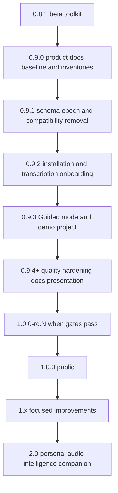
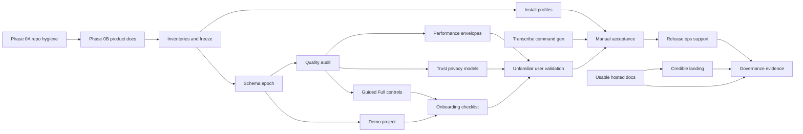

# TranscriptX pre-release roadmap (0.9.x → 1.0)

Documentation-first alignment of TranscriptX as a local-first personal transcript analysis workbench, then a stabilisation-focused 0.9.x programme that lands a clean public schema epoch, install profiles, quality audits, Transcribe Audio command generation, Simple/Advanced presentation, demo project, hosted docs, and a static website — culminating in a credible 1.0 governed by **release evidence and explicit severity rules**, not feature count or fixed patch assignments.

Before rewriting live product docs, an early **repository hygiene and knowledge-consolidation** workstream classifies documentation and scripts so the public project is coherent: intentional navigation, preserved historical detail, clear script support status, and no abandoned utilities mistaken for product capabilities.

**Version numbers in this roadmap are indicative.** Cut releases around coherent, tested increments. Do not combine unrelated risky changes merely because a patch label was shared in an earlier draft.

## Programme checklist

- [ ] **Phase 0A docs inventory** — Classify all tracked documentation; consolidate current authority; archive valuable historical material; remove incorporated scratch notes; create user/dev/archive indexes
- [ ] **Phase 0A script inventory** — Classify all scripts and helpers as supported, maintainer, internal, archived or disposable; clean machine-specific assumptions; define local ignored scratch location
- [ ] **Phase 0A hygiene controls** — Add deliberate `.gitignore` patterns and lightweight checks preventing new ad-hoc root docs/scripts
- [ ] **Phase 0B product docs** — PRODUCT, README, ROADMAP and related alignment after the repository information architecture is agreed
- [ ] **Phase 0B stubs** — Add planning stubs including schema_epoch_inventory, install_profiles_matrix, manual_acceptance_1_0, analysis_quality_audit, docs_architecture_1_0, ui_presentation_modes, demo_project, performance_envelopes_1_0, trust_privacy_model_governance_1_0, release_ops_support_1_0, unfamiliar_user_validation_1_0
- [ ] **Schema inventory** — Complete classified schema/version inventory, epoch marker design, and data-epoch transition UX before any code reset
- [ ] **Indicative 0.9.1 — schema epoch** — Epoch-1 reset + compatibility removal; GUI/typed-workflow preflight and fresh-data-dir UX; default preserve compatible transcripts; no automatic deletion; no new public analysis CLI
- [ ] **Indicative 0.9.2 — install + transcription** — Install-profile audit; Transcribe command gen; whispermlx-missing and corpus docs
- [ ] **Indicative 0.9.3 — modes + demo** — Guided/Full controls v1 + demo project load/remove with generate-demo-runs
- [ ] **Indicative 0.9.4+ — harden + public surfaces** — Quality audit; performance envelopes; trust/privacy/model gate; onboarding; hosted docs + modest website; accessibility acceptance
- [ ] **Unfamiliar-user validation** — Clean-room round (2–5 people, ≥1 non-technical); mandatory before 1.0
- [ ] **RC → 1.0** — Severity triage clear; gates pass; release ops/support policy published; governance evidence on exact commit

---

## 1. Product definition (locked)

**One sentence:** TranscriptX is a local-first personal transcript analysis workbench for people who want to think with transcripts.

**Product promise:** Import and organise transcripts; explore language, themes, speakers, interactions, emotion, voice and conversational dynamics; use structured analyses and local AI to find useful patterns; compare over time; inspect and export machine-readable results — while retaining local control of source material and outputs.

**Audience:** Approachable to any thoughtful user with transcripts; researchers and analysts are an important emerging audience (contracts, provenance, reproducibility) without positioning 1.0 solely as specialist research software.

**Primary surface:** Streamlit GUI. **Secondary:** typed Python API. **Transcription:** external to the analysis runtime, with a strong in-app command-generation handoff.

**AI position:** First-class, optional (Ollama today). Deterministic/statistical, model-based, and LLM interpretation are complementary; label them honestly; do not keep weak deterministic fallbacks merely to claim non-AI coverage.

**1.0 success:** An unfamiliar user can install, build/import a useful corpus, run appropriate analysis, understand results, recover from failures, and export artifacts without undocumented developer knowledge — **validated by a clean-room unfamiliar-user round**, not only maintainer testing. Not required: every backlog feature, PyPI, hosted SaaS, built-in transcription, or a highly polished website.

---

## 2. Locked decisions (this iteration)

| Topic | Decision |
|-------|----------|
| Public schema epoch | **Option A (disciplined):** numeric public `schema_version` → `1`; `"1.0"` only for intentional transcript-style major/minor; public string IDs → `transcriptx.<domain>.v1`; refuse/isolate pre-epoch stores; data-root epoch marker; **no cosmetic resets** of operational/internal counters |
| Product website | **Option A:** `website/` plain HTML/CSS (+ minimal JS), GitHub Pages; separate from hosted user docs. **Not a hard 1.0 blocker** if product gates pass — require a *credible* public landing; first version may be modest |
| Hosted docs | **Revive Sphinx + Read the Docs** (extras already list Sphinx/MyST/Furo; `docs/conf.py` / Makefile / `docs/requirements.txt` are missing; `scripts/build_docs.sh` is stale; `stale_refs.sh` currently forbids `readthedocs.io` and must be updated when RTD goes live). **Usable hosted documentation is required**; polished breadth is not a hard blocker if task docs complete supported workflows |
| Mode system | Presentation/config layer only — one execution system; labels prefer **Guided** / **Full controls** (Simple/Advanced acceptable aliases) |
| Onboarding | Lightweight dismissible checklist / coach marks; not a brittle tour framework; elaborate animation **deferrable to 1.1** |
| Demo data | Explicit “Load demo project”; isolated namespace; one-click remove; prefer **canonical transcripts + scripted generate-demo-runs** over large committed run trees; large bundled completed runs **deferrable to 1.1** if risky |
| Module freeze | No new analysis modules in 0.9.x unless required to complete/repair the 1.0 journey |
| Documentation preservation | Expansive: entry surfaces stay concise; detailed design history, rationale, migration notes, investigation results and operational knowledge are retained when useful for maintenance, debugging, future features or contracts. Do **not** solve clutter by indiscriminately deleting detailed material. |
| Script archive vs ignore | Tracked obsolete material is archived explicitly (`scripts/archive/` or docs archive). `.gitignore` is only for future local/generated scratch — not an archive mechanism. |
| Patch versioning | Labels in this roadmap are **indicative**. Cut releases around coherent, tested increments; never ship unrelated high-risk changes together merely to match a patch number |
| Hardening triage | Issues classified as release blocker / must fix / known limitation / post-1.0 — without this, hardening expands indefinitely |

### Mandatory vs desirable vs deferrable

**Mandatory for 1.0**
- Documentation inventory and authority consolidation; script/tooling inventory; removal of machine-specific or misleading supported scripts; archive policy; deliberate ignored location for future local scratch; removal or archival of obsolete pre-public compatibility and migration helpers after the schema reset.
- Product/roadmap/docs alignment; schema epoch reset + compatibility cleanup with **supported data-epoch transition UX**; installation/profile audit; end-to-end manual tests including **accessibility and supported-browser checks**; task-oriented documentation; Transcribe Audio command generation + corpus guidance; sustained real-use hardening; **unfamiliar-user clean-room validation**; **performance/resource envelopes** as documented expectations; **trust / privacy / model-governance gate**; **release severity triage**; **release operations and support policy**; release-governance evidence on exact clean commit.
- Usable hosted documentation and a credible public landing surface (may be modest).

A perfect historical archive taxonomy is **not** required for 1.0. A simple, documented archive structure is acceptable initially, provided current and historical material are clearly distinguished.

**Strongly desirable for 1.0**
- Guided/Full controls presentation mode; explicit demo project; polished Read the Docs navigation and screenshots; polished static `website/` + GitHub Pages.

**Not hard blockers if product gates pass**
- Elaborate website effects; exhaustive RTD autodoc; a highly polished first public site — provided usable docs and a credible landing exist.

**Safe to defer to 1.1**
- Elaborate guided coach-mark tour; sophisticated interactive website effects; large bundled completed analysis runs; any mode system that duplicates page logic; SQLite speaker analytics; multilingual routing beyond a small reliable subset; B4 ConvoKit-family methods; built-in/orchestrated transcription engine; elaborate archive taxonomy refinements beyond a clear current-vs-historical split; aesthetic refactors; experimental analyses; specialist convenience and non-supported configurations.

---

## 3. Phase 0A — Repository knowledge and tooling hygiene

Place this **before** the main product-documentation rewrite. Live docs and navigation should be designed only after current material has been classified.

**Aim:** turn the repository from an active development workspace into a coherent public project in which:

- live documentation is intentional and navigable;
- historical detail remains available where it may matter later;
- temporary planning material is no longer mixed with authoritative docs;
- scripts exposed to users or maintainers have a clear supported status;
- abandoned development utilities do not look like public product capabilities.

The output should be a clear **repository information architecture**, not merely a smaller file count.

### Phase 0A sequence

- [ ] Inventory Markdown, reStructuredText and other documentation-like files across the repository
- [ ] Inventory scripts, shell helpers, one-off migration tools, debug utilities and local developer automation
- [ ] Classify every item
- [ ] Consolidate relevant content into the correct live, reference, developer or archived location
- [ ] Remove or quarantine obsolete material
- [ ] Add repository checks that prevent ad-hoc files from accumulating again

### Documentation classification

#### 1. Public entry-level documentation

Examples: `README.md`; `docs/PRODUCT.md`; installation quick starts; first-analysis guide; website copy; hosted documentation landing pages.

Requirements: concise; task-oriented; current; low in internal implementation detail; links onward rather than duplicating deeper material.

#### 2. User reference documentation

Examples: complete installation profiles; configuration reference; transcription workflows; analysis capability explanations; troubleshooting; output and export guides; supported Python workflow reference.

Requirements: detailed enough for real use; surfaced through the hosted documentation navigation; written for users rather than repository historians.

#### 3. Authoritative contracts and policies

Examples: storage; run outcomes; output layouts; public surfaces; speaker profiles; schema epoch policy; release governance.

Requirements: preserve authority and stable locations where possible; do **not** archive merely because a contract is detailed; eliminate competing summaries that restate rules inaccurately; non-authoritative docs should link to these rather than copying them.

#### 4. Active developer documentation

Examples: architecture; contributor quick start; current release plans; testing architecture; module-development guidance; active refactor or migration plans that still govern unfinished work.

Requirements: clearly marked as active; linked from a curated developer index; contain ownership/status/last-reviewed metadata where useful; avoid date-stamped filenames for evergreen documents unless the date is integral to their purpose.

#### 5. Historical design and implementation records

Examples: completed wave plans; stocktakes superseded by newer decisions; old release plans; investigation reports; dependency-conflict analyses; implementation retrospectives; migration plans whose work is complete but whose rationale may remain valuable.

**Default action: archive, do not delete.**

Create a structured archive derived from the inventory, for example:

- `docs/archive/releases/`
- `docs/archive/plans/`
- `docs/archive/assessments/`
- `docs/archive/investigations/`
- `docs/archive/migrations/`

Exact hierarchy should be derived from the inventory rather than imposed mechanically.

Archived files should:

- carry a visible archived/superseded banner;
- state whether they are historical context only;
- link to the current authority where one exists;
- remain searchable;
- not appear in the primary user documentation navigation;
- be excluded from stale-current-version assertions where appropriate without being excluded from all link validation.

#### 6. Disposable working notes

Examples: temporary brainstorming; partial prompts; duplicate scratch stocktakes; abandoned checklists with no enduring rationale; generated planning fragments already incorporated elsewhere.

Delete only after confirming that useful content has been incorporated into a live document or archive.

Do not retain every development conversation merely because it exists. Preserve information with plausible future engineering, operational or product value.

### Documentation inventory deliverable

Planning document: [docs/dev/documentation_inventory_1_0.md](docs/dev/documentation_inventory_1_0.md)

One row per candidate file or coherent file family:

| Column | Content |
|--------|---------|
| path | File or family path |
| current purpose | What it is for today |
| current authority/status | Live / competing / stale / unknown |
| intended audience | Entry / user / contract / developer / historical / disposable |
| freshness | Current / dated / superseded |
| overlap or contradictions | Notes |
| action | retain / merge / rewrite / move / archive / delete |
| destination | Target path if moving/archiving |
| links that must be updated | Inbound/outbound |
| owner or governing document | Authority |
| hosted docs navigation | Yes / no / archive-only |

Include root-level and unexpectedly located `.md` files, not only files already under `docs/`.

Search for documentation embedded in:

- scripts;
- examples;
- configuration comments;
- archived Cursor or agent-plan material if tracked;
- root-level notes;
- package directories;
- test fixtures;
- release evidence folders.

Do **not** move authoritative contract files merely to achieve a cosmetically tidy directory tree unless all references and authority rules are safely updated.

- [ ] Create `docs/dev/documentation_inventory_1_0.md` with full classification rows
- [ ] Classify all tracked documentation-like files
- [ ] Execute retain / merge / rewrite / move / archive / delete decisions
- [ ] Create or update curated navigation: user docs index; developer docs index; contract index; archive index

### Documentation consolidation rules

- One current authority per subject.
- Concise public summaries may link to detailed references.
- Detailed documentation is **not** clutter merely because it is long.
- Historical reasoning should be archived when it may explain current design.
- Completed implementation plans should not remain presented as active roadmaps.
- Date-stamped stocktakes should either be refreshed as living documents or archived and replaced by a current index.
- Avoid copying the same installation or product claims across README, website, roadmap and hosted docs; link to a canonical source instead.
- Preserve Git history, but do not rely on Git history as the only home for operationally important knowledge.
- Archived documents should remain readable without pretending to be current.

The archive index should make retained history discoverable without placing it in the main user journey.

### Script and tooling inventory

Planning document: [docs/dev/script_inventory_1_0.md](docs/dev/script_inventory_1_0.md)

Inventory at minimum:

- `scripts/`;
- root-level shell scripts;
- Python utilities outside the supported package API;
- Docker helper scripts;
- release scripts;
- migration and schema utilities;
- transcription helpers;
- demo-generation scripts;
- documentation-build scripts;
- developer setup scripts;
- debugging/profiling helpers;
- one-off cleanup or repair tools.

For each script record:

| Column | Content |
|--------|---------|
| path | Script path |
| purpose | What it does |
| intended user | End user / maintainer / developer / historical |
| current callers | Docs, CI, Makefile, other scripts |
| documented or undisclosed | Status |
| tested or untested | Status |
| destructive or read-only | Risk class |
| platform assumptions | OS / Docker / GPU |
| dependency assumptions | Declared extras / undeclared |
| current validity | Valid / stale / unknown |
| public/support status | Supported / maintainer / internal / archived / disposable |
| action | retain supported / retain internal / rewrite / move / archive / delete |

- [ ] Create `docs/dev/script_inventory_1_0.md` with full classification rows
- [ ] Classify every tracked script/helper
- [ ] Execute retain / rewrite / move / archive / delete decisions

### Script classification and destinations

#### Supported user-facing scripts

Part of the 1.0 product or documented workflow.

Requirements: stable command/help output; safe argument parsing; shell/path quoting; documented prerequisites; actionable errors; dry-run where appropriate; tests; supported-platform declaration; referenced from current documentation.

Examples may include transcription corpus helpers, demo generation or install verification, subject to audit.

#### Maintainer and release tooling

Examples: release checks; fixture regeneration; schema inventory checks; documentation build/link checks; licence inventory; demo artifact regeneration.

Requirements: remain tracked; live in a clearly named location; have a short README or `--help`; not be presented as public product commands; be exercised by CI where practical.

#### Developer convenience tools

Examples: profiling; local inspection; debugging; repository audits; specialised data repair.

Requirements: clearly marked unsupported/internal; tracked only if generally reusable; avoid assumptions tied to the owner’s filesystem; document destructive behaviour.

#### Historical or potentially reusable scripts

Do **not** simply place tracked obsolete scripts in `.gitignore`. Gitignore applies to untracked local files; it is not an archive mechanism for already tracked repository history.

For scripts with potential future value but no current supported role, prefer one of:

- move to `scripts/archive/` with an archived banner and no live references;
- move to `docs/archive/` as a code listing or design record if the implementation itself need not remain executable;
- retain in Git history only after documenting what replaced it, if it has no plausible operational value.

Archived executable scripts must not be on normal PATHs, packaging manifests, Docker images, release bundles or user-facing docs.

#### Disposable and machine-local scripts

Remove genuinely one-off scripts once their useful logic or knowledge has been incorporated.

Expand `.gitignore` for recurring local scratch patterns, for example:

- temporary audit outputs;
- local release evidence not intended for commits;
- generated screenshots before curation;
- private corpus helpers;
- machine-specific Compose overrides;
- local benchmark output;
- developer scratch scripts in an explicitly named ignored directory.

Prefer a dedicated ignored location such as `.local/`, `.scratch/`, `tmp/`, or `scripts/local/`. **Choose one convention and document it.**

Do not broadly ignore `*.md`, `scripts/*.py` or similarly valuable classes of files.

Add placeholder files or documentation where needed so contributors know where local-only tools belong.

### Script cleanup priorities (early checks)

- [ ] Stale `scripts/build_docs.sh`
- [ ] Stale or misleading environment setup helpers
- [ ] Scripts that imply PyPI installation when releases use Git/Docker
- [ ] Scripts containing owner-specific absolute paths
- [ ] Scripts relying on undeclared environment variables
- [ ] Duplicate install or Docker launch helpers
- [ ] Transcription helpers with weak quoting, error reporting or resume behaviour
- [ ] Schema or fixture regeneration scripts that will become invalid after the epoch reset
- [ ] Scripts that directly mutate managed storage without going through supported services
- [ ] Release scripts that duplicate or conflict with release governance
- [ ] Scripts included in Docker build context or package data accidentally

### Phase 0A acceptance criteria

Phase 0A is complete only when:

- [ ] Every tracked documentation file has a classified purpose or an explicit action
- [ ] Every tracked script/helper has a classified support status
- [ ] Current documentation has one authority per subject
- [ ] Historical material has been archived with clear banners and replacement links
- [ ] Disposable notes have been incorporated or removed
- [ ] No known owner-machine paths or private corpus assumptions remain in supported tooling
- [ ] Public scripts have help, validation and documentation
- [ ] Archived scripts cannot be mistaken for supported product paths
- [ ] Hosted-doc navigation excludes internal planning noise
- [ ] Archive and developer indexes make retained detail discoverable
- [ ] Stale-reference and link checks understand the archive policy
- [ ] `.gitignore` has a deliberate home for future local scratch material
- [ ] CI or repository checks flag new ad-hoc root Markdown files and unclassified scripts where practical

### Preventative repository checks

Plan lightweight checks rather than a complex documentation CMS. Start in reporting/audit mode; promote only stable checks to blocking status.

- [ ] Allowlist expected root-level documentation files
- [ ] Fail or warn when new root `.md` files appear without classification
- [ ] Validate archived banners
- [ ] Ensure archived plans do not claim to be current
- [ ] Check that active dated plans appear in the developer index
- [ ] Identify unreferenced live docs
- [ ] Detect absolute paths such as `/Users/...`
- [ ] Detect scripts without shebang/help or classification metadata where relevant
- [ ] Confirm public scripts are mentioned in documentation
- [ ] Exclude intentionally archived references from current-version wording checks while retaining ordinary link validation

---

## 4. Phase 0B — Product documentation alignment

Safe documentation-only product alignment **after** Phase 0A information architecture is agreed (no schema/code resets yet).

The schema inventory may begin in parallel with Phase 0B, but **no public schema reset** should occur until documentation and script locations that reference old versions are known.

### Phase 0B file actions

- [ ] [docs/PRODUCT.md](docs/PRODUCT.md) — **Create** — authoritative short product doc (definition, promise, users, journey, AI philosophy, local-first, surfaces, boundaries, 1.0 criteria, long-term vision)
- [ ] [README.md](README.md) — **Rewrite opening** — sell the product first; move architecture/limitations later; fix stale claims (beta north-star, “docker-smoke writes transcript”, competing install stories)
- [ ] [docs/ROADMAP.md](docs/ROADMAP.md) — **Reorganise** around outcomes: current state → 0.9.x programme → 1.0 gate → 1.1–1.x → 2.0 vision → long-term/non-near-term → links to engineering backlogs; historical phase dumps already handled or further refined under Phase 0A archive policy
- [ ] [docs/ARCHITECTURE.md](docs/ARCHITECTURE.md) — Align wording with PRODUCT.md; keep non-authoritative; preserve contract hierarchy
- [ ] [docs/CONTRACT_INDEX.md](docs/CONTRACT_INDEX.md) — Add PRODUCT.md / public surfaces / epoch policy pointers; do not dilute contract authority
- [ ] [docs/public_surfaces.md](docs/public_surfaces.md) — Align supported surfaces; note Guided/Full as presentation preference (not a new surface); Transcribe command generator as GUI capability; Docker/Pages/docs as operational
- [ ] [docs/dev/stocktake_2026-07-17.md](docs/dev/stocktake_2026-07-17.md) — Retarget next decisions to 0.9→1.0 **or** archive and replace with a living index per Phase 0A rules; retire “credible beta” as live north star; point to PRODUCT + new ROADMAP
- [ ] [docs/dev/analysis_module_backlog_2026-07-17.md](docs/dev/analysis_module_backlog_2026-07-17.md) — Header note: 0.9.x freezes new modules; backlog is post-1.0 / repair-only
- [ ] Install / Docker / transcription / release-governance — Align version language, install-profile framing, transcription handoff promise, and 1.0 evidence expectations

### Phase 0B planning stubs

- [ ] `docs/dev/schema_epoch_inventory.md`
- [ ] `docs/dev/install_profiles_matrix.md`
- [ ] `docs/dev/manual_acceptance_1_0.md`
- [ ] `docs/dev/analysis_quality_audit.md`
- [ ] `docs/dev/docs_architecture_1_0.md`
- [ ] `docs/dev/ui_presentation_modes.md`
- [ ] `docs/dev/demo_project.md`
- [ ] `docs/dev/performance_envelopes_1_0.md`
- [ ] `docs/dev/trust_privacy_model_governance_1_0.md`
- [ ] `docs/dev/release_ops_support_1_0.md`
- [ ] `docs/dev/unfamiliar_user_validation_1_0.md`
- [ ] `docs/dev/release_severity_triage_1_0.md` (or fold into release governance / ROADMAP)

(Phase 0A stubs `documentation_inventory_1_0.md` and `script_inventory_1_0.md` are created earlier.)

### Contradictions / stale claims to remove

- [ ] README/ROADMAP “credible **beta** toolkit” north star and “Next: richer analysis modules / Ollama integration” (Ollama already shipped)
- [ ] Version bands stuck on 0.6.x/0.7.x “near-term” while package is **0.8.1**
- [ ] Competing install claims: `.[full]` vs Docker `requirements.txt` vs `./transcriptx.sh` presented as equivalent
- [ ] README claim that `scripts/docker-smoke-test.sh` writes an inline transcript (it does not)
- [ ] Aspirational `basic`/`full`/`llm` profile names presented as if implemented (runtime marker is `core`|`full` only)
- [ ] Stocktake “Wave 3 remainder (B5 DB / B18)” as default next capacity during a stabilisation freeze
- [ ] `stale_refs` “dead ReadTheDocs” once RTD is intentionally revived
- [ ] Sphinx builder assuming missing `docs/conf.py`

---

## 5. Version arc

**Indicative only.** The exact number of 0.9.x releases is unimportant. Cut releases around coherent, tested increments. Avoid creating pressure to combine unrelated changes merely because this roadmap once assigned them to the same patch.

Safer likely sequence:

### Indicative 0.9.0 — Product and release baseline (hygiene + docs + inventories; feature freeze)

**Phase 0A — Repository hygiene and information architecture**

- [ ] Documentation inventory
- [ ] Script inventory
- [ ] Authority and audience classification
- [ ] Archive structure
- [ ] Consolidation / move / delete decisions
- [ ] `.gitignore` and local scratch convention
- [ ] Initial repository hygiene checks

**Phase 0B — Product documentation alignment**

- [ ] PRODUCT.md + README/ROADMAP/ARCHITECTURE/surfaces/stocktake alignment
- [ ] Public surface & compatibility inventory
- [ ] Documentation architecture (website vs README vs RTD vs contracts vs dev) built on Phase 0A IA
- [ ] Guided/Full controls **design**
- [ ] Demo-project **design**
- [ ] Manual acceptance-test specification (incl. a11y / browser)
- [ ] Analysis-quality audit template
- [ ] Release severity triage rules published
- [ ] Performance-envelope and trust/governance planning stubs
- [ ] Freeze on non-release-critical module additions
- [ ] Known-limitations draft + model/dependency matrix skeleton

**Parallel / gated**

- [ ] **Schema reset inventory + accepted convention + epoch transition UX design** (no wipe/code reset yet; may start in parallel with 0B once doc/script locations referencing versions are known)
- [ ] Supported installation-profile inventory (derived from real deps; see §9)

### Indicative 0.9.1 — Schema epoch and compatibility removal

Focus: one coherent risk surface — public schema epoch.

- [ ] Execute public schema epoch reset + data-root epoch marker
- [ ] Remove unnecessary pre-public compatibility adapters
- [ ] Archive or remove obsolete pre-public compatibility and migration helpers (mandatory hygiene after reset)
- [ ] Supported GUI preflight (+ typed Python workflow / internal maintainer utility if needed — **not** a new public analysis CLI); optional inventory/export before reset; explicit fresh 1.0 data directory path; no automatic deletion; default preserve compatible transcripts/recordings
- [ ] Regenerate fixtures/goldens; refuse pre-epoch stores with remediation UX (see §8)
- [ ] Prove 0.9 epoch-1 store opens unchanged in later 0.9.x / 1.0 candidates

### Indicative 0.9.2 — Installation and transcription onboarding

Focus: getting users onto a working analysis environment and building corpora.

- [ ] Installation clean-environment fixes (`requirements.txt` ↔ extras ↔ Streamlit ownership; kill/rewrite stale `scripts/setup_env.sh`; fix auto-install PyPI hints; CUDA/`transcriptx.sh` honesty)
- [ ] Capability matrix per supported profile; clean-env verification
- [ ] Transcribe Audio parameterised **command generator** (no Streamlit shell execution)
- [ ] Harden `whispermlx-missing` + transcription docs (spaces, dry-run, resume, OS/Docker boundaries, import next step)

### Indicative 0.9.3 — Guided mode and demo project

Focus: first-run product experience (presentation + examples).

- [ ] Initial Guided/Full controls (presentation/defaults only)
- [ ] Demo project launcher + one-click removal
- [ ] Lightweight onboarding checklist (not elaborate tour)

### Indicative 0.9.4+ — Quality hardening, hosted docs, public presentation

Focus: operational tolerance, trust, docs surfaces — split further if needed.

- [ ] Sustained personal/corpus testing; bug fixes; GUI friction removal
- [ ] Deterministic vs AI quality audit (prioritise highlights, summaries, action-items)
- [ ] Prompt/model-output tuning; failure-state improvements
- [ ] Performance and resource envelope measurements documented
- [ ] Trust / privacy / model-governance gate evidence
- [ ] First screenshot-based user guides
- [ ] Sphinx revive + RTD navigation (user-task first; excludes internal planning noise) — usable docs required; polish not a hard blocker
- [ ] Initial `website/` + GitHub Pages — credible landing required; first version may be modest
- [ ] Accessibility and supported-browser acceptance checks
- [ ] Unfamiliar-user clean-room validation round (may slip to late 0.9.x / pre-RC if product not yet ready)

### RC preparation → 1.0

RC **only when gates pass** — not when a patch number is exhausted.

- [ ] Full clean-install matrix evidence
- [ ] AppTest + manual journey passes (incl. a11y / browser)
- [ ] Unfamiliar-user validation evidence reviewed; blockers triaged
- [ ] Regenerated version-matched demo data
- [ ] Docs link/build CI; website polish + final screenshots as capacity allows
- [ ] Schema/compatibility freeze; published known limitations under severity rules
- [ ] Performance envelopes and trust gate signed off
- [ ] Release-ops / support policy published
- [ ] Release-governance **rehearsal** (not yet the final tag)
- [ ] No unresolved **release blockers** or open **must-fix** items
- [ ] Public contracts + epoch frozen; usable hosted docs + credible landing live
- [ ] Exact release commit passes [docs/dev/release_governance.md](docs/dev/release_governance.md) + CI

### 1.x themes (post-stability)

Stronger evidence-grounding (P2 adoption); multilingual subset if reliable; richer longitudinal/corpus views; native/GPU install improvements; more guided transcription workflows (still analysis-first); optional coach-mark polish.

### 2.0 vision (user-level transformation)

From “workbench you operate” to a **personal audio and transcript intelligence companion**: guided transcribe→import→analyse orchestration (host service pattern, not MLX-in-Linux-Docker), deeper longitudinal understanding, seamless corpus workflows, broader model-provider/compute options — still local-first. Not a dump of every deferred backlog item.

---

## 6. Sequenced programme and dependencies

Critical path: **repository inventory and classification → product/docs alignment → schema inventory/reset → install/transcription → modes/demo → quality + performance + trust → unfamiliar-user validation → RC evidence.**

Cut intermediate tags around coherent tested increments; do not force install+schema+modes into one patch.

---

## 7. Release severity and triage rules

Without explicit severity, hardening expands indefinitely because every imperfection looks equally important. Publish these rules in [docs/dev/release_severity_triage_1_0.md](docs/dev/release_severity_triage_1_0.md) (or fold into release governance) and apply them during 0.9.4+ / RC triage.

| Severity | Definition | 1.0 action |
|----------|------------|------------|
| **Release blocker** | Data loss; unsafe deletion; corrupt outputs; broken supported install; incorrect run truth; security/privacy failure | Must fix before RC/1.0; no known-limitation escape |
| **Must fix** | Principal journey broken; misleading prominent analysis; unusable error state; documentation cannot complete a supported workflow | Must fix before 1.0 |
| **May ship as known limitation** | Optional module failure; unsupported language/model/platform combination; specialist UI friction; non-critical performance problem | Document honestly; do not block 1.0 |
| **Post-1.0** | Aesthetic refactors; experimental analyses; specialist convenience; non-supported configurations | Explicitly out of scope for the release gate |

- [ ] Severity rules written and linked from ROADMAP / release governance
- [ ] Hardening backlog tagged with severity before RC
- [ ] RC entry requires zero open release blockers and zero open must-fix items

---

## 8. Schema reset inventory and recommendation

### Convention (locked)

1. Classify every version-like value before changing it.
2. Public persisted numeric `schema_version` → **`1`**.
3. Use **`"1.0"`** only where an existing transcript-style contract already uses major/minor (canonical transcript stays `"1.0"` if already intentional).
4. Public persisted string schema IDs → **`transcriptx.<domain>.v1`** (rename `emotion_result_schema_v2`, live `llm_custom_qa.v2`, action-items `.v2` envelopes, etc.).
5. Refuse or isolate pre-epoch artifacts; **no long-lived compatibility adapters** for wiped pre-public data.
6. Write **`schema_epoch` / public-schema epoch marker** at managed data-root; detect early; explain clearly in GUI and supported remediation surfaces (see transition UX below — not a new public analysis CLI).
7. **Never** renumber, reuse, or reset public schema IDs after 1.0.

### Classification buckets

| Class | Reset? | Examples |
|-------|--------|----------|
| Public persisted artifact schema | **Yes → epoch 1** | `RUN_RESULTS_SCHEMA_VERSION` (2→1), cleanup **result** schema (2→1), layout (2→1), config schema, speaker/voice store versions, pooled integer schemas, public string IDs |
| Input/canonical transcript schema | Keep intentional `"1.0"`; document as public input contract | `CANONICAL_SCHEMA_VERSION`, `io/transcript_schema.SCHEMA_VERSION` |
| Contract version / schema id strings | Rename to `transcriptx.*.v1` when they identify **persisted public** artifacts | `LLM_ACTION_ITEMS_SCHEMA_ID`, custom QA pack ids |
| Journal / recovery format | **Exception:** cleanup journal **3** unless redesigned; rename journal stays 1 | cleanup `JOURNAL_SCHEMA_VERSION=3`, rename journal `1` |
| Policy / behaviour generation | **Do not reset** for cosmetics | cleanup **policy 7**, voice threshold/preprocess policies, admission policy, speaker eligibility policy |
| Cache identity | **Do not reset** unless invalidating caches deliberately as part of wipe | emotion_family inference/aggregation cache v3, clip cache, voice excerpt cache |
| Algorithm / analytical semantics | **Do not reset** when version describes method, not envelope | `semantic_similarity_v2.1.1` method identity, `INTERACTIONS_SEMANTICS_VERSION`, emotion `SEMANTICS_VERSION`, embedding semantics |
| Prompt IDs / prompt policy versions | **Do not reset** | LLM prompt version constants |
| Package / API version | Bump via normal release process (`0.9.x` → `1.0.0`) | `pyproject` / `__version__` |

### Wipe / refusal boundary

**Separate canonical source data from incompatible derived state.** Do **not** presume managed transcripts must be wiped.

Because the canonical transcript schema may remain `"1.0"`, the schema/epoch inventory decides whether managed transcripts can be retained.

**Default:** preserve **compatible** managed transcripts and **source recordings**; remove or refuse **incompatible** derived state — run outputs, caches, indexes, speaker profiles/voice data, groups, corrections, cleanup journals, run manifests/results, sidecars, and local config overrides as needed. Regenerate fixtures/goldens/tests/docs where they encode pre-epoch assumptions.

Never make deletion broader merely for epoch neatness. Owner-intended broader wipes remain allowed when explicitly chosen; they are not the default epoch policy.

On encounter of a pre-epoch or otherwise incompatible data-root: **fail closed with remediation** — not silent best-effort adapters. The first public impression must not be a cryptic incompatible-store failure.

### Data-epoch transition UX (mandatory)

Do not let “refuse pre-epoch store” become only an exception message. Keep preflight within **existing public surfaces** — do **not** create a new public analysis CLI solely for the reset.

- [ ] **GUI preflight** that detects incompatible roots before work begins
- [ ] Plus a **typed Python workflow** and/or clearly **internal maintainer utility** if automation is needed — not a new user-facing analysis CLI
- [ ] Optional **inventory/export** before any reset path the product offers
- [ ] Explicit **“create fresh 1.0 data directory”** path
- [ ] **No automatic deletion** of user data
- [ ] Precise identification of **which root** is incompatible
- [ ] **Backup guidance** in GUI/docs
- [ ] A **reset report** when a supported reset path is used (scoped to incompatible derived state by default; never broaden deletion for neatness)
- [ ] Tests proving **unrelated source recordings are never touched**
- [ ] Inventory decision recorded for **whether compatible managed transcripts are retained**
- [ ] Validation that a **0.9 epoch-1 store opens unchanged in 1.0**

- [ ] Deliverable: [docs/dev/schema_epoch_inventory.md](docs/dev/schema_epoch_inventory.md) with a row per constant (path, value, class, action, tests) **and** explicit retain/wipe decisions for managed transcripts vs derived state
- [ ] Inventory + transition-UX sign-off before epoch implementation
- [ ] After reset: archive or remove obsolete pre-public compatibility/migration helpers per Phase 0A script policy

---

## 9. Installation-profile matrix (derived)

Do **not** invent `basic`/`llm` marketing names until the graph matches. Proposed **user-facing profiles** mapped to real install paths:

| Profile | Install path | Capabilities | 1.0 status |
|---------|--------------|--------------|------------|
| **Docker full analysis** (recommended) | Compose + image from `requirements.txt` | GUI + full analysis stack; spaCy baked; CPU on Mac override | **Supported** — verify clean |
| **Docker + local AI** | Above + host Ollama via `host.docker.internal` | LLM modules / Corrections discovery | **Supported** |
| **Native full** | `./transcriptx.sh` / requirements.txt + editable | GUI + near-Docker deps; honest CPU/CUDA/MPS matrix | **Candidate supported profile** — confirm through clean-environment matrix (may conclude supported, best-effort, or deferred) |
| **Native + local AI** | Native full + Ollama | Same + LLM | **Candidate** — follows native-full audit outcome |
| **Voice / speaker match** | `[voice]` / `[speaker_match]` or Docker image subset | Prosody + local ECAPA match | **Optional supported** |
| **Core analysis API** | `pip install -e .` | Library/API without assuming Streamlit | **Developer/secondary** — must not claim “full app” |
| **Developer / test** | `.[dev]` (+ `nlp`) | CI lanes | **Contributor** |
| **Air-gap** | Any + `TRANSCRIPTX_DISABLE_DOWNLOADS=1` + prebaked caches | Offline inference | **Documented profile** |

### 1.0 install programme must fix

- [ ] Streamlit ownership (not in `[full]`)
- [ ] Clarify `.[full]` ≠ Docker
- [ ] Missing `keyphrases` in Docker
- [ ] `speaker_match` matrix cell
- [ ] Stale `setup_env.sh`
- [ ] Auto-install hints using PyPI name
- [ ] `transcriptx.sh` forcing `CUDA_VISIBLE_DEVICES=""`
- [ ] Playwright: clarify whether dependencies are required only for website/docs checks; remove them from product installation profiles unless a supported runtime feature needs them
- [ ] Capability matrix per profile

---

## 10. Transcribe Audio and corpus onboarding

Extend [src/transcriptx/web/page_modules/transcribe_audio.py](src/transcriptx/web/page_modules/transcribe_audio.py) into a **parameterised command generator** (copyable only; **never execute** from Streamlit for 1.0).

Parameters: input file/folder, output folder, provider/tool, Whisper/WhisperX model, language, diarisation, device/compute, patterns, overwrite/resume, batch options, expected output format.

Must cover: shell quoting/spaces; macOS vs Linux vs Docker/host boundaries; dependency/model checks (documented + dry-run flags on scripts); resumability/duplicates; partial failures; dry-run/preview; logs/progress; output compatible with managed import; clear next step → Import Transcript.

- [ ] Parameterised Transcribe Audio command generator (copyable only)
- [ ] Harden [scripts/whispermlx-missing.py](scripts/whispermlx-missing.py)
- [ ] Update [docs/runtime/transcription.md](docs/runtime/transcription.md) + WhisperX recipe docs for non-technical corpus building

---

## 11. Analysis-quality audit structure

New living sheet: [docs/dev/analysis_quality_audit.md](docs/dev/analysis_quality_audit.md) — one row per user-visible analysis:

intended question; output type; algorithm/model; meaningfulness on real transcripts; languages; min data; confidence/abstention; failure modes; overlap; GUI presentation; group semantics; test quality; performance; **recommendation:** retain / improve / relabel / hide under Full controls / deprecate / remove.

Prioritise Insights, default presets, summary surfaces, exports. **Mandatory scrutiny:** deterministic highlights, summaries, action-item extraction vs LLM equivalents — improve, restrict claims, reduce prominence, or remove misleading fallbacks. Use real corpora, not only fixtures.

No new modules during 0.9.x unless audit proves a release-critical repair. Map audit findings into release severity triage (§7).

- [ ] Create analysis-quality audit template
- [ ] Complete audit rows for user-visible analyses
- [ ] Mandatory scrutiny: deterministic highlights / summaries / action-items vs LLM equivalents
- [ ] Apply retain / improve / relabel / hide / deprecate / remove recommendations
- [ ] Tag each finding as release blocker / must fix / known limitation / post-1.0

---

## 12. Performance and resource envelopes

Correctness and installation alone are not enough — the product must be **operationally tolerable**. Deliverable: [docs/dev/performance_envelopes_1_0.md](docs/dev/performance_envelopes_1_0.md).

Define representative corpus sizes (small / medium / large-for-1.0) and record expectations (not necessarily strict universal guarantees) for:

- [ ] Startup time
- [ ] Import time
- [ ] Time to first useful result
- [ ] Default-preset runtime
- [ ] Memory and disk use
- [ ] Model download sizes
- [ ] Docker image size
- [ ] Group-analysis scaling
- [ ] UI responsiveness with a large library
- [ ] Behaviour when disk, RAM or model capacity is insufficient

These become **documented expectations and regression indicators**. Non-critical misses may ship as known limitations; capacity failures that corrupt data or hang without recovery are release blockers / must-fix per §7.

---

## 13. Trust, privacy and model-governance gate

Dedicated gate (stocktake already flags the missing aggregated third-party model/licence notice as a release gap). Deliverable: [docs/dev/trust_privacy_model_governance_1_0.md](docs/dev/trust_privacy_model_governance_1_0.md).

- [ ] Third-party model and dataset **licence inventory**
- [ ] Model download origins and **gated-model** requirements
- [ ] Voice embedding and speaker-identity **privacy wording**
- [ ] Confirmation that **no telemetry or remote processing** occurs unless explicitly configured
- [ ] Secrets and **absolute-path** audit
- [ ] Dependency **vulnerability and licence** checks
- [ ] **AI output labelling**
- [ ] Model, prompt and analytical-semantics identity in artifacts where needed
- [ ] Explicit definition of what **“reproducible”** means for stochastic LLM output

Gate is mandatory before 1.0. Incomplete polish of notices may be known limitation only where legal/privacy risk is absent; missing licence/privacy truth for shipped models is a release blocker.

---

## 14. Unfamiliar-user validation

The 1.0 success criterion centres on an unfamiliar user; personal testing will find analytical and workflow problems, but unfamiliar users expose assumptions the maintainer no longer notices.

Deliverable: [docs/dev/unfamiliar_user_validation_1_0.md](docs/dev/unfamiliar_user_validation_1_0.md). Run during indicative **0.9.4+ or pre-RC** once install and principal journeys are stable enough to evaluate.

**Mandatory before 1.0:**

- [ ] Two to five people who have **not** developed TranscriptX
- [ ] At least one relatively **non-technical** user
- [ ] **Fresh machine** or fresh environment
- [ ] **No live coaching** unless they become completely blocked
- [ ] Record: installation time; time to first useful result; blockers; misunderstood terminology; abandoned journeys

Triage findings with §7 severity rules. Blockers and must-fix items from this round gate RC.

---

## 15. Manual acceptance-test structure

Authoritative suite: [docs/dev/manual_acceptance_1_0.md](docs/dev/manual_acceptance_1_0.md).

Journeys (each with prerequisites, test data, steps, expected UI, expected files, failure criteria, evidence):

- [ ] Clean Docker
- [ ] Clean native where supported
- [ ] First launch
- [ ] Transcribe command gen
- [ ] Single + folder import
- [ ] Duplicate/malformed
- [ ] Default preset
- [ ] Optional AI
- [ ] Missing Ollama
- [ ] Partial module failure
- [ ] Insights source nav
- [ ] Charts/artifacts
- [ ] Speakers/profiles
- [ ] Voice where supported
- [ ] Groups
- [ ] Export
- [ ] Cleanup/reset
- [ ] Data-epoch GUI preflight / fresh data directory / refuse-with-remediation (no new public analysis CLI)
- [ ] Compatible managed transcripts retained when inventory allows; source recordings untouched
- [ ] Reopen data dir
- [ ] Upgrade from final 0.9 epoch-1 store unchanged
- [ ] Offline/downloads disabled
- [ ] Spaces/non-ASCII paths
- [ ] Empty/short/long/multilingual
- [ ] Guided/Full switch
- [ ] Demo load/remove
- [ ] Onboarding skip/complete/reopen

### Accessibility and browser checks (GUI primary surface)

`web/` is the primary interface; the stocktake notes `web/` is excluded from measured coverage, so focused acceptance testing is especially important.

- [ ] Keyboard navigation of principal journeys
- [ ] Focus visibility
- [ ] Contrast of primary text/controls
- [ ] Narrow / small screens usable for principal journeys
- [ ] Readable charts
- [ ] Downloadable alternatives for visual outputs where practical
- [ ] At least the browsers **Streamlit officially supports** at release time

Automation split: keep expanding `make test-gui-acceptance` / AppTest for structural journeys; residual AppTest-blind items stay in [docs/dev/gui_acceptance_residual_checklist.md](docs/dev/gui_acceptance_residual_checklist.md); **no Playwright for Streamlit before 1.0** (existing policy). Browser checks for the **app** are manual/acceptance against Streamlit’s supported browsers; separate browser checks apply to **website** and **RTD**.

---

## 16. Product-experience features (0.9.x)

### Guided / Full controls (strongly desirable)

Presentation + defaults layer only ([docs/dev/ui_presentation_modes.md](docs/dev/ui_presentation_modes.md)):

- **Guided:** principal workflow, recommended presets, reduced registry complexity, plain AI requirements, actionable errors, import→results path
- **Full controls:** module selection, detailed model/analysis settings, dependency/capability info, specialist group/voice/artifact controls, diagnostics

Acceptance:

- [ ] Guided materially reduces first-run complexity
- [ ] Full preserves supported controls
- [ ] Identical analytical meaning for equivalent settings
- [ ] Visible switch; persistent preference; no irreversible hiding
- [ ] Deep links/routes valid
- [ ] Tests prove presentation/defaults only

Defer to 1.1 if implementation starts duplicating page logic.

### Onboarding checklist (lightweight mandatory-ish; elaborate tour deferrable)

First-run checklist: Library → Import → Analyse → Insights/Charts → Export; Guided/Full; external transcription + command gen; optional Ollama; offer demo; skippable; reopen from Help/Settings; local completion flag; non-blocking if UI changes.

Acceptance:

- [ ] Optional, repeatable, non-blocking
- [ ] Survives missing optional capabilities
- [ ] Links to real actions
- [ ] No fragile CSS-selector critical path

### Demo project (strongly desirable)

Explicit “Load demo project” / “Explore examples” on first launch and Home. 3–5 redistributable examples (meeting/decisions; interview; multi-speaker interaction; optional voice if licence/size OK; small cross-session group). Isolated demo namespace; one-click remove; no touch of user data; **ship transcripts + `scripts/generate_demo_runs.py` (deterministic)** as default; detect stale demo vs schema epoch/package; label any AI demo outputs; keep image/repo size small.

Acceptance:

- [ ] Licence/provenance documented
- [ ] Isolation; safe deletion
- [ ] Epoch-matched artifacts
- [ ] Regeneration scripted and tested

### Hosted docs — Sphinx + RTD (usable required; polish desirable)

- [ ] Stand up missing Sphinx project (`docs/conf.py`, toctrees, MyST, Furo from `[docs]` extra)
- [ ] Curated **user** navigation (tasks first, reference second)
- [ ] Contracts/dev material reachable but not undifferentiated top-level
- [ ] Archive index discoverable but excluded from primary user journey
- [ ] Versioned docs for 1.0+; search; screenshots; install-profile pages as capacity allows
- [ ] Autodoc **only** for supported Python surfaces (`app.workflows`, managed import)
- [ ] CI build + linkcheck; RTD preview builds
- [ ] Remove/update `readthedocs.io` denylist when live
- [ ] Single source of truth — website/README summarise and link, do not fork content
- [ ] Stale-reference checks understand archive policy (exclude archived from current-version assertions; keep ordinary link validation)

**Gate:** documentation can complete supported workflows. Do **not** block 1.0 solely for incomplete polish if usable hosted docs exist.

### Website (credible landing required; first version may be modest)

[website/](website/): headline, product explanation, screenshots, workflows, local-first + AI, example outputs, install CTA, GitHub, docs link, platforms, release status, Buy Me a Coffee **config placeholder** (do not invent URL). GitHub Pages workflow. Plain HTML/CSS; minimal JS only for clear value (e.g. mobile nav).

- [ ] Initial `website/` content (credible public landing)
- [ ] GitHub Pages workflow
- [ ] Screenshots / example outputs as capacity allows
- [ ] Buy Me a Coffee placeholder (URL when supplied)

**Gate:** credible public landing exists. Do **not** make website polish or elaborate RTD a hard blocker if the product itself is ready.

Doc relationship:

- `website/` — marketing/presentation
- README — concise repo landing + quick start
- RTD — complete user guides / concepts / troubleshooting / supported reference
- contracts — authoritative behaviour
- `docs/dev/` — internal architecture and contribution
- `docs/archive/` — historical design/implementation records (discoverable via archive index)

---

## 17. Release operations and support policy

Define the mechanics around the tag so the maintenance promise matches the strength of existing contracts and release governance. Deliverable: [docs/dev/release_ops_support_1_0.md](docs/dev/release_ops_support_1_0.md) (extend [docs/dev/release_governance.md](docs/dev/release_governance.md) where appropriate).

- [ ] CHANGELOG structure and migration notes
- [ ] RC naming and duration
- [ ] Branch/tag convention
- [ ] Release artifacts and checksums
- [ ] GitHub issue templates
- [ ] Supported Python/platform matrix
- [ ] Security-reporting link
- [ ] Support expectations for 1.0.x
- [ ] Patch-release policy
- [ ] Deprecation period for public Python and schema surfaces
- [ ] Rollback procedure if 1.0 has a serious fault

Mandatory before the public 1.0 tag. RC may start once product gates pass even if some ops docs are still being finalised, but the public tag requires the policy published.

---

## 18. Pre-1.0 vs post-1.0 refactor recommendations

**Before 1.0 (only if release risk / severity demands):**

- [ ] Install/config duplication (`setup_env.sh`, extras vs requirements, auto-install hints)
- [ ] Remove obsolete pre-public schema adapters after wipe
- [ ] Legacy Data/Explorer redirects (already queued)
- [ ] Error-prone install profile markers
- [ ] Anything blocking clean-env verification or epoch refusal tests
- [ ] Machine-specific or misleading scripts identified in Phase 0A
- [ ] Epoch transition UX gaps (GUI preflight, typed/internal helper only, fresh dir, no auto-delete, preserve compatible transcripts)

**After 1.0:** aesthetic splits of god-files (`qa_analysis`, `highlights/core`, topic viz, aggregation registry); config 1.9 structural split; export Jinja2/Artifact Protocol; optional Playwright GUI; SQLite speaker analytics.

For each pre-1.0 refactor PR: state risk addressed, behavioural invariants, characterisation tests, change surface, and severity classification.

---

## 19. Risk register (high)

| Risk | Mitigation |
|------|------------|
| Schema rename churn breaks goldens/CI | Inventory-first; single epoch PR; regenerate fixtures; refuse pre-epoch |
| Mode system forks execution | Presentation-only; equivalence tests; defer if duplication appears |
| Demo size / licence | Transcripts + generate script; document provenance; optional voice |
| Sphinx revive larger than expected | Curated toctree first; defer full autodoc breadth; usable docs gate not polish gate |
| Install matrix never green on all hosts | Explicit supported vs best-effort cells; no false “full” claims |
| Quality audit removes popular but weak modules mid-freeze | Relabel/hide under Full controls before hard delete when uncertain; severity triage |
| Docs drift across README/website/RTD | Single source + link summaries; CI linkcheck |
| Useful engineering rationale lost during cleanup | Archive by default when future maintenance value is plausible; require destination/replacement before deletion |
| Archive becomes a second cluttered live-doc tree | Structured archive categories, archived banners, current-authority links, excluded from primary navigation |
| Old scripts remain executable-looking and are mistaken for supported tools | Move out of live script paths, add banners, remove packaging/docs references |
| `.gitignore` is misused as an archive mechanism | Archive tracked material explicitly; use ignore rules only for future local/generated files |
| Documentation cleanup creates mass broken links | Inventory inbound links first; perform moves in coherent batches; run link and stale-reference checks |
| Root-level scratch files reappear after 1.0 | Define ignored local workspace and add lightweight repository audits |
| Unrelated risky changes bundled in one patch | Indicative versioning; cut releases around coherent tested increments |
| Hardening never ends | Severity triage; known-limitation escape for non-must-fix |
| Cryptic epoch refusal alienates first public users | GUI preflight + typed/internal remediation; fresh-dir path; backup guidance; no auto-delete; preserve compatible transcripts by default; tests |
| Epoch wipe deletes salvageable source data | Inventory separates canonical transcripts/recordings from incompatible derived state; never broaden deletion for neatness |
| Maintainer-only testing misses UX assumptions | Mandatory unfamiliar-user clean-room round |
| Operational surprise (RAM/disk/image size) | Documented performance envelopes and capacity-failure behaviour |
| Licence/privacy/model gaps at public release | Dedicated trust/privacy/model-governance gate |
| 1.0 ships without a maintenance promise | Release-ops/support policy including rollback and deprecation |

---

## 20. Unresolved owner judgements (non-blocking defaults set)

- [ ] **Buy Me a Coffee URL** — placeholder until supplied
- [ ] **Exact 3–5 demo transcripts / licences** — owner to supply or approve redistributable sources
- [ ] **Native Mac MPS:** documented supported-with-caveats for 1.0, not a hard GPU gate (default)
- [ ] **Whether cleanup result schema 2→1** proceeds in same PR as public epoch (recommended yes; journal 3 / policy 7 stay)
- [ ] **Final UI copy:** ship **Guided / Full controls**; keep Simple/Advanced only as doc synonyms if needed
- [ ] **RTD project slug / custom domain** — create when docs build is green
- [ ] **Local scratch directory convention** — choose one of `.local/`, `.scratch/`, `tmp/`, `scripts/local/` and document it in Phase 0A
- [ ] **Exact archive subcategory names** — derive from inventory; simple documented structure acceptable for 1.0
- [ ] **Unfamiliar-user cohort** — who / when / consent and recording method
- [ ] **Representative corpus sizes** for performance envelopes
- [ ] **RC duration** default (e.g. minimum soak window) if not already in release governance
- [ ] **Security-reporting contact** channel for 1.0

---

## 21. Immediate next execution steps

1. [ ] Start **Phase 0A**: create `docs/dev/documentation_inventory_1_0.md` and `docs/dev/script_inventory_1_0.md`; inventory and classify before rewriting product docs
2. [ ] Complete Phase 0A acceptance criteria (authority consolidation, archive banners, script support status, `.gitignore` scratch home, hygiene checks in audit mode)
3. [ ] Apply **Phase 0B** documentation edits (PRODUCT.md, README, ROADMAP restructure, alignment passes, planning stubs including severity, performance, trust, release-ops, unfamiliar-user)
4. [ ] Freeze analysis-module additions in backlog/stocktake language
5. [ ] Publish release severity triage rules early so later hardening has a decision system
6. [ ] Schema inventory **and epoch transition UX design** may begin once version-referencing doc/script locations are known; do **not** execute schema wipe/code resets until `schema_epoch_inventory.md` is complete and reviewed
7. [ ] Cut later 0.9.x releases around coherent increments (schema ≠ install ≠ modes); RC only when gates pass